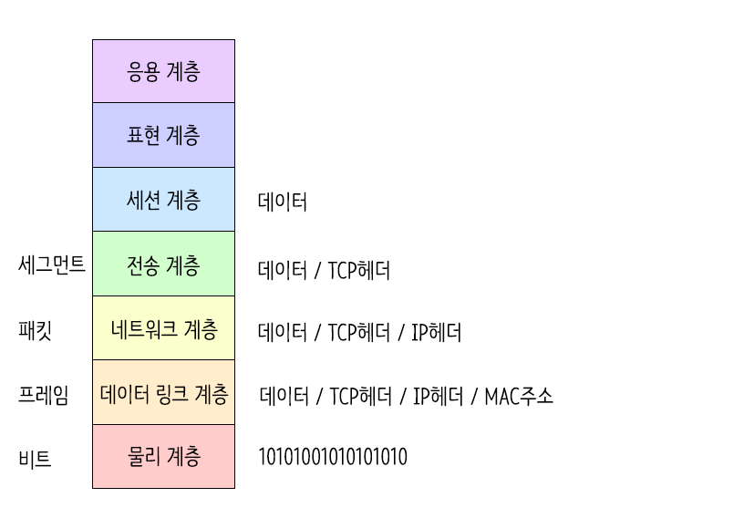

{: .note }
OSI 7계층을 나눈 이유는?

흐름을 한눈에 알아보기 쉽고 7단계 중 특정한 곳에 이상이 생기면 다른 단계의 장비 및 소프트웨어를 건들이지 않고 이상이 생긴 단계만 고칠 수 있어 나누었다.

{: .q-left }
> OSI 7계층 종류

{: .q-left }

> 1.물리 계층(Physical Layer)

**전기적 신호가 나가는 물리적인** 장비

물리 계층에서는 단지 데이터를 전달할 뿐, 전송 및 받으려는 데이터가 무엇인지, 어떤 에러가 있는지 등에 대한 관심이 없다.

즉,  데이터를 전기적인 신호로 변환해서 주고받는 기능 만 있을 뿐이다.

💡 Tip

전송단위: 비트(Bit), 장비: 케이블, 허브

{: .q-left }

> 2.데이터 링크 계층(Data link Layer)

물리계층을 통해 송수신되는 **정보의 오류와 흐름을 관리**하여 안전한 정보의 전달을 수행할 수 있도록 도와주는 역할. 

따라서 통신에서의  오류도 찾아주고 재전송도 하는 기능을 가지고 있다.

이 계층에서는 MAC 주소를 가지고 통신하게 된다.

데이터 링크 계층은 포인트 투 포인트(Point to Point)간 신뢰성 있는 전송을 보장하기 위한 계층으로 CRC기반의 오류 제어와 흐름 제어가 필요하다.

💡 Tip

- 흐름 제어 : 송신 측과 수신 측의 속도 차이를 조정
- 오류 제어 : 오류 검출과 회복
- 순서 제어 : 프레임의 순서적 전송
- 프레임 동기화 : 프레임의 시작과 끝을 구별하기 위한 동기화
- 단위 : Frame
- 장비: 브릿지, 스위치, 이더넷

{: .q-left }

> 3.네트워크 계층(Network Layer)

경로(Route)와 주소(IP)를 정하고 패킷을 전달해주는 것이 이 계층의 역할이다.

즉, **목적지까지 가장 안전하고 빠르게 데이터를 보내는 기능**을 말한다. 따라서 최적의 경로를 설정해야 한다.

이런 라우팅 기능을 맡고 있는 계층이 네트워크 계층이다.

💡 Tip

전송단위: 패킷(Packet/Datagram)

{: .q-left }

> 4.전송 계층(Transport Layer)

양 끝단의 사용자들 간의 신뢰성있는 데이터를 주고 받게 해주는 역할을 한다.

송신자와 수신자 간의 신뢰성있고 효율적인 데이터를 전송하기 위하여 오류검출 및 복구, 흐름제어와 중복검사 등을 수행한다.

데이터 전송을 위해서 Port 번호가 사용이 된다. 대표적인 프로토콜로는 TCP와 UDP.

💡 Tip

전송단위: 세그먼트(Segment)
