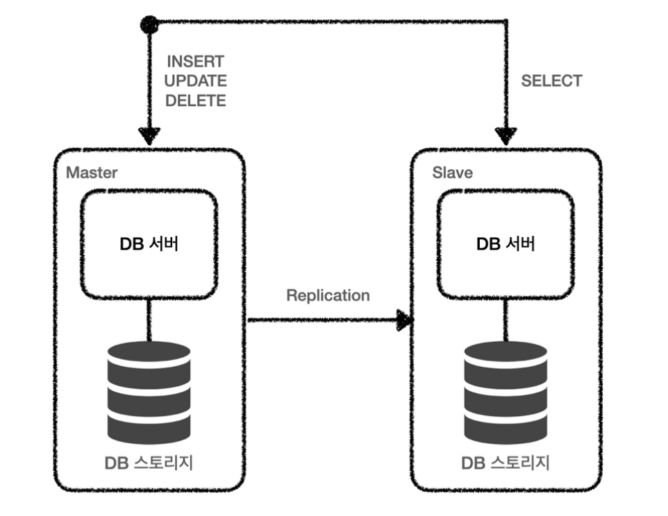

# 일반적인 데이터베이스 구조

처음으로 데이터베이스를 구성하게 되면 아래와 같은 구조로 DB 서버와 스토리지가 하나씩 구성된다.

이렇게 구성되면 데이터베이스는 서버가 제대로 동작하지 않으면 먹통이 된다는 것을 알 수 있다.

이러한 문제점을 해결하기 위해서 가장 먼저 떠오르는 방법은 서버를 하나 더 늘리는 것이다.

이렇게 서버를 하나가 아닌 여러 개로 구성하는 것을 Clustering이라한다.

## Clustering이란?

동일한 데이터베이스를 여러 대의 서버가 관리하도록 클러스터를 구축하는 것을 말한다.

{: .q-left}

> **여러 개의 DB를 수평적인 구조로 구축하는 방식이다.**

이처럼 분산 환경을 구성함으로써 장애 극복 시스템(Failover system)을 구축할 수 있다.

{: .note }

DB 클러스터링은 동기 방식으로 서버들 간의 데이터를 동기화한다.

- Active - Active 방식과 Active - StandBy 방식이 있다.
- 서버가 한 대 문제가 발생하더라도 대비가 가능하다.
- 여러 DB 서버로 부하를 분산시켜 사용자의 요청을 더 많이 수용할 수 있다.(로드밸런싱)
- 여러 대의 데이터베이스 서버를 가지므로 높은 가용성을 보장한다.

---

### Active - Active Clustering

 

두 서버의 상태가 모두 Active인 서버를 묶어 운영하는 방식이다.

이렇게 되면 서버 한 대가 죽게 되더라도 하나의 서버가 동작하고 있어서 서비스에 큰 문제가 발생하지 않는다. 다른 서버가 동작하는 동안 복구를 하여 서비스의 중단이 없도록 할 수 있다. 또한 하나의 DB 서버에 가해지던 부하를 분산 시킬 수 있어 CPU와Memory도 부하가 줄게 된다.

하지만 저장소 하나를 공유하면 병목 현상이 발생하게 되고, 두 대의 서버를 동시에 운용하다 보니 비용이 많이 든다.

---

### Active - StandBy Clustering

 

앞서 여러 개의 서버가 하나의 스토리지를 공유함으로써 병목현상이 발생하게 된다고 언급하였다.

이러한 문제점을 해결하기 위해 데이터베이스 서버 하나는 Active, 다른 하나는 StandBy 상태로 두는 방식이 Active - StandBy Clustering이다.

운영 중인 서버에 문제가 생겼을 때 Fail over를 하여 StandBy 중인 서버를 Active 상태로 전환하고 이를 통해 Active-Active 방식의 병목 현상을 해결할 수 있다.

다만 서버가 다운되었을 경우, 다른 서버가 Active 상태로 전환되는데 시간이 들어 서버가 중단되는 시간이 존재한다. 또한, 여러 대의 서버 사용을 통한 트래픽의 감소 효과와 그 효율이 줄어든다는 문제가 있다.

여기서 아마 스토리지는 그대로 두면서 서버를 하나 더 둠으로써 문제를 해결해 나가고 싶지만 여전히 문제를 확실하게 해결하는 기분은 들지 않는다. 그래서 이번에는 스토리지를 여러 개 가지는 Replication에 대해 알아보자.

---

## Replication이란?

데이터베이스 스토리지를 복제하는 것을 의미한다.

Clustering은 단순히 데이터베이스 서버를 확장한 것이라면 Replication은 데이터베이스 서버와 스토리지 모두를 확장하게 된다. 이때 단순히 확장만 하는 것이 아니라 메인으로 사용할 Master 서버와 이를 복제한 Slave 서버로 구성하게 된다.

{: .q-left}

> **여러 개의 DB를 권한에 따라 수직적인 구조(Master-Slave)로 구축하는 방식**

Master 서버는 쓰기 작업만을 처리하며 Slave 서버는 읽기 작업만을 처리한다.

{: .note }

Replication은 비동기 방식으로 서버들 간의 데이터를 동기화한다.

- 2대 이상의 DBMS를 나눠서 데이터를 저장
- 사용하기 위한 최소 구성 Master / Slave 구성
- Master 역할 : 웹 서버로부터 데이터 등록/수정/삭제 요청 시 바이너리 로그를 생성하여 Slave서버로 전달
- Slave 역할 : Master로부터 전달 받은 바이너리 로그를 데이터로 반영

 

Master 서버에는 INSERT, UPDATE, DELETE 작업이 전달되고 Slave 서버에는 SELECT 작업이 전달되는 것을 볼 수 있다.

Slave는 결국 Master 서버에서 복제된 데이터이기 때문에 데이터의 조작이 발생할 수 있는 INSERT, UPDATE, DELETE 작업은 Master로만 전달이 되고 SELECT하는 작업은 Slave 서버를 통하여 진행하게 된다. Slave 서버는 서비스에 맞게 여러 개를 가져갈 수 있다.

데이터베이스에서 발생하는 대부분의 쿼리는 조회인 SELECT인데 이러한 것을 Slave 서버를 통해 분산하여 처리할 수 있어 좀 더 성능 향상을 가져갈 수 있다.

처리 방식:

1. 데이터 등록/수정/삭제 요청
2. Master 서버 트랜잭션 수행
3. Master 서버는 데이터를 저장 / 수정 / 삭제 후, 트랜잭션에 대한 로그를 파일에 기록(Binary Log)
4. Slave 서버의 IO Thread는 Master 서버의 로그 파일(Binary Log)를 파일(Replay Log)에 복사한다.
5. Slave 서버의 SQL Thread는 파일(Replay Log)를 한 줄 씩 읽으며 데이터를 저장한다.

 

사용 목적:

- 데이터 백업 : Master 서버를 데이터의 원본 서버, Slave 서버를 백업서버로 할 수 있어 Master 서버에 문제 발생 시 Slave 서버로 변경하여 사용할 수 있다.
- DBMS 부하 분산: 사용자의 요청 폭주로 인해 1대의 DB 서버로 감당할 수 없을 때, 리플리케이션을 이용하여 같은 DB 데이터를 여러 대로 만들 수 있기에 로드 밸런싱을 할 수 있다.

 

장단점:

장점

- DB 요청의 60~80% 정도가 읽기 작업이기 때문에 리플리케이션만으로 충분히 성능을 높일 수 있다.
- 비동기 방식으로 운영되어 지연 시간이 거의 없다.

 

단점

- 서버들 간의 데이터 동기화가 보장되지 않아 일관성 있는 데이터를 얻지 못할 수도 있다.
- Master 서버가 다운되면 복구 및 대처가 까다롭다
- 테이블에 데이터가 많다고 가정한다면 Slave 서버를 N 대로 늘려도 원하는 데이터를 테이블로부터 찾는데 많은 시간이 소요되어 샤딩을 활용해야 한다.

샤딩(Sharding): 테이블을 특정 기준으로 나눠서 저장 및 검색하는 것

{: .caution }
복제 지연(Replication lag): Master 노드와 Slave 노드 간의 속도 차에 의한 병목 현상

Master 서버는 다중 스레드로 쓰기 작업을 수행하는 반면, Slave 노드는 단일 스레드로 쓰기 작업을 수행하므로 속도 차가 발생하여 나타나는 현상이다.

즉,리플리케이션의 구조적인 문제에서 발생하는 현상.

1. 장기 실행 쿼리 : 예를 들어 1시간 동안 수행되는 쿼리는 복제본에서 replay되는 시간도 1시간이므로 총 2시간의 지연시간을 갖게 된다.
2. 쓰기 쿼리량 증가 : 트래픽이 증가하거나 특정 배치 작업으로 인하여 쓰기 사용이 많아지면서 복제 지연이 발생할 수도 있다. 이는 Multi-Thread Replication 설정을 통해 복제를 적용하는 worker의 스레드 개수를 늘려 처리 속도를 향상시켜 해결할 수 있다. 만약 데이터의 양 자체가 많고 사용량도 계속 증가하는 경우 샤딩이나 도메인 자체의 분리 등을 통해 트래픽을 완화하는 것도 도움이 될 수 있다.
3. Slave의 로드 증가 : Slave에서 실행되는 서비스 조회 트래픽으로 인해 처리 성능이 지연되면서 복제 지연이 발생하는 경우를 말한다. 이 경우는 조회 트래픽을 감당할 Slave의 양이 부족하다는 의미이므로 Slave를 추가 구성함으로써 해결할 수 있다.

---

{: .important}

**바이너리 로그를 저장하는 방식은?**

앞서 Replication은 Master 서버에서 발생하는 모든 데이터 변경 사항을 Slave 서버로 복제하여 두 서버 간의 데이터 일관성을 유지하는 메커니즘이라고 설명했다.

이러한 과정은 주로 Binary log를 기반으로 이루어지며, Binary log는 Master 서버에서 실행된 모든 데이터 변경 쿼리를 기록하는 역할을 한다. MySQL에서는 이 Binary log를 저장하는 방식으로 **Row**, **Statement**, **Mixed**의 세 가지 방식을 제공하며, 각 방식은 고유한 장단점을 가지고 있다.

### Row

**Row** 방식은 데이터베이스의 각 행별로 변경된 내용을 정확히 기록한다.

이 방식은 데이터 일관성을 매우 높게 유지할 수 있다는 큰 장점이 있다. 예를 들어, 특정 행이 수정되었을 때 그 행의 이전 상태와 변경된 상태를 모두 기록하므로, 복제 서버에서도 원본 서버와 동일한 데이터 상태를 유지할 수 있다.

그러나 모든 행의 변경 사항을 저장하기 때문에 Binary log 파일의 크기가 급격히 증가할 수 있어 저장 공간에 부담을 줄 수 있는 단점이 존재한다.

### Statement

반면에 **Statement** 방식은 데이터 변경을 일으킨 SQL 문 자체를 Binary log에 기록한다.

이 방식은 로그 파일의 크기를 상대적으로 작게 유지할 수 있어 저장 공간을 절약할 수 있는 장점이 있다. 하지만 실행할 때마다 다른 값을 반환하는 함수와 같이 비확정적(non-deterministic) SQL 쿼리가 실행될 경우, 동일한 쿼리가 Master와 Slave 서버에서 다른 결과를 초래할 수 있어 데이터 불일치 문제가 발생할 수 있다. 예를 들어, SELECT NOW()와 같은 함수는 실행 시점에 따라 다른 결과를 반환할 수 있기 때문에, 이를 포함한 쿼리는 복제 시 문제가 될 수 있다.

### Mixed

이러한 문제를 보완하기 위해 MySQL은 **Mixed** 방식을 제공한다. Mixed 방식은 상황에 따라 row 기반과 statement 기반을 혼합하여 로그를 기록한다. 비확정적 SQL이 아닌 경우에는 statement 방식을 사용하여 저장 공간을 절약하고, 비확정적 SQL이 실행되는 경우에는 row 방식을 사용하여 데이터 일관성을 유지한다. 이를 통해 두 방식의 장점을 모두 활용할 수 있으며, 데이터 불일치 문제를 최소화할 수 있다. 다만, 구현이 다소 복잡할 수 있다는 단점이 존재한다.

{: .important}

**복제 과정**

Master 서버에서 데이터 변경 쿼리가 실행되고, 선택된 로그 저장 방식에 따라 Binary log에 기록된 후, Slave 서버의 IO Thread가 Binary log를 읽어와 Slave 서버의 Replay log로 전송한다.

Replay log는 Slave 서버에서 Master 서버의 Binary log를 저장하는 임시 저장소 역할을 하며, 이곳에 저장된 로그를 기반으로 Slave 서버의 SQL 스레드가 실제 데이터베이스에 변경 사항을 적용한다.

이 과정은 매우 효율적으로 설계되어 일반적으로 약 100밀리초 이내에 데이터 동기화가 완료된다. 이러한 빠른 동기화 속도 덕분에 원본과 복제 서버 간의 데이터 일관성이 실시간에 가깝게 유지될 수 있다.

---

## 내용 정리

**Clustering**은 동일한 데이터를 여러 DB 서버가 **동기 방식**으로 공유하여 하나의 논리적 DB처럼 작동하는 구조이다.

**Replication**은 Master-Slave 구조로 구성되어, 데이터를 **비동기 방식**으로 복제하여 읽기 요청을 분산시키는 구조이다.

### Clustering의 특징

- **구성 방식**: 여러 DB 서버가 **수평적**으로 동작 (Active-Active / Active-Standby)
- **데이터 동기화**: **동기 방식**으로 데이터 일관성 보장
- **장점**: 장애 발생 시 빠른 Failover, 하나의 논리적 DB처럼 동작 (고가용성), 로드 밸런싱으로 성능 향상
- **단점**: 저장소 공유 시 병목 발생 가능, 구성 비용이 높음

 

### Replication의 특징

- **구성 방식**: Master-Slave 형태의 **수직적** 구조
- **데이터 동기화**: **비동기 방식** → 복제 지연 가능성 존재
- **Master**: 쓰기 처리, **Slave**: 읽기 처리
- **장점**: SELECT 요청 분산으로 읽기 성능 극대화, 백업 및 장애 시 대체 서버로 활용 가능
- **단점**: Master 서버 장애 시 처리 어려움, 데이터 일관성 문제 가능성, 복제 지연(Replication Lag) 발생 가능
