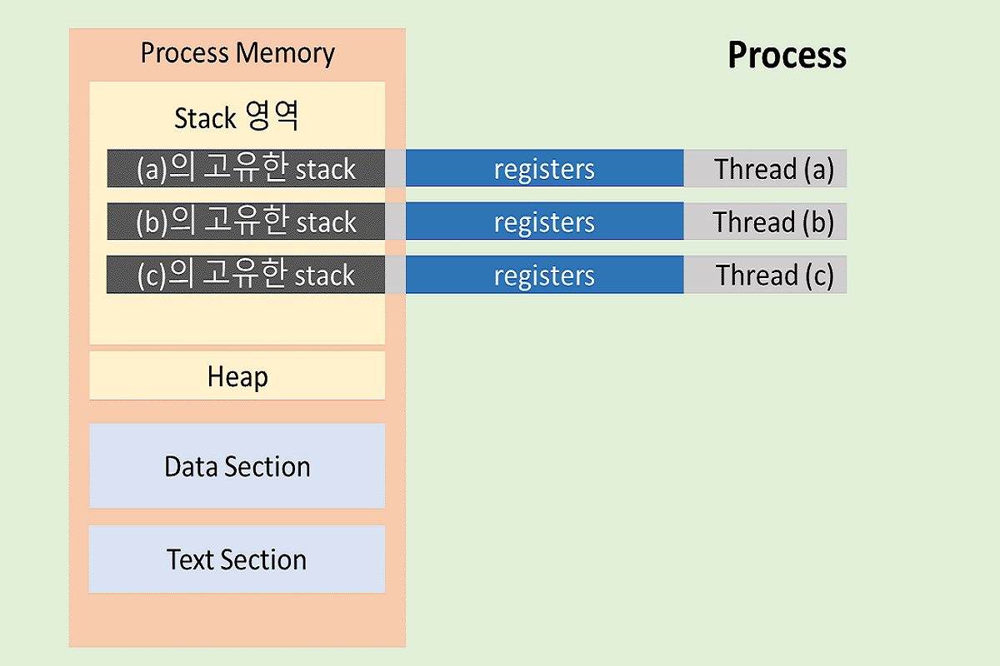

### 컨텍스트 스위칭(Context Swithcing)이란?

컨텍스트 스위칭은 CPU나 코어에서 실행 중이던 프로세스나 스레드가 다른 프로세스나 스레드로 교체되는 과정을 말합니다. 이는 멀티태스킹 시스템에서 여러 작업을 효율적으로 관리하기 위해 필수적인 메커니즘입니다.

{: .important }

컨택스트(Context)란?

컨텍스트는 프로세스나 스레드의 현재 상태를 의미합니다. 여기에는 CPU의 레지스터 상태(프로그램 카운터, 스택 포인터 등)와 메모리 상태가 포함됩니다. 컨텍스트는 프로세스나 스레드가 실행을 중단하고 나중에 다시 시작할 때 필요한 모든 정보를 담고 있습니다.

### 컨텍스트 스위칭이 필요한 이유

멀티태스킹 시스템에서는 여러 프로세스나 스레드가 동시에 실행되는 것처럼 보이도록, CPU가 짧은 시간 단위로 작업을 전환하며 여러 작업을 처리합니다. 이를 통해 사용자에게는 여러 작업이 동시에 진행되는 것처럼 인식되며, 시스템 자원을 효율적으로 활용할 수 있습니다.

### 컨텍스트 스위칭이 발생하는 시점

- **Time Slice(Quantum)를 다 사용했을 때**: 각 프로세스나 스레드에게 할당된 CPU 시간이 다 소진되면 스위칭이 발생합니다.
- **I/O 작업이 필요할 때**: 프로세스나 스레드가 I/O 작업을 수행해야 할 경우, CPU는 다른 작업을 처리하기 위해 현재 작업을 중단하고 스위칭을 수행합니다.
- **우선순위 변경**: 더 높은 우선순위의 작업이 발생하면 현재 작업을 중단하고 우선순위가 높은 작업으로 전환할 수 있습니다.

 

### 컨텍스트 스위칭을 수행하는 주체

컨텍스트 스위칭은 **운영체제의 커널(kernel)** 에 의해 수행됩니다. 커널은 시스템 자원을 관리하고 프로세스 및 스레드의 상태를 조정하여 효율적인 작업 처리를 담당합니다.

### 컨텍스트 스위칭의 구체적인 과정

{: .tip }
프로세스 컨텍스트 스위칭(다른 프로세스에 속한 스레드 간의 컨텍스트 스위칭)

1. **현재 프로세스의 상태 저장:** 실행 중인 프로세스의 레지스터 상태와 메모리 정보를 저장합니다.
2. **다음 프로세스의 상태 로드:** 스케줄러가 선택한 다음 실행할 프로세스의 저장된 상태를 로드합니다.
3. **프로세스 전환:** CPU는 새로운 프로세스의 실행을 시작합니다.
4. **추가 메모리 처리:** 새로운 프로세스의 가상 메모리 주소 체계를 설정하고, MMU(Memory Management Unit)와 TLB(Translation Lookaside Buffer)를 업데이트합니다.

 

{: .tip }
스레드 컨텍스트 스위칭(같은 프로세스에 속한 스레드 간의 컨텍스트 스위칭)

1. **현재 스레드의 상태 저장:** 실행 중인 스레드의 레지스터 상태를 저장합니다.
2. **다음 스레드의 상태 로드:** 동일한 프로세스 내에서 실행할 다음 스레드의 상태를 로드합니다.
3. **스레드 전환:** CPU는 새로운 스레드의 실행을 시작합니다.
4. **메모리 처리 생략:** 동일한 프로세스 내 스레드 간 전환이므로 메모리 관련 추가 처리가 필요 없습니다.

------

### 프로세스와 스레드 컨텍스트 스위칭의 공통점

- **커널 모드에서 실행:** 컨텍스트 스위칭은 항상 운영체제의 커널 모드에서 수행됩니다.
- **CPU 레지스터 상태 교체:** 현재 실행 중인 작업의 레지스터 상태를 저장하고, 다음 작업의 레지스터 상태를 복원합니다.

 

### 프로세스와 스레드 컨텍스트 스위칭의 차이점

같은 프로세스에 속한 스레드들 간의 컨텍스트 스위칭은 같은 프로세스에 속하기 때문에 메모리 영역을 공유합니다. 그래서 스위칭이 발생해도 메모리와 관련한 추가적인 작업이 발생하지 않습니다.

하지만 다른 프로세스에 속한 스레드 간의 컨텍스트 스위칭의 경우 메모리 프로세스간 메모리 주소 체계가 다르기 때문에, 메모리 주소 관련 처리를 추가적으로 수행해야 합니다.

그래서 MMU(Memory Manage Unit) 또한 새로운 프로세스의 주소 체계를 바로보도록 수정해줘야 하고, TLB(Translation Lookaside Buffer)라는 가상 메모리 주소와 실제 메모리 주소의 매핑 정보를 들고 있는 캐시도 비워줘야 합니다. 만약 TLB 캐시를 비워주지 않는 경우 이전에 작업했던 프로세스의 주소에 접근할 가능성이 있기 때문에 반드시 수행해야 합니다.

### 스레드 컨텍스트 스위칭이 프로세스보다 빠른 이유

스레드 컨텍스트 스위칭(Thread Context Switching)의 경우 프로세스 컨텍스트 스위칭(Process Context Switching)과 달리 MMU 새로운 주소 체계 바로보도록 수정하고 TLB 가상 메모리, 실제 메모리 저장된 캐시를 비우는 등의 메모리 주소 관련 작업을 하지 않고, CPU의 상태 정보만 바꿔주면 되기 때문입니다.