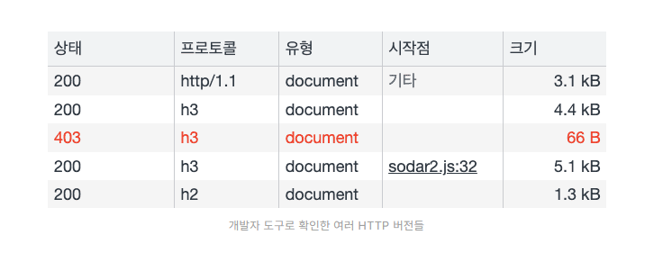
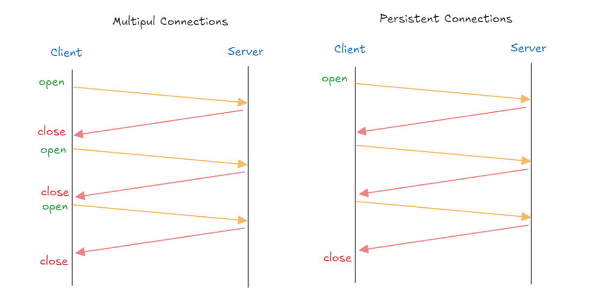
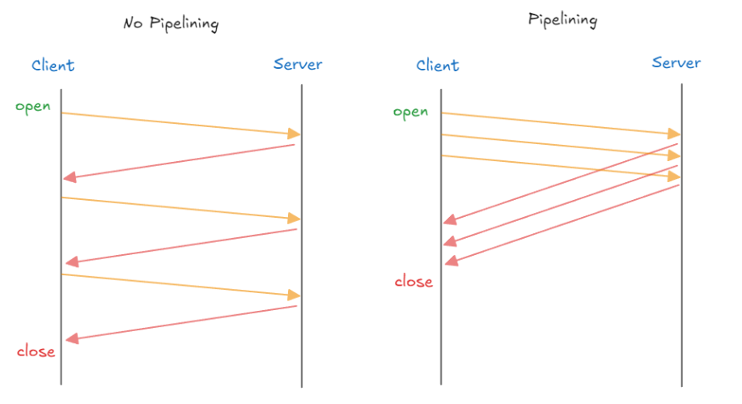
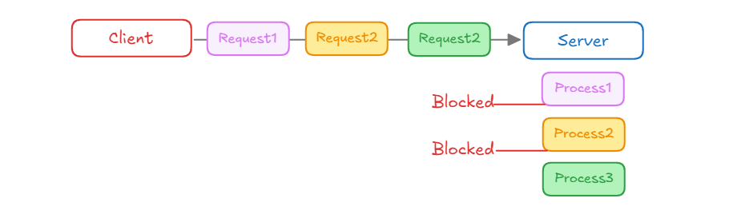
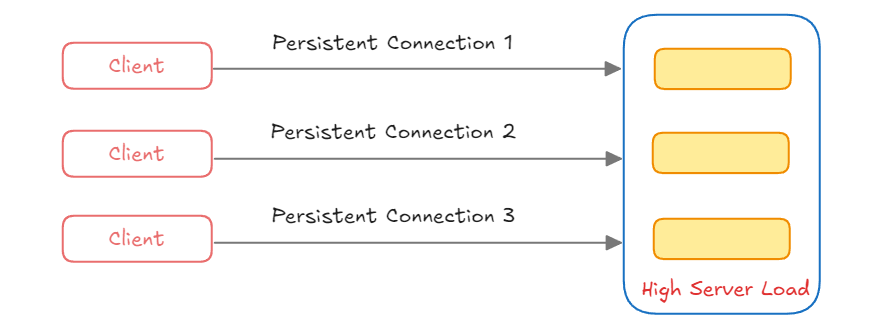
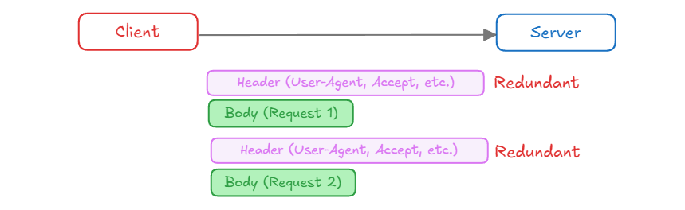

HTTP의 버전은 브라우저 개발자 도구의 네트워크 탭을 열어서 쉽게 확인할 수 있습니다. 위 사진의 프로토콜 컬럼을 살펴보면 **<span style="color:red" >`http/1.1`</span>,<span style="color:red" > `h2`</span>, <span style="color:red" >`h3` </span>**가 적힌 것을 확인할 수가 있습니다. 이는 각 통신이 HTTP/1.1, HTTP/2, HTTP/3을 이용했다는 것을 의미합니다.

그런데 하나의 웹 사이트에서 왜 이렇게 다른 버전의 HTTP가 사용되고 있는 걸까요? 각 버전에는 무슨 차이가 있는 걸까요? 그래서 이번 기회에 HTTP의 각 버전이 등장하게 된 배경과 버전 별 특징을 정리해보고자 합니다.

------

## 표준 이전의 HTTP

HTTP/1.1을 알기 위해서는 표준 이전의 HTTP에 대해서도 알아야 합니다. 표준 이전의 HTTP 등장 배경을 먼저 요약하자면 다음과 같습니다.

- HTTP/0.9: 문서화된 최초의 HTTP 버전
- HTTP/1.0: 기존 HTTP의 기능을 확장한 버전
- HTTP/1.1: 표준화 된 HTTP

초창기 HTTP에 대해 이야기하려면 월드 와이드 웹에 대한 이야기를 하지 않을 수가 없네요. 일반적으로 웹은 HTTP라는 프로토콜을 이용해 HTML 파일을 주고 받을 수 있는 공간을 의미합니다.

초창기 웹은 아주 단순한 서버-클라이어트 구조를 따랐습니다. 클라이언트에서 HTML을 받기위해 서버에게 HTTP 규격에 맞춰 요청을 보내면, 서버가 그에 맞는 HTML을 전송하는 것이 전부였습니다. 이러한 HTTP는 처음부터 TCP/IP 위에서 구현되도록 설계되었습니다. 지금은 TCP가 무겁고 느리다고 많이 비판받지만, 당시에는 TCP는 연결 지향적인 특성 때문에 UDP에 비해 안정적이고 신뢰성 있는 통신을 제공했기 때문입니다.

게다가 대역폭 및 트래픽을 최적화하는 기술인 흐름 제어, 혼잡 제어 기능도 기본적으로 제공했기 때문에 HTTP를 설계할 때 저렇게 복잡한 최적화 사항들까지 신경 쓸 필요가 없었습니다.

그러다 보니 당시 HTTP 구조는 매우 간단했습니다. 요청 메서드 종류도 GET 뿐이었고, 헤더나 상태코드도 없었습니다.응답은 무조건 HTML 파일 그 자체였습니다.

아래는 HTTP/0.9 방식을 이용한 요청과 응답의 예시입니다.

```
<!-- 요청 -->
GET /mypage.html

<!-- 응답 -->
<HTML>
Simple HTML page
</HTML>
```

그런데 웹이 점차 인기를 끌다 보니, 기존의 HTTP 사양만으로는 사용자들의 모든 요구사항을 충족할 수 없게 되자 여러 브라우저와 웹 서버 벤더는 각자 HTTP에 여러 가지 기능을 추가했는데, 당시에는 명시적으로 약속된 사항이 없어 이들 간에 많은 혼란이 있었습니다. 즉, 각 서버와 클라이언트의 가눙아 일관성 있게 구현되지 않았기 때문에 문제가 일어난 것입니다.

그래서 다양한 요구사항을 충족시키고 표준화하기 위해 HTTP WG(Working Group)이라는 조직이 탄생하였습니다. 이 조직이 여러 사양들을 정리해서 발표했는데 이를 HTTP/1.0이라 부릅니다.

HTTP/1.0에서 주목할 만한 몇 가지 사항이 있는데, 간단하게만 정리하고 넘어가겠습니다.

- 버전 정보가 명시되었고 각 요청, 응답 사이에서 전송되었습니다.
- 요청 메서드가 GET, HEAD, POST 세 가지로 확장되었습니다.
- 상태 코드가 추가되어 클라이언트 측에서 요청 결과에 따라 동작할 수 있게 되었습니다.
- 요청과 응답에 대한 부가적인 메타데이터를 담는 헤더 필드가 추가되었습니다.
- HTTP 헤더(Content-Type)의 도움으로 HTML 이외의 파일도 전송할 수 있게 되었습니다.

<br>

아래는 HTTP/1.0을 이용한 간단한 요청,응답 예시입니다. 

```
<!-- 요청 -->
GET /mypage.html HTTP/1.0
User-Agent: NCSA_Mosaic/2.0 (Windows 3.1)

<!-- 응답 -->
200 OK
Date: Tue, 15 Nov 1994 01:11:11 GMT
Server: CERN/3.0 libwww/2.17
Content-Type: text/html
<HTML>
Simple HTML page

</HTML>
```

------

## HTTP 1.1

사실 HTTP WG는 HTTP/1.0 사양을 정리하는 동시에 좀 더 표준화 된 사양인 HTTP/1.1의 초안을 제작하고 있었습니다. 

`HTTP 1.0` 은 각 요청마다 새로운 TCP 연결을 맺고, 요청을 처리하고 연결을 끊는 방식이다보니,
`3-way handshake` 와 `4-way handshake` 하는 과정에서 <span style="color:red"> **오버헤드가 발생해서 비효율적이었습니다.**</span>
그리고, 각 요청에 대한 응답을 받은 후에 다음 요청을 보낼 수 있어서 요청/응답이 순차적/직렬적으로 처리되어 <span style="color:orange">**Latency**</span>가 발생했습니다.

따라서 `HTTP 1.1` 에서는 이런 문제를 해결하기 위해서 `Persistent Connection` 과 `Pipelining` 을 지원하게 되었습니다.

### 연결 상태 유지(Persisted connection)



HTTP 1.0에서는 요청에 따른 응답이 수신되면 TCP 연결을 바로 종료하였기 때문에 웹 페이지에서 다수의 HTTP 요청이 발생하는 경우 매번 TCP handshake 과정을 거쳐야 해서 속도가 느려졌습니다. 게다가 TCP 자체의 흐름 제어와 혼잡 제어 알고리즘으로 인해 네트워크 성능이 100% 나오지 않기도 했습니다.

따라서 HTTP 1.1은 기본적으로 한 번 수립한 연결을 재사용하게 설정되어 있습니다. 이렇게 되면 연결을 맺고 끊는 과정이 줄어들기 때문에 지연시간을 줄일 수 있습니다. 물론 연결을 유지하는 시간이 길어질수록 서버에 부하가 생기기 때문에 연결을 유지하는 시간을 제한하고 있으며 이를 Keep-Alive라고 부릅니다.

- Client <-> Server 간 연결을 한 번 맺으면 여러 요청을 그 연결에서 처리 할 수 있게 한다.
- Connection: Keep-alive 헤더가 설정되어, Client나 Server가 명시적으로 연결을 끊지 않는 한 연결이 유지된다.

<br>

### 파이프라이닝(Pipelining)



파이프라이닝은 클라언트가 여러 요청을 연달아 보내야 할 때, 각 응답을 기다리는 것이 아니라 발생한 요청은 일단 전송하고 보는 방식입니다. 기존에는 여러 요청이 있을 때 하나의 요청과 그 응답을 세트로 반복하면서 처리하는 것을 볼 수 있는데요. 이것이 지연을 발생시키고 있는 것을 볼 수 있습니다.

그래서 HTTP 1.1에서는 파이프라이닝 기법을 사용합니다. 일단 클라이언트 측에서 여러 요청을 순차적으로 보내면, 서버는 받은 순서에 따라 응답을 제공하는 방식으로 지연을 개선합니다. 이때 각 요청 별 응답을 구분하기 위해 순서를 엄격히 지켜야 합니다.

- `Pipelining` 은 Client 가 Server 에 여러 요청을 <span style="color:green">**연속적**</span> 으로 보내고 순서대로 처리하는 방식이다.
- `Pipelining` 이 적용되면 <span style="color:green">**하나의 Connection 으로 다수의 요청과 응답을 처리할 수 있게 해서 Latency 를 줄일 수 있다.**</span>

<br>

{: .note}

하지만, 완전한 멀티플렉싱이 아닌 응답 처리를 미루는 방식이여서 각 응답의 처리는 순차적으로 처리되면, 결국 후순위 응답은 지연될 수 밖에 없습니다.

<br>

이 외에도 HTML을 분할해 전송하는 <span style="color:SteelBlue">**청크 전송 인코딩(Chunked Transfer Encoding)**</span>이나 요청과 응답에 대한 메터 정보를 담는 <span style="color:SteelBlue">**캐시 제어(Cache-Control)**</span>, 동일 IP에 여러 도메인을 호스트 할 수 있게 해주는 <span style="color:SteelBlue">**호스트(Host)**</span>등의 헤더와 기능이 추가되었습니다. 

### HTTP 1.1 문제점

`HTTP 1.1` 은 `Persistent Connection` 과 `Pipelining` 같은 기능을 통해서 `HTTP 1.0` 의 단점을 개선했지만,
여전히 여러 **문제점** 이 남아 있습니다.

#### Head-of-Line Blocking(HOLB)



- Client가 세 개의 요청(Request1, Request2, Request3)을 동시에 보내지만, Server는 순차적으로 처리한다.
- 첫 번째 요청(Process1)이 처리되는 동안 다른 요청들 (Process2, Process3)은 차단(Blocked)되어 대기한다.

<br>

{: .important}

**Head-of-Line Blocking 가 발생하는 이유**

- 순차적 처리

 HTTP 1.1 에서는 하나의 연결 위에서 요청이 순서대로 처리되어야 한다.

- 직렬 응답

서버는 요청 받은 순서대로 응답해야하므로, 하나의 요청이 지연되면 다음 요청도 자연스럽게 지연된다.

- 리소스 다운로드

브라우저가 여러 리소스를 요청할 때, 큰 파일(이미지, 동영상) 이 먼저 다운로드 되면, 더 중요한 작은 파일들(css, js)이 대기한다.

#### Connection 관리의 비효율성



여러 클라이언트가 서버와 Persistent Connection을 유지하게 되는 경우 서버는 여러 연결을 동시에 관리해야해서 서버에 부하가 갈 수 있다.

#### Header Overhead



- 클라이언트가 서버에 여러 요청을 보낼 때, 각 요청마다 동일한 Header를 반복해서 전송하게 된다.
- 중복된 Header 정보는 불필요한 대역폭을 차지하게 되어 효율성이 떨어지게 된다.

------

## HTTPS

<p style="text-align:center;">
  
</p>

한편으로는 HTTP의 보안을 강화한 HTTPS가 이맘때 등장했습니다. HTTP 그 자체는 암호화되지 않은 텍스트로만 통신하기 때문에, 중간에 누군가가 통신 내용을 가로채거나 사용자의 정보를 탈취할 수 있다는 문제점이 있었습니다.

이를 방지하기 위해서는 HTTP 통신에 신뢰성과 무결성을 추가할 필요가 있었습니다. HTTPS는 이 문제를 대화 상대가 서로 자신이 신뢰할 수 있음을 증명하는 인증서를 사용하고, 통신 내용은 **SSL(Secure Socket Layer)** 또는 **TLS(Transport Layer Security)**라는 프로토콜로 암호화하는 방식으로 해결했습니다.

이러한 HTTPS 통신에서 서버와 클라이언트는 서로 신뢰할 수 있는 상대인지 확인하기 위해 인증서를 이용한 비대칭 키 암호화 방식을 사용합니다. 

HTTPS 관련 자세한 내용은 [만화로 보는 HTTPS가 작동하는 방식](https://howhttps.works/ko/)을 통해 읽어보시면 좋을 것 같습니다.

