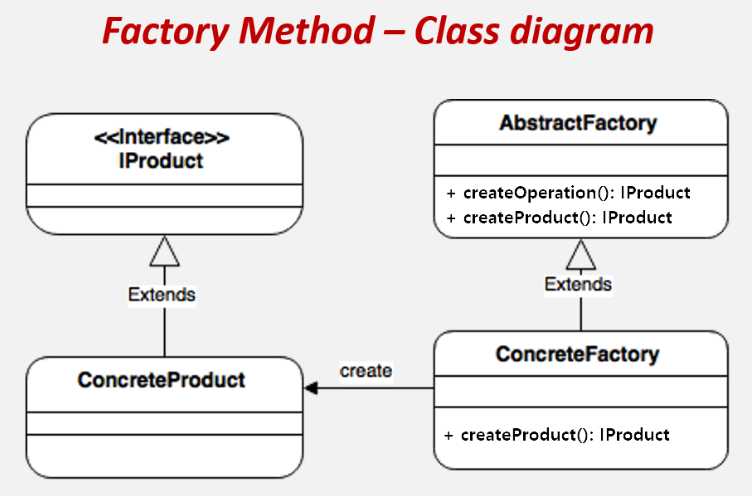
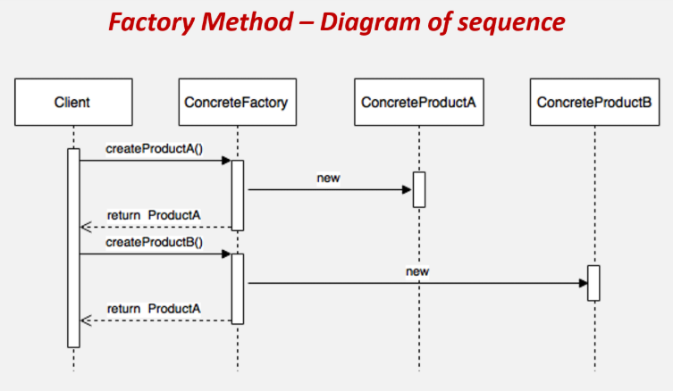
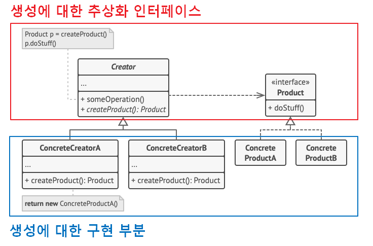
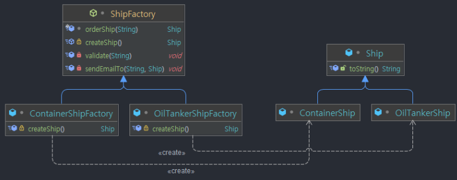

{: .q-left}

> ## Factory Method Pattern

**팩토리 메소드 패턴**은 객체 생성을 공장(Factory) 클래스로 캡슐화 처리하여 대신 생성하게 하는 생성 디자인 패턴이다.

즉, 클라이언트에서 직접 new 연산자를 통해 제품 객체를 생성하는 것이 아닌, 제품 객체들을 도맡아 생성하는 공장 클래스를 만들고, 이를 상속하는 서브 공장 클래스의 메서드에서 여러가지 제품 객체 생성을 각각 책임 지는 것이다.

또한 객체 생성에 필요한 과정을 템플릿 처럼 미리 구성해놓고, 객체 생성에 관한 전처리나 후처리를 통해 생성 과정을 다양하게 처리하여 객체를 유연하게 정할 수 있는 특징도 있다.

### 팩토리 메서드 패턴 구조

<p style="text-align:center;">
  
</p>


- Creator : 새로운 제품 객체들을 반환하는 최상위 공장 클래스로서, abstract로 선언하여 모든 자식 클래스들이 각각 이 메서드의 자체 버전들을 구현하도록 강제할 수도 있다.
  1. 객체 생성 처리 메서드(someOperation) : 객체 생성에 관한 전처리,후처리를 템플릿화한 메서드
  2. 팩토리 메서드(createProduct) : 서브 공장 클래스에서 재정의할 객체 생성 추상 메서드   
- ConcreteCreator : 기초 팩토리 메서드를 오버라이드(재정의)하여 다른 유형의 제품을 반환하게 하도록 한다.
- Product : 제품 구현체를 추상화
- ConcreteProduct: 제품 구현체

팩토리 메소드 패턴은 객체를 만들어내는 공장(Factory 객체)을 만드는 패턴이라고 보면 된다.

이 같은 변경 덕분에 이제 자식 클래스에서 팩토리 메서드를 오버라이딩하고 그 메서드에 의해 생성되는 제품들의 클래스를 변경할 수 있게 된다.

즉, 객체 간의 결합도가 낮아지고 유지보수가 용이해진다.

{: .tip}

Template Method 패턴과 Factory Method 패턴과의 관계

템플릿 메서드는 행동 패턴이고 팩토리 매세드는 생성 패턴이라 전혀 다른 패턴이다. 다만 클래스 구조의 결은 둘이 같다고 보면 되는데, 인스턴스를 생성하는 공장을 Template Method 패턴으로 구성한 것이 Factory Method 패턴이 되기 때문이다. Template Method 패턴에서는 하위 클래스에서 구체적인 처리 알고리즘의 내용을 만들도록 추상 메소드를 상속 시켰었다. 이 로직을 알고리즘 내용이 아닌 인스턴스 생성에 적용한 것이 Factory Method 패턴 인 것이다.

------

### 팩토리 메서드 패턴 흐름

**클래스 구성**

<p style="text-align:center;">
  
</p>

**제품(Product) 클래스**

```java
// 제품 객체 추상화 (인터페이스)
interface IProduct {
    void setting();
}

// 제품 구현체
class ConcreteProductA implements IProduct {
    public void setting() {
    }
}

class ConcreteProductB implements IProduct {
    public void setting() {
    }
}
```

**공장(Factory) 클래스**

```java
// 공장 객체 추상화 (추상 클래스)
abstract class AbstractFactory {

    // 객체 생성 전처리 후처리 메소드 (final로 오버라이딩 방지, 템플릿화)
    final IProduct createOperation() {
        IProduct product = createProduct(); // 서브 클래스에서 구체화한 팩토리 메서드 실행
        product.setting(); // .. 이밖의 객체 생성에 가미할 로직 실행
        return product; // 제품 객체를 생성하고 추가 설정하고 완성된 제품을 반환
    }

    // 팩토리 메소드 : 구체적인 객체 생성 종류는 각 서브 클래스에 위임
    // protected 이기 때문에 외부에 노출이 안됨
    abstract protected IProduct createProduct();
}

// 공장 객체 A (ProductA를 생성하여 반환)
class ConcreteFactoryA extends AbstractFactory {
    @Override
    public IProduct createProduct() {
        return new ConcreteProductA();
    }
}

// 공장 객체 B (ProductB를 생성하여 반환)
class ConcreteFactoryB extends AbstractFactory {
    @Override
    public IProduct createProduct() {
        return new ConcreteProductB();
    }
}
```

{: .tip}

최상위 공장 클래스는 반드시 추상 클래스로 선언할 필요 없다.
Java 8 버전 이후 추가된 인터페이스의 디폴트 메서드를 통해 팩토리 메서드를 선언하면 되기 때문이다.

```java
interface class AbstractFactory {

    default IProduct someOperation() {
        IProduct product = createProduct();
        product.setting(); 
        return product
    }

	IProduct createProduct();
}

class ConcreteFactoryA implements AbstractFactory {
    @Override
    public IProduct createProduct() {
        return new ConcreteProductA();
    }
}
```

**클래스 흐름**

<p style="text-align:center;">
  
</p>

```java
class Client {
    public static void main(String[] args) {
        // 1. 공장 객체 생성 (리스트)
        AbstractFactory[] factory = {
                new ConcreteFactoryA(),
                new ConcreteFactoryB()
        };

        // 2. 제품A 생성 (안에서 createProduct() 와 생성 후처리 실행)
        IProduct productA = factory[0].createOperation();

        // 3. 제품B 생성 (안에서 createProduct() 와 생성 후처리 실행)
        IProduct productB = factory[1].createOperation();
    }
}
```

```java
abstract class AbstractFactory {

    final IProduct createOperation() { // 2. 호출됨
        IProduct product = createProduct(); // 3. 재정의된 메서드로 이동
        product.setting();
        return product; // 5. 제품 A 반환
    }


    abstract protected IProduct createProduct();
}


class ConcreteFactoryA extends AbstractFactory {
    @Override
    public IProduct createProduct() { // 4. 제품 A 생성
        return new ConcreteProductA();
    }
}

class Client {
	public static void main(String[] args){
		// 공장 객체 생성
		AbstractFactory[] factory = {
			new ConcrerFactoryA()
		};
		
		IProduct productA = factory[0] createOperation(); // 1. 추상 팩토리 호출
	}
}
```

------

### 팩토리 메서드 패턴 특징

**패턴 사용 시기**

- 클래스 생성과 사용의 처리 로직을 분리하여 <span style="color:red">결합도를 낮추고자</span>할 때

- 코드가 동작해야 하는 객체의 유형과 종속성을 캡슐화를 통해 <span style="color:red">정보 은닉 처리</span>할 경우

- 라이브러리 또는 프레임워크 사용자들에게 내부 컴포넌트들을 확장하는 방법을 제공하고 싶을 경우

- 기존 객체를 매번 재구축하는 대신 이들을 재사용하여 시스템 리소스를 절약하고 싶을 경우

  1. 먼저 생성된 모든 객체를 추적하기 위해 일부 스토리지를 생성해야 한다.
  2. 누군가가 객체를 요청하면 프로그램은 해당 풀 내에서 유휴(free) 객체를 찾아야 한다....
  3. ... 이 객체를 클라이언트 코드에 반환해야 한다.
  4. 유휴(free) 객체가 없으면, 프로그램은 새로운 객체를 생성해야 한다.(그리고 풀에 이 객체를 추가해야 한다.)

  기존 객체를 재사용하는데 정말로 많은 양의 코드가 발생한다. 그리고 중복 코드를 줄이기 위해 이 많은 양의 코드를 모두 한 곳에 넣어야 한다.

  아마도 이 코드를 배치할 수 있는 가장 확실하고 편리한 위치는 우리가 재사용하려는 객체들의 클래스의 생성자일 것이다. 그러나 생성자는 특성상 항상 새로운 객체들을 반환해야 하며, 기존 인스턴스를 반환할 수는 없다.

  따라서 새 객체들을 생성하고 기존 객체를 재사용할 수 있는 일반적인 메서드인 팩토리 메서드를 사용하자!

**패턴 장점**

- 생성자(Creator)와 구현 객체(concrete product)의 강한 결합을 피할 수 있다.
- 팩토리 메서드를 통해 객체의 생성 후 공통으로 할 일을 수행하도록 지정해줄 수 있다.
- 단일 책임 원칙 준수: 객체 생성 코드를 한 곳(패키지, 클래스 등)으로 이동하여 코드를 더 쉽게 유지관리할 수 있다.
- 개방/폐쇄 원칙 준수: 기존 코드를 수정하지 않고 새로운 유형의 제품 인스턴스를 프로그램에 도입할 수 있다.

<p style="text-align:center;">
  
</p>

**패턴 단점**

- 각 제품 구현체마다 팩토리 객체들을 모두 구현해주어야 하기 때문에, 구현체가 늘어날때 마다 팩토리 클래스가 증가하여 서브 클래스 수가 폭발한다

- 코드의 복잡성이 증가한다.

------

## 예제를 통해 알아보는 Factory Method 패턴

**다양한 선박 팩토리 구성하기**

예제로 선박(Ship) 제품을 만드는 로직을 구성한다고 가정

### 클린하지 않은 문제의 코드

가장 심플합 방법은 Ship 객체를 만들어 반환하는 메서드를 정의하는 것이다. 매개변수의 입력값에 따라 룰 기반 각기 다른 타입의 선박을 생성한다.

```java
class Ship {
    String name, color, capacity;

    @Override
    public String toString() {
        return String.format("Ship { name: '%s', color: '%s', logo: '%s' }", name, color, capacity);
    }
}
```

```java
public static Ship orderShip(String name, String email) {
    if (name == null) {
        throw new IllegalArgumentException("배 이름을 지어주세요");
    }
    if (email == null) {
        throw new IllegalArgumentException("이메일을 남겨주세요");
    }

    // 선박 객체 생성
    Ship ship = new Ship();

    // 선박 객체 생성 후처리
    ship.name = name;

    if (name.equalsIgnoreCase("ContainerShip")) {
        ship.capacity = "20t";
    } else if (name.equalsIgnoreCase("OilTankerShip")) {
        ship.capacity = "15t";
    }

    if (name.equalsIgnoreCase("ContainerShip")) {
        ship.color = "green";
    } else if (name.equalsIgnoreCase("OilTankerShip")) {
        ship.color = "blue";
    }

    System.out.println(ship.name + " 다 만들었다고 " + email + "로 메일을 보냈습니다.");

    return ship;
}

public static void main(String[] args) {
    Ship containerShip = orderShip("ContainerShip", "inpa.naver.com");
    System.out.println(containerShip);

    Ship oilTankerShip = orderShip("OilTankerShip", "inpa.naver.com");
    System.out.println(oilTankerShip);
}
```

만일 ContainerShip이나 OilTankerShip 외에 다른 종류의 선박들이 계속 추가된다면 분기문이 선형적으로 늘어나 복잡해질 것이다. 또한 향후에 Ship 클래스 구성 자체가 변화한다면 분기문 로직도 통째로 바꿔줘야 할 것이다.

### 심플 팩토리 메서드 패턴을 적용한 코드

> 심플 팩토리 메서드 패턴

객체 생성을 담당하는 팩토리 클래스를 심플하게 하나만 구성하는 방법을 말한다.

아래 코드는 각 선박 타입에 따른 선박 객체들을 상속 관계로 구성해주고, ShipFactory 클래스를 만들고 모든 선박 객체 생성을 이 공장 클래스에 위임한다.

```java
// 제품 객체
class Ship {
    String name, color, capacity;

    @Override
    public String toString() {
        return String.format("Ship { name: '%s', color: '%s', logo: '%s' }\n", name, color, capacity);
    }
}

class ContainerShip extends Ship {
    ContainerShip() {
        name = "ContainerShip";
        capacity = "20t";
        color = "green";
    }
}

class OilTankerShip extends Ship {
    OilTankerShip() {
        name = "OilTankerShip";
        capacity = "15t";
        color = "blue";
    }
}
```

```java
// 공장 객체
class ShipFactory {

    final Ship orderShip(String name, String email) {
        validate(name, email);

        Ship ship = createShip(name); // 선박 객체 생성

        sendEmailTo(email, ship);

        return ship;
    }

    private Ship createShip(String name) {
        Ship ship = null;
        if (name.equalsIgnoreCase("ContainerShip")) {
            ship = new ContainerShip();
        } else if (name.equalsIgnoreCase("OilTankerShip")) {
            ship = new OilTankerShip();
        }
        return ship;
    }

    private void validate(String name, String email) {
        if (name == null) {
            throw new IllegalArgumentException("배 이름을 지어주세요");
        }
        if (email == null) {
            throw new IllegalArgumentException("이메일을 남겨주세요");
        }
    }

    private void sendEmailTo(String email, Ship ship) {
        System.out.println(ship.name + " 다 만들었다고 " + email + "로 메일을 보냈습니다.");
    }
}
```

```java
class Client {
    public static void main(String[] args) {
        ShipFactory factory = new ShipFactory();

        Ship containerShip = factory.orderShip("ContainerShip", "inpa.naver.com");
        System.out.println(containerShip);

        Ship oilTankerShip = factory.orderShip("OilTankerShip", "inpa.naver.com");
        System.out.println(oilTankerShip);
    }
}
```

아무리 객체 생성을 공장 클래스로 위임했더라도, 여전히 공장 클래스 내에서 분기 로직이 잔존해 있다.

즉, 개방-폐쇄 원칙을 만족하지 못하게 된다. 따라서 새로운 종류의 배를 만든다거나 배를 만드는 공정을 변경할 수 있으면서도 기존에 작성했던 코드를 유지할 수 있는 구조로 변경해야 한다.

{: .important}

생성할 제품 구현체가 몇개 안되고 앞으로 제품 종류 추가 가능성이 없다면, 심플 팩토리 메서드 패턴으로 구성하는 방법도 나쁘지 않다.

### 팩토리 메서드 패턴을 적용한 코드

잔존해 있는 분기문을 제거하고 객체 지향으로 팩토리를 구성해보자

<p style="text-align:center;">
  
</p>

먼저 ShipFactory 클래스를 추상 클래스로 변환하고 Ship 인스턴스 생성을 책임지는 createShip() 메서드를 추상 메서드로 추상화 시킨다. 그리고 각 선박 종류에 맞는 ShipFactory 클래스를 상속하는 서브 팩토리 클래스들을 만들고 createShip() 추상 메서드를 각 객체 특징에 맞게 재정의 하도록 한다.

즉, Ship 인스턴스를 만드는 작업 코드는 서브 클래스가 결정하도록 하는 것이다.

또한 공장 생성 메소드 내부에서는 필요한 동작을 자유롭게 구현할 수도 있어서 좀 더 다양한 기능을 수행하거나 수정에 용이한 구조를 만들어 낼 수 있다.

```java
class Ship {
    String name, color, capacity;

    @Override
    public String toString() {
        return String.format("Ship { name: '%s', color: '%s', logo: '%s' }\n", name, color, capacity);
    }
}

class ContainerShip extends Ship {
    ContainerShip(String name, String capacity, String color) {
        this.name = name;
        this.capacity = capacity;
        this.color = color;
    }
}

class OilTankerShip extends Ship {
    OilTankerShip(String name, String capacity, String color) {
        this.name = name;
        this.capacity = capacity;
        this.color = color;
    }
}
```

```java
abstract class ShipFactory {

    // 객체 생성 전처리 / 후처리 메서드 (상속 불가)
    final Ship orderShip(String email) {
        validate(email);

        Ship ship = createShip(); // 선박 객체 생성

        sendEmailTo(email, ship);

        return ship;
    }

    // 팩토리 메서드
    abstract protected Ship createShip();

    private void validate(String email) {
        if (email == null) {
            throw new IllegalArgumentException("이메일을 남겨주세요");
        }
    }

    private void sendEmailTo(String email, Ship ship) {
        System.out.println(ship.name + " 다 만들었다고 " + email + "로 메일을 보냈습니다.");
    }
}

class ContainerShipFactory extends ShipFactory {
    @Override
    protected Ship createShip() {
        return new ContainerShip("ContainerShip", "20t", "green");
    }
}

class OilTankerShipFactory extends ShipFactory {
    @Override
    protected Ship createShip() {
        return new OilTankerShip("OilTankerShip", "15t", "blue");
    }
}
```

```java
class Client {
    public static void main(String[] args) {
        // 전용 선박 생산 공장 객체를 통해 선박을 생성
        Ship containerShip = new ContainerShipFactory().orderShip("hsh.naver.com");
        System.out.println(containerShip);

        Ship oilTankerShip = new OilTankerShipFactory().orderShip("hsh.naver.com");
        System.out.println(oilTankerShip);
    }
}
```

선박 타입명을 입력값으로 줘서 분기문을 통해 선박 제품을 생성하는 것이 아닌, 전용 선박 생산 공장 객체를 통해 선박을 생성함으로써, 수정에 닫혀있고 확장에 열려있는 구조를 구성할 수 있게 된다.

만일 BattleShip이라는 새로운 종류의 선박 제품을 추가한다 하더라도 기존 코드 수정없이 간단하게 제품 객체와 공장 객체를 각각 정의하고 상속 시키기만 하면된다.

```java
// 제품 객체
class BattleShip extends Ship {
    BattleShip(String name, String capacity, String color) {
        this.name = name;
        this.capacity = capacity;
        this.color = color;
    }
}

// 제품을 생성하는 공장 객체
class BattleShipFactory extends ShipFactory {
    @Override
    protected Ship createShip() {
        return new BattleShip("BattleShip", "10t", "black");
    }
}
```

### 팩토리 객체를 싱글톤화 하기

객체를 생성하는 공장 객체는 여러개 있을 필요성이 없다.

ex) <span style="color:orange">ContainerShipFactory()</span>,<span style="color:orange">OilTankerShipFactory()</span>

따라서 싱글톤 객체로 구성하여 유일한 인스턴스로 만들어 두는 것이 좋다.

```java
class Client {
    public static void main(String[] args) {
        // 전용 선박 생산 공장 객체를 통해 선박을 생성
        Ship containerShip = new ContainerShipFactory().orderShip("hsh.naver.com");
        System.out.println(containerShip);

        Ship oilTankerShip = new OilTankerShipFactory().orderShip("hsh.naver.com");
        System.out.println(oilTankerShip);
    }
}
```

물론 위와 같이 메서드 호출용으로 일회용으로 쓰인 인스턴스는 JVM의 가비지 컬랙션에 의해 자동으로 지워지지만, 이런 가비지 값이 늘어나게되면 나중에 객체 제거 과정에서 Stop-the-world가 일어나게 된다.(프로그램 렉)

따라서 각 팩토리 클래스들을 싱글톤화 시켜 메모리 적으로 최적화를 시킨다.

getInstance() 메서드로 하나만 생성, 메모리 사용은 팩토리 객체 1개만 존재

```java
class ContainerShipFactory extends ShipFactory {

    // Thread-Safe 한 싱글톤 객체화
    private ContainerShipFactory() {}
    private static class SingleInstanceHolder {
        private static final ContainerShipFactory INSTANCE = new ContainerShipFactory();
    }
    public static ContainerShipFactory getInstance() {
        return SingleInstanceHolder.INSTANCE;
    }

    @Override
    protected Ship createShip() {
        return new ContainerShip("ContainerShip", "20t", "green");
    }
}

class OilTankerShipFactory extends ShipFactory {

    // Thread-Safe 한 싱글톤 객체화
    private OilTankerShipFactory() {}
    private static class SingleInstanceHolder {
        private static final OilTankerShipFactory INSTANCE = new OilTankerShipFactory();
    }
    public static OilTankerShipFactory getInstance() {
        return OilTankerShipFactory.SingleInstanceHolder.INSTANCE;
    }

    @Override
    protected Ship createShip() {
        return new OilTankerShip("OilTankerShip", "15t", "blue");
    }
}

class Client {
    public static void main(String[] args) {
        // 전용 선박 생산 공장 객체를 통해 선박을 생성
        Ship containerShip = ContainerShipFactory.getInstance().orderShip("hsh.naver.com");
        System.out.println(containerShip);

        Ship oilTankerShip = OilTankerShipFactory.getInstance().orderShip("hsh.naver.com");
        System.out.println(oilTankerShip);
    }
}
```

- ContainerShipFactory 클래스는 한 번만 생성됨
- 이 팩토리 객체를 여러 번 재사용할 수 있음

{: .note}

팩토리 클래스는 보통 상태를 가지지 않고, 객체를 생성하는 기능만 제공하므로 굳이 여러 개를 만들 필요가 없어 싱글톤 팩토리를 쓴다.

### 최상위 팩토리를 인터페이스로 구성하기

최싱위 팩토리 클래스는 반드시 추상 클래스로 선언할 필요가 없다.

Java 8 버전 이후 추가된 인터페이스의 디폴트 메서드와 Java 9 버전 이후 추가된 private 메서드를 통해 그대로 인터페이스로 구성할 수 있기 때문이다.

```java
interface ShipFactory {

    // java8에 추가된 디폴트 메서드
    default Ship orderShip(String email) {
        validate(email);

        Ship ship = createShip(); // 선박 객체 생성

        sendEmailTo(email, ship);

        return ship;
    }

    // 팩토리 추상 메서드
    Ship createShip();
	
    // java9에 추가된 private 메서드
    private void validate(String email) {
        if (email == null) {
            throw new IllegalArgumentException("이메일을 남겨주세요");
        }
    }

    private void sendEmailTo(String email, Ship ship) {
        System.out.println(ship.name + " 다 만들었다고 " + email + "로 메일을 보냈습니다.");
    }
}
```

------

## 실무에서 찾아보는 Factory Method 패턴

### Java

매개변수의 값에 따라 또는 메서드에 따라 각기 다른 인스턴스를 리턴하는 단순한 버전의 팩토리 패턴으로서 팩토리 메서드 패턴과는 조금 다르다.

- java.util.Calendar 의 getInstance()
- java.util.ResourceBundle 의 getBundle()
- java.text.NumberFormat 의 getInstance()
- java.nio.charset.Charset 의 forName()
- java.net.URLStreamHandlerFactory 의 createURLStreamHandler(String)
- java.util.EnumSet 의 of()
- javax.xml.bind.JAXBContext 의 createMarshaller() and other similar methods

<br>

#### NumberFormat의 getInstance()

- 국가  또는 화폐에 따라 다른 표현 방식을 커버하기 위해 팩토리 메소드 패턴으로 디자인 되었다.
- NumberFormat을 구현하는 클래스는 DecimalFormat, ExponentialFormat 등이 있다.

```java
public static void main(String[] args) {
    // 팩토리 메서드로 구현체를 생성하여 반환
    NumberFormat currencyFormatter = NumberFormat.getCurrencyInstance();
    NumberFormat percentFormatter = NumberFormat.getPercentInstance();

    double x = 0.1;

    System.out.println(currencyFormatter.format(x)); // $0.10를 출력한다.
    System.out.println(percentFormatter.format(x)); // 10%를 출력한다.
}
```

<br>

#### Calendar의 getInstance()

- getInstance()를 호출할 때마다 새로운 Calendar 객체가 생성
- Calendar는 Gregorian 형식 Julian 형식이 있는데, 이 두가지 경우를 모두 커버하기 위해 팩토리 메소드 패턴으로 디자인 되었다.

```java
public static void main(String[] args) {
    // 팩토리 메서드로 구현체를 생성하여 반환
    System.out.println("Calendar 예시 : ", Calendar.getInstance());
}
```

------

### Spring Framework

<br>

#### BeanFactory

- Object 타입의 Product 를 만드는 BeanFactory 라는 Creator
- BeanFactory 가 Creator 인터페이스이고 이를 구현한 ClassPathXmlApplicationContext, AnnotationConfigApplicationContext 가 ConcreteCreator 이다.
- 여기서 넘겨주는 Product 는 Object 타입이고 이를 넘겨 받는 인스턴스가 ConcreateProduct 가 된다.
- 컴포넌트 스캔, bean 설정 어노테이션, xml 파일 등의  bean 들이 결국 ConcreateProduct 에 해당되는 것
- ioc 컨테이너에 해당되는 클래스가 bean 팩토리 인데 이부분에 녹아져 있는 패턴이 팩토리 메서드 패턴이다.

```java
// 컴포넌트 스캔, bean 설정 어노테이션, xml 파일 등의 bean 들을 매개변수로 주어 ConcreateProduct 를 반환
BeanFactory xmlFactory = new ClassPathXmlApplicationContext("config.xml");
String hello = xmlFactory.getBean("hello", String.class);

BeanFactory javaFactory = new AnnotationConfigApplicationContext(Config.class);
String hi = javaFactory.getBean("hi", String.class);
```

