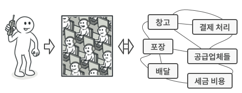
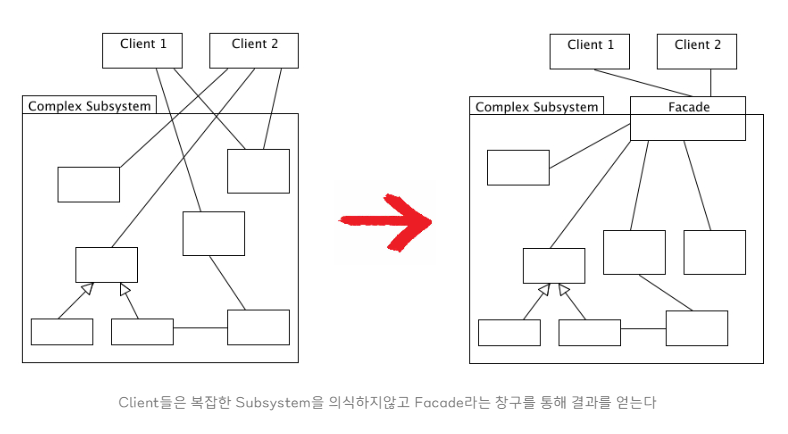
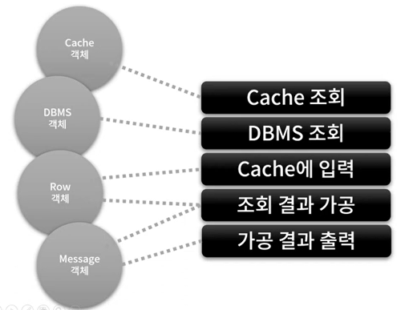
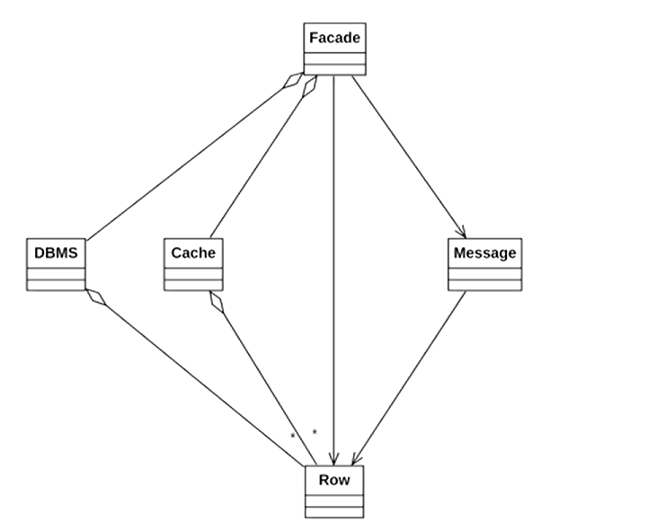

## Facade Pattern

{: .note }
복잡한 클래스 라이브러리에 대해 사용하기 편하게 간편한 인터페이스를 구성하기 위한 구조 패턴

예를들어 라이브러리의 각 클래스와 메서드들이 어떤 목적의 동작인지 이해하기 어려워 바로 가져다 쓰기에는 난이도가 높을때, 이에 대한 적절한 네이밍과 정리를 통해 사용자로 하여금 쉽게 라이브러리를 다룰 수 있도록 인터페이스를 만든다.


<p style="text-align:center;">
  
</p>

버전이 올라갈수록 많은 클래스들이 만들어져 서로 관계를 맺으면서 점점 복잡해진다. 그래서 커다란 솔루션을 구성하려면 상호 관련된 많은 클래스들을 적절히 제어해야 할 필요성이 있다. 위 그림을 보면 전화로 주문하기 위해 매장에 전화를 걸었을 때 전화를 받는 교환원을 두어 사용자는 교환원을 통해서 간단한 명령 요구만 내리면 요구에 대한 서비스를 받을 수 있다.

이처럼 퍼사드(Facade) 패턴은 복잡하게 얽혀 있는 것을 정리해서 사용하기 편한 인터페이스를 고객에게 제공한다고 보면된다.

------

### 퍼사드 패턴 구조

<p style="text-align:center;">
  
</p>

- Facade : 서브 시스템 기능을 편리하게 사용할 수 있도록 하기 위해 여러 시스템과 상호 작용하는 복잡한 로직을 재정리해서 높은 레벨의 인터페이스를 구성한다. 클라이언트의 요청을 어디로 보내야 하는지 알고 있다.
- Additional Facade : 하나의 퍼사드를 관련 없는 기능들로 오염시켜 복잡한 구조로 만드는 것을 방지하기 위해 퍼사드를 분리할 수 있다. 이 추가적인 퍼사드들은 클라이언트들과 다른 퍼사드 모두에 사용할 수 있다.
- SubSystem : 수십 가지 라이브러리 혹은 클래스
- Client : 서브 시스템에 직접 접근하는 대신 Facade를 사용한다. 

퍼사드 패턴은 다른 디자인 패턴과는 다르게 클래스 구조가 정형화 되지 않은 패턴이다. 그냥 퍼사드 클래스를 만들어 적절히 기능 집약화만 해주면 그게 디자인 패턴이 되는 것이다.

{: .tip}

클라이언트로 하여금 복잡한 것을 의식하지 않도록 해주는 것

<p style="text-align:center;">
  
</p>

**재귀적인 Facade 패턴의 적용**

재귀적 퍼시드란 위에서 언급한 Additional Facade를 말하는 것이다. 예를 들어 다수의 클래스, 다수의 패키지를 포함하고 있는 큰 시스템에 요소 요소마다 Facade 패턴을 여기 저기 적용하고 다시 그 Facade를 합친 Facade를 만드는 식으로, 퍼사드를 재귀적으로 구성하면 시스템은 보다 편리하게 된다. 이처럼 퍼사드는 한 개만 있으라는 법은 없으며 필요에 의하면 얼마든지 늘려 의존할 수 있다.

------

### 퍼사드 패턴의 특징

**패턴 사용 시기**

- 시스템이 너무 복잡할 때
- 간단한 인터페이스를 통해 복잡한 시스템을 접근하도록 하고 싶을때
- 시스템을 사용하고 있는 외부와 결합도가 너무 높을 때 의존성 낮추기 위할때

**패턴 장점**

- 하위 시스템의 복잡성에서 코드를 분리하여, 외부에서 시스템을 사용하기 쉬워진다.
- 하위 시스템 간의 의존 관계가 많을 경우 이를 감소시키고 의존성을 한 곳으로 모을 수 있다.
- 복잡한 코드를 감춤으로써, 클라이언트가 시스템의 코드를 모르더라도 Facade 클래스만 이해하고 사용 가능

{: .caution}

중간에 매개체 역할을 해주는 퍼사드 객체가 있기 때문에 실제 내부 로직이 어떻게 변경이 되더라도 상관이 없어지므로 의존성이 감소된다.

**패턴 단점**

- 퍼사드는 앱의 모든 클래스에 결합된 전지전능한 객체가 될 수 있다.
- 퍼사드 클래스 자체가 서브 시스템에 대한 의존성을 가지게 되어 의존성을 완전히 피할 수는 없다.
- 추가적인 코드가 늘어나는 것이기에 유지보수 측면에서 공수가 더 많이 들게 된다.
- 추상화 하고자하는 시스템이 얼마나 복잡한지 퍼사드 패턴을 통해서 얻게 되는 이점과 추가적인 유지보수 비용을 비교해보며 결정해야 한다.

------

### 구현 방법

1. 기존 하위시스템이 이미 제공하고 있는 것보다 더 간단한 인터페이스를 제공하느 것이 가능한지 확인한다.
2. 새 퍼사드 패턴 클래스에서 이 인터페이스를 선언하고 구현한다. 이 퍼사드는 클라이언트 코드의 호출들을 하위 시스템의 적절한 객체들로 리다이렉션 해야한다.
3. 패턴을 최대한 활용하려면 모든 클라이언트 코드가 퍼사드 패턴을 통해서만 하위 시스템과 통신하도록 해야한다. 이를 통해 클라이언트 코드는 하위 시스템의 변경 사항들로부터 보호될 수 있다.
4. 퍼사드가 너무 커지면 행동들 일부를 새롭고 refined한 퍼사드 클래스로 추출하는 것을 고려해야 한다.

------

## 예제를 통해 알아보는 Facade 패턴

<br>

### 복잡한 DBMS 시스템 간편하게 재구성

데이터베이스로부터 어떤 데이터를 조회해서 출력해주는 JDBC 비스무리한 자바 패키지가 있다고 하자. 우리는 이 라이브러리를 이용하여 데이터베이스로부터 값을 얻어오고 화면에 데이터를 파싱해서 예쁘게 출력하려는 프로그램을 만들려고 한다.
패키지에는 총 4개의 Cache, DBMS, Row, Message 클래스가 존재한다. 그리고 아래 그림에서 볼 수 있듯이 각 행위에 대해 각 클래스들의 역할이 정해져 있다.

<p style="text-align:center;">
  
</p>

그런데 이 라이브러리를 이용하는데 있어 DB를 조회해서 데이터를 가공하기까지 다음과 같은 규칙이 존재한다고 한다.

1. DBMS를 바로 조회하기 전에
2. 과거에 조회된 데이터인지를 캐시에서 먼저 조사를 하고
3. 캐시에 데이터가 있다면 이 캐시에 데이터를 가공하고 출력
4. 캐시에 데이터가 없다면 DBMS를 통해서 조회를 하고
5. 조회된 데이터를 가공하고 출력함과 동시에 캐시에 저장한다.

DBMS에 조회된 데이터는 성능을 위해 반드시 캐시에 저장해야 되는 것을 잊지 말아야하고, 또한 데이터를 가공하기 위해서는 Message 클래스를 써야 한다. 이 수칙을 따르지 않으면 라이브러리가 제대로 작동하지 않아 개발자는 위의 사항을 제대로 숙지한 상태에서 프로그래밍을 하여야 한다.
우선 라이브러리의 각 클래스에 대한 은유적인 코드는 아래와 같다고 한다.

```java
// DBMS에 저장된 데이터를 나타내는 클래스
class Row  {
    private String name;
    private String birthday;
    private String email;

    public Row(String name, String birthday, String email) {
        this.name = name;
        this.birthday = birthday;
        this.email = email;
    }

    public String getName() {
        return name;
    }

    public String getBirthday() {
        return birthday;
    }

    public String getEmail() {
        return email;
    }
}

// 데이터베이스 역할을 하는 클래스
class DBMS {
    private HashMap<String, Row> db = new HashMap<>();

    public void put(String name, Row row) {
        db.put(name, row);
    }

    // 데이터베이스에 쿼리를 날려 결과를 받아오는 메소드
    public Row query(String name) {
        try {
            Thread.sleep(500); // DB 조회 시간을 비유하여 0.5초대기로 구현
        } catch(InterruptedException e) {}

        return db.get(name.toLowerCase());
    }
}

// DBMS에서 조회된 데이터를 임시로 담아두는 클래스 (속도 향상)
class Cache {
    private HashMap<String, Row> cache = new HashMap<>();

    public void put(Row row) {
        cache.put(row.getName(), row);
    }

    public Row get(String name) {
        return cache.get(name);
    }
}

// Row 클래스를 보기좋게 출력하는 클래스
class Message {
    private Row row;

    public Message(Row row) {
        this.row = row;
    }

    public String makeName() {
        return "Name : \"" + row.getName() + "\"";
    }

    public String makeBirthday() {
        return "Birthday : " + row.getBirthday();
    }

    public String makeEmail() {
        return "Email : " + row.getEmail();
    }
}
```

#### 클린하지 않은 문제의 코드

문제의 코드는 당연히 라이브러리의 코드를 그대로 메인 로직에 작성하여 구현하는 것이다. 데이터를 조회하고 출력되기 까지 여러개의 객체가 사용되고 있다.
물론 당장은 프로그램이 정상적으로 돌아가 서비스에는 문제가 없을지는 모르겠지만, 나중에 수정과 확장함에 있어 개발자가 위의 수칙들을 까먹고 실수를 하여 서비스에 버그가 생길수 있다.

```java
class Client {
    public static void main(String[] args) {
        // 1. 데이터베이스 생성 & 등록
        DBMS dbms = new DBMS();
        dbms.put("홍길동", new Row("홍길동", "1890-02-14", "honggildong@naver.com"));
        dbms.put("임꺽정", new Row("임꺽정", "1820-11-02", "imgguckjong@naver.com"));
        dbms.put("주몽", new Row("주몽", "710-08-27", "jumong@naver.com"));

        // 2. 캐시 생성
        Cache cache = new Cache();

        // 3. 트랜잭션에 앞서 먼저 캐시에 데이터가 있는지 조회
        String name = "홍길동";
        Row row = cache.get(name);

        // 4. 만약 캐시에 없다면
        if (row == null){
            row = dbms.query(name); // DB에 해당 데이터를 조회해서 row에 저장하고
            if(row != null) {
                cache.put(row); // 캐시에 저장
            }
        }

        // 5. dbms.query(name)에서 조회된 값이 있으면
        if(row != null) {
            Message message = new Message(row);

            System.out.println(message.makeName());
            System.out.println(message.makeBirthday());
            System.out.println(message.makeEmail());
        }
        // 6. 조회된 값이 없으면
        else {
            System.out.println(name + " 가 데이터베이스에 존재하지 않습니다.");
        }
    }
}
```

#### 퍼사드 패턴을 적용한 코드

따라서 이러한 사항들을 개발자가 직접 기억해서 하나하나 따져가며 코드를 작성하는 것보다, 이 사항들을 묶은 클래스를 하나 추가해서 단순화된 인터페이스를 통해 서브 클래스를 다룸으로써 개발자의 실수를 줄이고자 하는 것이 바로 퍼사드(Facade) 패턴이다. 마치 교재에 있는 풀어져 있는 내용들을 필기노트에 요약하듯이, 퍼사드 객체에 사용 로직을 묶어 재정리 함으로써 단순화 시켜 개발을 보다 용이하게 해주는 것이다.

<p style="text-align:center;">
  
</p>

```java
class Facade {
    private DBMS dbms = new DBMS();
    private Cache cache = new Cache();

    public void insert() {
        dbms.put("홍길동", new Row("홍길동", "1890-02-14", "honggildong@naver.com"));
        dbms.put("임꺽정", new Row("임꺽정", "1820-11-02", "imgguckjong@naver.com"));
        dbms.put("주몽", new Row("주몽", "710-08-27", "jumong@naver.com"));
    }

    public void run(String name) {
        Row row = cache.get(name);

        // 1. 만약 캐시에 없다면
        if (row == null){
            row = dbms.query(name); // DB에 해당 데이터를 조회해서 row에 저장하고
            if(row != null) {
                cache.put(row); // 캐시에 저장
            }
        }

        // 2. dbms.query(name)에서 조회된 값이 있으면
        if(row != null) {
            Message message = new Message(row);

            System.out.println(message.makeName());
            System.out.println(message.makeBirthday());
            System.out.println(message.makeEmail());
        }
        // 3. 조회된 값이 없으면
        else {
            System.out.println(name + " 가 데이터베이스에 존재하지 않습니다.");
        }
    }
}
```

```java
class Client {
    public static void main(String[] args) {

        // 1. 퍼사드 객체 생성
        Facade facade = new Facade();

        // 2. db 값 insert
        facade.insert();

        // 3. 퍼사드로 데이터베이스 & 캐싱 & 메세징 로직을 한번에 조회
        String name = "홍길동";
        facade.run(name);
    }
}
```

퍼사드 패턴을 적용하니 메인 로직이 엄청 심플해졌다. 이처럼 퍼사드의 핵심은 인터페이스(API)를 적게 구성하는 것이다. 라이브러리에서 제공하는 클래스나 메소드가 많이 보이면, 프로그래머는 무엇을 사용하면 좋을지 망설이게 되고 호출하는 순서도 doc을 살펴보며 주의해야만 한다. 주의해야 한다는 말은 다르게 말하면 틀리기 쉽다는 것이다. 따라서 퍼사드의 메서드를 가능한 적게 구성하는 것이 좋다.

{: .important}

오해하지 말아야 할 점은 퍼사드는 하위 시스템 클래스들을 캡슐화 하는 것이 아니다. 그냥 서브 시스템들을 사용할 간단한 인터페이스를 제공할 뿐 이다. 사용자가 서브 시스템 내부의 클래스를 직접 사용하는 것을 제한할 수는 없다. 그래서 오히려 추상화에 가깝다고 볼 수 있다.

{: .caution}

대부분의 경우 퍼사드 객체는 하나만 있어도 충분하므로, 퍼사드 클래스를 싱글톤으로 구성해주면 좋다.