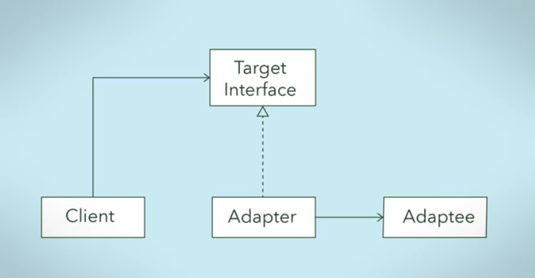
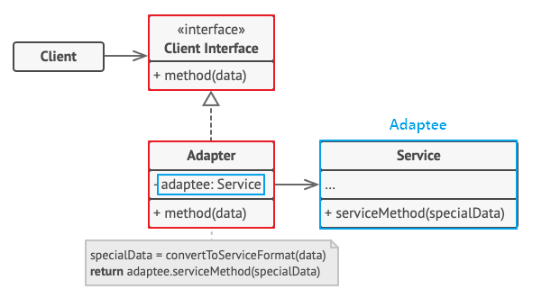
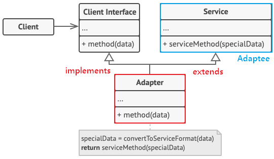
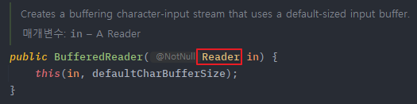
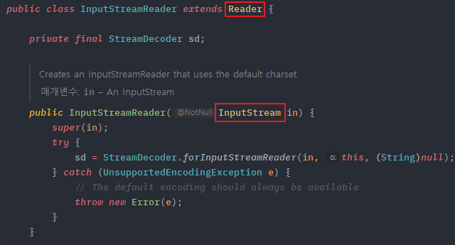
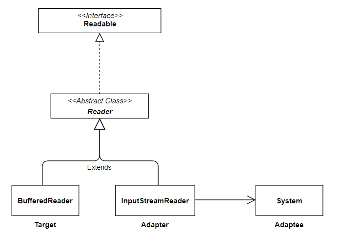

## Adapter Pattern

{: .note }

호환성이 없는 인터페이스 때문에 함께 동작할 수 없는 클래스들이 함께 작동하도록 해주는 패턴

기존에 있는 시스템에 새로운 써드파티 라이브러리를 추가하고 싶거나, Legacy 인터페이스를 새로운 인터페이스로 교체하는 경우에 어댑터 패턴을 사용하면 코드의 재사용성을 높일 수 있다.

<p style="text-align:center;">
  
</p>

------

### 어댑터 패턴 구조

Adapter 패턴에는 기존 시스템의 클래스를 상속해서 호환 작업을 해주냐, 합성해서 호환작업을 해주냐에 따라, 두 가지 패턴 방법으로 나뉘게 된다.

#### 객체 어댑터(Object Adapter)

- 합성된 멤버에게 위임을 이용한 어댑터 패턴 (추천 방식)
- 자기가 해야 할 일을 클래스 멤버 객체의 메소드에게 다시 시킴으로 목적을 달성하는 것을 위임이라고 한다.
- 합성을 활용하였기 때문에 런타임 중에 Adaptee(Service)가 결정되어 유연하다.
- 그러나 Adaptee(Service) 객체를 필드 변수로 저장해야 하기 때문에 공간 차지 비용이 든다.

<p style="text-align:center;">
  
</p>

1. Adaptee(Service) : 어댑터 대상 객체. 기존 시스템 / 외부 시스템 / 써드파티 라이브러리
2. Target(Client Interface) : Adapter가 구현하는 인터페이스
3. Adapter : Client와 Adapter(Service) 중간에서 호환성이 없는 둘을 연결시켜주는 역할을 담당
4. Client : 기존 시스템을 어댑터를 통해 이용하려는 쪽. Client Interface를 통하여 Service를 이용한다.

- <span style="color:red">Object Adapter 방식에서는 합성을 이용해 구성한다.</span>
- <span style="color:red">Adaptee(Service)를 따로 클래스 멤버로 설정하고 위임을 통해 동작을 매치시킨다.</span>

```java
// Adaptee : 클라이언트에서 사용하고 싶은 기존의 서비스 (하지만 호환이 안되서 바로 사용 불가능)
class Service {

    void specificMethod(int specialData) {
        System.out.println("기존 서비스 기능 호출 + " + specialData);
    }
}

// Client Interface : 클라이언트가 접근해서 사용할 고수준의 어댑터 모듈
interface Target {
    void method(int data);
}

// Adapter : Adaptee 서비스를 클라이언트에서 사용하게 할 수 있도록 호환 처리 해주는 어댑터
class Adapter implements Target {
    Service adaptee; // composition으로 Service 객체를 클래스 필드로

    // 어댑터가 인스턴스화되면 호환시킬 기존 서비스를 설정
    Adapter(Service adaptee) {
        this.adaptee = adaptee;
    }

    // 어댑터의 메소드가 호출되면, Adaptee의 메소드를 호출하도록
    public void method(int data) {
        adaptee.specificMethod(data); // 위임
    }
}
```

```java
class Client {
    public static void main(String[] args) {
        // 1. 어댑터 생성 (기존 서비스를 인자로 받아 호환 작업 처리)
        Target adapter = new Adapter(new Service());

        // 2. Client Interface의 스펙에 따라 메소드를 실행하면 기존 서비스의 메소드가 실행된다.
        adapter.method(1);
    }
}
```

#### 클래스 어댑터 (Class Adapter)

- 클래스 상속을 이용한 어댑터 패턴
- Adaptee(Service)를 상속했기 때문에 따로 객체 구현없이 바로 코드 재사용이 가능하다.
- 상속은 대표적으로 기존에 구현된 코드를 재사용하는 방식이지만, 자바에서는 다중 상속 불가 문제 때문에 전반적으로 권장하지는 않는다.

<p style="text-align:center;">
  
</p>

1. Adaptee(Service) : 어댑터 대상 객체. 기존 시스템 / 외부 시스템 / 써드파티 라이브러리
2. Target(Client Interface) : Adapter가 구현하는 인터페이스
3. Adapter : Client와 Adapter(Service) 중간에서 호환성이 없는 둘을 연결시켜주는 역할을 담당
4. Client : 기존 시스템을 어댑터를 통해 이용하려는 쪽. Client Interface를 통하여 Service를 이용한다.

- <span style="color:red">Class Adapter 방식에선 상속을 이용해 구성한다.</span>
- <span style="color:red">Existing Class와 Adaptee(Service)를 동시에 Implements,extends하여 구성한다.</span>

```java
// Adaptee : 클라이언트에서 사용하고 싶은 기존의 서비스 (하지만 호환이 안되서 바로 사용 불가능)
class Service {

    void specificMethod(int specialData) {
        System.out.println("기존 서비스 기능 호출 + " + specialData);
    }
}

// Client Interface : 클라이언트가 접근해서 사용할 고수준의 어댑터 모듈
interface Target {
    void method(int data);
}

// Adapter : Adaptee 서비스를 클라이언트에서 사용하게 할 수 있도록 호환 처리 해주는 어댑터
class Adapter extends Service implements Target {

    // 어댑터의 메소드가 호출되면, 부모 클래스 Adaptee의 메소드를 호출
    public void method(int data) {
        specificMethod(data);
    }
}
```

```java
class Client {
    public static void main(String[] args) {
        // 1. 어댑터 생성
        Target adapter = new Adapter();

        // 2. 인터페이스의 스펙에 따라 메소드를 실행하면 기존 서비스의 메소드가 실행된다.
        adapter.method(1);
    }
}
```

------

### 어댑터 패턴 호출 과정

<p style="text-align:center;">
  
</p>

클라이언트에서는 Target Interface를 호출하는 것처럼 보인다. 하지만 클라이언트의 요청을 전달받은 (Target Interface를 구현한) Adapter는 자신이 감싸고 있는 Adaptee에게 실질적인 처리를 위임한다. Adapter가 Adaptee를 감싸고 있는 것 때문에 Wrapper 패턴이라고도 불린다.

------

### 어댑터 패턴 특징

**패턴 사용 시기**

- 레거시 코드를 사용하고 싶지만 새로운 인터페이스가 레거시 코드와 호환되지 않을 때
- 이미 만든 것을 재사용하고자 하나 이 재사용 가능한 라이브러리를 수정할 수 없을 때
- 이미 만들어진 클래스를 새로운 인터페이스(API)에 맞게 개조할 때
- 소프트웨어의 구 버전과 신 버전을 공존시키고 싶을 때

{: .important}

Adapter 패턴은 기존의 클래스를 수정하지 않고 새로운 인터페이스에 맞게 호환 작업을 중계해주는 것이다.

**패턴 장점**

- 프로그램의 기본 비즈니스 로직에서 인터페이스 또는 데이터 변환 코드를 분리할 수 있기 때문에 <span style="color:RoyalBlue">**단일 책임 원칙**</span>을 만족한다.
- 기존 클래스 코드를 거치지 않고 클라이언트 인터페이스를 통해 어댑터와 작동하기 때문에 <span style="color:RoyalBlue">**개방 폐쇄 원칙**</span>에 만족한다

**패턴 단점**

- 다수의 새로운 인터페이스와 클래스들을 도입해야 하므로 코드의 전반적인 복잡성이 증가한다.

------

## 예제를 통해 알아보는 Adapter 패턴

<br>

### 프로그램의 엔진을 교체하고 호환시키기

우리 회사에서는 A회사에서 개발한 Sort엔진 솔루션을 구매해서 우리 회사의 Sort머신에 탑재하여 사용해왔다.

```java
interface ISortEngine {
    void setList(); // 정렬할 리스트
    void sort(); // 정렬 알고리즘
    void reverseSort(); // 역순 정렬 알고리즘
    void printSortListPretty(); // 정렬된 리스트를 예쁘게 출력
}

class A_SortEngine implements ISortEngine {
    public void setList() {}
    public void sort() {}
    public void reverseSort() {}
    public void printSortListPretty() {}
}
```

```java
// Client 역할을 하는 클래스 : Sort 엔진 객체를 받아 실행
class SortingMachine {
    ISortEngine engine;

    void setEngine(ISortEngine engine) { this.engine = engine; }

    void sortingRun() {
        engine.setList();

        engine.sort();
        engine.printSortListPretty();

        engine.reverseSort();
        engine.printSortListPretty();
    }

    public static void main(String[] args) {
        SortingMachine machine = new SortingMachine();
        machine.setEngine(new A_SortEngine());
        machine.sortingRun();
    }
}
```

A회사의 Sort엔진 성능보다 B회사의 Sort엔진이 더 좋아 교체하기로 결정했다. 그래서 B회사로부터 엔진 명세서를 받아왔더니, 다음과 같이 기존 Sort엔진과는 동작 메서드 시그니처가 달랐으며 심지어 지원하지 않는 메서드(printSortListPretty)도 존재했다.

```java
class B_SortEngine {
    public void setList() {} // 정렬할 리스트
    public void sorting(boolean isReverse) {} // 정렬 / 역순 정렬 알고리즘 (파라미터로 순서 결정)
}
```

우리 회사의 Sort엔진에서 인터페이스를 끌어다 쓰고 있었기 때문에 B_Sort 엔진에 인터페이스를 implements 해도 호환이 되지 않아 크나큰 수정 작업이 필요불가결 하며, 특히 printSortListPretty 메서드 부재는 조금 치명적이었는데 왜냐하면 이 메서드는 굉장히 이쁘게 정렬된 리스트를 출력해서 마음에 들었기 때문이다. 하지만 B 회사의 엔진 성능이 A 회사 보다 4배나 빨랐기 때문에 비용이 들어도 어떻게든 교체해야 하는 상황이다.

#### 호환성에 문제가 있는 코드

일단 가장 직관적인 해결법은 SortingMachine 클래스를 통짜 수정해서 적응하는 방법이다. 기존 사용하던 인터페이스 내부를 삭제하여 마커 인터페이스 용도로만 이용하고, Sort 머신에서 다운 캐스팅을 통해 둘이 호환시켜 주었다.

```java
interface ISortEngine {
    // 두 엔진 간의 간극이 맞지 않기 때문에 어쩔수없이 삭제해버리고, 마커 인터페이스 용도로만 사용
}

class A_SortEngine implements ISortEngine {
    public void setList() {}
    public void sort() {}
    public void reverseSort() {}
    public void printSortListPretty() {}
}

class B_SortEngine implements ISortEngine {
    public void setList() {} // 정렬할 리스트
    public void sorting(boolean isReverse) {} // 정렬 / 역순 정렬 알고리즘 (파라미터로 순서 결정)
}
```

```java
// Client 역할을 하는 클래스 : Sort 엔진 객체를 받아 실행
class SortingMachine {
    // ISortEngine engine; - 필요 없어져서 deprecated

    // void setEngine(ISortEngine engine) { this.engine = engine; } - 필요 없어져서 deprecated

    void sortingRun() {
        A_SortEngine Aengine = (A_SortEngine) this.engine;
        B_SortEngine Bengine = (B_SortEngine) this.engine;

        Bengine.setList();
        Bengine.sorting(false);

        Aengine.setList();
        Aengine.printSortListPretty();
    }

    public static void main(String[] args) {
        SortingMachine machine = new SortingMachine();
        // machine.setEngine(new A_SortEngine());
        machine.sortingRun();
    }
}
```

이 코드를 더 이상 유지 보수 할 것이 아니라면 이대로 적용하면 된다. 하지만 객체 지향 프로그래밍에서 고수준이 아닌 저수준 모듈로 의존해서 로직을 짜는건 좋지않으며, 만일 나중에 다른 회사의 엔진으로 또 교체해야할 경우가 온다면 안그래도 억지로 호환시키느라 뜯어고친 코드 다시 전체를 뜯어고쳐야 될지도 모른다. 따라서 이러한 노가다 스러운 방법은 좋지않다.

#### 객체 어댑터 패턴을 적용한 코드

어댑터 패턴은 클라이언트가 사용하는 인터페이스는 정해져 있는데, 적용할 코드(Adaptee)가 해당 인터페이스를 따르지 않을때 클라이언트와 Adaptee 사이의 간극을 어댑터로 매꿔서 Adaptee를 재사용할 수 있도록 한다.

우리 회사의 Sort엔진에서 이용하던 인터페이스는 건드리지 않고 별도의 어댑터 SortengineAdapter 클래스를 만들어 호환작업을 시켜준다.

```java
// 기존의 인터페이스는 손대지 않는다
interface ISortEngine {
    void setList(); // 정렬할 리스트
    void sort(); // 정렬 알고리즘
    void reverseSort(); // 역순 정렬 알고리즘
    void printSortListPretty(); // 정렬된 리스트를 예쁘게 출력
}

class A_SortEngine implements ISortEngine {
    public void setList() {}
    public void sort() {}
    public void reverseSort() {}
    public void printSortListPretty() {}
}

class B_SortEngine {
    public void setList() {} // 정렬할 리스트
    public void sorting(boolean isReverse) {} // 정렬 / 역순 정렬 알고리즘 (파라미터로 순서 결정)
}
```

```java
// 객체 어댑터를 구성한다.
class SortEngineAdapter implements ISortEngine {
    // (두 엔진을 composition 하여 이용)
    A_SortEngine Aengine;
    B_SortEngine Bengine;

    SortEngineAdapter(A_SortEngine Aengine, B_SortEngine Bengine) {
        this.Aengine = Aengine;
        this.Bengine = Bengine;
    }

    @Override
    public void setList() {
        Bengine.setList();
    }

    @Override
    public void sort() {
        Bengine.sorting(false); // 메서드 시그니처가 달라서 위임을 통해 호환 작업
    }

    @Override
    public void reverseSort() {
        Bengine.sorting(true); // 메서드 시그니처가 달라서 위임을 통해 호환 작업
    }

    @Override
    public void printSortListPretty() {
        Aengine.printSortListPretty(); // B 엔진에 없는 기능을 A 엔진으로 실행
    }
}
```

```java
// Client 역할을 하는 클래스 : Sort 엔진 객체를 받아 실행
class SortingMachine {
    ISortEngine engine;

    void setEngine(ISortEngine engine) { this.engine = engine; }

    void sortingRun() {
        engine.setList();

        engine.sort();
        engine.printSortListPretty();

        engine.reverseSort();
        engine.printSortListPretty();
    }

    public static void main(String[] args) {
        // 클라이언트의 머신에 원본 엔진 대신 어댑터를 할당한다.
        ISortEngine adapter = new SortEngineAdapter(new A_SortEngine(), new B_SortEngine());
        SortingMachine machine = new SortingMachine();
        machine.setEngine(adapter);

        machine.sortingRun();
    }
}
```

기존 클라이언트 코드는 건들지 않은채, 객체 할당만 어댑터 객체를 넣으면 수정없이 B 엔진 이용이 가능해지는걸 볼 수 있다. 나중에 C 엔진, D 엔진으로 교체한다고 하더라도 어댑터 클래스만 적절히 손만 봐주면 되기 때문에 유지보수가 용이해진다.

#### 클래스 어댑터 패턴을 적용한 코드

상속 구조를 통해 확실히 심플하게 보일수는 있지만 자바에서는 단일 상속만 가능하기 때문에 만일 여러개의 Adaptee를 호환작업을 해줘야 한다면 한계점이 존재한다.

```java
// 클래스 어댑터를 구성한다.
class SortEngineAdapter extends B_SortEngine implements ISortEngine {

    @Override
    public void setList() {
        super.setList();
    }

    @Override
    public void sort() {
        sorting(false);
    }

    @Override
    public void reverseSort() {
        sorting(true);
    }

    @Override
    public void printSortListPretty() {
        // A_SortEngine 클래스의 원본 printSortListPretty 메서드의 알고리즘 로직을 그대로 복붙 및 구현
    }
}
```

```java
// Client 역할을 하는 클래스 : Sort 엔진 객체를 받아 실행
class SortingMachine {
    ISortEngine engine;

    void setEngine(ISortEngine engine) { this.engine = engine; }

    void sortingRun() {
        engine.setList();

        engine.sort();
        engine.printSortListPretty();

        engine.reverseSort();
        engine.printSortListPretty();
    }

    public static void main(String[] args) {
        // 클라이언트의 머신에 원본 엔진 대신 어댑터를 할당한다.
        ISortEngine adapter = new SortEngineAdapter();
        SortingMachine machine = new SortingMachine();
        machine.setEngine(adapter);

        machine.sortingRun();
    }
}
```

------

## 실무에서 찾아보는 Adapter 패턴

<br>

### InputStreamReader

콘솔에서 입력을 받고 싶을때 Scanner 클래스와 가장 많이 사용하는 것이 BufferedReader 인데, 아래와 같이 생성자 인자로 InpuStreamReader 객체를 넣어 사용하는 것을 본 적이 있을 것이다.

```java
BufferedReader br = new BufferedReader(new InputStreamReader(System.in));
```

이 코드의 핵심은 input을 행하는 System.in 을 BufferedReader 객체에 사용하고 싶은데 이 중간을 InpuStreamReader 가 어댑터 역할을 하고 있는 것이다.
먼저 BufferedReader 클래스를 살펴보면 생성자에 아래와 같이 Reader 타입을 받는걸 볼 수 있다.



그래서 이 둘을 연결시켜 주는 어댑터가 InputStreamReader 클래스이다.
InputStreamReader 클래스는 생성자로 InputStream 타입을 받고 인스턴스화 하며, InputStreamReader 클래스 자체가 Reader 추상 클래스를 상속하고 있기 때문에 업캐스팅으로 변환하여 BufferedReader의 생성자 인자로 들어가게 해주는 것이다.



이 구조를 UML 로 보면 아래와 같게 된다. BufferedReader 클래스와 InputStreamReader 클래스는 Reader 추상 클래스를 동시에 상속받고 있다.
InputStreamReader 클래스는 InputStream 타입을 받을 수 있는 생성자를 가지고 있으므로, System.in 을 InputStreamReader 생성자에 넘겨 인스턴스화 하면, 같은 Reader 부모 클래스를 상속하고 있는 BufferedReader의 생성자의 인자로 넘겨줄수 있기 때문에, 마치 System.in 을 BufferedReader에 넣은 것처럼 호환 역할을 InputStreamReader 가 어댑터로서 행하고 있다고 볼 수 있다.



따라서 정리하면 InputStreamReader 클래스를 Adapter, System.in 을 Adaptee, Reader 를 Target Interface 라고 할 수 있다.

### Arrays의 asList()
기존의 배열(Array)을 리스트(List)로 변환 & 호환 작업을 해주는 Arrays.asList() 도 어찌보면 어댑터라고 볼 수 있다.

```java
public static void main(String[] args) {
	// String 배열 : adaptee 기존 서비스
    String[] s = {"a", "b", "c"};
    
    // List<String> : target 인터페이스
    List<String> list
    
    // Arrays.asList() : adapter 기존 서비스 배열을 리스트로 변환 & 호환하게 해주는 역할
    list = Arrays.asList(s);
}
```

