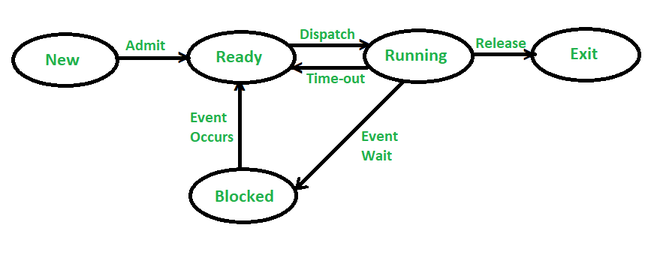
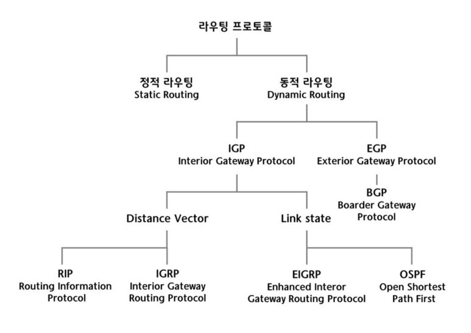
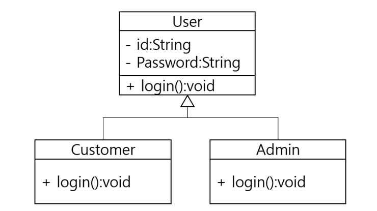
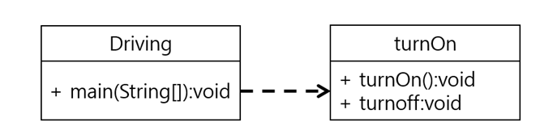
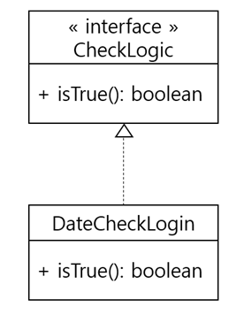
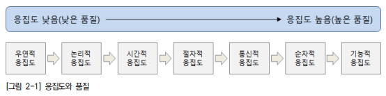
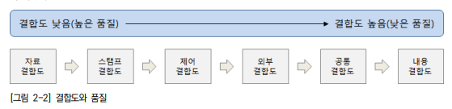
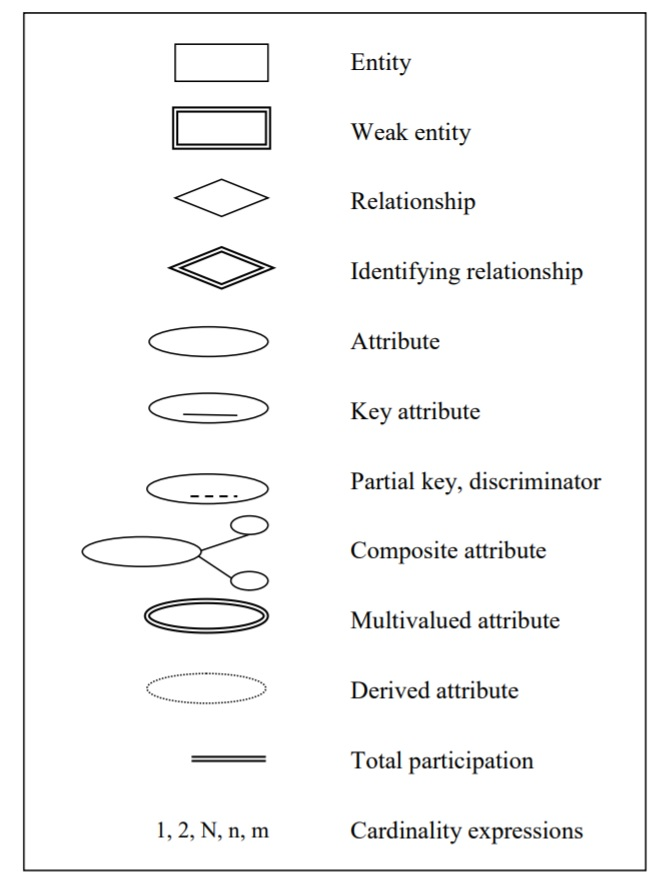

#### **화이트박스 테스트**

- 제품의 내부 요소들이 명세서에 따라 수행되고 충분히 실행되는가를 보장하기 위한 검사이다.
- 프로그램 원시 코드의 구조를 커버하도록 테스트 케이스를 설계한다.
- 코드의 제어 구조 설계 절차에 초점을 맞춰 테스트 케이스를 설계하며, 주로 테스트 과정 초기에 적용된다.

**테스트 기법**

1. **기초 경로 테스트** : 설계서나 소스 코드를 기반으로 흐름도를 작성하여 논리적 순환 복잡도를 측정
2. **조건 검사** : 논리식을 중심으로 테스트
3. **루프 검사** : 반복 구조를 중심으로 테스트
4. **데이터 흐름 검사** : 변수의 정의와 사용을 중심으로 테스트

------

#### 블랙박스 테스트

- 요구사항 명세서를 기반으로 구현된 기능을 테스트 케이스로 설계하는 방법이다.
- 소프트웨어 인터페이스에서 실행되며 기능 테스트라고도 한다.
- 기능 및 인터페이스, 데이터 접근, 성능 등의 오류를 발견하기 위해 테스트 후반부에 적용된다.

**테스트 기법**

1. **동치 분할 검사** : 입력 조건에 유효한 값과 무효한 값을 균등하게 하여 테스트 케이스를 설계

2. **경계값 분석** : 입력 조건의 경계에서 오류가 발생할 확률이 높다는 점을 이용하여 입력 조건의 경계값의 테스트 케이스를 생성한다

3. **원인-효과 그래프 검사** : 입력 데이터 간의 관계와 출력에 미치는 영향을 분석하여 효용성이 높은 테스트 케이스를 설계

4. **오류 예측 검사** : 과거의 경험이나 확인자의 감각에 의존하여 테스트 케이스를 설계

5. **비교 검사** : 여러 버전의 프로그램에 동일한 테스트 자료를 제공하여 테스트하는 기법

------

#### **인수 테스트 종류**

1. **알파 테스트** : 개발자의 장소에서 사용자가 개발자 앞에서 행하는 테스트 기법이며 오류와 사용상의 문제점을 사용자와 개발자가 함께 확인하면서 기록한다.
2. **베타 테스트** : 다수의 사용자에게 제한되지 않은 환경에서 프로그램을 사용하게 하고 오류가 발견되면 개발자에게 통보하는 방식의 테스트 방법

------

#### **정보보호 목표**

정보의 수집 및 가공, 저장, 검색, 송수신 중 발생할 수 있는 정보의 훼손과 변조, 유출 등을 방지하기 위한 관리적, 기술적 수단을 마련하는 것

기밀성, 인증성, 무결성, 가용성, 책임성

------

#### **레지스터**

- CPU 내에서 발생 및 사용되는 데이터를 일시적으로 저장하는 저장장치
- 가격대비 용량이 가장 작고 기억장치 중 속도가 가장 빠르다
- 플립플롭(Flip-Flop)과 래치(Latch)로 구성된다

**종류**

1. 제어장치(Control Unit) : 명령어 수행에 필요한 데이터를 저장하는 레지스터
2. 연산장치(Arithmetic Logic Unit) : 산술 및 논리 연산 등의 연산기능을 수행할 때 사용되는 레지스터

------

#### 정규형

 

**제1정규형**

- 원자성을 가지지 못하는 반복 그룹 속성이 제거된 릴레이션 스키마이다.
- 릴레이션의 모든 속성 및 도메인이 원자성을 가진다면 이 정규형에 해당한다.

 

**제2정규형**

- 부분 함수 종속을 제거한 릴레이션 스키마이다.
- 기본키가 아닌 모든 속성들이 기본키에 완전 함수 종속이면 이 정규형에 속한다.
- 완전 함수 종속 관계를 만들기 위해 릴레이션을 기본키 중심으로 분해한다.

 

**제3정규형**

- 이행적 함수 종속을 제거한 릴레이션 스키마
- 결정자이자 종속자에 해당하는 속성을 기준으로 릴레이션을 분할한다.

 

**보이스-코드 정규형**

- 결정자이면서 후보키가 아닌 함수 종속을 제거한 릴레이션 스키마
- 모든 결정자가 후보키인 경우
- 해당되는 경우가 거의 없어 실제로 고려되지 않은 정규형

 

**제4정규형**

- 다치 종속을 제거한 상태
- 다치 종속은 둘 이상의 속성을 가진 결정자에 의해 정해지는 속성이다.

 

**제5정규형**

- 후보키를 통하지 않는 조인 종속을 제거한 상태
- 조인 종속은 정규화를 통해서 분해된 각 릴레이션이 분해 전 릴레이션으로 재구성될 수 있는 것이다
- 릴레이션에 존재하는 모든 조인 종속성이 릴레이션의 후보키를 통해서만 성립된다

 

**반정규화**

- 정규화된 논리 데이터 모델을 시스템 운영의 단순화를 위해 중복, 통합, 분할 등을 수행하는 데이터 모델링 기법이다.
- 완벽한 수준의 정규화를 진행하면 일관성과 안정성은 증가하지만 성능이 저하될 수 있으므로 성능 향상을 위해 테이블을 통합, 분할, 추가하는 과정이다.

------

#### 서브넷 마스크

- 배정받은 하나의 네트워크 주소를 다시 여러 개의 작은 하위 네트워크로 나누어 사용하는 방식을 말한다.
- FLSM(Fixed Length Subnet Mask) : 동일한 크기로 서브넷을 나누는 방식
- VLSM(Variable Length Subnet Mask) : 다양한 크기로 서브넷을 나누는 방식

------

#### 테스트 오라클

결과를 판단하기 위해 테스트 케이스에 대한 예상 결과를 계산하거나 확인하는 작업

테스트의 결과가 참인지 거짓인지를 판단하기 위해서 사전에 정의된 참 값을 입력하여 비교하는 기법 및 활동이다.

1. **샘플링 오라클** : 특정한 몇몇 테스트 케이스의 입력값들에 대해서만 기대 결과를 제공
2. **일관성 검사 오라클** : 애플리케이션의 변경이 있을 때, 테스트 케이스의 수행 전과 후의 결과 값이 동일한지를 확인
3. **참 오라클** : 모든 테스트 케이스의 입력값에 대해 기대 결과를 제공하고 발생되는 모든 오류를 검출할 수 있음
4. **휴리스틱 오라클** : 샘플링 오라클을 개선, 특정 입력값에 대해 기대 결과를 제공하고, 나머지 값들에 대해서는 휴리스틱(추정)으로 처리

**특징**

- 제한된 검증 : 모든 테스트 케이스에 적용할 수 없음
- 수학적 기법 : 기대 값을 수학적 기법으로 산출
- 자동화 기능 : 테스트 대상 프로그램의 실행, 결과 비교, 커버리지 측정 등을 자동화

------

### 보안 공격

- **컴퓨터 바이러스** : 복제, 은폐, 파괴 기능을 통해 시스템을 마비시키거나 파일을 파괴하는 악성 코드의 한 종류
  - 부트 : 부트 영역에 존재하여 부팅과 동시에 활동
  - 파일 : 특정 실행 파일에 숨어있다 파일이 실행되면 활동
  - 매크로 : 오피스 문서 등에 삽입되어 작동하는 바이러스
  - 메모리 상주 : 주기억 장치에서 용량 부족이나 프로그램 감염

- **시스템 공격 유형**
  - 가로채기(Interception) : 데이터 전송 중 불법적으로 데이터에 접근하여 내용을 보거나 도청하는 행위. 기밀성을 위협
  - 가로막기(Interruption) : 데이터가 수신측에 정상적으로 전달되는 것을 방해. 가용성 위협
  - 수정(Modification) : 전송 중인 데이터에 접근하여 내용의 일부분을 불법적으로 수정. 무결성 위협
  - 위조(Fabrication) : 데이터가 다른 송신자로부터 전송된 것처럼 꾸미는 행위. 무결성 위협

#### 소극적 보안 공격

- 스캐닝 : 미리 정해둔 공격 패턴을 수행하여 취약점을 파악
- 스니핑 : 네트워크 상에 전송되는 트래픽을 훔쳐보는 행위
  - Switch Jamming(Mac Flooding) : 위조된 MAC 주소를 지속적으로 네트워크에 흘림으로써 스위치의 주소 테이블을 오버플로우시켜 스위치가 제기능을 못하게 한 후 스니핑 수행
  - ARP Spoofing : 로컬 통신 서버와 클라이언트의 MAC 주소를 공격자의 MAC 주소로 속임
  - ARP Redirect : 희생자의 ARP Cache Table 정보 변조 후 스니핑
  - ICMP Redirect : 희생자의 라우팅 테이블 변조 후 스니핑

#### 기타 보안 공격

- 루트킷 : 컴퓨터 시스템에 침투하여 자신의 존재를 숨긴 채 백도어,트로이 목마 설치, 원격 접근 등 시스템의 관리자 권한을 탈취하여 공격을 수행하는 악성 소프트웨어
- 버퍼 오버플로우 : 정상적인 경우에는 사용되지 않아야 할 주소 공간(메모리), 원래는 경계선 관리가 적절하게 수행되어 덮어쓸 수 없는 부분에 해커가 임의의 코드를 덮어씀으로써 발생하는 취약점을 이용하는 공격
  - 스택 가드 : 메모리상에서 프로그램의 복귀 주소와 변수 사이에 특정 값을 저장해 두었다가 그 값이 변경되었을 경우 오버플로우 상태로 가정하여 프로그램 실행을 중단하는 기술
  - 스택 쉴드 : 함수가 모두 수행되고 종료 시 저장된 값과 스택의 복사본 값을 비교해 값이 다를 경우 공격자로 간주하고 프로그램 실행을 중단한다.
- Watering Hole : 특정 집단이 주로 방문하는 웹사이트를 감염시키고 피해 대상이 그 웹사이트를 방문할 때까지 기다리는 웹 기반 공격
- Typesquatting : 사이트 주소를 잘못 입력하는 실수를 이용하여 불법 사이트에 접속하게 하여 피해를 주는 공격 방법

------

#### 운영체제

**시간 개념**

1.실행 시간 2.응답 시간 3.대기 시간 4.반환 시간 5.시간 간격

**자원관리**

- 프로세스 관리 : 프로세스의 생성과 제거, 시작 및 정비, 스케줄링 등을 담당한다.
- 기억장치 관리 : 프로세스에게 메모리 할당 및 회수 등을 담당한다.
- 주변장치 관리 : 입출력 장치의 스케줄링 및 관리를 담당한다.
- 파일 관리 : 파일의 생성과 삭제, 변경, 유지 등의 관리를 담당한다.

------

#### 버스

주변 장치 간에 정보 교환을 위해 연결된 통신 회선

- 내부 버스 : CPU 내부 요소 사이의 정보를 전송

- 외부 버스 : CPU와 주변장치 사이의 정보를 전송
  - 주소 버스, 데이터 버스, 제어 버스
  

------

#### 서비스 지향 아키텍처 (SOA)

- 기업의 소프트웨어 인프라인 정보시스템을 공유와 재사용이 가능한 서비스 단위나 컴포넌트 중심으로 구축하는 정보기술 아키텍처
- 정보를 누구나 이용 가능한 서비스로 간주하고 연동과 통합을 전제로 아키텍처를 구축해 나간다.

------

#### 소프트웨어 테스트 프로세스

계획 -> 분석 및 디자인 -> 케이스 및 시나리오 작성 -> 수행 -> 결과 평가 및 보고서 작성 -> 결함 추적 및 관리

------

#### DRM (디지털 저작권 관리)

인터넷이나 기타 디지털 매체를 통해 유통되는 데이터의 저작권 보호를 위해 데이터의 안전한 배포를 활성화하거나 불법 배포를 방지하기 위한 시스템이다.

------

#### 프로세스 주요 상태 및 전이

**상태**

- **준비** : 기억 장치에 존재하는 프로세스를 선택하여 CPU의 할당을 기다리는 시점
- **실행** : 대기 상태의 프로세스가 CPU를 할당받아 작업이 진행되는 상태
- **대기** : 프로세스의 특정 작업을 진행하기 위해 입출력 작업 등을 기다리는 상태
- **종료** : 프로세스 실행이 완료되어 종료된 상태

**전이**

- **Dispatch** : 준비 상태의 프로세스가 실행 상태로 변하는 과정
- **Time Run Out** : 실행 상태의 프로세스가 할당된 시간을 다 사용했지만 아직 작업을 끝내지 못한 경우 다시 준비 상태로 넘어가는 과정
- **Block** : 실행 상태의 프로세스가 입출력에 의한 작업을 위해 대기 상태로 변하는 과정
- **Wake up** : 입출력 등이 완료되어 대기 상태의 프로세스가 준비 상태로 변하는 과정

------

#### 클린 코드

- 중복을 최소화한 가독성이 좋고 단순한 코드
- 로직의 이해가 빠르고 수정 속도가 빨라진다
- 오류를 찾기 용이하고 유지보수 비용이 낮아진다

**작성 원칙**

가독성, 단순성, 의존성 배제, 중복성 제거, 추상화

------

#### 커널

- **마이크로 커널**  :  시스템 운영에 필요한 최소한의 기능들만을 제공하며, 사용자가 필요한 기능을 추가하여 운영체제를 확장할 수 있도록 한다.
- **모놀리식 커널** : 구현이 간단하여 속도가 빠르며, 임의 기능을 적재하여 동적으로 사용할 수 없다.

------

#### SNMP(Simple Network Management Protocol)

- 네트워크 장비를 관리 감시하기 위한 목적으로 UDP상에 정의된 응용 계층 표준 프로토콜
- 네트워크 관리자가 네트워크 성능을 관리하고 네트워크 문제점을 찾는다

------

#### RTD(Real Time transport Protocol)

IP 네트워크상에서 오디오와 비디오를 전달하기 위한 통신 프로토콜. 전화, WebTRC, 텔레비전 서비스, 웹 기반 푸시 투 토크 기능을 포함한 화상 통화 분야 등의 스트리밍 미디어를 수반하는 통신, 엔터테인먼트 시스템에 사용된다.

------

#### 쉘 스크립트

- 운영체제의 제어 프로그램을 통제할 수 있는 인터프리터 방식의 프로그램
- 여러 제어 명령을 주기적으로 자동으로 실행시킬 수 있다.
- 관리자 및 권리 권한을 가진 사용자가 운영체제의 다양한 제어 방식이나 권한을 통제하는 데 사용된다.
- 원하는 스크립트를 작성하여 sh 파일로 저장한 뒤에 필요할 때 실행한다.

------

#### FTP(File Transfer Protocol)

인터넷에서 파일을 주고 받을 수 있도록 하는 프로토콜

다른 컴퓨터가 접속하면 파일의 업로드와 다운로드 서비스를 제공한다. 별도의 계정 없이 익명으로도 이용 가능하며 ASCII 전송 모드와 Binary 전송 모드가 있다.

------

#### 클락-윌슨 모델(Clark-Wilson Model)

- 정보의 무결성을 강조한 모델로서 Biba Integrity 모델보다 향상된 모델이다
- 정보의 노출 방지보다 변조 방지가 더 중요한 금융기업과 같은 상업용 보안 구조 요구사항을 충족하는 범용 모델이다
- 접근 권한을 가지고 있지 않은 사용자뿐만 아니라 정당한 사용자 또한 접근을 제어한다

------

#### 비선점형 방식

현재 실행 중인 프로세스를 다른 프로세스가 강제적으로 중단시킬 수 없는 방식

- FIFO : 프로세스가 도착(입력)한 순서대로 처리한다
- SJF : 실행 시간이 가장 짧은 프로세스 순으로 처리한다
- HRN : 대기 시간이 긴 프로세스의 우선순위를 높여서 긴 작업과 짧은 작업 간의 지나친 불평등을 해소할 수 있다.

------

#### 정적 테스트

**워크스루**

- 프로그램을 실행하지 않고 요구사항 명세서, 소스 코드를 대상으로 분석한다.
- 검토 회의 전에 미리 준비된 자료를 배포하여 사전 검토를 진행한다.
- 검토 회의를 빠르게 진행하여 오류를 조기에 발견한다.

**인스펙션** : 요구사항 명세서 작성자 이외의 전문 검토 그룹이 상세히 결함을 분석

**동료 검토** : 요구사항 명세서 작성자가 다수의 동료들에게 내용을 직접 설명하면서 결함을 분석

------

#### 테스트 모듈

- **Test Stub** : 상위 모듈의 테스트를 위한 기능만 가지고 있는 시험용 하위 모듈 (하향식 통합 테스트)
- **Test Driver** : 아직 존재하지 않는 상위 모듈의 역할을 하는 시험용 모듈 (상향식 통합 테스트)
- **Test Suites** : 테스트 대상 컴포넌트나 모듈, 테스트 케이스의 집합
- **Test Case** : 입력값, 실행 조건, 기대 결과 등의 집합

------

#### 침입 차단 시스템(IPS : Instruction Prevention System)

불법적인 외부 침입으로부터 내부 네트워크의 정보를 보호하기 위한 시스템이다. 침입 이전에 방지하는 것이 목적으로, 알려지지 않은 형태의 공격도 지능적으로 자동 차단한다.

- 스크리닝 라우터
  - 일반 라우터의 기능에 내부로 진입하는 패킷의 헤더를 분석하여 필터링
  - 필터링 속도가 빠르고 비용이 적게 들지만 IP 주소와 포트에 대한 침입 차단만 가능
- 배스천 호스트
  - 내외부 네트워크 사이에서 게이트웨이 역할을 하는 호스트로 외부 공격에 대한 방어 기능을 담당하는 컴퓨터
  - 배스천 호스트 자체가 손상되거나 배스천 호스트로의 접근 권한이 노출되기만 해도 기능이 무력화된다.
  - 프록시 서버 : 배스천 호스트에 설치되어 접근 제어, 인증, 바이러스 검색 등의 서비스 제공

{: .note}

무결성 보장, 네트워크 감시 통제, 비밀성 보장

------

#### 침입 탐지 시스템(IDS : Intrusion Detection System)

네트워크 상의 비정상적인 접근을 탐지할 수는 있지만 차단할 수는 없다.

**데이터 수집원에 의한 IDS 분류**

- 호스트 기반 : 특정 호스트에서 수집된 자료를 분석하여 비정상 행위를 탐지
  - 탐지가 정확하고 패킷의 손실도 없으며 추가적인 장비가 필요 없다
  - 운영체제에 종속적이고 많은 부하가 발생하며 구현이 어렵다
- 네트워크 기반 :  IDS 장비를 네트워크 앞단에 설치하여 경유하는 트래픽을 분석하는 방식
  - 운영체제에 독립적이고 해커의 개입이 어려우며 비용이 저렴하다
  - 고속 네트워크의 경우 패킷의 손실 가능성이 있고 암호화된 트래픽은 분석이 불가능하다
  - 호스트 내부에서 벌어지는 비정상적인 행위에 대해서는 감지가 불가능하다
- 다중 호스트 기반 : 여러 호스트 시스템을 종합적으로 분석하여 비정상 행위를 탐지하는 방식

**탐지 기반에 의한 IDS 분류**

외부의 공격에 대응하는 방법에는 예방, 선점, 방해, 오인, 탐지 등이 있다.

1. 예방 : 네트워크 취약점 관리
2. 선점 : 공격자의 서버와 프로그램 공격
3. 방해 : 침입 목표를 숨기거나 위장
4. 오인 : 침입 목표와 유사한 시스템으로 유도
5. 탐지 : 침입 행동 탐지 후 대응

- 지식 기반 침입 탐지 : 알려진 패턴에 대한 오탐률이 낮지만 새로운 패턴에 대한 탐지는 어렵다
- 이상 탐지 : 정상 행위에 대한 패턴을 기반으로 새로운 행위에 대해 비정상 여부를 판단하며 새로운 패턴에 대해 자동으로 업데이트가 가능하지만 오탐률이 높다

**백도어 탐지 기법**

해커가 이용자 몰래 컴퓨터에 접속하여 악의적인 행위를 하기 위해 설치해 놓은 출입구 역할을 하는 악성코드

1. 무결성 검사 : 공격자에 의해 변경된 파일 확인
2. 로그 분석
3. SetUID 파일 검사 :  최상위 권한이 부여된 대상 확인
4. 열린 포트 검사 : 몰래 실행되거나 열어둔 포트 확인

- 탐지 도구
  - 스캐너 : SAINT, SATAN, NMAP, CGI, Klaxon
  - 발견 : Chkwtmp, AAFID, MOM
  - 로그 : HostSentry, PingLogger, John The Ripper
  - 무결성 : TripWire, TMAU, Hobgoblin 

------

#### Mesh Network

기존 무선 랜의 한계 극복을 위해 등장하였으며, 대규모 디바이스의 네트워크 생성에 최적화되어 차세대 이동통신, 홈 네트워킹, 공공 안전 등의 특수 목적을 위한 새로운 방식의 네트워크 기술이다. 대표 AP만 유선으로 연결되며 무선 통신 라우터들이 모든 노드를 무선으로 연결하는 방식이다.

------

#### 교착상태

- 회복 : 교착상태가 발생한 프로세스 중 희생양을 정하여 자원을 빼앗는 방식

  **희생양을 정하는 기준**

  - 우선순위가 낮은 프로세스
  - 진행률이 적은 프로세스
  - 자원을 적게 사용하고 있는 프로세스
  - 기아 상태 등으로 수행이 불가능한 프로세스

- 발견

- 회피

- 예방

------

#### 오버레이 기법

- 주기억장치보다 큰 사용자 프로그램을 실행하기 위한 기법
- 프로그램을 여러 개의 조각으로 나눈 후 필요한 조각을 차례로 주기억장치에 적재하여 프로그램을 실행한다.
- 주기억장치의 공간이 부족해지면 적재된 조각 중 불필요한 조각을 중첩하여 적재한다.
- 여러 조각으로 나누는 작업은 프로그래머가 직접 수행해야 한다.

------

#### 디지털 변조 방식

1. **위상 편이 변조**(PSK: Phase Shift Keying)
   - 디지털 데이터의 1과 0을 위상(각도,위치)을 다르게하여 전송하는 방식이다.
   - 위상을 다르게 하면 여러 개의 신호를 만들 수 있어 전송 속도(용량)가 빨라진다.

------

#### IPSec(IPSecurity)

- 보안에 취약한 구조를 가진 IP를 개선하기 위해 국제 인터넷 기술 위원회에서 설계한 표준이다.
- IPv4에서는 보안이 필요한 경우에만 선택적으로 사용하였지만 IPv6부터는 기본 스펙에 포함된다.
- IP계층에서의 보안성 제공을 위해 AH, ESP, IKE 프로토콜로 구성된다.
  - AH(Authentication Header) : 발신지 인증, 데이터 무결성만을 보장
  - ESP(Encapsulating Security Payload) : 발신지 인증, 데이터 무결성, 기밀성을 모두 보장
  - IKE(Internet Key Exchange) : 보안 관련 설정들을 생성, 키 교환

- 동작 모드는 전송 모드와 터널 모드로 나뉜다.
  - 전송 모드 : IP 헤더를 제외한 IP 패킷의 페이로드만을 보호
  - 터널 모드 : IP 패킷 전체를 보호

------

#### 패킷 교환 방식

- **가상 회선** : 제어 패킷을 통해 논리적 전송 경로를 확보한 뒤 데이터 패킷을 전송하는 방식으로 패킷의 전송 순서는 바뀌지 않고 그대로 전송되며, Traffic이 비교적 많이 발생한다.
- **데이터그램** : 논리적 경로의 확보 없이 자유롭게 데이터 패킷을 전송하는 방식으로 제어 패킷이 필요 없고, 패킷의 전송 순서는 바뀔 수 있으며, Traffic이 비교적 적게 발생한다.

------

### 라우팅 프로토콜

- RIP (Routing Information Protocol)
  - 최적의 경로를 산출하기 위한 정보로써 홉(거리 값)만을 고려하므로, 실제로는 최적의 경로가 아닌 경우가 많다
  - 특정 시간 간격으로 업데이트가 발생하므로 컨버전스 타임(라우터 간에 변경된 정보를 서로 주고받는 데 걸리는 시간)이 길다

- OSPF (Open Shortest Path First)
  - VLSM 및 CIDR을 지원하는 대규모 기업 네트워크에서 가장 널리 사용되는 프로토콜이다.
  - 라우팅 테이블의 변화가 발생하는 즉시 업데이트가 발생하므로 컨버전스 타임이 짧다.
  - 홉 카운트와 더불어 다양한 요소를 고려하여 경로를 선택하기 때문에 최적의 경로일 확률이 높다.

- IGRP (Internet Gateway Routing Protocol)
  - 라우팅 테이블 갱신을 위해 필요한 정보만 전송할 수 있어 회선 부하가 감소된다
  - 네트워크 변화에 대해 신속하게 반응할 수 있는 독립적 네트워크 내에서만 사용하는 프로토콜이다.
  - 홉 카운트 기준으로 정보를 전송하며 데이터 전송 시 다양한 타입의 서비스를 지원한다

- EIGRP (Enhanced IGRP)
  - 순차적으로 빠르게 패킷을 전달하는 신뢰성 있는 프로토콜이다.
  - VLSM을 지원하여 IP주소 낭비를 막을 수 있다.

- BGP (Border Gateway Protocol)
  - 독립 운용되는 대규모 네트워크 그룹(AS) 간 네트워크 정보를 교환하기 위해 주로 사용되는 정책 기반 프로토콜이다.

------

#### APT (Advanced Persistent Threat) - 지능형 지속 공격

잠행적이고 지속적인 컴퓨터 해킹 프로세스들의 집합으로, 단체, 국가, 사업체 등을 표적으로 오랫동안 상당한 정도의 은밀한 형태의 공격을 지속하는 것을 의미

------

#### 테스트 커버리지

주어진 테스트 케이스에 의해 수행되는 소프트웨어의 테스트 범위를 측정하는 테스트 품질 측정 기준

- **기능 기반 커버리지** : 대상 애플리케이션의 전체 기능을 모수로 설정하고, 실제 테스트가 수행된 기능의 수를 측정
- **라인 커버리지** : 대상 애플리케이션의 전체 소스 코드 라인 수를 모수로 설정하고, 테스트가 수행한 라인 수를 측정
- **코드 커버리지** : 소스 코드의 구조 코드 자체가 얼마나 테스트되었는지를 측정하는 방법
  1. **변형 조건/결정 커버리지** : 각 조건이 참 또는 거짓이 되는 모든 경우의 수를 고려하여 테스트 케이스를 설계하고, 각 조건이 결과에 독립적으로 영향을 미치는지를 검증하는 가장 엄격한 테스트 커버리지
  2. **구문 커버리지** : 모든 구문을 한번 이상 수행
  3. **결정 커버리지** : 결정문의 결과가 참과 거짓의 결과를 수행
  4. **조건 커버리지** : 결정문 내부 개별 조건식의 결과가 참과 거짓의 결과를 수행
  5. **조건/결정 커버리지** : 결정문의 결과와 결정문 내부 개별 조건식의 결과가 참과 거짓의 결과를 수행
  6. **다중 조건 커버리지** : 결정문의 모든 조건식의 모든 가능한 논리적 조합을 고려

------

#### ATM

- 하나의 전송로를 여러 대의 단말이 함께 사용하기 위해서 제어하는 방식
- B-ISDN의 중심이 되는 전송/교환 기술로 모든 정보를 53바이트의 고정길이로 취급한다.

------

#### 템퍼 프루핑

- 데이터나 시스템의 무단 변경을 막아 정보의 신뢰성을 보장하는 보안 기술로 데이터 위변조를 방지하여 해킹이나 사이버 공격으로부터 시스템을 안전하게 보호하는 역할을 한다.
- 디지털 서명, 해시 함수, 시간 도장 등을 통해 구현할 수 있으며 데이터의 무결성 보장, 시스템 보안 강화, 신뢰성 확보가 가능하다

------

#### 클라우드 컴퓨팅 서비스

- IaaS : 서버, 스토리지, 네트워크 등의 인프라를 임대하는 서비스
- PaaS : 개발을 위한 하드웨어 및 소프트웨어 구축이 되어 있는 서비스
- SaaS : 인프라와 운영체제, 소프트웨어까지 갖춰져 있는 서비스
- BaaS : 블록체인의 기본 인프라를 추상화하여 블록체인 응용 기술을 제공하는 서비스

------

#### 해시 함수

- 제곱법 : 키를 제곱한 결과의 일부분으로 저장 위치 결정
- 숫자분석법 : 키의 숫자 분포가 고른 부분을 분석하여 저장 위치 결정
- 기수변환법 : 키의 값을 다른 진법으로 변환하여 저장 위치 결정

------

#### ICMP

네트워크에 연결된 단말기의 운영체제에서 오류 메시지를 수신하는 데 사용되는 제어 메시지 프로토콜

------

|            관계 해석             |             관계 대수              |
| :------------------------------: | :--------------------------------: |
|          비절차적 언어           |            절차적 언어             |
|      원하는 정보가 무엇인지      | 원하는 정보를 어떻게 얻어야 하는지 |
|        명제와 변수로 구성        |      연산자와 피연산자로 구성      |
|       연결자와 한정자 사용       |         연산자의 종류 사용         |
| 튜플 관계 해석, 도메인 관계 해석 | 순수 관계 연산자, 일반 집합 연산자 |

------

#### OSI 7계층의 계층별 특징

- **물리 계층** : 물리적 신호를 주고받는 계층으로, 데이터의 종류나 오류를 제어하지 않는다
  - 전송 회선, 허브, 리피터 등

- **데이터 링크 계층** : 물리 계층을 통해 노드 간 송수신되는 정보의 오류와 흐름을 관리하여 정보 전달의 안전성을 높임
  - MAC 주소를 통해 통신하며 프레임 단위로 데이터를 전송
  - 브리지, 스위치 등
- **네트워크 계층** : 주소를 정하고 경로를 선택하여 패킷을 전달해주는 계층
  - 논리적 주소 부여를 통해 데이터를 목적지까지 가장 안전하고 빠르게 전달하는 라우팅 기능
  - 라우터, L3 스위치
- **전송 계층** : 네트워크 상의 단말기 간 신뢰성 있는 데이터 송수신을 제공할 수 잇도록 지원
  - 오류 검출과 복구, 흐름 제어, 중복 및 누락 검사, 다중화 등을 수행하며 세그먼트 단위로 데이터를 전송한다.
  - TCP, UDP 등
- **세션 계층** : 데이터 통신을 위한 양 끝단 응용 프로세스가 통신을 관리하기 위한 방법을 제공하는 계층
  - 대화 제어 : 통신장치들 간의 상호작용을 유지, 동기화 등의 연결 서비스 제공
  - 데이터 전송 중에 연결이 끊어지는 경우, 동기점을 통해 오류를 복구한다
- **표현 계층** : 응용 프로세스 간 데이터 표현상의 차이에 상관없이 통신이 가능하도록 독립성을 제공하는 계층
  - 데이터의 코드 변환, 데이터 압축, 암호화 등의 수행을 통해 응용 계층의 부담을 덜어준다
- **응용 계층** : 네트워크 가상 터미널이 존재하여 서로 상이한 프로토콜에 의해 발생하는 호환성 문제 해결

------

### 정보 시스템 신기술 동향

#### 소프트웨어 관련 기술

1. **그레이웨어** : 소프트웨어를 제공하는 입장에서는 악의성이 없더라도 사용자 입장에서는 유용하지 않거나 악의적이라고 판단될 수 있는 애드웨어, 공유웨어, 스파이웨어 등의 총칭이다.
2. **DLT (Distributed Ledger Technology)** : 중앙 관리자나 중앙 데이터 저장소가 존재하지 않고 P2P망 내의 참여자들에게 모든 거래 목록이 분산 저장되어 거래가 발생할 때마다 지속적으로 갱신되는 디지털 원장을 의미
3. **시멘틱 웹(Sementic Web)** : 사람을 대신하여 컴퓨터가 정보를 읽고 이해하고 가공하여 새로운 정보를 만들어 낼 수 있도록 이해하기 쉬운 의미를 가진 차세대 지능형 웹
4. **오픈 그리드 서비스 아키텍처 (OGSA)** : 애플리케이션 공유를 위한 웹 서비스를 그리드 상에서 제공하기 위해 만든 개방형 표준
5. **HoneyPot** : 해켜의 공격을 유도하여 그들의 활동을 추적하고 분석하는 데 사용되는 가상의 시스템
6. **TCP Wrapper** : 접근 제어 목적을 위한 필터 역할을 하는 토큰으로써 사용되며, 호스트나 부분망 IP 주소, 호스트명 쿼리 응답을 허용한다.

#### 하드웨어 관련 기술

1. **HACMP** : 안정적인 서비스 운영을 위해 2대 이상의 시스템을 하나의 클러스터로 묶어서 장애 발생 시 즉시 다른 시스템으로 대체 가능한 환경을 구축하는 메커니즘을 의미
2. **Thin Client PC** : 하드디스크나 주변 장치 없이 기본적인 메모리만 갖추고 서버와 네트워크로 운영되는 개인용 컴퓨터이다. 기억 장치를 따로 두지 않기 때문에 데이터는 서버측에서 한꺼번에 관리한다.
3. **TrustZone** : 하나의 프로세서 내에 일반 애플리케이션을 처리하는 일반 구역과 보안이 필요한 애플리케이션을 처리하는 보안 구역으로 분할하는 기술
4. **Cloud HSM** : 클라우드 기반으로 암호화 키 생성, 저장, 처리 등을 하는 보안 기기

#### 데이터베이스 관련 기술

1. **Digital Archiving** : 디지털 정보 자원을 장기적으로 보존하기 위한 작업으로, 아날로그 콘텐츠는 디지털로 변환한 후 압축하여 저장하고, 디지털 콘텐츠는 체계적으로 분류하여 메타 데이터를 만들어 DB화하는 작업

2. **Hadoop** : 가상화된 대형 스토리지를 형성하고 그 안에 보관된 거대한 데이터 세트를 병렬로 처리할 수 있도록 개발된 자바 소프트웨어 프레임워크

   맵리듀스 : 흩어져 있는 데이터를 연관성 있는 것들끼리 묶는 작업을 수행한 뒤, 중복 데이터를 제거하고 원하는 데이터를 추출하는 작업 수행

   스쿱 : 하둡과 관계형 데이터베이스 간에 데이터를 전송할 수 있도록 설계된 도구

3. **Tajo** : 우리나라 개발자들이 주도하는 하둡 기반의 분산 데이터 웨어하우스 프로젝트로, 맵리듀스를 사용하지 않고 SQL을 사용한다.

4. **Data Warehouse** : 기업의 전략적 관점에서 효율적인 의사 결정을 지원하기 위해 데이터의 시계열적 축적과 통합을 목표로 하는 기술의 구조적, 통합적 환경

5. **Linked Open data** : 사용자가 정확하게 원하는 정보를 찾을 수 있도록 웹 상의 모든 데이터와 데이터베이스를 무료로 공개하고 연계하는 것

#### 네트워크 관련 기술

1. **MQTT(Message Queuing Telemetry Transport)** : TCP/IP 프로토콜 위에서 동작하는 발생-구독 기반의 메시징 프로토콜이다. 사물통신, 사물인터넷과 같이 대역폭이 제한된 통신환경에 최적화하여 개발된 푸시 기술 기반의 경량 메시지 전송 프로토콜. 메시지 매개자(Broker)를 통해 송신자가 특정 메시지를 발행하고 수신자가 메시지를 구독하는 방식으로 IBM이 주도하여 개발되었다.

2. **PICONET** : 여러 개의 독립된 통신 장치가 블루투스 및 UWB 기술을 사용하여 통신망을 형성하는 무선 네트워크 구축 기술이다. TDM 기술을 사용하며 주국(Master)을 통해 일대다로 통신이 이루어진다.

3. **SDDC** : 모든 하드웨어가 가상화되어 가상 자원의 풀을 구성하고, 데이터 센터 전체를 운영하는 소프트웨어가 필요한 기능 및 규모에 따라 동적으로 자원을 할당, 관리하는 역할을 수행하는 데이터 센터이다. 컴퓨팅, 네트워킹, 스토리지, 관리 등을 인력 개입 없이 모두 소프트웨어로 정의한다.

   SDC : 서버의 CPU, 메모리에 대해서 소프트웨어 명령어 기반으로 제어할 수 있는 컴퓨터

   SDN : 개방형 API를 통해 네트워크의 트래픽 전달 동작을 소프트웨어 기반 컨트롤러에서 제어/관리하는 가상화 네트워크 기술

   SDS : 서버와 전통적인 스토리지 장치에 장착된 이질적이고 연결되어 있지 않은 물리적 디스크 드라이브를 하나의 논리적인 스토리지로 통합한 가상화 스토리지 기술 

4. **Zing** : 기기를 키오스크에 갖다 대면 원하는 데이터를 바로 가져올 수 있는 기술

5. **Ad-hoc network** : 노드들에 의해 자율적으로 구성되는 네트워크로, 무선 인터페이스가 가지는 통신 거리상의 제약을 극복할 수 있어 긴급 부고, 긴급 회의, 전쟁터에서의 군사 네트워크 등에 응용할 수 있는 네트워크이다.

6. **DPI (Deep Packet Inspection)** : OSI 7계층의 전 계층의 프로토콜과 패킷 내부의 콘텐츠를 파악하여 침입 시도, 해킹 등을 탐지하고 트래픽을 조정하기 위한 패킷 분석 기술

7. **IBN (Internet Based Networking)** : 네트워크 관리자가 의도한 바를 시스템이 자동으로 파악하여 네트워크 구성 및 운영을 최적화하는 지능형 네트워킹 기술

------

#### 객체지향 분석 방법론

- **Rumbaugh(럼바우)** :  소프트웨어의 구성 요소를 다양한 그래픽 표기법을 이용하여 모델링하는 기법
  - 객체 모델링(정보 모델링) : 객체 다이어그램을 활용하여 객체와 객체 간의 관계 정의
  - 동적 모델링 : 상태, 활동 다이어그램을 활용하여 기능의 흐름을 표시
  - 기능 모델링 : 자료 흐름도를 활용하여 입출력 데이터, 세부 기능 결정
- **Booch** : 미시적 개발 프로세스와 거시적 개발 프로세스를 모두 사용하는 분석기법
- **Jacobson** : 사용자와 시스템이 상호작용하는 시나리오를 활용하여 분석하는 기법
- **Coad와 Yourdon** : E-R 다이어그램을 사용하여 객체의 행위를 모델링하는 분석 기법
- **Wirfs-Brock** : 분석과 설계 간 구분이 없으며 고객 명세서를 평가하여 설계 작업까지 연속적으로 수행하는 분석 기법

------

#### 객체지향 설계 원칙 (SOLID)

- **단일 책임** : 하나의 클래스가 제공하는 모든 기능이 하나의 문제만 해결하도록 설계해야 한다.
- **개방 폐쇄** : 기존 코드의 수정 없이 기능을 수정하거나 추가할 수 있도록 한다.
- **리스코프 치환** : 하위 클래스는 상위 클래스의 기능이 호환될 수 있어야 한다.
- **인터페이스 분리** : 하나의 포괄적인 인터페이스보다 다수의 구체적인 인터페이스를 구성해야 한다.
- **의존성 뒤집기** : 하위 클래스의 변경 사항이 상위 클래스에 영향을 미치지 않도록 구성해야 한다.

------

#### 객체지향 테스트

- **스레드 기반 테스트** : 시스템에 대한 하나의 입력이나 이벤트 응답에 요구되는 클래스들의 집합을 통합(하향식)해가며 테스트한다.
- **사용-기반 테스트** : 상위 클래스와 관계를 갖지 않는 수준에서 클래스들을 독립적으로 검사한 후 상위 클래스와 결합(상향식)하는 방식이다.
- **검증과 시스템 테스트** : 사용자의 요구가 객체에 정확히 반영되었는지, 성능이나 인터페이스상 오류는 없는지 검사하는 것이다.

------

### 디자인 패턴

- 생성 패턴 : 클래스 정의, 객체 생성 방식에 적용 가능한 패턴
- 구조 패턴 : 객체 간 구조와 인터페이스에 적용 가능한 패턴
- 행위 패턴 : 기능(알고리즘), 반복적인 작업에 적용 가능한 패턴

#### 생성 패턴

- **Factory Method** : 상위 클래스에서는 객체를 생성하기 위한 인터페이스를 정의하고 하위 클래스는 어떤 클래스의 인스턴스를 생성할 것인지를 결정하는 패턴이다.
  - 팩토리 메소드를 오버라이딩하여 객체를 반환하는 패턴
  - 사용자의 입력값이나 조건이 다른 상태에서 객체를 생성하는 경우에 적용할 수 있는 패턴
- **Abstract Factory** : 관련이 있는 서브 클래스를 묶어서 팩토리 클래스로 만들고, 조건에 따라 객체를 생성하는 패턴
- **Builder** : 복잡한 객체 생성과정을 단계별로 분리(캡슐화)하여 동일한 절차에서도 서로 다른 형태의 객체를 생성할 수 있게 한다.
- **Prototype** : 새로운 객체를 생성하는 것이 아닌 기존의 객체를 복사하여 특정 속성값을 변경한다.
- **Singleton** : 클래스가 오직 하나의 인스턴스만을 가지도록 하는 패턴이다

#### 구조 패턴

- **Adaptor** : 서로 다른 인터페이스를 가진 클래스들을 함께 사용할 수 있도록 하는 패턴
- **Bridge** : 복잡하게 설계된 클래스를 기능부와 구현부로 분리한 뒤, 두 클래스를 연결하는 패턴
- **Composite** : 객체들의 관계를 트리 구조로 구성하여 단일 객체와 복합 객체를 동일하게 다루도록 하는 패턴
- **Decorator** : 클래스 변경 없이 주어진 상황에 따라 기능을 추가하는 패턴
- **Facade** : 복잡한 서브 시스템들을 간편하게 사용할 수 있도록 단순화된 인터페이스를 제공하는 패턴이다.
- **Flyweight** : 메모리 사용량을 최소화하기 위해 객체들 간 데이터 공유를 극대화하는 패턴
- **Proxy** : 특정 객체로의 접근을 해당 객체의 대리자를 통해 진행하는 패턴으로 원본 객체의 생성 연기, 원격 제어, 접근 제어 등을 결정할 수 있다.

#### 행위 패턴

- **Interpreter** : 다양한 인수를 활용하여 여러 가지 명령을 처리할 수 있다.
- **Template Method** : 상위 클래스에서는 알고리즘의 뼈대를 정의하고 구체적인 단계는 하위 클래스에서 정의하는 패턴
- **Chain of Responsibility** : 문제 해결을 위한 일련의 처리 객체가 순서대로 문제를 해결하는 패턴
- **Command** : 요청을 객체의 형태로 캡슐화하여 나중에 이용할 수 있도록 요청에 필요한 정보를 저장하는 패턴
- **Iterator** : 내부 구현을 노출시키지 않고 집약된(집합) 객체에 접근하고 싶은 경우에 적용하는 패턴
- **Mediator** : 객체 간의 통신이 직접 이루어지지 않고 중재자를 통해 진행되어 결합도를 감소시키는 패턴
- **Memento** : 롤백을 통해 객체의 상태를 이전 상태로 되돌릴 수 있는 기능을 제공하는 패턴
- **Observer** : 객체의 상태 변화를 관찰하는 옵저버를 등록하여 상태 변화가 있을 때마다 등록된 옵저버에게 통지하는 패턴
- **State** : 객체의 내부 상태에 따라 다른 기능을 수행하는 메소드를 구현하는 패턴이다
- **Strategy** : 문제를 해결하는 데 있어 다양한 알고리즘이 적용될 수 있는 경우에 알고리즘을 별도로 분리하는 패턴
- **Visitor** : 알고리즘을 자료 구조에서 분리하여 클래스를 수정하지 않고도 새로운 알고리즘을 추가할 수 있도록 하는 패턴이다.

------

#### 접근 통제 정책

|   정책    | 강제적 접근 통제(MAC) | 임의적 접근 통제(DAC) | 역할 기반 접근 통제(RBAC) |
| :-------: | :-------------------: | :-------------------: | :-----------------------: |
| 권한 부여 |        시스템         |     데이터 소유자     |        중앙 관리자        |
| 접근 결정 |       보안 등급       |         신분          |           역할            |
| 정책 변경 |        고정적         |       변경 용이       |         변경 용이         |
|   장점    |  안정적, 중앙 집중적  |   구현 용이, 유연함   |         관리 용이         |

------

#### UML 관계의 종류

- **연관 관계** : 특정 사물이 다른 사물의 특성을 지속적으로 참조하는 관계

- **집합 관계** : 사물이 다른 사물에 포함되어 있는 관계

  - 전체와 부분은 서로 독립적
  - 전체 사물 쪽에 속이 빈 마름모를 붙여서 실선으로 표현

- **포함 관계** : 사물이 다른 사물에 포함되어 있는 관계

  - 전체와 부분은 서로 종속적
  - 전체 사물 쪽에 속이 찬 마름모를 붙여서 실선으로 표현

- **일반화 관계** : 하나의 사물이 다른 사물에 대해 상위, 하위 관계를 가지는 것을 표현

  - 상위 사물 쪽에 속이 빈 삼각 실선 화살표로 표현

    

- **의존 관계** : 필요에 의해 짧은 시간 동안만 관계를 유지하는 형태

  - 영향을 받는 사물 쪽에 점선 화살표로 표현

  

- **실체화 관계** : 사물들의 공통적인 기능을 상위 사물로 그룹화하여 표현한다

  - 상위 사물 쪽에 속이 빈 삼각 점선 화살표로 표현

  

------

#### 모듈의 품질 개선

{: .important}

모듈 응집도 : 응집도가 강할수록 필요한 요소들로만 구성되므로 모듈의 독립성이 높아진다

  

1. **기능적 응집도** : 모든 기능 요소들이 하나의 문제를 해결하기 위해 수행되는 경우
2. **순차적 응집도** : 모듈의 기능 수행으로 인한 출력 결과를 다른 모듈의 입력값으로 사용하는 경우
3. **통신적 응집도** : 동일한 입력을 기반으로 수행된 기능의 출력 결과를 이용하여 서로 다른 기능을 수행
4. **절차적 응집도** : 하나의 문제를 해결하기 위해 여러 모듈들이 순차적으로 수행되는 경우
5. **시간적 응집도** : 각 기능들의 연관성은 없지만 특정 시기에 함께 수행되어야 하는 경우
6. **논리적 응집도** : 유사한 성격이나 형태를 가진 기능을 하나의 모듈에서 수행되도록 하는 경우
7. **우연적 응집도** : 모듈 내부의 구성 요소들이 서로 아무런 관련이 없는 경우

{: .caution}

모듈 결합도 : 결합도가 약할수록 의존성이 약해지므로 모듈의 독립성이 높아진다

  

1. **자료 결합도** : 모듈 간의 인터페이스로 전달되는 인수와 매개변수를 통해서만 상호작용이 일어나는 경우
2. **스탬프 결합도** : 관련 있는 모듈들이 동일한 자료 구조를 공유하는 경우
3. **제어 결합도** : 전달 대상 모듈에게 값만 전달하는 것이 아니라 제어 요소를 함께 전달하는 경우
4. **외부 결합도** : 인수의 전달 없이 특정 모듈이 다른 모듈의 내부 데이터를 참조하는 경우
5. **공유 결합도** : 모듈이 모듈 외부에 선언된 변수를 참조하여 기능을 수행
6. **내용 결합도** : 모듈이 다른 모듈의 내부 기능과 데이터를 직접적으로 사용하는 경우

------

#### E-R 다이어그램 표기법 (Peter-Chen)

------

#### 암호 알고리즘

**비밀키(대칭키) 암호화**

변환 방식에 따라 블록 암호와 스트림 암호로 구분된다.

ex) DES, AES, SEED, ARIA, RC4

- **블록 암호(Block Cipher)**

  - 평문을 일정한 단위로 나누어서 단위마다 암호화 과정을 수행하여 암호문을 얻는 방법이다.

  - 출력 블록의 각 비트는 입력 블록과 키의 모든 비트에 의존한다.

  - 블록의 길이가 정해져 있으므로 기호의 삽입, 삭제가 불가능하다.

  - 암호화 과정에서의 오류는 여러 변환 과정의 영향을 미치므로 파급력이 크다.

  - 블록 암호는 구현이 용이하며 혼돈과 확산 이론을 기반으로 설계된다.
  - 메시지의 길이가 nbit보다 작다면 nbit블록을 만들기 위해 패딩이 추가
  - DES. SEED, AES, ARIA

- **스트림 암호(Stream Cipher)**

  - 평문을 비트 혹은 바이트 단위로 암호화한다.
  - 작고 빠르기 때문에 휴대폰이나 컴퓨터 능력이 적게 사용되는 환경에 적합하다
  - 알고리즘 구현 속도가 빠르기 때문에 실용적이며, 군사적인 목적으로 많이 사용된다.
  - 한 비트에만 영향을 주기 때문에 오류 발생에 영향을 덜 받는다
  - 난수와 같은 초기 값을 발생시켜 평문과 XOR연산을 통해 암호화한다.

{: .tip}

알고리즘이 단순하고 속도가 빠르지만 관리해야 할 키의 개수(N(N-1)/2)가 비교적 많은 편

1. DES(Data Encryption Standard) : 64bit 블록의 크기를 가지며, byte별로 1bit의 패리티 bit를 가진다
2. AES(Advanced Encryption Standard) : DES를 대체하는 미국의 표준 대칭키.메모리를 적게 사용하고 속도가 빨라 모바일 장비에서도 사용할 수 있다.
3. IDEA : DES를 대체하기 위해 스위스에서 개발된 것으로 유럽에서 많이 사용
4. SEED : 국내 순수 기술로 개발한 블록 대칭키 알고리즘
5. ARIA : 국내 국가보안연구소를 중심으로 개발하여 정부 및 공공기관에서 범용적으로 사용하는 알고리즘
6. WEP : 유선 LAN에서 기대할 수 있는 수준의 무선 LAN 보안 프로토콜
7. TKIP : IEEE 802.11 무선랜 보안에 사용된 웹 방식을 보완한 데이터 보안 프로토콜

**공개키(비대칭키) 암호화**

ex) RSA

{: .tip}

알고리즘이 복잡하고 속도가 느리지만 관리해야 할 키의 개수(2N)가 비교적 적은 편

1. RSA : 큰 합성수의 소인수 분해가 어렵다는 점을 이용한 알고리즘으로 키의 길이가 길고 속도가 느린 편. SSL, 공동인증서에 활용
2. ECC : RSA의 대안으로 이산대수의 난해성에 기반. RSA보다 적은 bit수의 키로 동일한 성능 제공. 비트코인에 활용
3. DSA : 미국 NIST에서 전자서명 표준에서 사용하기 위해 발표한 정부용 공개키 암호화 알고리즘

**해시 암호**

키 없이 단방향으로만 변환 가능한 암호화 알고리즘

ex) SNEFRU, MD4, MD5, N-NASH, SHA

------

### 코드 문제

#### USING과ON

- USING : 두 테이블에서 같은 이름을 가진 속성. FROM AI JOIN DB USING (학번)
- On : 컬럼 이름이 같아도 조인 가능 AI.학번=DB.학번

#### union

union은 공동체이므로 포인터 변수(a,b)가 같은 공간을 공유한다. 따라서 포인터 변수 a,b는 항상 같은 값을 가지며 어떤 포인터에 접근하더라도 나중에 할당된 값을 가진다.

#### RESTRICT

특정 테이블을 삭제해야 할 때, 해당 테이블을 참조하는 테이블이 있다면 삭제를 취소하는 삭제 옵션
