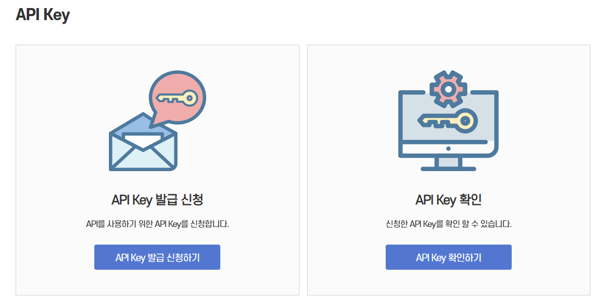

### ETRI STT API 소개

최신 인공지능 기술에 기반하여 한국어, 영어, 다국어(일본어/중국어/독어/불어/스페인어/러시아어/베트남어/아랍어/태국어)에 대해 고성능의 음성인식 정확률을 제공하는 서비스로서, 사용자가 발성한 녹음된 입력 음성 데이터(단위 파일 또는 버퍼)를 음성인식 서버로 전달하여 문자(텍스트)로 제공한다. 

음성인식 API는 HTTP 기반의 REST API 인터페이스로 JSON 포맷 기반의 입력 및 출력을 지원하며 ETRI에서 제공하는 API Key 인증을 통해 사용할 수 있는 Open API 이다.

### 음성인식 API 사용

음성인식 API는 REST API이며, 음성인식에 사용하기 위해 샘플링 주파수16kHz로 녹음된 음성 파일을 Base64로 Encoding 하여 HTTP 통신으로 ETRI Open API 서버에 전달하면 된다. 

서버가 제공하는 REST API의 URI는 다음과 같으며 POST 방식으로 호출해야 한다.

```
http://aiopen.etri.re.kr:8000/WiseASR/Recognition
```

#### API 발급 및 확인

상단 API Key에서 이메일 입력 후 해당 이메일에서 API Key를 확인한다.



HTTP 요청으로 음성인식을 요청할 때 사전 준비 사항에서 발급받은 API Key 정보를 요청 본문에 포함시켜야 한다.

다음은 HTTP 요청 메시지 예시이다.

```
[HTTP Request Header]
"Authorization" : "YOUR_ACCESS_KEY"

[HTTP Request Body]
{
    "request_id": "reserved field",
    "argument": {
        "language_code": "LANGUAGE_CODE",
        "audio": "BASE64_OF_AUDIO_DATA"
    }
}
```

위와 같은 HTTP 요청을 ETRI Open API 서버로 전달하면 서버는 JSON 형태의 Text 데이터를 HTTP 응답 메시지로 반환한다. 다음은 HTTP 응답 예제이다.

```
[HTTP Response Header]
Access-Control-Allow-Origin:*
Connection:close
Content-Length:0
Content-Type:application/json; charset=UTF-8

[HTTP Response Body]
{
    "request_id": "reserved field",
    "result": 0,
    "return_object": {음성인식 결과 JSON}
}
```


