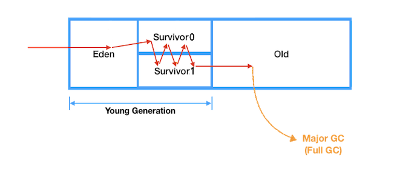
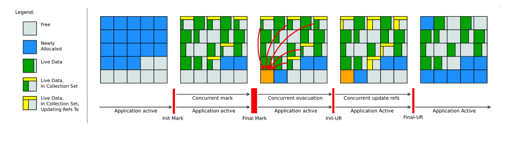

## Garbage Collection(GC) 이란?

가비지 컬렉션은 자바의 메모리 관리 방법 중의 하나로 JVM의 <span style="color:red">**Heap**</span> 영역에서 **동적으로 할당했던 메모리 중 필요 없게 된 메모리 잭체를 모아 주기적으로 제거**하는 프로세스를 말합니다.

가바지 컬렉션은 꼭 자바에만 있는 개념이 아니라 파이썬, 자바스크립트, Go 언어 등 많은 프로그래밍 언어에서 가비지 컬렉션이 기본으로 내장되어 있습니다.

------

## 가비지 컬렉션 대상

가비지 컬렉션은 특정 객체가 garbage인지 아닌지 판단하기 위해서 도달성, 도달능력 이라는 개념을 적용합니다.

객체에 레퍼런스가 있다면 <span style="color:green">Reachable</span>(객체가 참조되고 있는 상태)로 구분되고, 객체에 유효한 레퍼런스가 없다면 <span style="color:red">Unreachable</span>로 구분해버리고 수거합니다.

<p style="text-align:center;">
  
</p> 

생성된 Heap 영역 객체들이 메서드가 끝나는 등의 특정 이벤트들로 인하여 Heap 영역 객체의 메모리 주소를 가지고 있는 참조 변수가 삭제되는 현상이 발생하면, 위의 그림에서의 <span style="color:red">빨간색 객체</span>와 같이 Heap 영역에서 <span style="color:red">어디서든 참조하고 있지 않은 객체(Unreachable)</span>들이 발생하게 되고 이를 주기적으로 가비지 컬렉터가 제거해줍니다.

------

## 가비지 컬렉션 청소 방식

이제 GC가 Unreachable한 객체를 어떤 방식으로 청소를 하는지 알아보겠습니다.

### <span style="color:orange">Mark</span> And <span style="color:orange">Sweep</span>

다양한 GC에서 사용되는 객체를 식별하고 제거하는 **기초적인 청소 과정**입니다.


기본 원리는 가비지 컬렉션이 될 대상 객체를 <span style="color:orange">식별(Mark)</span>하고 <span style="color:orange">제거(Sweep)</span>하며 객체가 제거되어 파편화된 메모리 영역을 <span style="color:orange">앞에서부터 채워나가는 작업(Compaction)</span>을 수행하게 됩니다.

- **Mark 과정** : 먼저 Root Space로부터 그래프 순회를 통해 연결된 객체들을 찾아내어 각각 어떤 개게를 참조하고 있는지 찾아서 마킹합니다.
- **Sweep 과정** : 참조하고 있지 않은 객체들을 Heap에서 제거합니다.
- **Compact 과정** : Sweep 후에 분산된 객체들을 Heap의 시작 주소로 모아 메모리가 할당된 부분과 그렇지 않은 부분으로 압축합니다.

{: .tip}

**GC의 Root Space란?**

JVM GC에서의 Root Space는 heap 메모리 영역을 참조하는 method area, static 변수, stack, native method stack이 됩니다.


------

## 가비지 컬렉션 동작 과정


#### heap 메모리 구조

Heap 영역은 처음 설계될 때 다음의 2가지 전제로 설계되었습니다.

- <span style="color:cornflowerBlue">대부분의 객체는 금방 접근 불가능한 상태가 된다.</span>
- <span style="color:cornflowerBlue">오래된 객체에서 새로운 객체로의 참조는 아주 적게 존재한다.</span>

객체는 대부분 일회성이며, 메모리에 오랫동안 남아있는 경우는 드물다는 특성을 이용해 객체의 생존 기간에 따라 물리적인 Heap 영역을 나누었고 <span style="color:LightCoral">**Young**</span> 과 <span style="color:LightCoral">**Old**</span> 총 2가지 영역으로 설계하였습니다.


**Young 영역**

- 새롭게 생성된 객체가 할당되는 영역
- 대부분의 객체가 금방 Unreachable 상태가 되기 때문에, 많은 객체가 Young 영역에 생성되었다가 사라진다.
- Young 영역에 대한 가비지 컬렉션을 Minor GC라고 부른다.

**Old 영역**

- Young영역에서 Reachable 상태를 유지하며 살아남은 객체가 복사되는 영역
- Young 영역보다 크게 할당되며, 영역의 크기가 큰 만큼 가비지는 적게 발생
- Old 영역에 대한 가비지 컬렉션을 Major GC 또는 Full GC라고 부른다.

------

또다시 힙 영역은 더욱 효율적인 GC를 위해 <span style="color:cornflowerBlue">Young 영역을 3가지 영역(Eden, survivor 0 , survivor 1)</span>으로 나눕니다.


**Eden**

- new를 통해 새로 생성된 객체가 위치
- 정기적인 가비지 수집 후 살아남은 객체들은 Survivor 영역으로 보냅니다.

**Survivor 0 / Survivor 1**

- 최소 1번의 GC 이상 살아남은 객체가 존재하는 영역
- Survivor 영역에는 특별한 규칙이 있는데, Survivor 0 또는 Survivor 1 둘 중 하나에는 꼭 비어 있어야 합니다.

------

#### Minor GC 과정


모든 객체가 처음에는 Young Generation에 생성되게 됩니다.

Young Generation의 공간은 Old Generation보다 <span style="color:Violet">상대적으로 작기 때문에 메모리 상의 객체를 찾아 제거하는데 적은 시간</span>이 걸립니다.

1. 처음 생성된 객체는 Young Generation 영역의 일부인 Eden 영역에 위치합니다.

   

2. 객체가 계속 생성되어 Eden 영역이 꽉차게 되고 <span style="color:red">Minor GC</span>가 실행됩니다.

   

3. <span style="color:orange">Mark</span> 동작을 통해 reachable 객체를 탐색합니다.

   

4. Eden 영역에서 살아남은 객체는 1개의 Survivor 영역으로 이동합니다.

   

5. Eden 영역에서 사용되지 않은 객체의 메모리를 <span style="color:orange">Sweep</span>합니다.

   

6. 살아남은 모든 객체들은 age값(Survivor 영역에서 객체가 살아남은 횟수)이 1씩 증가합니다.

   

7. 또다시 Eden 영역에 신규 객체들로 가득 차게 되면 다시한번 minor GC가 발생하고 mark합니다.

   

8. marking한 객체들을 비어있는 Survival 1로 이동시키고 Sweep합니다.

   

9. 다시 살아남은 모든 객체들은 age가 1씩 증가하게 됩니다.

   

10. 이러한 과정을 반복합니다.

------

#### Major GC 과정



Old Generation 객체들은 처음에는 Young Generation에 의해 시작되었으나, GC 과정 중에 제거되지 않은 경우 age 임계값에 도달하여 이동된 객체들입니다.

1. 객체의 age가 임계값(8로 가정)에 도달하게 되면

   

2. 이 객체들은 Old Generation으로 이동하게 됩니다. 이를 <span style="color:Turquoise">**promotion** </span>이라 부릅니다.

   

3. 위의 과정이 반복되어 Old Generation 영역의 공간이 부족하게 되면 <span style="color:red">Major GC</span>가 발생하게 됩니다.

   

Old 영역에 할당된 메모리가 허용치를 넘게 되면, Old 영역에 있는 모든 객체들을 검사하여 참조되지 않는 객체들을 한꺼번에 삭제하는 Major GC가 실행되게 됩니다.

Old Generation은 Young Generation에 비해 상대적으로 큰 공간을 가지고 있어, 메모리 상의 객체 제거에 많은 시간이 걸리며 <span style="color:red">**Young에 비해 10배 이상의 시간**</span>을 사용합니다.

이는 애플리케이션에도 영향을 주어 <span style="color:red">**Stop-The-World**</span> 문제가 발생하게 됩니다.

{: .tip}

**Stop-The-World란?**

GC가 자동으로 처리해준다고 해도 <span style="color:red">메모리가 언제 해제되는지 정확하게 알 수 없어 제어하기 힘들며</span>, 가비지 컬렉션이 동작하는 동안에는 <span style="color:red">다른 동작을 멈추기</span> 때문에 오버헤드가 발생되는 문제점을 뜻합니다.

Major GC가 일어나면 Thread가 멈추고 Mark and Sweep 작업을 해야 해서 CPU 부하를 주기 때문에 멈추거나 버벅이는 현상이 일어납니다.

따라서 개발자들은 끊임없이 **가비지 컬렉션 알고리즘**을 발전 시켜왔으며, 이제 그 알고리즘 종류에 대해 살펴보겠습니다.

------

## 가비지 컬렉션 알고리즘 종류

JVM이 메모리를 자동으로 관리해주는 것은 개발자의 입장에서 상당한 메리트입니다. 
하지만 문제는 GC를 수행하기 위해 Stop The World가 발생되고 이 때문에 애플리케이션이 중지되는 문제점이 발생하게 됩니다.

또한 자바가 발전됨에 따라 Heap의 사이즈가 커지면서 애플리케이션의 지연(Suspend) 현상이 두드러지게 되었고, 이를 최적화 위해 다양한 Garbage Collection(가비지 컬렉션) 알고리즘이 개발되었습니다.

여기서 알아두어야 할 것은 소개할 GC 알고리즘은 모두 설정을 통해 Java에 적용할수 있다는 점입니다.
즉, 상황에 따라 필요한 GC 방식을 설정해서 사용할 수 있습니다. 

------

### Serial GC

JDK에 도입된 최초의 가비지 컬렉터이며, 단일 스레드로 동작하는 가장 단순한 형태입니다. 작은 힙 메모리와 단일 CPU 환경에 적합하며 Stop-The-World 시간이 가장 길게 발생합니다.

- Minor GC 에는 Mark-Sweep을 사용하고, Major GC에는 Mark-Sweep-Compact를 사용.
-  보통 실무에서 사용하는 경우는 없다 (디바이스 성능이 안좋아서 CPU 코어가 1개인 경우에만 사용)

<p style="text-align:center;">
  
</p> 


**Serial GC 실행 명령어**

자바 프로그램을 실행할 때 -XX:+UseSerialGC GC 옵션을 지정하여 해당 가비지 컬렉션 알고리즘으로 힙 메모리를 관리하도록 실행할 수 있습니다.

```bash
java -XX:+UseSerialGC -jar Application.java
```

------

### Parallel GC 

Java 5부터 8까지 **default** 가비지 컬렉터로 사용되었으며, Serial GC와 달리  <span style="color:red"> **Young 영역의 GC를 멀티 스레드**</span>로 수행합니다. (단, Old 영역은 여전히 싱글 쓰레드)

높은 처리량에 초점을 두기 때문에 Throughput GC라고도 불립니다.


**parallel GC 실행 명령어**

- GC 스레드는 기본적으로 cpu 개수만큼 할당됩니다.
- 옵션을 통해 GC를 수행할 스레드의 개수 등을 설정해줄 수 있습니다.

```bash
java -XX:+UseParallelGC -jar Application.java
```

------

### Parallel Old GC

**Parallel Old GC**는 Parallel GC의 향상된 버전으로, Young영역 뿐만 아니라, Old 영역에서도 멀티 스레드를 활용하여 GC를 수행합니다.

새로운 가비지 컬렉션 청소 방식인 <span style="color:orange">**Mark-Summary-Compact**</span> 방식을 이용합니다.


**Parallel Old GC 실행 명령어**

```bash
java -XX:+UseParallelOldGC -jar Application.java
# -XX:ParallelGCThreads=N : 사용할 쓰레드의 개수
```

------

### CMS GC(Concurrent Mark-Sweep)

CMS GC는 Java 5부터 8까지 사용된 가비지 컬렉터로, **애플리케이션 스레드와 병렬로 실행되어 Stop-The-World 시간을 최소화**하도록 설계되었습니다. 

하지만 메모리와 CPU 사용량이 많고, 메모리 압축을 수행하지 않아 메모리 단편화 문제가 있습니다. Java 9부터 deprecated 되고, Java 14에서 완전히 제거되었습니다.


**CMS GC 실행 명령어**

```bash
# deprecated in java9 and finally dropped in java14
java -XX:+UseConcMarkSweepGC -jar Application.java
```

------

### G1 (Garbage First) GC

**G1 GC**는 Java 9부터 **default** 가비지 컬렉터입니다. GC 대상이 많은 region을 먼저 회수하기 때문에 garbage first라는 이름이 붙었습니다.

- 기존의 GC 방식과 달리 <span style="color:red">힙을 여러 개의 region으로 나누어 논리적으로 Young, Old 영역을 구분</span>합니다. 
- 처리량과 Stop-The-World 시간 사이의 균형을 유지하며 4GB 이상 32GB보다 작은 힙 메모리를 사용할 때 가장 효과적입니다.
- 전체 영역을 Region이라는 영역으로 체스같이 분할하여 상황에 따라 Eden, Survivor, Old 등 <span style="color:red">역할을 고정이 아닌 동적으로 부여</span>

Garbage로 가득찬 영역을 빠르게 회수하여 빈 공간을 확보하므로, 결국 GC 빈도가 줄어드는 효과를 얻게 되는 원리입니다.


**G1 GC의 효율성**

G1 GC에서는 이전의 GC들처럼 일일히 메모리를 탐색해 객체들을 제거하지 않습니다. 대신 메모리가 많이 차있는 영역을 인식하는 기능을 통해 <span style="color:Orange">메모리가 많이 차있는 영역을 우선적으로 GC</span>합니다. 즉, region별로 GC가 일어납니다.

또한 이전의 GC 들은 Young Generation에 있는 객체들이 GC가 돌때마다 살아남으면 Eden -> Survivor0 -> survivor1으로 순차적으로 이동했지만, G1 GC에서는 순차적으로 이동하지는 않습니다.

대신 G1 GC는 더욱 효율적이라고 생각하는 위치로 객체를 Reallocate 시킵니다. 예를 들어 Survivor 1 영역에 있는 객체가 Eden 영역으로 할당하는 것이 더 효율적이라고 판단될 경우 Eden 영역으로 이동시킵니다.

**G1 GC 실행 명령어**

```bash
java -XX:+UseG1GC -jar Application.java
```

{: .note}

#### G1 GC에서 Humongous 객체란 무엇이며 어떻게 처리되나요?

**Humongous 객체**는 region 크기의 50% 이상을 차지하는 큰 객체를 의미합니다. Humongous 객체는 크기에 따라 하나 또는 여러 개의 연속된 region을 차지할 수 있고, region 내 잉여 공간은 다른 객체에 할당되지 않아 메모리 단편화가 발생할 수 있습니다. 또한, Young 영역을 거치지 않고 바로 Old 영역에 할당되기 때문에 Full GC가 발생할 가능성이 높아집니다. 이 문제를 해결하려면 `-XX:G1HeapRegionSize` 옵션을 사용하여 region 크기를 조정하거나, 큰 객체를 작은 객체로 분할하여 처리해 볼 수 있습니다.

------

### ZGC (Z Garbage Collector)

**ZGC**는 Java 11부터 실험적으로 도입된 가비지 컬렉터로, Java 15부터 정식 기능으로 인정받았습니다. 

- 대량의 메모리(8MB ~ 16TB)를 low-latency로 잘 처리하기 위해 디자인 된 GC
- G1의 Region처럼, ZGC는 <span style="color:red">ZPage</span>라는 영역을 사용하며, G1의 Region은 크기가 고정인데 비해, ZPage는 2mb 배수로 동적으로 운영됩니다. 

-  <span style="color:red">10ms 이하의 Stop-The-World 시간과 대용량 힙을 처리</span>할 수 있도록 설계되었습니다.


**ZGC 실행 명령어**

```bash
java -XX:+UnlockExperimentalVMOptions -XX:+UseZGC -jar Application.java
```

------

### Shenandoah GC

**Shenandoah GC**는 Red Hat에서 개발한 가비지 컬렉터로, Java 12부터 도입되었습니다. 

- G1 GC와 마찬가지로 힙을 여러 개의 region으로 나누어 처리합니다.
- ZGC처럼 저지연 Stop-The-World와 대용량 힙 처리를 목표로 합니다.
- 기존 CMS가 가진 단편화, G1이 가진 pause의 이슈를 해결하였습니다.
- 강력한 Concurrency와 가벼운 GC 로직으로 heap 사이즈에 영향을 받디 않고 일정한 pause 시간 소요가 특징입니다.




**Shenandoah GC 실행 명령어**

```bash
java -XX:+UseShenandoahGC -jar Application.java
```

------

### 질문

{: .tip}

**2vCPU, 1GB 메모리를 가진 Linux 서버에 JDK 17을 설치하면 어떤 가비지 컬렉터가 사용될까요?**

JDK 9부터 G1 GC가 default 가비지 컬렉터이지만, 서버 스펙에 따라 자동으로 결정됩니다.

OpenJDK에서는 **CPU 코어 수가 2개 이상이고 메모리가 2GB 이상일 경우** 서버를 **Server-Class Machine**으로 인식합니다. Server-Class Machine이라면 가비지 컬렉터로 G1 GC가 선택되지만, 이 서버는 조건을 충족하지 않기 때문에 Serial GC가 선택됩니다. G1 GC를 사용하려면 서버를 스케일업하거나 `-XX:+UseG1GC` 옵션을 명시적으로 설정해야 합니다.

**실행 중인 JVM의 GC 확인 방법**

```shell
sudo jcmd {jar PID} VM.info 또는 sudo jinfo {jar PID}
```

