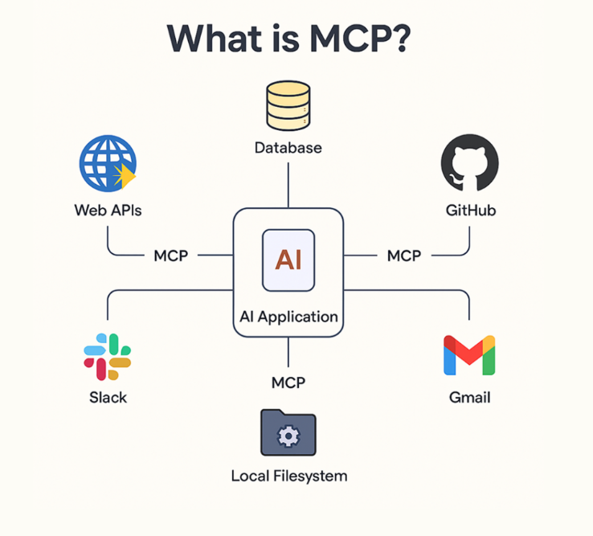
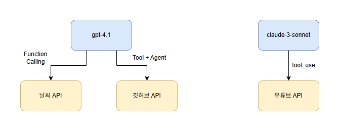
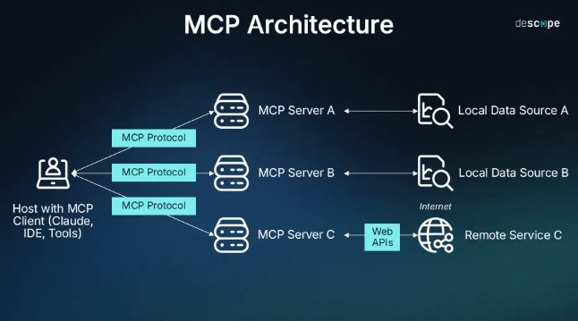
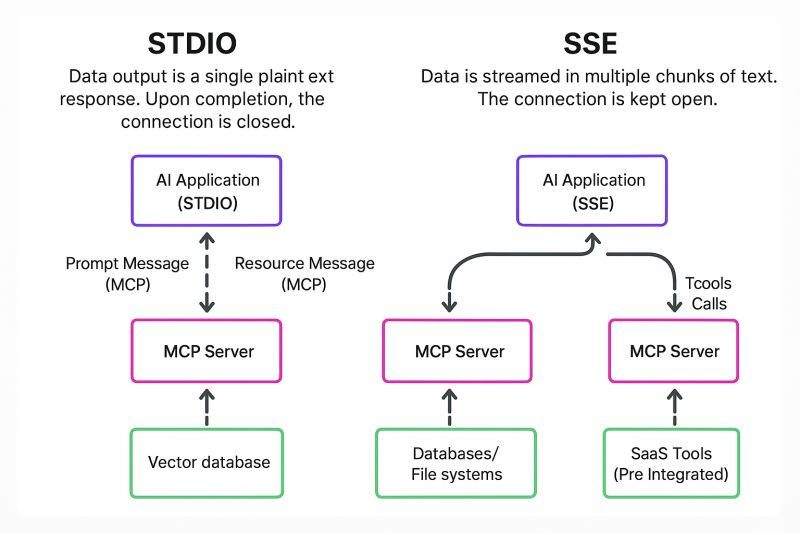

------

## MCP 개념 이해하기

### MCP가 무엇인가요?

{: .important}

LLM이 외부의 다양한 도구와 구조화된 방식으로 상호작용 할 수 있도록 설계된 프로토콜입니다.

MCP를 통해 LLM은 계산기, 파일 검색기, API 서버, 클라우드 서비스 등 다양한 외부 도구를 호출하고, 작업을 자동화하거나 결과를 받아올 수 있습니다.

### LLM은 왜 도구가 필요한가요?

LLM은 방대한 정보를 바탕으로 텍스트를 생성하는 데 매우 뛰어난 성능을 보이지만, 실제 업무에 적용하려면 한계에 부딪히게 됩니다. 예를 들어 '현재 서울의 날씨는?'이라는 질문에 대해 LLM은 과거의 데이터를 기반으로 추측은 할 수 있어도, 실시간 정보를 직접 조회할 수는 없습니다. 이러한 문제를 해결하기 위해 등장한 것이 바로 외부 **도구**입니다.



최근에는 이러한 도구를 연결하여 LLM이 실제 행동까지 수행하도록 하는 AI 에이전트 기술이 주목받고 있습니다. AI 에이전트는 사용자가 자연어로 의도를 전달하고, LLM은 적절한 도구를 골라 작업을 분해하고 실행하는 방식입니다. 그러나 도구를 연결하는 구조는 생각보다 복잡하며, 특히 다양한 모델을 조합하거나 여러 개의 도구를 사용할수록 유지보수가 어려워지기 때문이죠.

### 기존 방식의 문제점

기존에도 LLM과 외부 도구를 연결하려는 시도로는 OpenAI의 Function Calling, 앤트로픽 클로드의 tool_use 메시지 구조, 랭체인의 에이전트 기반 방식 등 다양한 접근이 존재했습니다.



하지만 이들 방식이 서로 호환되지 않아, 동일한 도구라도 모델별로 입력 형식과 호출 방식이 달라 재사용이 어렵습니다.
멀티 LLM 환경에서는 연동 코드가 중복되고, 도구가 많아질수록 프롬프트에 각 도구의 사용법을 일일이 명시해야 합니다. 또한 함수의 입력값이나 반환값이 바뀔 경우, 관련 코드를 모두 수정해야 하는 번거로움이 뒤따릅니다.

{: .q-left}

> Call_Weather_API.py

```python
import os
import json
import requests
from openai import OpenAI

# 환경 변수 또는 직접 키 입력
openai_api_key = "sk-" # OpenAI 키 입력
weather_api_key = "" # OpenWeather 키 입력

client = OpenAI(api_key=openai_api_key)

# Function 정의 (OpenAI에 알려줄 함수 명세)
functions = [
    {
        "name": "get_current_weather",
        "description": "현재 날씨를 조회합니다",
        "parameters": {
            "type": "object",
            "properties": {
                "location": {"type": "string", "description": "도시 이름"},
            },
            "required": ["location"],
        },
    }
]

# 사용자 질문
messages = [
    {"role": "user", "content": "서울 날씨 어때?"}
]

# Step 1: GPT에게 함수 호출 요청 생성시킴
response = client.chat.completions.create(
    model="gpt-4",
    messages=messages,
    functions=functions,
    function_call="auto"
)
message = response.choices[0].message

if message.function_call:
    function_name = message.function_call.name
    arguments = json.loads(message.function_call.arguments)
    location = arguments["location"]

    # OpenWeatherMap은 영어 도시명을 더 잘 인식함 → 한글일 경우 영문 변환 권장
    # 간단한 매핑 예시
    korean_to_english = {
        "서울": "Seoul",
        "부산": "Busan",
        "대구": "Daegu",
        "인천": "Incheon",
        "광주": "Gwangju",
        "대전": "Daejeon",
        "울산": "Ulsan",
        "제주": "Jeju"
    }
    location_eng = korean_to_english.get(location, location)  # 기본은 그대로

    # Step 3: 실제 날씨 API 호출
    weather_url = "https://api.openweathermap.org/data/2.5/weather"
    params = {
        "q": location_eng,
        "appid": weather_api_key,
        "units": "metric",  # 섭씨 온도
        "lang": "kr"
    }

    weather_response = requests.get(weather_url, params=params)
    weather_data = weather_response.json()

    # Step 4: 실패 시 처리
    if "main" not in weather_data:
        print("❌ 날씨 정보를 가져오는 데 실패했습니다.")
        print("에러 메시지:", weather_data.get("message", "알 수 없는 오류"))
        print("전체 응답:", weather_data)
        exit()

    # Step 5: 결과 구성
    weather_result = {
        "location": location_eng,
        "temperature": weather_data["main"]["temp"],
        "condition": weather_data["weather"][0]["description"]
    }

    # Step 6: GPT에게 도구 실행 결과 전달
    messages.append(message)  # GPT가 만든 function_call 메시지
    messages.append({
        "role": "function",
        "name": function_name,
        "content": json.dumps(weather_result)
    })

    final_response = client.chat.completions.create(
        model="gpt-4",
        messages=messages
    )

    print("\n 최종 응답:")
    print(final_response.choices[0].message.content)

else:
    print("GPT가 함수 호출을 요청하지 않았습니다.")
```

Function Calling과 실제 API 호출 코드를 연동하면 실시간 날씨를 받아올 수 있지만, 이러한 연동을 도구마다 매번 새롭게 구성해야 하며, 모델마다 연결 방식이 다르기 때문에 재사용이 어렵습니다. 이러한 문제를 해결하고, LLM과 도구를 더 일관되고 유연하게 연결할 수 있도록 제안된 것이 바로 MCP입니다.

------

### MCP의 구조

- **도구 정의**

 각 도구는 독립된 MCP 서버로 구현되고, 도구의 기능은 JSON구조로 표현되며, 클라이언트가 이를 LLM에 전달해 도구 선택 및 호출에 활용합니다. 이 구조에는 도구의 이름, 수행하는 작업에 대한 설명, 입력 파라미터의 데이터 형식과 제약 조건, 반환값의 구조등이 포함됩니다.

- **도구 불러오기 및 LLM 연동**

클라이언트(커서, 클로드 데스크톱 등)는 MCP 서버로부터 도구의 JSON 명세를 자동으로 불러오며, 이를 LLM에게 전달합니다. 이 정보는 자동으로 프롬프트에 포함되어 별도의 수작업 없이 도구의 사용법을 이해하고 호출할 수 있도록 지원합니다. 덕분에 개발자는 프롬프트에 함수 설명을 일일이 삽입하거나, LLM이 도구를 학습하도록 반복 훈련시킬 필요가 없습니다.

- **다중 도구 연결 및 에이전트 협업**

MCP는 하나의 LLM이 여러 MCP 서버와 동시에 연결될 수 있도록 설계되어 있기 때문에 LLM은 복수의 도구를 병렬로 호출하거나, 앞선 도구의 출력값을 다음 도구의 입력으로 연계하여 복합 작업을 처리할 수 있습니다. 정리하면, MCP는 단순한 도구 호출을 넘어서, 에이전트들이 유기적으로 협업할 수 있는 구조를 가능하게 하는 핵심 기반 기술입니다.

------

### MCP가 가져올 변화

- 단일 모델에서 멀티 에이전트 구조로의 변환
- 도구를 사용자가 직접 호출하던 방식에서, AI가 사용자 요청을 해석해 적절한 도구를 자동으로 선택하고 실행하는 방식으로 전환
- 반복적으로 구현하던 도구를 재사용 가능한 구조로 개선
- LLM 중심의 설계에서 에이전트 중심의 아키텍처로 진화

결과적으로 AI 생태계는 MCP와 같은 표준화된 연결 프로토콜을 중심으로 한 멀티 에이전트 협업 체계로 진화할 것입니다.

------

## MCP 동작 방식 이해하기

### MCP 아키텍처

MCP는 기본적으로 서버-클라이언트 아키텍처를 갖습니다.



예를 들어 사용자가 문서를 요약해달라고 하면, 클라이언트는 해당 요청을 PDF 검색기나 코드 실행기와 같은 MCP 서버에 전달하고, 서버는 이를 처리한 뒤 결과를 다시 반환합니다. 이처럼 MCP는 클라이언트와 LLM이 생성한 요청(tool_use)에 응답하고 결과 메시지(tool_result)를 반환하는 서버 역할을 합니다.

MCP는 전통적인 서버-클라이언트 구조를 따르지만, 클라이언트 측을 두 개의 구성 요소로 나누어 이해할 수 있습니다. 사용자와 직접 상호작용하는 상위 계층은 'MCP 호스트'로, 클로드 데스크톱, 커서, 스미더리 등과 같은 LLM 기반 애플리케이션이 이 역할을 수행합니다. MCP 호스트는 사용자 입력을 받고, LLM의 응답을 출력하는 사용자 인터페이스 환경을 포함합니다.

|    역할    |                             설명                             | 예시                                                         |
| :--------: | :----------------------------------------------------------: | ------------------------------------------------------------ |
|   호스트   |    사용자가 직접 상호작용하는 AI 에플리케이션 인터페이스     | 클로드 데스크톱, 커서, 스미더리, 윈드서프 등                 |
| 클라이언트 | 사용자 질문을 분석한 뒤 MCP 서버에 적절한 요청을 보내고, 도구 실행 결과를 다시 받아 호스트에 전달하는 역할 | 커서 내부  LLM 호출 모듈, 클로드 데스크톱의 MCP 요청 처리기 등 |
|    서버    | 도구를 실제로 실행하는 MCP 서버. 이 서버에는 다양한 기능(API, 파일 처리, 검색 등)이 등록되어 있으며, 클라이언트의 요청에 따라 실행 | 날씨 API, PDF 요약 서버, 웹 검색 서버 등                     |

동일한 MCP 서버를 여러 호스트에서 공동으로 사용할 수 있다는 점이 핵심입니다. 하나의 MCP 서버를 만들면 다양한 애플리케이션에서 재사용할 수 있기 때문에 사용자 입장에서는 더 일관된 경험을 제공받고, 개발장 입장에서도 유지보수와 확장에 유리한 구조를 구성할 수 있습니다.

**각 도구를 역할별로 분리된 서버로 구성시 장점**

1. 독립 실행 : MCP 서버는 각각 독립된 프로세스로 실행되기 때문에 기능별로 나누면 장애 격리와 유지보수에 효과적입니다.
2. 확장성 : 기능의 특성에 따라 서버마다 다른 확장 전략을 적용할 수 있습니다.
3. 재사용성 : 한 번 구축한 MCP 서버를 클로드 데스크톱, 커서, 윈드서프 등 여러 클라이언트에서 공유해 사용할 수 있습니다.
4. 모듈화 : MSA처럼 각 도구를 전체 시스템과 분리해 독립적으로 개발, 배포, 운영할 수 있게 해줍니다.

------

### MCP 동작 원리

1. **사용자 입력** : 사용자가 자연어로 질문 또는 명령을 입력합니다.
2. **LLM이 입력을 분석** : LLM은 사용자의 입력을 해석하고 Context를 파악합니다.
3. **외부 정보 필요 여부를 판단** : LLM이 입력을 해석한 뒤, 자체 지식만으로 답변이 가능한지, 아니면 외부 정보를 참조해야 하는지를 판단합니다.
4. **MCP 형식에 맞춘 요청 생성** : 외부 도구 호출이 필요한 경우, MCP 형식(JSON 요청)으로 변환하여 요청을 준비합니다.
5. **MCP 서버가 요청을 수신 및 해석** : MCP 서버는 클라이언트를 통해 전달된 요청을 수신하고, 요청된 도구를 실행. MCP 서버는 도구 선택에 관여하지 않으며, 요청에 포함된 정보에 따라 지정된 도구만을 실행합니다.
6. **외부 리소스 또는 도구를 호출** : MCP 서버가 요청된 도구(@mcp.tool로 등록된 함수 등)를 실행합니다. 도구에 따라 외부 API를 호출하거나, 데이터베이스 조회, 코드 실행 등의 작업을 수행하여 필요한 정보를 가져올 수 있습니다.
7. **데이터 수신 및 결과 정리** : MCP 서버는 도구 실행 결과를 JSON 형식으로 반환되며, 이 결과는 클라이언트를 통해 LLM에 전달되며, LLM은 이를 기반으로 후속 응답을 생성합니다.
8. **MCP 서버가 모델에 응답 전달** : 도구 실행 결과는 클라이언트를 통해 LLM에게 전달되며, 이후 LLM은 기존 대화 문맥과 결합해 응답을 생성합니다.
9. **AI 모델이 응답을 통합 및 재구성** : LLM은 MCP 서버에서 전달받은 응답을 기존 문맥과 통합하여 자연스럽게 정리합니다.
10. **사용자에게 최종 응답 출력** : LLM이 재구성한 응답을 사용자에게 출력하는 최종 단계입니다.

------

### MCP 통신 방식



**Stdio 방식**

MCP 서버와 클라이언트가 표준 입출력을 통해 직접 데이터를 주고받는 통신 방식입니다.

- MCP 서버는 명령 프롬프트나 터미널 환경에서 실행되며, 클라이언트는 표준 입출력을 통해 서버와 직접 데이터를 주고 받습니다.
- 클라이언트는  stdin을 통해 데이터를 서버에 전송하고, 서버는 stdout을 통해 처리 결과를 클라이언트에 반환합니다.

**장점**

1. 설정이 간단하고 별도 네트워크 구성 없이 빠르게 테스트 가능
2. 네트워크를 사용하지 않아 민감한 데이터가 외부로 노출될 위험이 적음
3. 커서, 클로드 데스크톱 등 로컬 실행 기반의 도구와 연동하기에 적합

**단점**

1. 클라이언트와 서버가 동일한 시스템 또는 파일 경로 내에 있어야 하므로 원격 사용이 불가능함
2. 병렬 처리에 제약이 있으며, 동시에 여러 세션을 관리하기 어려움

{: .caution}

Stdio 기반 MCP 서버 예시

```python
from mcp.server.fastmcp import FastMCP

mcp = FastMCP("Math")

@mcp.tool()
def add(a: int, b: int) -> int:
	"""두 수를 더합니다"""
	return a + b
	
if __name__ = "__main__":
	mcp.run_stdio()
```

------

**SSE 방식**

MCP 서버가 HTTP 기반의 스트리밍 통신을 통해 클라이언트에게 실시간으로 데이터를 전송하는 방식입니다.

- MCP 서버는 웹 서버처럼 작동하며, 클라이언트는 /messages/ 경로에 접속하여 **지속적인 연결**을 유지합니다.
- 클라이언트는 보통 HTTP POST 방식으로 요청을 보내고, 서버는 처리 결과를 한 번에 전송하지 않고, 생성된 결과를 순차적으로 스트리밍합니다.

**장점**

1. HTTP 기반이므로 원격 접속 및 클라우드/웹 환경 배포에 용이
2. 다중 클라이언트 접속 및 세션 관리에 적합
3. 실시간 응답 및 스트리밍 처리에 최적화됨

**단점**

1. HTTP 서버 구성이 필요하므로 초기 설정이 복잡할 수 있음
2. 재연결은 기본적으로 지원되지만, 세션 유지나 중단 복원은 추가 구현 필요

{: .tip}

SSE 기반 MCP 서버 예시

```python
from mcp.server.fastmcp import FastMCP
from fastapi import FastAPI
import uvicorn

@mcp.tool()
def add(a: int, b: int) -> int:
	return a + b

app: FastAPI = mcp.app
	
if __name__ = "__main__":
	uvicorn.run(app, host="0.0.0.0", port=3000)
```

------

### MCP 사용 방법

- **도구** : LLM이 호출할 수 있는 외부 함수로, 사용자가 요청한 작업(예, 이메일 전송, 웹 검색 등)을 실제로 실행하는 역할.  MCP에서는 @mcp.tool()로 등록하여 사용합니다.

```python
@mcp.tool()
def add(a: int, b: int) -> int:
	"""Add two numbers"""
	return a + b
```

서버는 add라는 이름의 도구를 정의하고, 두 개의 정수 a와 b를 입력 받아 그 합을 반환합니다.

```python
from mcp import FastMCP

mcp = FastMCP("Add")

@mcp.tool()
def add(a: int, b: int) -> int:
	"""a와 b를 더하기"""
	return a + b
	
if __name__ == "__main__":
	mcp.run()
```

- **리소스** : LLM이 참고할 수 있도록 문맥이나 데이터를 사전에 제공하는 역할. MCP에서는 @mcp.resource()를 사용해 리소스를 등록하고 활용할 수 있습니다.

```python
@mcp.resource("greeting")
def get_greeting(name: str) -> str:
	return f"Hello, {name}!"
```

리소스는 주로 사용자 프로필, 회사 정보, 시스템 로그처럼 LLM이 참고할 수 있는 **배경 정보나 맥락을 보완하는 용도**로 활용됩니다.

user_profile이라는 리소스를 정의한 예시

이 리소스는 사용자의 이름, 직무, 지역 정보를 포함하고 있으며, LLM이 문맥을 이해하고 더욱 **개인화된 응답을 생성**하는데 도움을 줍니다. 

<span style="color:orange">'이번 주 마케팅 전략 보고서를 요약해줘.'</span>

이 경우, LLM은 user_profile 리소스를 참고하여 '배수민 마케팅 매니저'의 입장에서, 서울 지사를 고려한 전략적 요약을 생성할 수 있습니다.

```python
@mcp.resource("user_profile")
def get_user_profile() -> dict:
	return {
		"name": "배수민",
		"role": "마케팅 매니저",
		"location" : "서울"
	}
```

- **프롬프트**: LLM에게 주어지는 지시문 또는 입력 문장으로, 사용자의 요청을 일관된 방식으로 해석하고 처리할 수 있도록 도와주는 역할. MCP에서는 @mcp.prompt() 또는 add_prompt()를 사용해 프롬프트를 등록할 수 있습니다.

```python
@mcp.prompt()
def review_code(code: str) -> str:
	return f"Please review this code:\\n\\n{code}"
```

------

**클라이언트 등록 방법**

- **직접 실행**

작성된 파일을 직접 실행합니다.

```bash
python mcp_server.py
```

또한, uv는 러스트(Rust)로 만들어진 빠른 파이썬 실행 도구로 pip, venv, python의 기능을 하나로 통합해 가년하게 실행할 수 있는 명령줄 인터페이스입니다.

```
uv run mcp_server.py
```

- **커맨드 호출 등록: npx 명령어 사용**

npx는 Node.js 기반 명령어 실행 도구로, 패키지를 설치하지 않고도 MCP 서버를 즉시 실행할 수 있어 임시 테스트나 커서 환경에 적합합니다.

```
npx -y @smithery/cli run ./my_server.py --stdio
```

- **정적 등록: mcp.json (커서 전용)**

.cursor/mcp.json 파일을 사용하면 MCP 서버를 자동으로 등록할 수 있으며, 여러 개의 MCP 서버를 동시에 관리할 수 있습니다.

```
{
	"mcpServers": {
		"fs": {
			"command": "npx",
			"args": [
				"-y",
				"@smithery/cli@latest",
				"run",
				"@smithery/fs",
				"--key",
				"YOUR_ACCESS_KEY"
			]
		}
	}
}
```

- **GUI 등록: 클로드 데스크톱 개발자 모드**

 설정 파일을 수동으로 열어 명령어, 실행 옵션, 전송 방식 등을 JSON 형식으로 입력하면, 해당 MCP 서버를 AI가 사용할 수 있는 도구로 등록할 수 있습니다.

```
{
	"mcpServers": {
		"filesystem": {
			"command": "npx",
			"args": [
				"-y",
				"@modelcontextprotocol/server-filesystem",
				"C:\\Users\\YourUsername\\Desktop",
				"C:\\Users\\YourUsername\\Downloads"
			]
		}
	}
}
```

- **원격 서버 연결: URL 방식으로 원격 서버 연결(SSE)**

클로드 데스크톱의 개발자 모드에서는 SSE 방식의 원격 MCP 서버 URL을 직접 등록할 수 있습니다. 이때 서버는 /messages 또는 /sse와 같은 SSE 응답을 제공하는 HTTP 스트리밍 엔트포인트를 갖고 있어야 하며, transport는 반드시 "sse"로 설정해야 합니다.

```
{
	"mcpServers": {
		"gpt4-search": {
			"url": http://localhost:8000/messages/",
			"transport": "sse"
		}
	}
}
```

MCP 서버는 FastAPI와 같은 웹 프레임워크를 사용해 구성할 수 있으며, SSE 방식으로 통신하려면 비동기 HTTP 서버(ASGI 서버)를 통해 실행되어야 합니다. 이때 uvicorn과 같은 ASGI 서버를 사용하면 FastAPI 기반 MCP 서버를 쉽게 실행할 수 있습니다.

------

### MCP의 기능적 한계

MCP는 기본적으로 도구 단위의 단일 호출에 최적화 되어 있기 때문에, 도구 간의 순차 실행, 조건 분기, 결과 공유와 같은 복잡한 워크플로 구성이 어렵습니다.

개발자가 별도의 로직이나 중간 처리를 직접 구현해야 합니다.

또한 MCP에서는 각 도구가 독립적으로 정의되기 때문에, 입출력 및 스펙이 일치하지 않으면 호출 실패나 잘못된 결과가 발생할 수 있습니다.

전송 방식에서도 SSE는 서버에서 클라이언트로 데이터를 지속적으로 푸시하는 단방향 스트리밍 방식이기 때문에, 클라이언트에서 서버로 실시간 데이터를 전송해야 하는 경우에는 적합하지 않으며 Stdio는 로컬 환경에서는 유용하지만, 웹이나 모바일 환경에는 부적합합니다.

------

### MCP의 보안 취약성

1. **엔트포인트를 외부에 노출하는 구조**
2. **사용자 입력 검증 부족**
   - 명령어 주입
   - 파일 시스템 접근
   - 악성 코드 실행
3. **도구 간 인증 및 권한 관리 부족** : 도구 간 상호 인증 및 신뢰 기반 설정 부족의 경우 다음과 같은 문제 발생
   - 중간자 공격(MITM)
   - 도구 간 무단 호출
4. **민감한 정보의 로그 노출** : MCP는 요청과 응답 데이터를 로그로 기록하는 구조를 갖고 있습니다. 따라서 별도의 필터링 없이 로그를 저장할 경우, 사용자 개인정보, 시스템 내부 정보 등 민감한 데이터가 노출될 위험이 있습니다.
