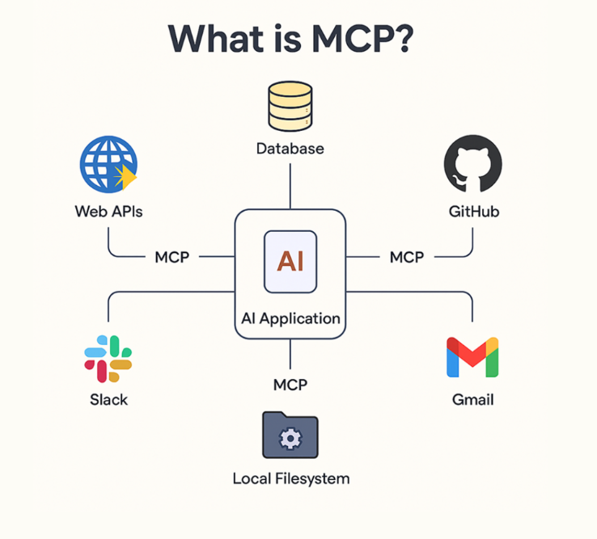

# 구현 동기

백엔드 개발을 하다 보면 대부분의 작업이 REST API 중심으로 이뤄집니다.
 CRUD 요청을 처리하고, 데이터베이스에 값을 저장하거나 불러오는 익숙한 패턴이죠. 하지만 실제 서비스 환경에서는 단순 요청–응답 구조만으로는 해결되지 않는 순간이 옵니다.

최근 AI 서비스들이 폭발적으로 늘어나면서, 백엔드 개발자인 저 역시 “AI를 어떻게 서비스에 녹일 수 있을까?”라는 고민을 자주 하게 됐습니다.
 기존의 REST API 방식만으로도 AI 모델을 호출할 수는 있지만, 문제는 **실시간성과 데이터 흐름**이었습니다.

- AI 모델이 생성한 결과를 **바로 사용자에게 스트리밍 형태로 전달**하고 싶을 때
- 다수의 클라이언트가 동시에 AI 응답을 **구독(Subscribe)** 하고 있어야 할 때
- 여러 AI 엔진과 **프로토콜 단위로 연결·전환**해야 할 때

이런 요구사항을 만족시키려면 단순한 API 서버만으로는 부족했습니다.
 그래서 선택한 것이 바로 **MCP 서버**입니다.

MCP 서버는 이벤트 기반 구조 덕분에 **실시간 AI 추론 결과 전달**, **대화형 인터페이스 유지**, **다중 프로토콜 브리징**에 강점이 있습니다.
 저는 이를 활용해, 예를 들어 AI 챗봇이 생성하는 답변을 한 문장씩 스트리밍하거나,
 여러 AI 모듈을 하나의 서버에서 제어하고 통합하는 구조를 구현해보고자 했습니다.

------

## MCP 개념 이해하기

### MCP가 무엇인가요?

{: .important}

LLM이 외부의 다양한 도구와 구조화된 방식으로 상호작용 할 수 있도록 설계된 프로토콜입니다.

MCP를 통해 LLM은 계산기, 파일 검색기, API 서버, 클라우드 서비스 등 다양한 외부 도구를 호출하고, 작업을 자동화하거나 결과를 받아올 수 있습니다.

### LLM은 왜 도구가 필요한가요?

LLM은 방대한 정보를 바탕으로 텍스트를 생성하는 데 매우 뛰어난 성능을 보이지만, 실제 업무에 적용하려면 한계에 부딪히게 됩니다. 예를 들어 '현재 서울의 날씨는?'이라는 질문에 대해 LLM은 과거의 데이터를 기반으로 추측은 할 수 있어도, 실시간 정보를 직접 조회할 수는 없습니다. 이러한 문제를 해결하기 위해 등장한 것이 바로 외부 **도구**입니다.



최근에는 이러한 도구를 연결하여 LLM이 실제 행동까지 수행하도록 하는 AI 에이전트 기술이 주목받고 있습니다. AI 에이전트는 사용자가 자연어로 의도를 전달하고, LLM은 적절한 도구를 골라 작업을 분해하고 실행하는 방식입니다. 그러나 도구를 연결하는 구조는 생각보다 복잡하며, 특히 다양한 모델을 조합하거나 여러 개의 도구를 사용할수록 유지보수가 어려워지기 때문이죠.

### 기존 방식의 문제점

기존에도 LLM과 외부 도구를 연결하려는 시도로는 OpenAI의 Function Calling, 앤트로픽 클로드의 tool_use 메시지 구조, 랭체인의 에이전트 기반 방식 등 다양한 접근이 존재했습니다.


하지만 이들 방식이 서로 호환되지 않아, 동일한 도구라도 모델별로 입력 형식과 호출 방식이 달라 재사용이 어렵습니다.
멀티 LLM 환경에서는 연동 코드가 중복되고, 도구가 많아질수록 프롬프트에 각 도구의 사용법을 일일이 명시해야 합니다. 또한 함수의 입력값이나 반환값이 바뀔 경우, 관련 코드를 모두 수정해야 하는 번거로움이 뒤따릅니다.

{: .q-left}

> Call_Weather_API.py

```python
import os
import json
import requests
from openai import OpenAI

# 환경 변수 또는 직접 키 입력
openai_api_key = "sk-" # OpenAI 키 입력
weather_api_key = "" # OpenWeather 키 입력

client = OpenAI(api_key=openai_api_key)

# Function 정의 (OpenAI에 알려줄 함수 명세)
functions = [
    {
        "name": "get_current_weather",
        "description": "현재 날씨를 조회합니다",
        "parameters": {
            "type": "object",
            "properties": {
                "location": {"type": "string", "description": "도시 이름"},
            },
            "required": ["location"],
        },
    }
]

# 사용자 질문
messages = [
    {"role": "user", "content": "서울 날씨 어때?"}
]

# Step 1: GPT에게 함수 호출 요청 생성시킴
response = client.chat.completions.create(
    model="gpt-4",
    messages=messages,
    functions=functions,
    function_call="auto"
)
message = response.choices[0].message

if message.function_call:
    function_name = message.function_call.name
    arguments = json.loads(message.function_call.arguments)
    location = arguments["location"]

    # OpenWeatherMap은 영어 도시명을 더 잘 인식함 → 한글일 경우 영문 변환 권장
    # 간단한 매핑 예시
    korean_to_english = {
        "서울": "Seoul",
        "부산": "Busan",
        "대구": "Daegu",
        "인천": "Incheon",
        "광주": "Gwangju",
        "대전": "Daejeon",
        "울산": "Ulsan",
        "제주": "Jeju"
    }
    location_eng = korean_to_english.get(location, location)  # 기본은 그대로

    # Step 3: 실제 날씨 API 호출
    weather_url = "https://api.openweathermap.org/data/2.5/weather"
    params = {
        "q": location_eng,
        "appid": weather_api_key,
        "units": "metric",  # 섭씨 온도
        "lang": "kr"
    }

    weather_response = requests.get(weather_url, params=params)
    weather_data = weather_response.json()

    # Step 4: 실패 시 처리
    if "main" not in weather_data:
        print("❌ 날씨 정보를 가져오는 데 실패했습니다.")
        print("에러 메시지:", weather_data.get("message", "알 수 없는 오류"))
        print("전체 응답:", weather_data)
        exit()

    # Step 5: 결과 구성
    weather_result = {
        "location": location_eng,
        "temperature": weather_data["main"]["temp"],
        "condition": weather_data["weather"][0]["description"]
    }

    # Step 6: GPT에게 도구 실행 결과 전달
    messages.append(message)  # GPT가 만든 function_call 메시지
    messages.append({
        "role": "function",
        "name": function_name,
        "content": json.dumps(weather_result)
    })

    final_response = client.chat.completions.create(
        model="gpt-4",
        messages=messages
    )

    print("\n 최종 응답:")
    print(final_response.choices[0].message.content)

else:
    print("GPT가 함수 호출을 요청하지 않았습니다.")
```

Function Calling과 실제 API 호출 코드를 연동하면 실시간 날씨를 받아올 수 있지만, 이러한 연동을 도구마다 매번 새롭게 구성해야 하며, 모델마다 연결 방식이 다르기 때문에 재사용이 어렵습니다. 이러한 문제를 해결하고, LLM과 도구를 더 일관되고 유연하게 연결할 수 있도록 제안된 것이 바로 MCP입니다.
