## 커서에서 MCP 서버 만들고 연결하기

**사용한 API는 다음과 같습니다**

- OpenAI API
- Tavily API : 웹 검색 결과를 실시간으로 가져와 요약 및 정리해주는 LLM용 검색 API
- Brave Search API : 사용자의 정보를 수집하지 않으면서 필요한 정보를 찾아주는 안전하고 빠른 검색 엔진
- Google maps API : 지도 보기, 길 찾기, 주변 장소 검색 등 제공

------

### 나만의 MCP 서버 생성하여 연결하기

{: .tip}

#### RAG-Server: PDF 생성하기

PDF 문서에서 질문에 해당하는 내용을 검색해 답변하는, RAG 기반 MCP 서버를 구현해보았습니다. 

필요한 패키지를 설치하기 위해 터미널 창을 연 후 아래 명령어를 실행합니다.

```powershell
PS C:\Users\user\MCP_Server\rag-server> pip install langchain langchain-openai lanchain-community openai chromadb pypdf tiktoken python-dotenv
```

- **langchain-community**: 다양한 외부 도구(API, 검색 엔진 등)와 LLM을 연결하기 위한 커넥터 및 유틸리티 모음으로, RAG 시스템이나 에이전트를 구성할 때 필요한 요소들을 제공합니다.
- **chromadb**: RAG 시스템에서 문서 내용을 임베딩(벡터화)해서 저장하고 검색하는 데 사용됩니다.
- **pypdf**: PDF 파일을 읽고, 텍스트를 추출하는 데 사용됩니다.
- **tiktoken**: OpenAI 모델의 토큰 수를 계산하는데 사용됩니다.
- **python-dotenv**: .env 파일에서 환경 변수(API 키 등)를 자동으로 읽어옵니다.

<br>

**main.py**

```python
from dotenv import load_dotenv

# .env 파일에서 환경 변수 로드
load_dotenv()

import logging  # 프로그램 실행 중의 정보, 경고, 오류 등을 콘솔 또는 로그 파일에 출력하기 위한 모듈
from mcp.server.fastmcp import FastMCP  # MCP 프로토콜 서버를 간편하게 생성하고 도구를 등록할 수 있는 클래스

from langchain_community.vectorstores import Chroma # 문서 임베딩을 저장하고, 벡터 기반으로 검색할 수 있는 Chroma 벡터 저장소 모듈
from langchain_community.document_loaders import PyPDFLoader # PDF 파일을 LangChain의 문서 객체로 로딩하는데 사용하는 도구
from langchain_text_splitters import RecursiveCharacterTextSplitter # 긴 문서를 일정 길이로 나누는 데 사용하는 텍스트 분할 도구
from langchain.chains import RetrievalQA # 검색 기반 질문응답 시스템(RAG)를 구성하기 위한 LangChain 체인 구성 클래스
from langchain_openai import ChatOpenAI, OpenAIEmbeddings # OpenAI의 GPT 언어 모델과 텍스트 임베딩 모델을 LangChain에서 사용할 수 있게 해주는 래퍼

# 로그 출력 수준 설정 (INFO 이상의 로그만 출력됨)
logging.basicConfig(level=logging.INFO)

# MCP 서버 인스턴스 생성 (이름은 "PDF-RAG"으로 설정되며, 로깅 또는 디버깅에 사용됨)
mcp = FastMCP("PDF-RAG")

# 분석할 PDF 파일의 경로를 지정 (이 파일의 내용을 GPT가 이해할 수 있도록 처리함)
PDF_PATH = "C:/Users/user/MCP_Server/rag-server/스마트팜.pdf"  # 이 경로에 있는 PDF 파일을 대상으로 질문응답이 수행됨

# PDF 파일을 로드라고, 페이지 단위로 문서 객체(pages)로 변환
loader = PyPDFLoader(PDF_PATH)
pages = loader.load() # 각 페이지는 LangChain의 Document 객체로 구성됨

# 페이지 단위 문서를 500자 단위로 잘라서 RAG에 더 적합하게 구성
splitter = RecursiveCharacterTextSplitter(chunk_size=500, chunk_overlap=50) # 50자씩 겹치게 분할하여 문맥 보존
docs = splitter.split_documents(pages) # 분할된 문서 리스트 생성

# OpenAI 임베딩 모델을 초기화 (문서 텍스트를 벡터로 변환하는데 사용됨)
embeddings = OpenAIEmbeddings()

# OpenAI GPT-4o 언어 모델을 초기화 (최종 응답을 생성하는데 사용됨)
llm = ChatOpenAI(model="gpt-4o")

# 분할된 문서를 벡터로 임베딩하여 Chroma 벡터 저장소에 저장 (기본적으로 메모리 내 저장)
vectorstore = Chroma.from_documents(docs, embeddings)

# 검색 기반 질문응답 체인(RAG)을 생성
qa_chain = RetrievalQA.from_chain_type(
    llm = llm,
    retriever = vectorstore.as_retriever() # Chroma 저장소에서 관련 문서를 검색하는 리트리버 사용
)

# ask_pdf 함수를 MCP 도구로 등록하여 외부 클라이언트(예: Cursor, Claude)가 호출 가능하게 만듦
@mcp.tool()
def ask_pdf(query: str) -> str:
    """PDF 내용을 기반으로 질문에 답변합니다"""
    logging.info(f"Received query: {query}") # 사용자가 입력한 질문을 로그로 출력
    return qa_chain.run(query) # RAG 체인을 실행하여 질문에 대한 답변을 생성하고 반환

# MCP 서버 실행 (표준 입출력 방식으로 실행되며, 다른 프로그램에서 subprocess로 연결할 수 있음)
if __name__ == "__main__":
    mcp.run(transport="stdio")
```

- **return qa_chain.run(query)**: PDF 기반 RAG QA 체인을 실행합니다.

**Run Python File**을 클릭해 코드를 실행합니다. "HTTP/1.1 200 OK" 메시지가 나타나면 서버가 정상적으로 실행된 것입니다.

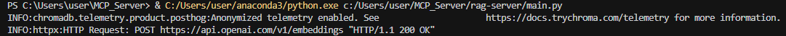

서버에 오류가 없으니 커서에서 MCP 서버를 연결해봅시다. **Open Cursor Setting > Tools & Integrations > New MCP Server**를 차례로 클릭합니다.

<p style="text-align:center;">
  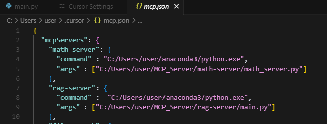
</p>

rag-server에 해당하는 내용을 자신의 환경에 맞게 설정합니다. 다시 **Open Cursor Setting > Tools & Integrations**로 이동하여 다음과 같이 초록색 상태로 등록된 것을 확인합니다.

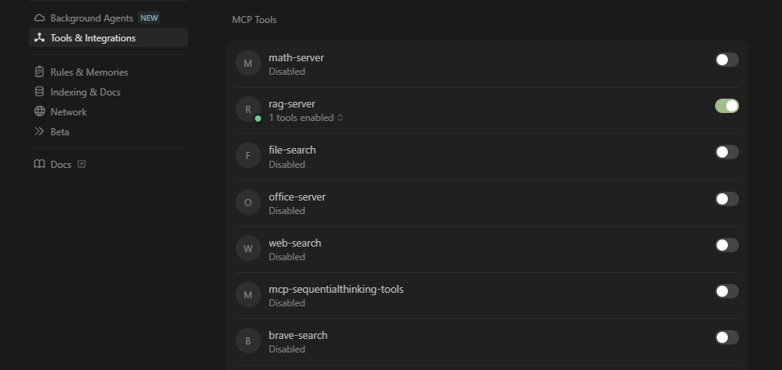

정상적으로 등록이 되었으니, PDF 파일에 대한 검색을 해보겠습니다. Toggle AI Pane을 클릭해 다음과 같은 내용을 입력합니다. **Run tool**이 활성화되는데, 해당 버튼을 클릭합니다. 참고로 **Run tool**이 활성되지 않는다면 앞에 "ask_pdf 도구를 사용해서"라는 설명을 더해주면 됩니다. 그러면 다음과 같은 결과를 보여줍니다. 

<div style="display: flex; justify-content: center; gap: 10px;">
  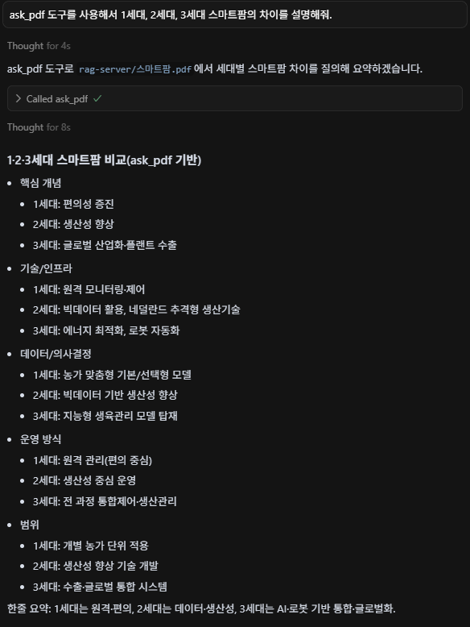
  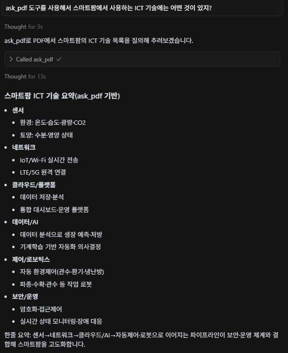
</div>

------

{: .tip}

#### web-search-server 생성하기

이번에는 웹 검색 및 요약을 위한 MCP 서버를 생성해보겠습니다. 웹 검색은 Tavily를 사용하고, 요약은 OpenAI 모델을 이용합니다. **Tavily API 키는 별도로 발급을 받아야합니다.**

```powershell
PS C:\Users\user\MCP_Server\web-search-server> pip install requests langchain-openai python-dotenv
```

- **requests**: 파이썬의 HTTP 통신 라이브러리로 API 호출, 웹 페이지 요청, 외부 서버와의 데이터 송수신에 사용됩니다.

<br>

**main.py**

```python
import os
import logging  # 프로그램 실행 중 발생하는 정보, 경고, 오류 메시지를 기록하기 위한 모듈
from dotenv import load_dotenv  # .env 파일에 저장된 환경 변수들을 파이썬 환경으로 불러오는 데 사용
import requests  # 외부 HTTP API에 요청을 보내고 응답을 처리하는 데 사용하는 HTTP 클라이언트 라이브러리
from mcp.server.fastmcp import FastMCP  # LangChain 기반 MCP 서버를 쉽게 구성할 수 있게 해주는 클래스
from langchain_openai import ChatOpenAI  # OpenAI GPT 모델을 LangChain 인터페이스로 사용하는 클래스


# .env 파일에서 환경 변수 로드
load_dotenv()

# OpenAI GPT 모델 인스턴스 초기화
# model="gpt-4"은 GPT-4 모델을 사용하겠다는 의미
llm = ChatOpenAI(model="gpt-4")

# Tavily 웹 검색 API에서 사용할 키 설정
# 환경변수에서 API 키 불러오기
TAVILY_API_KEY = os.getenv("TAVILY_API_KEY")

# MCP 서버 생성 - 서버 이름은 "WebSearch"
# 이 이름은 도구 목록 조회 시 식별자 역할을 하며, 여러 MCP 서버를 구분하는 데 사용됨
mcp = FastMCP("WebSearch")

# Tavily 웹 검색 API를 호출하는 함수 정의
# 사용자로부터 입력받은 query(검색어)를 Tavily API에 전달하고, 그 결과를 정리해서 반환
def search_web_tavily(query: str) -> str:
    url = "https://api.tavily.com/search"  # Tavily API의 엔드포인트
    headers = {"Content-Type": "application/json"}  # 요청 헤더: JSON 형식의 데이터를 전송한다는 의미
    payload = {
        "api_key": TAVILY_API_KEY,  # 사용자 인증을 위한 키
        "query": query,  # 사용자가 검색하고자 하는 키워드 또는 문장
        "search_depth": "basic",  # 검색의 깊이 설정 (basic은 빠른 검색, deep은 더 정교한 검색)
        "include_answer": True,  # Tavily가 제공하는 요약 또는 해석 포함 여부
        "max_results": 5  # 검색 결과에서 최대 몇 개를 가져올지 지정
    }

    try:
        # POST 방식으로 Tavily API 호출
        response = requests.post(url, json=payload, headers=headers)
        response.raise_for_status()  # HTTP 에러가 발생했을 경우 예외를 발생시킴

        # 응답 본문을 JSON으로 변환 후 "results" 항목 추출 (리스트 형태)
        results = response.json().get("results", [])

        # 결과가 없을 경우 사용자에게 안내
        if not results:
            return "검색 결과가 없습니다."

        # 각 결과 항목의 제목과 내용을 합쳐 하나의 문자열로 구성 (결과 여러 개를 줄 구분으로 연결)
        contents = "\n\n".join([f"{r['title']}\n{r['content']}" for r in results])
        return contents  # 완성된 검색 결과 문자열 반환

    except Exception as e:
        # 오류가 발생한 경우 로그에 에러 메시지 출력
        logging.error(f"Tavily 검색 오류: {e}")
        return "검색 중 오류가 발생했습니다."  # 사용자에게는 일반적인 오류 메시지를 반환

# MCP 도구로 등록 - GPT가 직접 호출할 수 있는 도구로 사용됨
# 외부 클라이언트(Cursor, Claude 등)에서 'web_search'라는 이름으로 호출 가능
@mcp.tool()
async def web_search(query: str) -> str:
    """웹에서 검색한 결과를 요약해 제공합니다."""  # LangChain 또는 클라이언트가 이 도구의 역할을 설명할 때 사용됨

    # 검색 요청이 들어왔음을 로그에 기록
    logging.info(f"검색 요청: {query}")

    # Tavily API를 통해 검색 실행
    content = search_web_tavily(query)

    # 검색 결과 내용을 기반으로 GPT-4가 요약문을 생성
    # ainvoke()는 비동기 GPT 호출 (LangChain에서 await를 지원)
    summary = await llm.ainvoke(f"다음 검색 결과를 한 문단으로 요약해줘:\n\n{content}")

    if hasattr(summary, 'content'):
        return summary.content
        
    return str(summary)  # 요약된 결과를 클라이언트에게 반환

# MCP 서버 실행 블록
# 이 파일이 단독 실행될 경우 MCP 서버를 stdio 방식으로 실행함
# stdio는 Cursor나 Claude Desktop에서 subprocess 방식으로 이 서버를 연결할 때 사용하는 통신 방식
if __name__ == "__main__":
    mcp.run(transport="stdio")
```

실행 후 아무런 출력 없이 멈춰 있는 상태라면, 이는 오류 없이 정상적으로 작동하고 있다는 의미입니다.

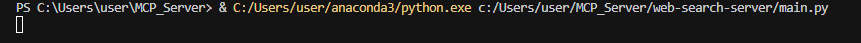

이제 MCP 서버에 연결하기 위해 **Open Cursor Setting > Tools & Integrations > New MCP Server**를 차례대로 클릭합니다.

기존에 mcp.json 파일의 내용을 다음으로 교체합니다.

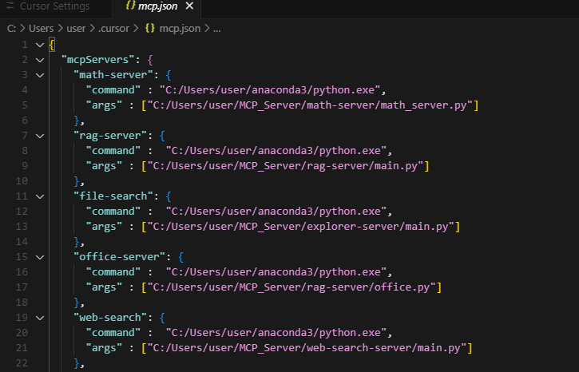

다시 **Open Cursor Setting > Tools & Integrations**로 이동하여 다음과 같이 초록색 상태로 등록된 것을 확인합니다.

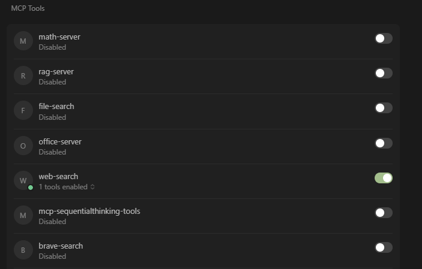

MCP 서버와 정상적으로 연결되었으니, 이제 검색 및 요약 기능을 테스트해보겠습니다. 결과는 다음과 같습니다.

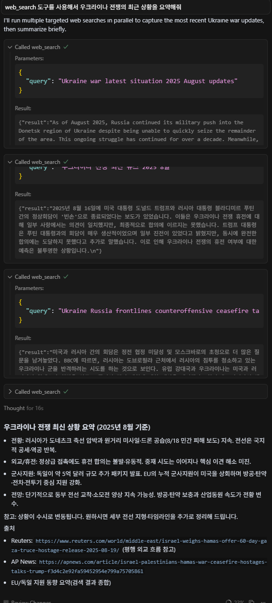

{: .important}

질문에 도구 이름을 명시하지 않을 경우 도구 사용 여부는 LLM이 판단하게 됩니다.


------

### 공개 MCP 서버 연결하기

공개 MCP 서버는 누군가가 이미 만들어둔 MCP 서버를 말하며, 스미더리를 통해 다양한 유형의 MCP 서버를 선택할 수 있습니다.

https://smithery.ai/에 접속하여 깃허브 계정으로 로그인을 진행합니다.

{: .tip}

Sequential Thinking 연결하기

Sequential Thinking은 말 그대로 사용자의 질문에 답변할 때 추론을 사용하는 것입니다.

**실습에 사용된 스미더리 URL**

```
https://smithery.ai/server/@xinzhongyouhai/mcp-sequentialthinking-tools
```

**JSON > Connect > Windows**를 선택합니다. 해당 내용을 Copy하고 **Open Cursor Setting > Tools & Integrations > New MCP Server**에 추가합니다.

<div style="display: flex; justify-content: center; gap: 10px;">
  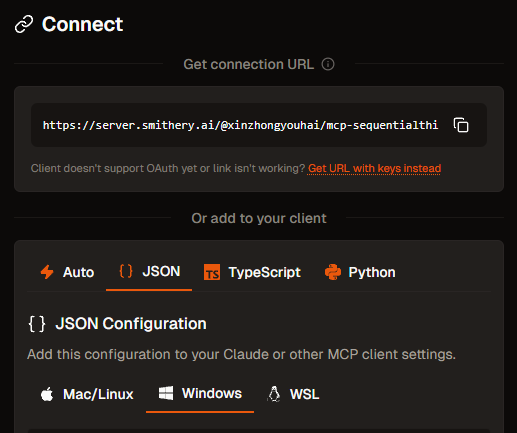
  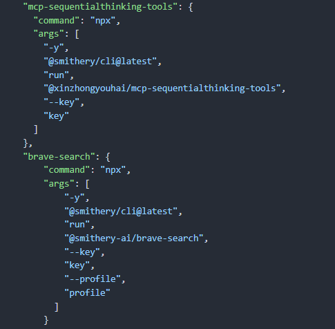
</div>

다시 **Open Cursor Setting > Tools & Integrations**로 이동하여 다음과 같이 초록색 상태로 등록된 것을 확인합니다. 정상적으로 등록이 되었다면 sequentialthinking을 테스트를 진행해봅시다.

테스트는 "sequentialthinking을 사용하여 GPT-4o와 Claude 3 중 어떤 모델이 나에게 더 적합한지 단계적으로 분석해줘"라는 질문을 입력하였습니다.

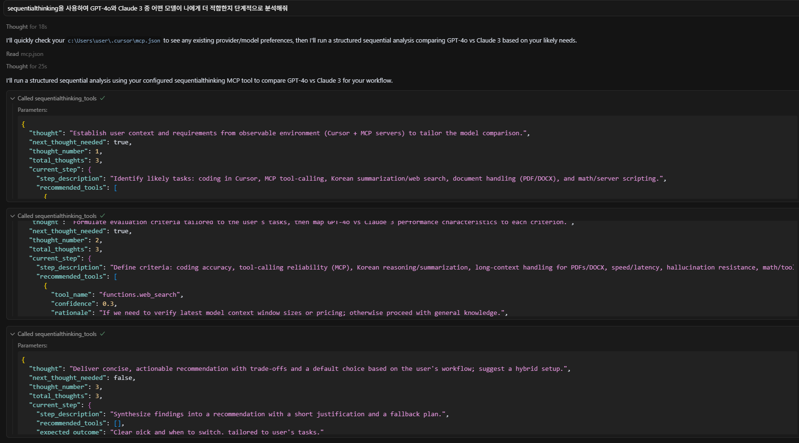

추론 과정도 단계별로 확인할 수 있습니다.

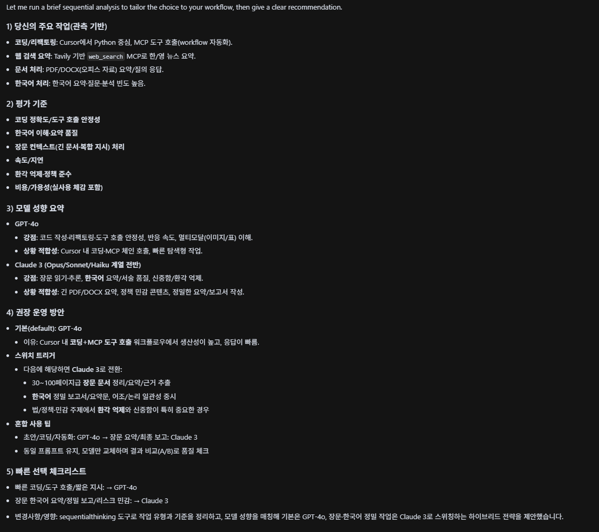

------

{: .tip}

웹 검색(Brave Search) 연결하기

이번에는 Brave라는 웹 검색 MCP 서버를 이용하는 방법에 대해 알아보겠습니다.

**실습에 사용된 스미더리 URL**

```
https://smithery.ai/server/@smithery-ai/brave-search
```

앞서 진행한 것과 같이 JSON을 선택하고 앞에서 받아두었던 Brave API 키를 입력한 후 Connect를 클릭합니다.

해당 내용을 Copy하고 **Open Cursor Setting > Tools & Integrations > New MCP Server**에 추가합니다.

이제 웹 검색을 한번 해보겠습니다. 앞서 Tavily를 이용한 검색용 MCP 서버를 연결한 상태라면, LLM에게 반드시 brave_web_search 도구를 사용하도록 명시해야 합니다.

질문은 "brave_web_search 도구를 사용해서 이스라엘-가자 분쟁에 대한 최신 뉴스를 요약해줘"라고 입력하였습니다.

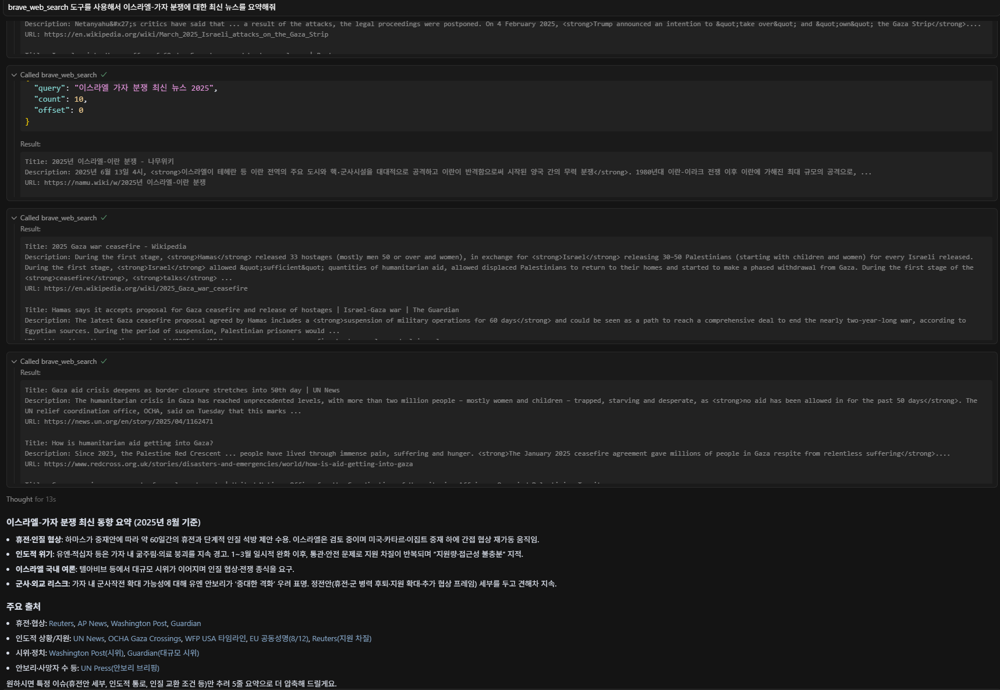

------

## 클로드 데스크톱에서 MCP 서버 만들고 연결하기

이번에는 윈도우 탐색기에서 파일을 검색하는 방법을 소개하겠습니다.

### 나만의 MCP 서버 등록하기

{: .tip}

#### 윈도우 탐색기

**explorer-claude.py**

```python
import os  # 운영체제와 상호작용하기 위한 표준 모듈로, 파일 및 디렉터리 경로 구성, 파일 탐색, 파일 정보 조회 등에 사용
import logging  # 코드 실행 중에 발생하는 정보, 경고, 오류 등의 메시지를 기록하거나 출력하는 데 사용되는 로깅 모듈
import sys  # 시스템 관련 기능을 제공하는 모듈로, 여기서는 표준 에러 출력(sys.stderr)에 디버그 메시지를 출력하는 데 사용
from datetime import datetime  # 유닉스 타임스탬프를 사람이 읽을 수 있는 날짜와 시간 형식으로 변환할 때 사용되는 모듈
from typing import List, Dict  # 함수의 입력값과 반환값에 타입 힌트를 제공하기 위한 모듈
from mcp.server.fastmcp import FastMCP  # 랭체인 기반 MCP 서버를 간단하게 구성하고, 사용자 정의 도구(tool)를 등록할 수 있는 클래스.
import asyncio  # 비동기 처리를 위한 표준 모듈

# MCP 서버 인스턴스를 생성, 서버의 이름은 "File-Search"로 설정되어 있으며,
# 이는 MCP 클라이언트에서 도구 목록을 조회하거나 호출할 때 식별자로 사용됨
mcp = FastMCP("File-Search")

# 로깅 레벨을 INFO로 설정하여, info 이상의 로그 메시지를 출력
# 이 설정을 통해 이후 logging.info(), warning(), error() 등의 메시지가 콘솔에 출력
logging.basicConfig(level=logging.INFO)

# MCP 서버가 시작되었음을 알리는 디버그 메시지를 표준 에러(stderr)로 출력
# 표준 출력(stdout)이 아닌 에러 스트림을 사용하면, 결과 출력과 디버깅 로그를 구분할 수 있어 개발 및 테스트에 유용
print("[DEBUG] MCP server starting...", file=sys.stderr)

# 파일 검색의 기준이 될 루트 경로를 설정
# 여기서는 D 드라이브 전체 대신, 사용자의 "Documents" 폴더로 범위를 제한하여
# 보안상 안전하고 검색 속도도 빠르게 할 수 있도록 구성
# 해당 경로는 본인이 검색하고자 하는 위치로 변경
ROOT_DIR = "C:/Users/user/탐색 폴더"

# 키워드가 포함된 파일을 찾는 동기 방식의 함수
# base_path 하위 폴더를 재귀적으로 순회하며, 파일명에 주어진 keyword가 포함된 파일들을 찾아 리스트로 반환
# 최대 결과 개수는 max_results로 제한되며, 기본값은 20
def search_files(keyword: str, base_path: str = ROOT_DIR, max_results: int = 20) -> List[Dict]:
    results = [] # 검색된 파일 정보를 저장할 리스트

    # os.walk()는 지정된 경로의 모든 하위 디렉터리를 포함하여 순회하며
    # 현재 경로(dirpath), 하위 디렉터리 리스트(_), 그리고 파일 리스트(filenames)를 반환
    for dirpath, _, filenames in os.walk(base_path):
        for fname in filenames:  # 해당 경로에 존재하는 모든 파일을 하나씩 확인
            if keyword.lower() in fname.lower():  # 파일명에 키워드가 포함되어 있는지 대소문자를 무시하고 검사
                fpath = os.path.abspath(os.path.join(dirpath, fname))  # 상대 경로를 절대 경로로 변환하여 전체 경로를 구성
                try:
                    stat = os.stat(fpath)  # os.stat()을 통해 파일의 메타정보(크기, 생성시간 등)를 가져옴
                    results.append({
                        "파일명": fname,
                        "경로": fpath,
                        "크기(Bytes)": stat.st_size,
                        "생성일": datetime.fromtimestamp(stat.st_ctime).strftime("%Y-%m-%d %H:%M"),
                    })  # 파일명, 경로, 크기, 생성일을 딕셔너리 형태로 정리하여 리스트에 추가

                    if len(results) >= max_results:  # 결과 개수가 지정한 최대값에 도달하면 바로 리스트를 반환
                        return results
                except Exception as e:
                    # 파일에 접근할 수 없는 경우(예: 권한 문제, 손상된 파일 등) 경고 메시지를 로그로 남기고 해당 파일은 건너뜀
                    logging.warning(f"파일 접근 오류: {fpath} - {e}")
    return results  # 전체 검색이 끝난 뒤 결과 리스트를 반환

# MCP에 등록할 도구(tool)를 정의, 랭체인 또는 Cursor, Claude 등에서 호출 가능한 외부 호출형 
@mcp.tool()
async def find_file(keyword: str) -> str:
    """Documents 폴더에서 키워드에 해당하는 파일을 검색합니다."""  # 도구 설명으로, 사용자 인터페이스나 로그에 표시

    logging.info(f"'{keyword}' 키워드로 파일 검색 시작")  # 검색 시작 로그를 출력

    loop = asyncio.get_event_loop()  # 현재 실행 중인 이벤트 루프를 가져옴
    found = await loop.run_in_executor(None, search_files, keyword)  # search_files 함수는 동기 함수이므로, run_in_executor를 사용해 별도 스레드에서 실행

    if not found:  # 검색 결과가 비어 있다면
        return f"'{keyword}'에 해당하는 파일을 찾을 수 없습니다."  # 사용자에게 파일이 없음을 알리는 메시지를 반환

    # 검색된 파일 리스트를 문자열로 변환
    # 각 항목은 파일명, 파일 크기, 경로를 포함하며 보기 좋게 줄바꿈하여 구성
    return "\n".join([f"{f['파일명']} ({f['크기(Bytes)']} Bytes) - {f['경로']}" for f in found])

# 이 Python 파일이 직접 실행되는 경우에만 MCP 서버를 실행
# transport="stdio"는 MCP 서버와 클라이언트(Cursor, Claude 등)가 표준 입력/출력을 통해 통신할 수 있도록 설정하는 방식
if __name__ == "__main__":
    asyncio.run(mcp.run(transport="stdio"))  # MCP 서버를 비동기적으로 실행

```

커서에서 사용했던 코드와 가장 큰 차이점은 다음과 같습니다. 예를 들어 커서에서의 코드는 다음과 같았죠?

```python
if __name__ == "__main__":
    mcp.run(transport="stdio")
```

하지만 클로드 데스크톱에서는 다음과 같이 사용합니다.

```python
if __name__ == "__main__":
    asyncio.run(mcp.run(transport="stdio"))
```

explorer-claude.py를 C:\Users\user\AppData\Local\AnthropicClaude\app-0.12.55으로 복사해주세요. 참고로 해당 경로는 클로드 데스크톱이 설치된 경로입니다.

이제 클로드 데스크톱에서 연결을 설정하겠습니다. 먼저 클로드 데스크톱을 실행한 후 메뉴에서 **파일 > 설정**을 차례대로 클릭합니다. 이후 **개발자 > 설정 편집**을 클릭합니다.

claude_desktop_config.json을 에디터로 열어 다음과 같이 수정합니다.

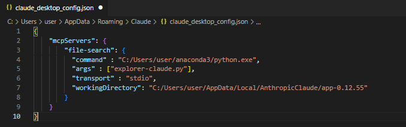

클로드 데스크톱은 창을 닫아도 백그라운드에서 계속 실행되기에 작업 관리자를 열어 작업을 끝내고 다시 클로드 데스크톱을 실행합니다. **파일 > 설정 > 개발자 > file-search**에서 running 상태이면 정상적으로 동작하고 있는 것입니다.

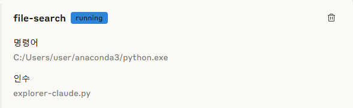

MCP 서버가 정상적으로 실행되면, 다음 화면 처럼 **검색 및 도구** 메뉴를 클릭했을 때 사용 가능한 도구 목록이 표시됩니다.

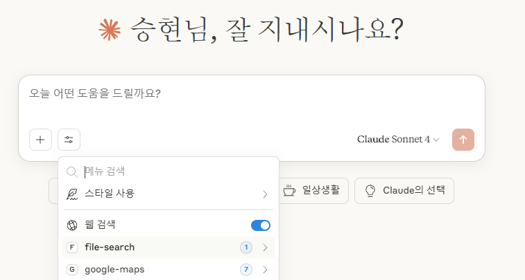

이제 검색할 파일을 입력한 후 Enter를 누르면 결과를 확인할 수 있습니다.

------

### 공개 MCP 서버 연결하기

이번에는 공개 MCP 서버를 사용하는 방법입니다. 구글 지도에 대해 알아보겠습니다.

{: .tip}

구글 지도에 연결하기

스미더리에 접속하여 google maps를 검색합니다. JSON을 선택하고 앞에서 받았던 Google Maps API 키를 입력한 후 Connect를 클릭합니다. 

**Windows**를 선택한 후 Copy한 후 **파일 > 설정 > 개발자 > 설정 편집** 메뉴를 통해 claude_desktop_config.json을 수정합니다.

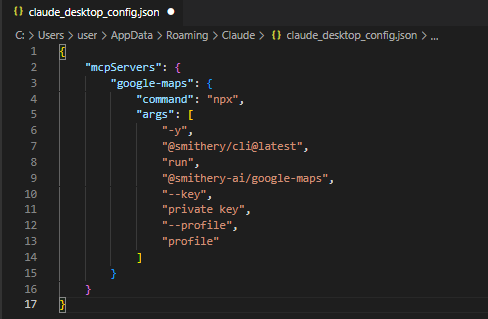

MCP 서버가 정상적으로 실행되면, 다음 화면 처럼 **검색 및 도구** 메뉴를 클릭했을 때 사용 가능한 도구 목록에 **google-maps**가 표시됩니다. 사용 가능한 도구가 7개인 걸  확인할 수 있습니다.

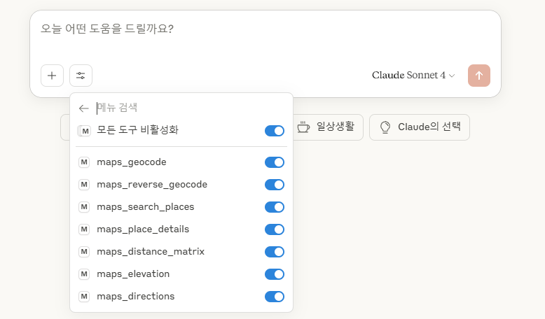

다음과 같이 질문해 봅시다.

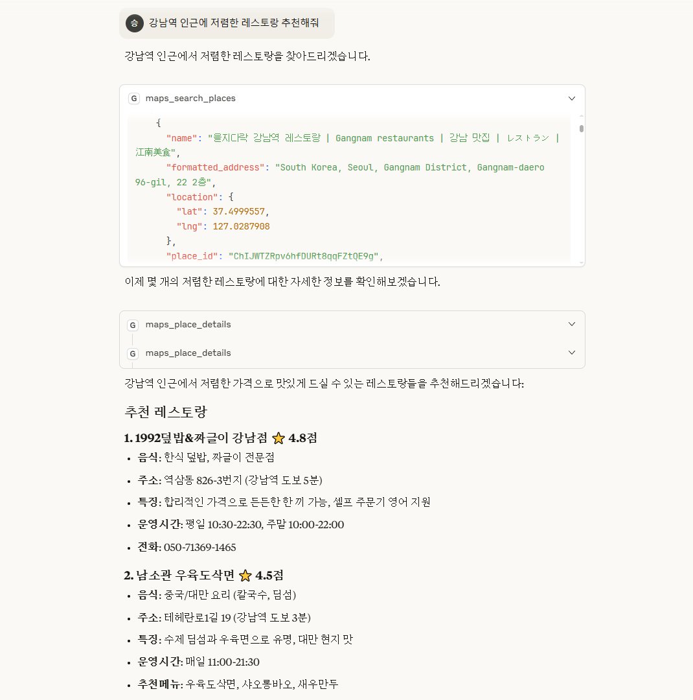

maps_search-places 도구를 사용하여 얻은 결과입니다.
