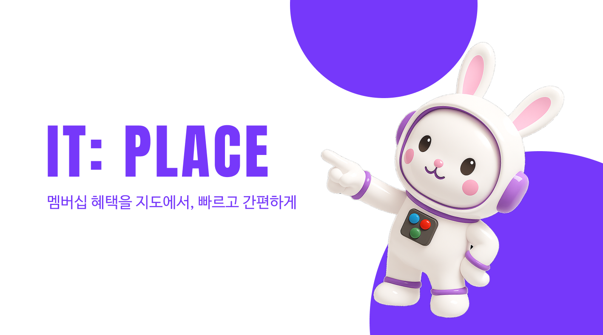

### Protecting your digital life

In an era where data is currency, security is paramount. From personal information to national secrets, the need to protect digital assets has never been greater. Cybersecurity encompasses a range of practices, technologies, and strategies designed to defend against threats in an increasingly connected world. Threats like phishing, malware, and ransomware exploit human vulnerabilities as much as technical flaws.

{: .note }
Useful information that users should know, even when skimming content.

Two-factor authentication (2FA) adds an extra layer of security, requiring a second verification step. This could be a code sent to your phone, a fingerprint scan, or a physical security key. Enable 2FA on critical accounts like email, banking, and social media, as it significantly reduces the risk of unauthorized access.


*Photo by [Cayetano Gros](https://www.lummi.ai/creator/cayetanogros) on [Lummi](https://www.lummi.ai/)*

Understanding phishing is another crucial aspect of cybersecurity. Phishing scams are designed to trick you into revealing personal information by impersonating trusted entities. Be cautious of unsolicited emails or messages that ask for sensitive information, and always double-check URLs to ensure you're on a legitimate site.

> Firewalls, encryption, and multi-factor authentication are just a few tools used to protect sensitive data.

Public Wi-Fi networks are convenient but often insecure. If you need to access the internet in public spaces, use a VPN (Virtual Private Network) to encrypt your connection and hide your IP address. VPNs protect you from potential eavesdropping, ensuring your data remains private even on untrusted networks.

<div class="gallery-box">
  <div class="gallery gallery-columns-2">
    
    
  </div>
  <p>A gallery of stunning shots</p>
</div>

Regular software updates are essential for cybersecurity. Hackers often exploit vulnerabilities in outdated software, so keeping your applications and operating system up to date ensures you’re protected against known threats. Enable automatic updates wherever possible to ensure you’re always protected.

### Technology plays a significant role in security

Ethical hacking and penetration testing highlight the importance of proactive measures. By identifying and addressing vulnerabilities before malicious actors can exploit them, security professionals help build robust defenses.

However, security is a shared responsibility. Developers must write secure code, users must follow best practices, and organizations must invest in comprehensive cybersecurity strategies. Together, these efforts create a safer digital landscape.

{: .tip }
Understanding phishing is another crucial aspect of cybersecurity

The human factor remains a critical aspect of security. Social engineering attacks often target emotions and trust rather than technical systems. This underscores the need for training and awareness campaigns to build a culture of security.

```js
  $('.top').click(function () {
    $('html, body').stop().animate({ scrollTop: 0 }, 'slow', 'swing');
  });
  $(window).scroll(function () {
    if ($(this).scrollTop() > $(window).height()) {
      $('.top').addClass("top-active");
    } else {
      $('.top').removeClass("top-active");
    };
  });
```

Security also intersects with privacy. Protecting user data requires not just strong defenses but also ethical considerations. Transparency in data handling and compliance with regulations like GDPR are essential components of modern cybersecurity. As technology evolves, so do threats. From AI-driven attacks to quantum computing challenges, the field of security is dynamic and ever-changing. Staying informed and adaptive is the key to staying protected.