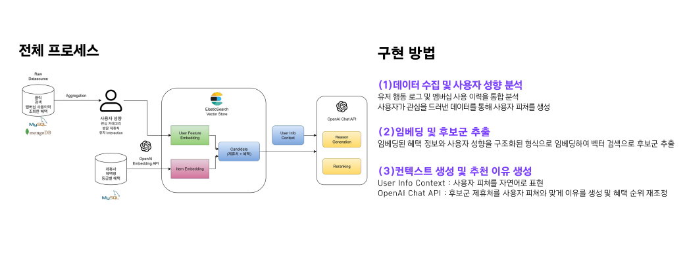
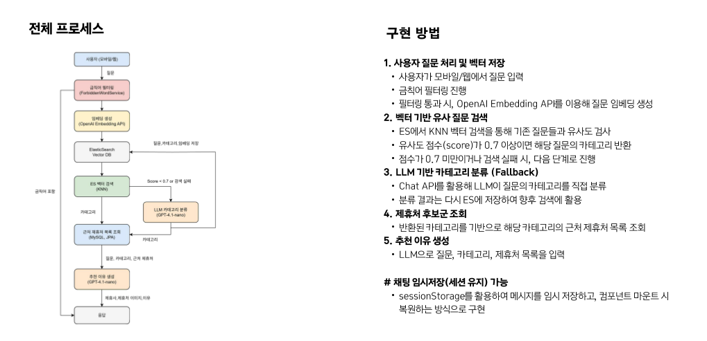

## LG 유플러스 유레카 융합프로젝트


### 팁 협업 및 배포 링크

{: .important}

**프로젝트와 관련된 협업 문서, 디자인 시안, 배포된 서비스는 아래 링크를 통해 확인할 수 있습니다.**

[](https://www.notion.so/6-222ca47e589c801c9f3ede0902f3fa36?source=copy_link)[](https://www.figma.com/design/rE9IRJ0U0UsMTxlrCjXSJn/ItPlace?node-id=2152-9464&t=I2va1vEw3L3krkwp-1)[](https://www.itplace.click/)

[**Notion**](https://www.notion.so/6-222ca47e589c801c9f3ede0902f3fa36?source=copy_link)[  ](https://www.notion.so/6-222ca47e589c801c9f3ede0902f3fa36?source=copy_link)[: 프로젝트 기획안, 회의, 일정 등 모든 협업 기록 문서가 정리되어 있는 공간입니다.](https://www.notion.so/6-222ca47e589c801c9f3ede0902f3fa36?source=copy_link)

[**Figma**](https://www.figma.com/design/rE9IRJ0U0UsMTxlrCjXSJn/ItPlace?node-id=38-3&t=cXggngggSEHTEydN-1)[  : It Place의 와이어프레임, 디자인 시안, 프로토타입이 정리되어 있습니다.](https://www.figma.com/design/rE9IRJ0U0UsMTxlrCjXSJn/ItPlace?node-id=38-3&t=cXggngggSEHTEydN-1)

[**발표자료**](https://www.canva.com/design/DAGu0Z7UfSQ/mnmqGLz8YHmUcCQHYcLEMA/edit?utm_content=DAGu0Z7UfSQ&utm_campaign=designshare&utm_medium=link2&utm_source=sharebutton)[ :](https://www.canva.com/design/DAGu0Z7UfSQ/mnmqGLz8YHmUcCQHYcLEMA/edit?utm_content=DAGu0Z7UfSQ&utm_campaign=designshare&utm_medium=link2&utm_source=sharebutton)[ 수행 절차, 아키텍처, 트러블슈팅 등 프로젝트의 모든 과정이 문서화된 프레젠테이션입니다.](https://www.canva.com/design/DAGu0Z7UfSQ/mnmqGLz8YHmUcCQHYcLEMA/edit?utm_content=DAGu0Z7UfSQ&utm_campaign=designshare&utm_medium=link2&utm_source=sharebutton)

[**메인 서비스**](https://www.itplace.click/)[ : 실제 사용자들이 이용할 수 있는 It Place의 배포된 웹사이트입니다.](https://www.itplace.click/)

[**관리자 페이지**](https://admin.itplace.click/)[ : 제휴처 정보, 사용자 통계 등 관리자 기능을 사용할 수 있는 전용 페이지입니다.](https://admin.itplace.click/)

------

### 서비스 소개

**It Place: 잇플레이스**는 LG U+ 멤버십 이용자들이 전국 제휴처를 **지도 기반**으로 탐색하고, 혜택을 **간편하게 확인**하며, **개인 맞춤형 혜택 추천**을 받을 수 있는 지도 기반 혜택 안내 플랫폼입니다.

------

### 기획 배경 & 목적

- **문제**: 많은 사용자가 통신사 멤버십 혜택을 놓치고 있음
- **해결**: 위치 기반 지도 탐색 + AI 추천 시스템으로 혜택 접근성 향상
- **효과**: 사용자는 더 쉽게 혜택을 누리고, 기업은 더 나은 마케팅 지원 가능

------

### 주요 기능

유플러스 회원정보 연동 기능의 경우, 실제 데이터를 가져올 수는 없어 mockData로 유플러스 회원 DB에 있는 회원만 가능한 기능입니다.

**1️⃣ 회원가입 & 로그인**

```
- 일반 회원가입 및 소셜 로그인 지원
- LG U+ 멤버십 연동 시 기본 정보 자동 불러오기 (가상의 U+ 멤버십 정보 활용)
- 번호 인증, 이메일 인증, reCAPTCHA를 통한 보안 강화
- 개인정보 수정 및 회원 탈퇴 기능 제공
```

**2️⃣ 지도 및 위치 기반 시스템**

```
- Kakao Map API를 활용한 제휴처 마커 표시
- 로드뷰 지원으로 실제 위치 확인 가능
- GPS 기반 현재 위치 탐색 및 반경 내 검색
- 거리순 정렬, 카테고리별 필터링 기능
- 사용자 데이터를 활용한 AI 기반 혜택 추천
- 사용자 지정 위치로 재검색 가능
- 혜택 사용 버튼 및 거리 제한 조건으로 무분별한 사용 방지
- 제휴처 홈페이지 외부 링크 이동 기능 지원
```

**3️⃣ 혜택 및 제휴처 정보 제공**

```
- 제휴처 위치 및 혜택에 대한 상세 정보 제공
- 멤버십 등급별 혜택 정보 표시
- 즐겨찾기 기능으로 원하는 혜택 저장
- 사용자 검색 로그 기록 저장
- 혜택 사용 이력 및 누적 혜택 금액 조회 가능
- 제휴처 홈페이지 리다이렉트 기능 제공
```

**4️⃣ AI 추천 & 질문 서비스**

```
- 멤버십 혜택 이력 & 사용자 행동 로그를 반영한 개인 맞춤 추천
- 사용자 질문 의도에 맞는 AI 제휴처 정보 제공
- 금칙어 필터링
- 로그를 활용한 추천 콜드 스타트 완화
```

**5️⃣ 관리자 대시보드 & 통계 관리**

```
- 직관적인 대시보드로 서비스 현황 Overview 제공
- 제휴처별: 이용 통계, 관심도 통계, 클릭 수 통계, 검색 순위 통계
- 제휴처 정보 조회 및 수정 기능
- 회원 정보 조회 기능 지원
```

**5️⃣ 이벤트 페이지 & 프로모션 기능**

```
- 지도 내 이벤트 지점을 통한 혜택 사용 유도
- 스크래치 카드 기반 이벤트 기능 제공
- 로그인 여부 및 보유 쿠폰 수에 따라 긁기 제한 제어
```


------

### 담당 역할

{: .q-left}

> AI 추천 & 질문 서비스




