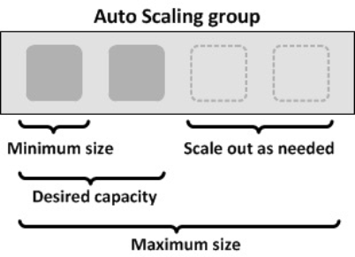
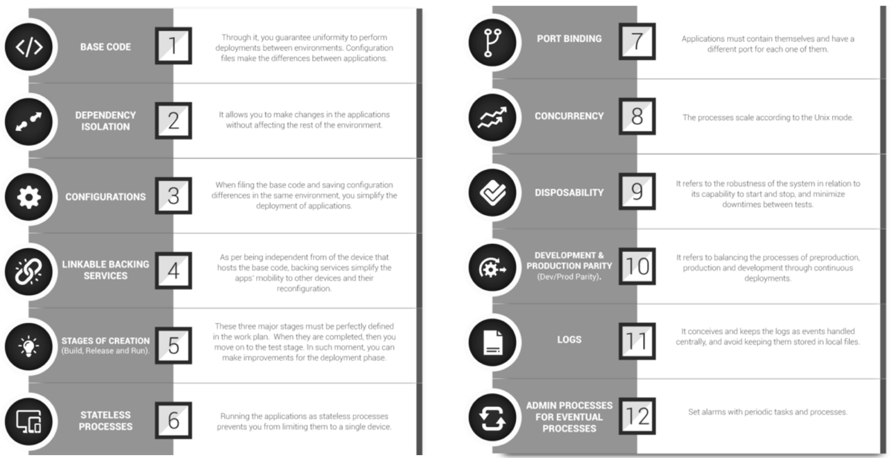
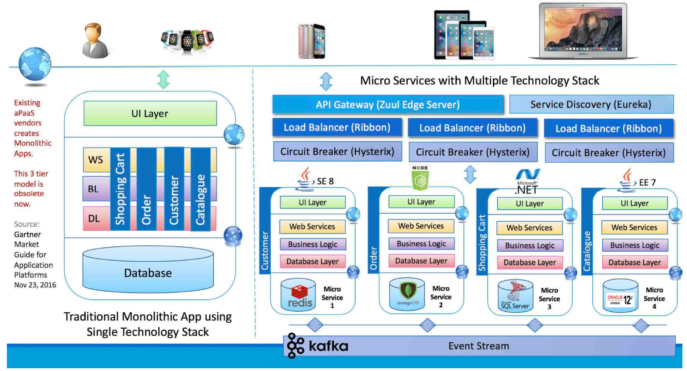
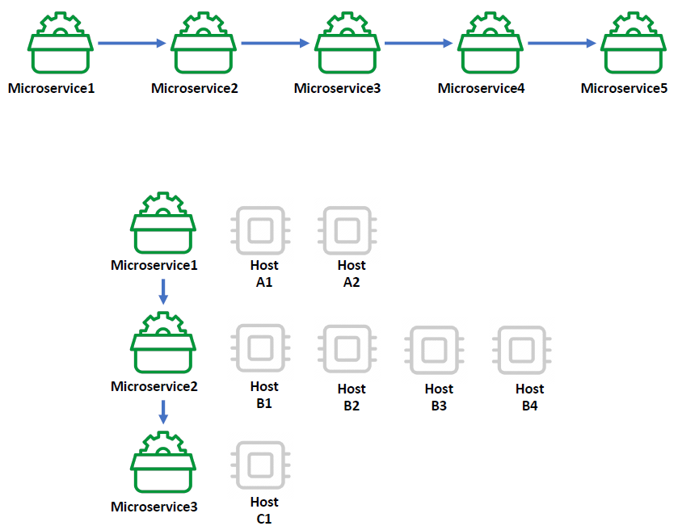
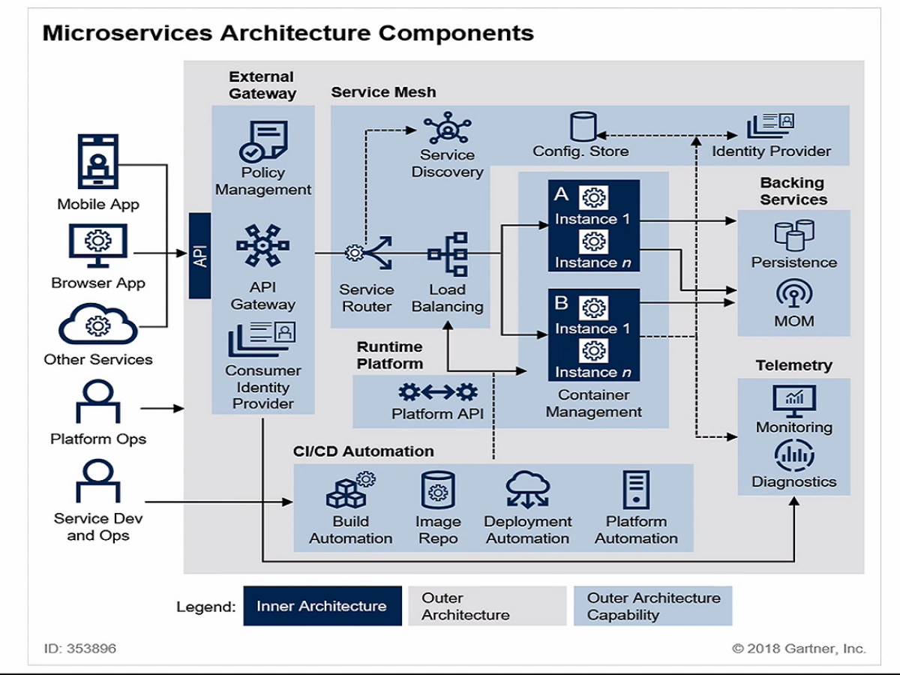
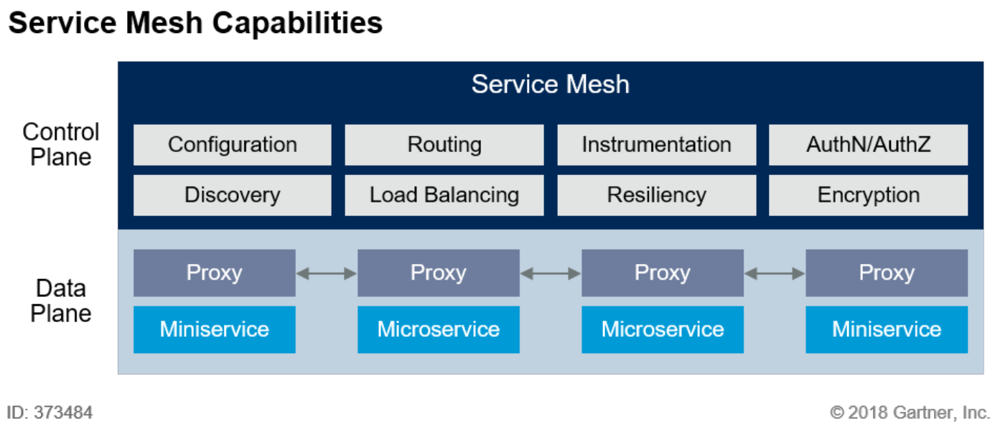
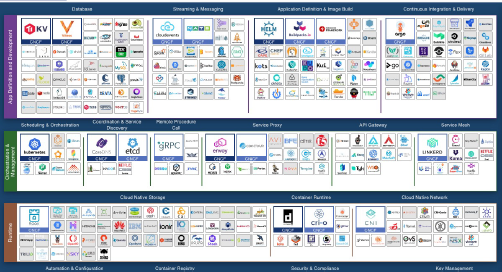
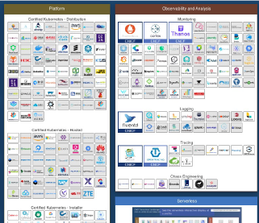
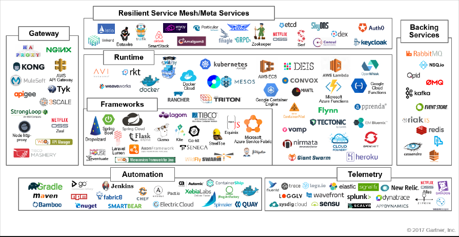

## Software Architecture

 **Antifragile**

- **Auto scaling** : 리소스 사용량이나 조건에 따라 인스턴스나 리소스를 자동으로 확장/축소할 수 있는 개념

  

- **Microservices** : 전체 서비스들을 구축하고 있는 개별적인 모듈이나 기능을 독립적으로 개발하고 배포하고 운영할 수 있도록 세분화된 서비스

- **Chaos engineering** : 변동, 예견된 불확실성, 예견되지 않는 불확실성, 카오스 불확실성에서도 안정적인 서비스를 유지

![[Spring Cloud로 개발하는 마이크로서비스 애플리케이션] 1. Microservice 소개 - Antifragile](../images/2025-08-23-MSA/img-1755926843778-9.png)

- **Continuous Deployments**: 지속적인 통합과 지속적인 배포환경 구성

![[Spring Cloud로 개발하는 마이크로서비스 애플리케이션] 1. Microservice 소개 - Antifragile](../images/2025-08-23-MSA/img-1755926935211-12.png)

------

## Cloud Native Architecture

- **확장 가능한 아키텍처**
  - 시스템의 수평적 확장에 유연
  - 확장된 서버로 시스템의 부하 분산 및 가용성 보장
  - 시스템 또는 서비스  애플리케이션 단위의 패키지 (컨테이너 기반 패키지)
  - 모니터링
- **탄력적 아키텍처**
  - 서비스 생성 - 통합 - 배포, 비즈니스 환경 변화에 대응 시간 단축
  - 분할된 서비스 구조
  - 무상태 통신 프로토콜
  - 서비스의 추가와 삭제 자동 감지
  - 변경된 서비스 요청에 따라 사용자 요청 처리 (동적 처리)
- **장애 격리**
  - 특정 서비스에 오류가 발생해도 다른 서비스에 영향을 주지 않습니다.

------

## Cloud Native Application

**Cloud Native Architecture** 에 의해 설계되고 구현되는 Application

![[Spring Cloud로 개발하는 마이크로서비스 애플리케이션] 1. Microservice 소개 - 2. Cloud Native Application](../images/2025-08-23-MSA/img-1755927366905-15.png)

------

### CI/CD

- **지속적인 통합**, CI(Continuous Integration)
  - 통합 서버, 소스 관리(scm), 빌드 도구, 테스트 도구
  - ex) Jenkins, Team CI, Travis CI
- **지속적 배포**
  - Continuous Delivery
  - Continous Deployment

![[Spring Cloud로 개발하는 마이크로서비스 애플리케이션] 1. Microservice 소개 - 2. Cloud Native Application - CI/CD](../images/2025-08-23-MSA/img-1755927650444-18.png)

- **카나리 배포와 블루그린 배포**

![[Spring Cloud로 개발하는 마이크로서비스 애플리케이션] 1. Microservice 소개 - 2. Cloud Native Application - CI/CD](../images/2025-08-23-MSA/img-1755927688146-21.png)

------

### DevOps

자주 테스트하고, 피드백 받고, 업데이트하는 과정을 거쳐 전체 개발 일정이 완료될 때까지 지속적으로 끊임없이 진행해가는 것

**Cloud Native Application**은 데브옵스 환경에 맞춰서 서비스의 구조를 작은 단위로 분할할 수 있게 함으로써 통합, 테스트, 배포를 자주할 수 있는 구조가 될 수 있습니다.

![[Spring Cloud로 개발하는 마이크로서비스 애플리케이션] 1. Microservice 소개 - 2. Cloud Native Application - DevOps](../images/2025-08-23-MSA/img-1755928016266-24.png)

------

### Container 가상화

공통적인 라이브러리나 리소스를 공유해서 사용하므로 각자 필요한 부분에 대해서만 독립적인 영역에 실행할 수 있는 구조.

하드웨어 가상화보다 더 적은 리소스를 사용한다. 컨테이너 가상화 위에서 작동되는 서비스들은 가볍고 빠르게 운영할 수 있습니다.

![[Spring Cloud로 개발하는 마이크로서비스 애플리케이션] 1. Microservice 소개 - 2. Cloud Native Application - Container 가상화](../images/2025-08-23-MSA/img-1755928168052-27.png)

------

## 12 Factors

Heroku에서 제시한 12가지 항목

**Cloud Native Application**을 개발하거나 서비스를 운영할 때 고려해야되는 항목을 정리

- **코드 통합** : 형상 관리를 위해 코드를 한 곳에서 배포하는 것이 주 목적
  - Base Code는 VCS(Version Control System)을 사용해 변화를 추적하고 코드를 저장하는 저장소를 의미
  - Code Base가 여러개인 경우 분산 시스템으로 간주하고, 각각 코드 베이스별로 앱으로서 12 Factors를 따릅다.

- **종속성 배제** : 각 Microservice는 자체 종속성을 가지고 패키징 되며 전체 시스템에 영향을 주지않는 형태에서 변경되어야 합니다
  - 대부분의 Java 프로젝트에서는 Gradle이나 Maven을 이용해서 의존성을 관리할 수 있습니다.
  - 게다가, Spring Boot의 경우에는 내장 톰캣이나 jetty를 임베딩해 배포까지 가능합니다.
  - 애플리케이션이 필요로 하는 라이브러리를 dependency manifest 파일에 (Gemfile, POM 등) 명시적으로 선언하여 사용합니다.
  - Spring Boot의 경우 embedded runtime, external runtime에 따라 dependency를 명시적으로 선언할 수 있습니다. 배포 방식은 jar or war
- **환경설정의 외부 관리** : 코드의 외부에서 관리 도구를 통해 Micro Service에 필요한 작업들을 구성할 수 있어야합니다
  - 모든 설정 정보는 코드로부터 분리된 공간에 저장되어야하고, 런타임에서 코드에 의해 읽혀야 합니다.
  - ex) 데이터베이스 접속 정보, OAuth 또는 외부 서비스 인증 정보

- **백업 서비스의 분리** : 응용 프로그램 자체에서 필요한 백업 서비스를 분리하게 됨으로써 서로 상호가능한 서비스 자체를 종속성 없는 상태에서 작업 가능합니다
  - DB, 메시지 큐, SMTP 서비스, 캐시 시스템 등 네트워크를 통해 이용하는 모든 서비스를 의미
- **개발 환경과 테스트 운영 환경의 분리** : 빌드, 릴리즈, 실행 환경을 분리
- **상태 관리** : 프로세스 각각의 Micro Service들은 실행되는 서비스와 분리된 채, 프로세스에서 운영가능해야 합니다
- **포트 바인딩** : 다른 Micro Service와 격리를 위해 각각의 Micro Service는 자체 포트에서 노출되는 인터페이스 및 자체에 포함되는 기능이 있어야 합니다
  - 애플리케이션을 다른 애플리케이션에서 런타임 인젝션이 아닌 HTTP 서비스로 접근할 수 있도록 포트 바인딩합니다.
- **동시성** : 하나의 서비스가 여러가지 인스턴스에 동일한 형태로 복사되면서 운영됨으로써 부하 분산이 가능
- **서비스의 올바른 상태 유지** : 서비스의 인스턴스 자체가 삭제가 가능하며 확장성을 높이고 정상적으로 종료 될 수 있는 환경이 되어야 합니다
- **개발과 production단계 구분** : 환경 자체를 최대한 다른 쪽에 있는 작업과 중복되지 않는 상태로서 서비스를 유지할 수 있어야 합니다.
- **Log의 분리** : Log를 출력시키는 Logic은 기존에 있었던 Application Logic과 분리되어서 Application 자체가 실행되지 않는 상태라 해도 Logging만은 정상적으로 작동해야 합니다.
- **관리 프로세스** : 현재 운영되고 있는 모든 Micro Service들이 어떤 상태이며 어떤 리소스로 구성되어있는지 파악하기 위해 관리 도구가 필요합니다.

**Pivotal 추가 항목**

- **API first**
  - 가지고 있는 모든 서비스들은 API 형태로 제공되어야 합니다
  - API를 구축함에 있어서 사용자 측에서 어떠한 형태로 쓸 것인가 먼저 고민해서 개발해야 됩니다.
- **Telemetry**
  - 모든 지표는 수치화, 시각화돼서 관리되어야 합니다.
- **Authentication and authorization** : API를 사용함에 있어서 인증작업은 필수입니다.

------

## Monolithic vs MicroService

### Monolithic Architecture

Application을 개발함에 있어 모든 요소들을 하나의 거대한 software안에서 전부 포함시켜 개발하는 방법

따라서 Application을 구성하는 서비스들 간 의존성을 가지며, 즉 시스템 일부만 수정을 하여도 전체 시스템을 다시 패키징하고 빌드-테스트-배포 해야하는 과정을 거쳐야 합니다.

![[Spring Cloud로 개발하는 마이크로서비스 애플리케이션] 1. Microservice 소개 - 4. Monolithic vs Microservice - Monolith Architecture](../images/2025-08-23-MSA/img-1755930506450-35.png)

### MicroService Architecture

MSA는 Micro Service Architecture의 약자로 **작은 규모의 여러 비즈니스 서비스를 묶어 하나의 어플리케이션을 제공**하고 배포하는 설계 구조입니다. MSA는 각각의 서비스별로 다른 개발언어와 데이터베이스를 사용할 수 있으며 컨테이너 기반으로 관리됩니다. 이러한 작업을 하기 위하여 MSA는 Cloud Native 기반의 환경으로 구축하게 되며 **Docker 컨테이너(Container)를 생성하여 각각의 서비스를 운영**하게 됩니다.

### Monolith vs Front & Back vs MicroService Architecture

![[Spring Cloud로 개발하는 마이크로서비스 애플리케이션] 1. Microservice 소개 - 4. Monolithic vs Microservice - Monolith vs Front & Back vs Microservice Architecture](../images/2025-08-23-MSA/img-1755930783051-38.png)

{: .tip}

Front & Back 구조란?

Front & Back 설계 방식은 기존 Monolithic 방식과는 다르게 **프론트와 백엔드를 나누는 방식**입니다. 프론트와 백엔드를 나눔으로써 별도의 독립된 API 서버를 가지게 되어 기존에는 생각할 수 없었던 오픈 API를 제공할 수 있는 구조가 되었습니다. 이러한 API 서버를 독립된 비즈니스 서비스별로 쪼개어 관리하는것이 MSA의 유래가 되었습니다.

{: .important}

MSA를 왜 사용해야 하는가?

하나의 어플리케이션으로 모든 것을 관리하는 Monolithic 방식이 훨씬 간편하고 관리하기 쉬울텐데 구현이 어려워 보이는 MSA 방식을 왜 사용하여야 하는지 의문이 들게 될 것입니다. 그러한 이유 중 하나로 **MSA는 클라우드 기반 어플리케이션(Cloud Nature Application)에 가장 적합**하기 때문입니다.

------

## MicroService의 특징

1. **Challenges** : 개발 방식 및 패러다임을 상당히 바꾸어야 합니다.
2. **Small Well chosen Deployable Units** : 독립적으로 개발 가능한 형태의 작은 서비스
3. **Bounded Context** : 각각의 서비스들은 애플리케이션을 구성하고 있는 전체 도메인의 지식에 따라 서비스 경계를 잘 구분 해야 경계로 인해 하나의 서비스가 여러개되어 단일화 될 수 있습니다.
4. **Restful** : 상태에 대해서 REST Api로 통신 json포맷 이용 서버의 리소스 및 상태 표시에 최적화
5. **Configuration management** : 마이크로 서비스들이 갖고 있는 설정 및 환경 정보는 코드 내에 갖고 있지 않고 외부에 시스템을 통해 관리
6. **Cloud enabled** : 클라우드 네이티브 기술을 최대한 활용
7.  **Dynamic scale up and down**
8. **CI/CD**
9. **Visibility**

{: .note}

무조건 Micro Service Application만 만들어야 할까요?

처한 환경 및 기존 Application에서 MSA로 전환 혹은 Application개발 시,생기는 이익에 대하여 생각을 해야 합니다.

- **Multiple Rates of Change(다양한 변화율)**: 변화로 인해 생기는 이익이 어느 정도 이상이 되어야 Micro Service Application으로 전환을 할 것인지 봐야합니다.
- **Independent Life Cycles(독립 라이프 사이클)** : Application을 구성하고 있는 각각의 서비스들이 독립적으로 개발되고 운영될 수 있도록 서비스 경계가 잘 만들어져 있는가?
- **Independent Scalability(독립적인 확장성)** : 유지 보수 및 확장성에 대처가 가능한지 확인
- **Isolated Failure(격리된 오류)** : 오류를 격리시킬 수 있는지 오류가 독립적인지
- **Simplify Interactions with External Dependencies(외부 종속성과 상호 작용을 단순화)** : 서비스간의 종속성을 최소화하고 응집력을 높일 수 있도록 서비스 경계가 잘 구분되어 있는 가를 고려해야 합니다.
- **Polyglot Technology(다국어 기술)**: 여러가지 프로그래밍 언어,스토리지 기술을 지원 할 수 있는지 확인합니다.

------

## MSA 표준 구성요소

넷플릭스, 아마존, 트위터, 나이키 등에서 채택한 아키텍처로서 소개되면서 주목을 받았으며, 지금가지도 널리 다른 서비스들에서 참조되고 있는 아키텍처입니다.

MSA에서는 이런 아키텍처 구조를 가지기 위하여 **External Gateway**, **CI/CD Automation**, **Service Mesh** 구성 환경을 가지게 됩니다.

**동작 방식**

MSA는 독립된 서비스를 제공하기 위하여 REST API를 사용하는데 각각의 독립된 서비스를 REST API 인터페이스로 제공함으로써 클라이언트 단말 화면에서 접근할 수 있도록 합니다. 동작 순서는 다음과 같습니다.

1. 단말(APP)에서 요청하여 단말 요청 정보를 통합 관리해주는 API 게이트웨이를 호출합니다.
2. API 게이트웨이는 Service Router로 전달하고 Service Router는 Service Discovery에 해당 서비스 요청에 매칭되는 컨테이너 인스턴스가 있는지 확인합니다.
3. 요청에 맞는 서비스 정보가 있을 경우 로드 밸런싱을 통해 실제로 호출되는 각 컨테이너 서비스를 호출합니다.

정상적인 동작을 위해서는 위와 같은 과정이 필요하며 많은 기술이 요구 됩니다.

이러한 구조를 독립적으로 제공하는 프레임워크로는 **스프링 클라우드**가 있습니다.

### Service Mesh Capabilities

MSA 인프라 -> 미들웨어

- 프록시 역할, 인증, 권한 부여, 암호화, 서비스 검색, 요청 라우팅, 로드 밸런싱
- 자가 치유 복구 서비스

서비스간의 통신과 관련된 기능을 자동화

**Service Mesh** : 마이크로 서비스 아키텍처를 적용한 시스템 내부 통신

- 서비스간의 통신을 추상화하고 안전하고 빠르고 신뢰성있게 만들어주는 인프라 스트럭쳐의 레이어
- 복잡한 내부 네트워크를 제어하고 추적하고 내부 네트워크에 관련된 로직을 추가함으로써 **안정성, 신뢰성, 탄력성, 표준성, 가시성, 보안성** 등을 확보활 수 있게 됩니다.

서비스 메시의 구체적인 경량화 Proxy를 통해서 다양한 라우팅 기능이나 서킷브레이커와 같은 공통 기능을 설정할 수 있습니다

서비스간의 통신에 연관된 기능뿐만 아니라 서비스 배포 전략에도 도움을 줄 수가 있습니다

아래와 같은 서비스들을 통해서 안정적이고 효율적으로 마이크로서비스의 개발과 운영을 지원하고 있습니다

1. **Configuration(설정정보)**
2. **Routing(라우팅)**
3. **Instrumentation(수단)**
4. **AuthN/AuthZ(인증관련정보)**
5. **Discovery(서비스검색)**
6. **Load Balancing(로드밸런싱)**
7. **Resiliency(탄력성)**
8. **Encryption(암호화)**

------

### CNCF (Cloud Native Computing Foundation)

[https://landscape.cncf.io](https://landscape.cncf.io/)

**Cloud Native** 를 구축함에 있어서 상호연관될 수 있는 서비스들이 어떤 것들이 있는지 표시하고 있습니다.

  
  

------

### MSA 기반 기술

