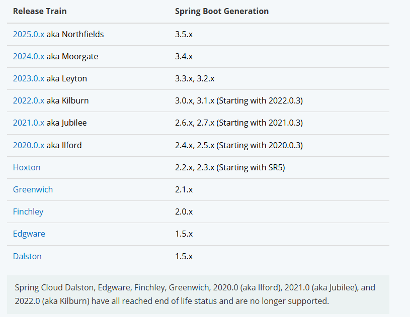
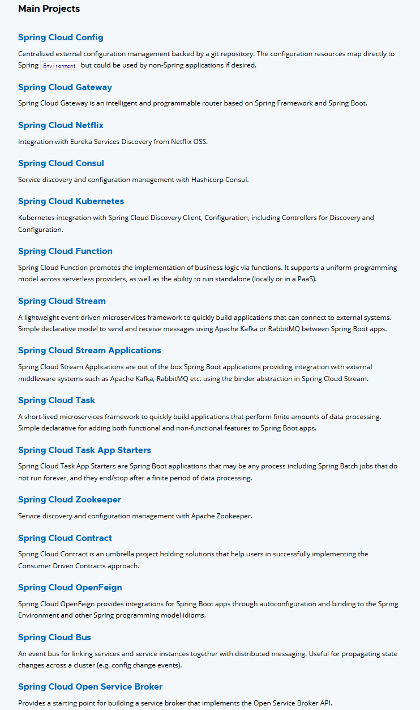
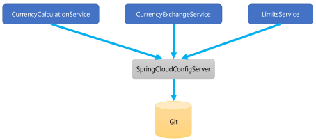
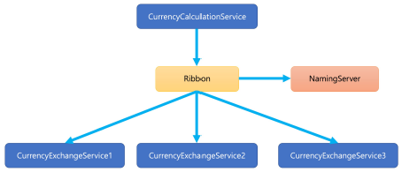
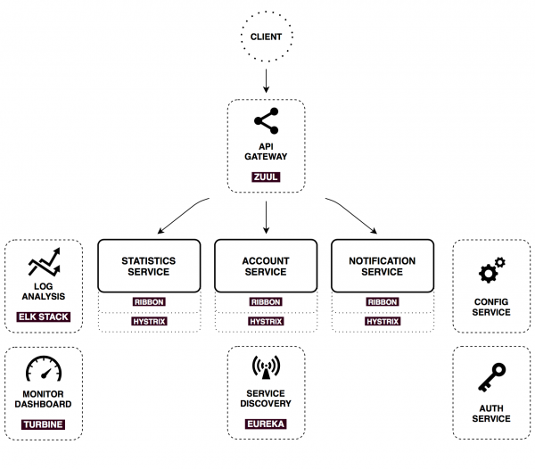
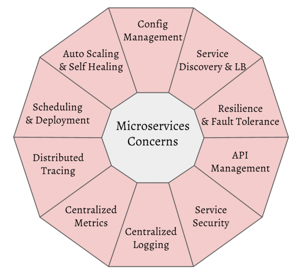
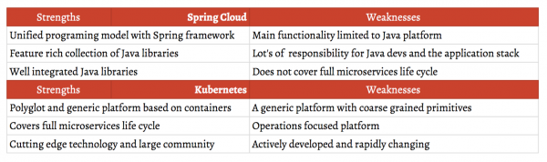
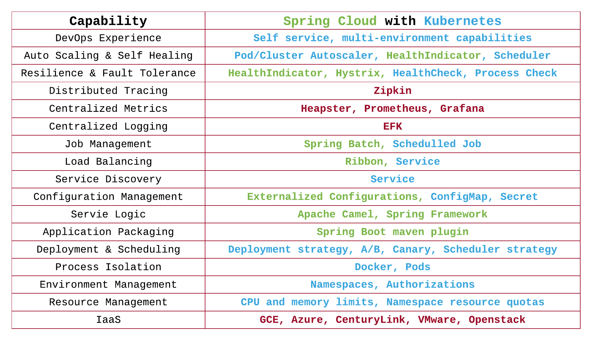

## Spring Cloud란?

Spring Cloud란 MicroServices의 개발, 빌드, 배포, 운영에 필요한 아키텍처를 쉽게 구성할 수 있게 도와주는 Spring Boot 기반 프레임워크입니다.

![[Spring Cloud로 개발하는 마이크로서비스 애플리케이션] 2. Spring Cloud란? - Spring Cloud란?](../images/2025-08-23-SpringCloud/img-1755958275574-10.png)

{: .tip}

Spring Boot + Spring Cloud

  

{: .tip}

Spring Cloud Main Projects

  

- **Spring Cloud Cloudfoundry**
- **Spring Cloud Config**
  - 분산 시스템에서 외부화된 구성을 위한 서버 및 클라이언트 측 지원을 제공
- **Spring Cloud Contract**
  - 사용자가 소비자 주도 계약 접근 방식을 성공적으로 구현하는 데 도움이 되는 솔루션을 보유한 포괄적인 프로젝트
  - Spring Cloud Contract Verifier 프로젝트로 구성
- **Spring Cloud Consul**
  - Spring 환경 및 기타 Spring 프로그래밍 모델 관용구에 대한 자동 구성 및 바인딩을 통해 Spring Boot 앱에 대한 Consul 통합을 제공
- **Spring Cloud Gateway**
  - API로 라우팅하는 간단하면서도 효과적인 방법을 제공하고 보안, 모니터링/메트릭 및 탄력성과 같은 교차 문제를 API에 제공
- **Spring Cloud Netflix**
  - Spring 환경 및 기타 Spring 프로그래밍 모델 관용구에 대한 자동 구성 및 바인딩을 통해 Spring Boot 앱을 위한 Netflix OSS 통합을 제공
- **Spring Cloud Vault**
  - Vault에서 secrets을 검색하고 원격 속성 소스로 Spring 환경을 초기화
  - SSL로 보안된 secrets
  - MySQL, PostgreSQL, Apache Cassandra, MongoDB, Consul, AWS 및 RabbitMQ 에 대한 자격 증명을 생성
  - Token, AppId, AppRole, Client Certificate, Cubbyhole, AWS EC2 및 IAM, Kubernetes 인증
  - Bootstrap application context: 모든 작업을 수행하도록 훈련할 수 있는 기본 애플리케이션의 상위 컨텍스트
  - Spring Cloud Vault Connector를 통해 HashiCorp의 Vault 서비스 브로커 를 사용한 Cloud Foundry 통합
- **Spring Cloud Kubernetes**
  - 개발자가 Kubernetes에서 Spring Cloud 애플리케이션을 빌드하고 실행할 수 있도록 하는 잘 알려진 Spring Cloud 인터페이스의 구현을 제공
- **Spring Cloud Circuitbreaker**
  - 다양한 회로 차단기 구현에서 추상화를 제공
  - 개발자가 앱에 가장 적합한 회로 차단기 구현을 선택할 수 있도록 애플리케이션에서 사용할 일관된 API를 제공
- **Spring Cloud Bus**
  - 분산 시스템의 노드를 경량 메시지 브로커와 연결
  - 상태 변경(예: 구성 변경) 또는 기타 관리 지침을 브로드캐스트하는 데 사용
  - AMQP 및 Kafka 브로커 구현이 프로젝트에 포함되어 있음
  - 클래스 경로에 있는 모든 Spring Cloud Stream 바인더는 즉시 전송으로 작동
- **Spring Cloud Cli**
  - Spring Cloud에 대한 Spring Boot 명령줄 기능을 제공
  - Spring Cloud 구성 요소 애플리케이션(예: @EnableEurekaServer) 을 실행하기 위해 Groovy 스크립트를 작성할 수 있음
  - 암호화 및 암호 해독과 같은 작업을 쉽게 수행하여 비밀 구성 값으로 Spring Cloud Config 클라이언트를 지원
  - Launcher CLI를 사용하면 명령줄에서 Eureka, Zipkin, Config Server와 같은 서비스를 한 번에 편리하게 시작할 수 있음(개발 시 매우 유용)
- **Spring Cloud Zookeeper**
  - Spring 환경 및 기타 Spring 프로그래밍 모델 관용구에 대한 자동 구성 및 바인딩을 통해 Spring Boot 앱에 Apache Zookeeper 통합을 제공
  - 몇 가지 간단한 주석으로 애플리케이션 내부의 공통 패턴을 빠르게 활성화 및 구성하고 Zookeeper로 대규모 분산 시스템을 구축
  - 제공된 패턴에는 서비스 검색 및 분산 구성이 포함
- **Spring Cloud Sleuth**
  - 분산 추적을 위한 Spring Boot 자동 구성을 제공
- **Spring Cloud Starter Build**
- **Spring Cloud Task**
  - 사용자는 Spring Cloud를 사용하여 수명이 짧은 마이크로 서비스를 개발 및 실행할 수 있으며 Spring Cloud Data Flow에서도 로컬, 클라우드에서 실행할 수 있습니다.
- **Spring Cloud Commons**
  - Spring Cloud Context와 Spring Cloud Commons의 두 가지 라이브러리로 기능을 제공
  - Spring Cloud Context는 Spring Cloud 애플리케이션의 ApplicationContext(부트스트랩 컨텍스트, 암호화, 새로 고침 범위 및 환경 끝점)에 대한 유틸리티 및 특수 서비스를 제공
  - Spring Cloud Commons는 다양한 Spring Cloud 구현(예: Spring Cloud Netflix vs. Spring Cloud Consul)에서 사용되는 추상화 및 공통 클래스 세트
- **Spring Cloud Openfeign**
  - Spring 환경 및 기타 Spring 프로그래밍 모델 관용구에 대한 자동 구성 및 바인딩을 통해 Spring Boot 앱에 대한 OpenFeign 통합을 제공

------

  
  

- **Centralized configuration management**
  - Spring Cloud Config Server
- **Location transparency**
  - Naming Server (Eureka)
- **Load Distribution (Load Balancing)**
  - Ribbon (Client Side) - 레거시
  - Spring Cloud Gateway
- **Easier REST Clients**
  - FeignClient
- **Visibility and monitoring**
  - Zipkin Distributed Tracing
  - Netflix API Gateway
- **Falut Tolerance**
  - Hystrix

------

## Spring Cloud vs Kubernetes

확장성있고 탄력있는 수 십 또는 수 백 개의 마이크로서비스로 구성된 시스템을 구축하기 위해, 시스템을 중앙 관리하고 광범위한 빌드와 실행 시간에 대한 능력을 가진 툴의 도움을 받아야 합니다. 

스프링 클라우드는 기능 서비스와 인프라 서비스(eg. 로그 분석, 설정 서버, 서비스 디스커버리, 인증/인가 서비스 등) 모두 제공하며, 스프링 클라우드를 활용한 MSA를 표현한 그림은 아래와 같습니다.

  

위 그림은 시스템의 실행시간 관점을 보여줍니다. 하지만 MSA에서 중요한 패키징, 지속적 통합(Continuous Integration), 스케일링, 고가용성, 자가치유 등은 보이지 않습니다. 이러한 추가적인 고려사항들을 살펴보면서 Spring Cloud 와 Kubernetes가 어떠한 관계에 있는지 살펴보겠습니다.

------

### 마이크로서비스 관심사

각각의 기능별 비교보다는 마이크로서비스의 관심사를 중심으로 스프링 클라우드와 쿠버네티스가 어떻게 접근하는지를 살펴보고자 합니다. 

마이크로서비스는 독립적인 배포와 기술적인 다양성을 통해 모듈간의 뚜렷한 경계를 가능하게 하지만 이러한 구조는 분산 시스템 개발에 대한 비용과 상당한 운영상의 과부화를 일으킵니다. 

MSA의 성공적인 구축을 위해 중요한 요소는 가능한 MSA 고려사항들에 대해 도움을 줄 수 있는 툴을 활용하는 것입니다.

  

**장단점**

두 플랫폼은 기능 별로 비교하기 애매하기 때문에 각 플랫폼이 가지는 강점과 약점을 기준으로 판단하는 것이 필요합니다.

  

### Spring Cloud

스프링 클라우드는 분산 환경에서의 공통적인 패턴을 빠르게 구축하도록 도와주는 도구를 제공합니다. 예를 들어 설정관리, 서비스 디스커버리, 서킷 브레이커, 라우팅 등. Neflix OSS 라이브러리 기반으로 만들어졌으며, Java 개발자를 위해 만들어졌습니다.

#### 강점

- 스프링 플랫폼과 스프링 부트의 빠른 어플리케이션 생성 능력에 의해 제공되는 **통합 프로그래밍 모델**은 개발자에게 훌륭한 마이크로서비스 개발 경험을 제공합니다. 예를 들어, 적은 어노테이션만으로 설정 서버를 만들 수 있으며, 약간의 어노테이션을 추가하면 서비스들을 설정하기 위한 클라이언트 라이브러리들을 얻을 수 있습니다.
- 실행시간의 주요한 것들을 다룰 수 있는 **다양한 선택지의 라이브러리들**이 있습니다. 모든 라이브러리들은 자바로 쓰여져있기 때문에 다양한 기능, 훌륭한 제어, 잘 튜닝된 옵션들을 제공해줍니다.
- 다른 스프링 클라우드 라이브러리들은 다른 라이브러리와 쉽게 통합됩니다. 예를 들어, FeignClient는 서킷 브레이커 라이브러리인 Hystrix, 로드 밸런싱 라이브러리인 Ribbon과 함께 사용할 수 있습니다. 

#### 약점

- **자바에 한정적입니다.** MSA의 강력한 모티브 중에 하나가 기술 스택, 라이브러리, 심지어 언어까지도 필요하면 전환할 수 있는 능력이지만, 스프링 클라우드는 이게 불가능합니다. 만약 설정 관리, 서비스 디스커버리 또는 로드 밸런싱에 있어 스프링 클라우드/Netflix OSS를 사용하기 원한다면, 이는 적합한 선택이 아닙니다. Netflix Prana프로젝트가 JVM환경 밖에서 Neflix OSS 환경을 사용할 수 있도록 구현하지만 범용성이 떨어지는 문제가 있습니다.
- **개발자 및 자바 어플리케이션에 너무 많은 책임**이 주어집니다. 각 마이크로서비스에 대한 환경 및 의존성을 관리해야 하며, 빌드하는 시간을 필요로 하게되고 또한 설정 서버를 만들 경우 설정 서버가 이미 실행되어 있어야 합니다. 서비스 디스커버리에 있어서도 유레카 서버가 실행되고 있어야 합니다.
- 스프링 클라우드는 MSA 세계에 있어서 **일부분의 기능만을 제공**합니다. 개발자들은 완벽한 마이크로서비스를 위해 자동 배포, 스케쥴링, 리소스 관리, 프로세스 분리, 자가복구, 빌드 파이프라인 등을 추가적으로 고려해야 할 것입니다. 이러한 점에서는 스프링 클라우드 + 클라우드 파운드리(또는 Docker Swarm)과 Kubernetes 간에 비교하는 것이 적합할 것입니다. 이는 또한 완벽한 마이크로서비스 경험을 위해 쿠버네티스와 같은 것들로 보완되어야 함을 의미합니다.

### Kubernetes

쿠버네티스는 자동 배포, 스케일링, 컨테이너 관리를 위한 오픈 소스 시스템입니다. 다양한 언어를 지원하며 프로비져닝, 실행, 스케일링, 분산 시스템 관리를 위한 기술을 제공합니다.

#### 강점

- 쿠버네티스는 **다양한 언어를 지원**하고, 클라우드 네이티브와 전통적인 컨테이너 어플리케이션 모두 사용할 수 있는 **일반적인** 컨테이너 관리 플랫폼입니다. 설정 관리, 서비스 디스커버리, 로드 밸런싱, 매트릭스 수집, 로그 통합 등의 기능을 제공하는 쿠버네티스는 다양한 언어들에서 사용이 가능합니다. 

- 스프링 클라우드와 비교해서 쿠버네티스는 **더 광범위한 MSA 문제를 해결**합니다. 런타임 서비스를 제공할 뿐만 아니라 쿠버네티스는 개발자가 환경을 프로비져닝하도록 하며, 자원 제약을 세팅하고, 어플리케이션 생애주기를 관리하고, 오토 스케일링과 자가치유를 가능하게 합니다.

#### 약점

- 쿠버네티스는 다양한 언어를 지원하므로 서비스와 구성요소는 **일반적이나** JVM을 위한 Spring Cloud와 같은 **다른 플랫폼에 최적화 되어 있지 않습니다**. 예를 들어, 설정은 환경 변수 또는 마운팅된 파일 시스템으로서 애플리케이션에 전달되며, 스프링 클라우드 Config에서 제공하는 설정 업데이트 기능이 없습니다.
- 쿠버네티스는 **개발자 친화적인 플랫폼이 아닙니다.**

------

스프링 클라우드는 JVM 내부에서 강력하며, 쿠버네티스는 이러한 JVM을 관리하는 데 강점을 가집니다. 따라서 둘을 조합하는 것이 필요하며, 이러한 조합으로 스프링은 어플리케이션 패키징을 제공하고, 도커와 쿠버네티스는 배포와 스케쥴링을 제공합니다. 

스프링은 Hystrix 스레드 풀을 통해 애플리케이션 내부 벌크헤딩을 제공하고, 쿠버네티스는 자원, 프로세스, 네임스페이스 격리를 통해 벌크헤딩을 제공합니다. 

스프링은 모든 마이크로서비스를 위해 상태 엔드 포인트를 제공하고, 쿠버네티스는 상태 확인(health check) 및 정상적인 서비스로의 트래픽 라우팅을 제공합니다. 스프링은 설정을 외부화하고 업데이트 하며, 쿠버네티스는 설정을 모든 마이크로서비스에 배포합니다.

------

## 참조

Spring Cloud for Microservices Compared to Kubernetes : https://developers.redhat.com/blog/2016/12/09/spring-cloud-for-microservices-compared-to-kubernetes

