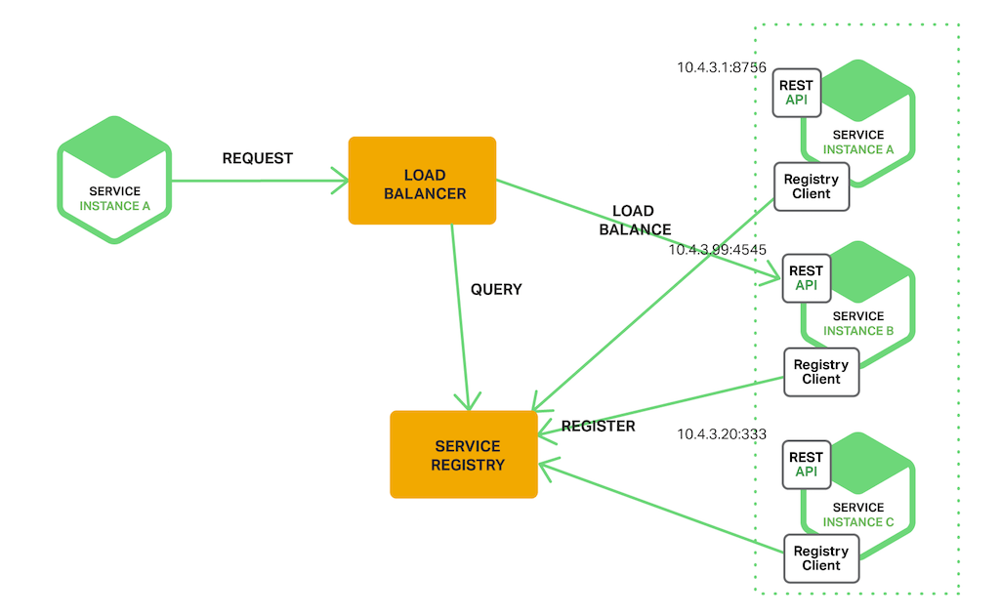
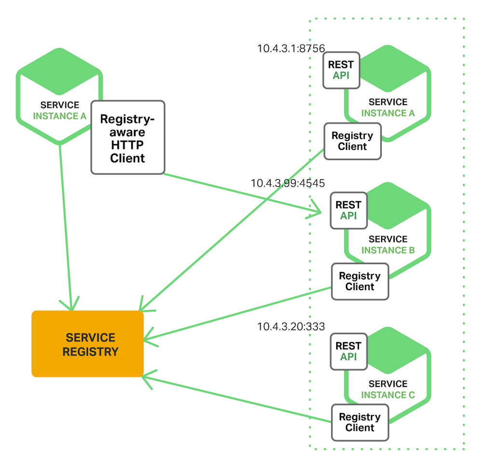
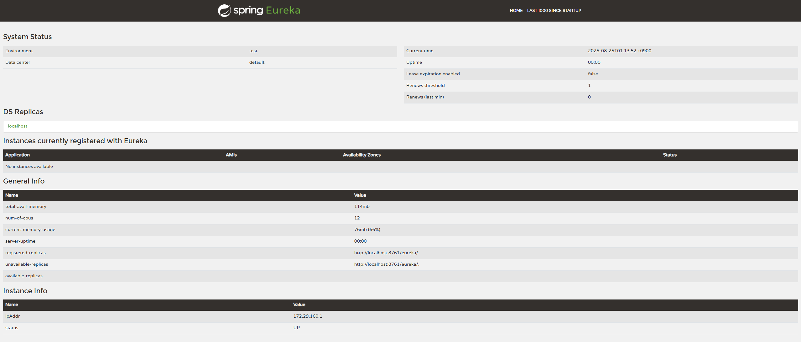
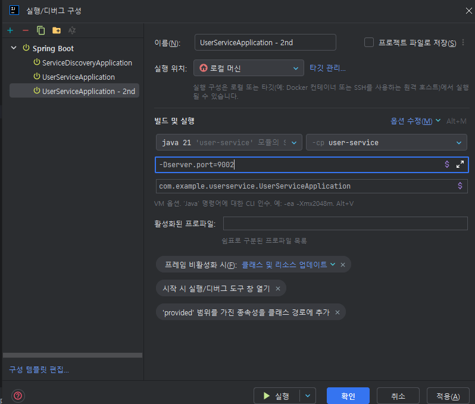
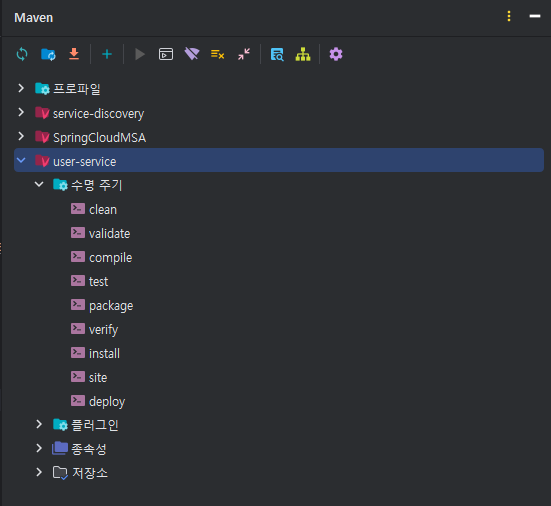
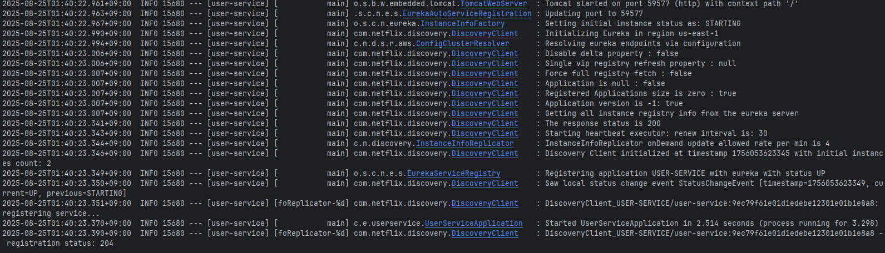
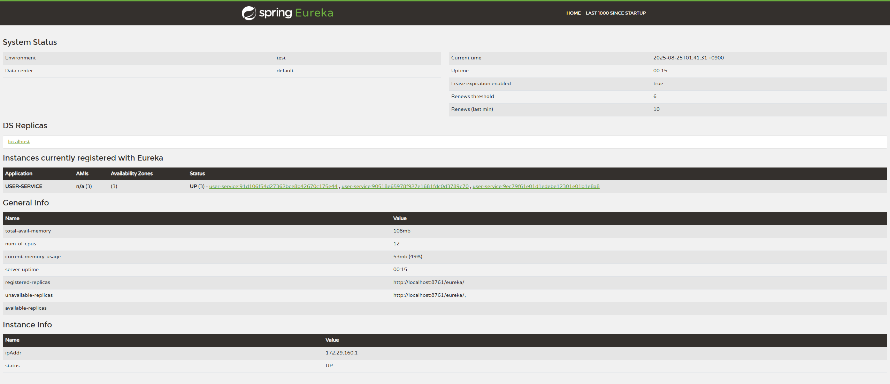

## Service Discovery 패턴이란?

Service Discovery 패턴은 MSA를 도입하면서 불편한 점을 해결하는 패턴입니다.

MSA에서는 외부에서 오는 요청은 API Gateway를 통해서 전달되고, 서비스 간 통신도 이루어집니다. 이때 API Gateway는 어떻게 서비스 Application의 정보를 알아서 전달하고, 각 서비스들도 어떻게 다른 서비스 Application의 정보를 알아서 통신할까요?

API Gateway에서 모든 서비스 Application의 정보를 수동으로 등록하고 각 서비스에서도 다른 서비스들의 정보를 등록하면 되겠지만 클라우드 환경 도입에 따라서 동적으로 서버가 Scale-out 되는 일이 많기 때문에 여러 서버의 정보를 수동으로 업데이트한다는 것은 매우 불편할 것입니다.

이러한 불편한 점을 해결하는 것이 바로 Service Discovery 패턴입니다.

> 서비스의 위치 (IP, Port 등)를 저장 및 관리하는 서비스의 주소록 역할

Service Discovery 패턴은 Service Registry를 구성하여 구현합니다.

이렇게 Service Discovery 패턴을 구현함으로써 서비스를 호출하는 쪽에서는 서비스의 위치를 몰라도 Service Discovery를 구현한 구현체에게 서비스의 위치를 질의함으로써 요청을 전달할 수 있습니다. 외부에서 API Gateway를 통한 요청과 서비스 간 통신 모두 Service Discovery를 거쳐서 요청을 전달하게 됩니다.

------

## Server-Side Discovery / Client-Side Discovery

이러한 Service Discovery 패턴에는 2가지 종류가 존재합니다.

두 패턴의 구분 기준은 다음과 같습니다. 

{: .tip}

MSA의 다른 서비스를 호출할 때 Service Registry를 통해서 다른 서비스를 호출하는가?

- **Server-Side Discovery** : Service Registry가 아닌 앞단의 Load Balancer를 통해 다른 서비스 호출
- **Client-Side Discovery** : Service Registry를 통해 서비스 호출

### Server-Side Discovery



Server-Side Discovery는 앞서 말한 것처럼 다른 서비스를 호출할 때 Service Registry를 거치지 않고 앞단의 물리적인 로드 밸런서를 배치하여 로드 밸런서가 내부의 Service Registry에게 질의함으로써 결과를 반환하는 Flow입니다.

이러한 Server-Side Discovery의 장단점은 다음과 같습니다.

**장점**

- 각 서비스들이 다른 서비스를 호출할 때 Load Balancer에 요청을 보내도록 설계되므로 Service Registry의 구체적인 구현은 모른 채로 Load Balancer만 호출하면 됩니다. (추상화된 Load Balancer만 호출하고, 하위 구현체인 Service Registry는 몰라도 됩니다, 즉 캡슐화되어 있다.)
- 추상화된 Load Balancer에 요청만 보내면 되므로 다른 서비스를 검색하는 로직을 구현할 필요가 없습니다.

**단점**

- 배포 환경에서 앞단의 로드 밸런서를 배치하는 것이 필수적입니다.
- 요청 시 Load Balancer를 한 단계 거쳐야하므로 네트워크 hop이 증가하여 처리가 상대적으로 지연될 수 있습니다.

------

### Client-Side Discovery



Client-Side Discovery는 앞서 말한 것처럼 각 서비스들이 Service Registry에게 질의하여 결과를 반환하는 Flow입니다. 

Client-Side Discovery에서는 Service Registry를 구현하는 다음과 같은 라이브러리들을 사용합니다.

- **Spring Cloud Netflix Eureka** : Service Registry의 서버 역할, 서비스들을 등록하는 역할

{: .q-left}

> Spring Cloud Netflix Eureka 흐름

1. 각 서비스 인스턴스가 **Eureka 서버에 등록**함 (Service Registry).
2. 클라이언트는 Eureka에서 해당 서비스의 인스턴스 목록을 받아옵니다.
3. 클라이언트는 자체 로직(e.g. Ribbon, LoadBalancer)을 통해 적절한 인스턴스를 선택하여 직접 호출합니.

이번 개인 학습 프로젝트에서는 **Spring Cloud Netflix Eureka를 사용**하였습니다.

Client-Side Discovery의 장단점 또한 알아보겠습니다.

**장점**

- 인프라 작업인 앞단에 Load Balancer를 배치하는 작업을 하지 않고, 애플리케이션 코드 단에서 Service Discovery 패턴을 구현할 수 있어서 상대적으로 간단합니다.
- 각 서비스들이 호출하려는 서비스를 알기 때문에 서비스별로 특성에 맞게 로드밸런싱 방식을 구현할 수 있습니다.

**단점**

- 각 서비스별로 다른 서비스를 검색하는 로직을 언어 및 프레임워크 별로 구현해야 합니다.
  - 따라서, 각 서비스가 Service Registry에 의존적입니다.
  - 만약 서비스별로 동일한 언어 및 프레임워크가 아니라 다른 언어 및 프레임워크 환경인 폴리그랏(polyglot) 환경이라면 언어 및 프레임워크별로 여러번 구현해야합니다.

------

## Eureka를 사용한 Client-Side Discovery 구현

개인 학습 프로젝트에 Eureka 라이브러리를 사용하여 Service Discovery를 구현 이유는 다음과 같습니다.

1. 인프라 작업이 아닌 애플리케이션 코드 단 작업이라서 상대적으로 접근이 쉽고 간단하다.
2. 레퍼런스가 Eureka를 사용하는 Client-Side Discovery가 압도적으로 많다.
3. 현재 프로젝트도 여러 언어 및 프레임워크를 사용하는 것이 아닌 Java & Spring으로만 구성되어 있다.

{: .q-left}

> Eureka Service Discovery 생성

**pom.xml**

```xml
<?xml version="1.0" encoding="UTF-8"?>
<project xmlns="http://maven.apache.org/POM/4.0.0" xmlns:xsi="http://www.w3.org/2001/XMLSchema-instance"
	xsi:schemaLocation="http://maven.apache.org/POM/4.0.0 https://maven.apache.org/xsd/maven-4.0.0.xsd">
	<modelVersion>4.0.0</modelVersion>
	<parent>
		<groupId>org.springframework.boot</groupId>
		<artifactId>spring-boot-starter-parent</artifactId>
		<version>3.5.0</version>
		<relativePath/> <!-- lookup parent from repository -->
	</parent>
	<groupId>com.example</groupId>
	<artifactId>service-discovery</artifactId>
	<version>1.0</version>
	<name>service-discovery</name>
	<description>Service discovery application for New Toy Project</description>
	<properties>
		<java.version>21</java.version>
		<spring-boot.version>3.5.0</spring-boot.version>
		<spring-cloud.version>2025.0.0</spring-cloud.version>
	</properties>
	<dependencies>
		<dependency>
			<groupId>org.springframework.cloud</groupId>
			<artifactId>spring-cloud-starter-netflix-eureka-server</artifactId>
		</dependency>

		<dependency>
			<groupId>org.springframework.boot</groupId>
			<artifactId>spring-boot-starter-test</artifactId>
			<scope>test</scope>
		</dependency>
	</dependencies>
	<dependencyManagement>
		<dependencies>
			<dependency>
				<groupId>org.springframework.cloud</groupId>
				<artifactId>spring-cloud-dependencies</artifactId>
				<version>${spring-cloud.version}</version>
				<type>pom</type>
				<scope>import</scope>
			</dependency>
		</dependencies>
	</dependencyManagement>

	<build>
		<plugins>
			<plugin>
				<groupId>org.springframework.boot</groupId>
				<artifactId>spring-boot-maven-plugin</artifactId>
				<version>${spring-boot.version}</version>
			</plugin>
		</plugins>
	</build>

</project>

```

- Java 21,  Spring Boot 버전은 3.5.0 사용하였습니다.
- Spring Cloud Discovery에서 Eureka Server를 추가합니다.

**SpringBootApplication 부분**

```java
package com.example.servicediscovery;

import org.springframework.boot.SpringApplication;
import org.springframework.boot.autoconfigure.SpringBootApplication;
import org.springframework.cloud.netflix.eureka.server.EnableEurekaServer;

@SpringBootApplication
@EnableEurekaServer
public class ServiceDiscoveryApplication {

	public static void main(String[] args) {
		SpringApplication.run(ServiceDiscoveryApplication.class, args);
	}

}
```

@EnableEurekaServer로 유레카 서버 자격으로 등록합니다.

**application.yml**

```yaml
server:
  port: 8761

spring:
  application:
    name: service-discovery

eureka:
  client:
    register-with-eureka: false
    fetch-registry: false
```

- port는 8761로 설정
- register-with-eureka false, fetch-registry false로 서버를 클라이언트로 등록하지 않도록 합니다.

localhost:설정한 Eureka Server Port(8761)의 URI로 접속해보면 다음과 같은 Eureka Server 대시보드가 렌더링됩니다.



유레카 서버가 가동된 것을 볼 수 있으며, 아직 클라이언트가 등록되어 있지 않은 상태입니다.

{: .q-left}

> User Service 생성

이제 각 Service들에서 다른 서비스들의 정보를 얻기 위한 Eureka Clients를 구현해보도록 하겠습니다.

아래의 과정은 MSA의 각 서비스들에서 모두 Eureka Clients를 추가해주면 됩니다.

**pom.xml**

```xml
<?xml version="1.0" encoding="UTF-8"?>
<project xmlns="http://maven.apache.org/POM/4.0.0" xmlns:xsi="http://www.w3.org/2001/XMLSchema-instance"
    xsi:schemaLocation="http://maven.apache.org/POM/4.0.0 https://maven.apache.org/xsd/maven-4.0.0.xsd">
    <modelVersion>4.0.0</modelVersion>
    <parent>
       <groupId>org.springframework.boot</groupId>
       <artifactId>spring-boot-starter-parent</artifactId>
       <version>3.5.0</version>
       <relativePath/> <!-- lookup parent from repository -->
    </parent>
    <groupId>com.example</groupId>
    <artifactId>user-service</artifactId>
    <version>1.0</version>
    <name>user-service</name>
    <description>user-service</description>
    <properties>
       <java.version>21</java.version>
       <spring-cloud.version>2025.0.0</spring-cloud.version>
    </properties>
    <dependencies>
       <dependency>
          <groupId>org.springframework.boot</groupId>
          <artifactId>spring-boot-starter-web</artifactId>
       </dependency>
       <dependency>
          <groupId>org.springframework.cloud</groupId>
          <artifactId>spring-cloud-starter-netflix-eureka-client</artifactId>
       </dependency>

       <dependency>
          <groupId>org.springframework.boot</groupId>
          <artifactId>spring-boot-devtools</artifactId>
          <scope>runtime</scope>
          <optional>true</optional>
       </dependency>
       <dependency>
          <groupId>org.projectlombok</groupId>
          <artifactId>lombok</artifactId>
          <optional>true</optional>
       </dependency>
       <dependency>
          <groupId>org.springframework.boot</groupId>
          <artifactId>spring-boot-starter-test</artifactId>
          <scope>test</scope>
       </dependency>
    </dependencies>
    <dependencyManagement>
       <dependencies>
          <dependency>
             <groupId>org.springframework.cloud</groupId>
             <artifactId>spring-cloud-dependencies</artifactId>
             <version>${spring-cloud.version}</version>
             <type>pom</type>
             <scope>import</scope>
          </dependency>
       </dependencies>
    </dependencyManagement>

    <build>
       <plugins>
          <plugin>
             <groupId>org.apache.maven.plugins</groupId>
             <artifactId>maven-compiler-plugin</artifactId>
             <configuration>
                <annotationProcessorPaths>
                   <path>
                      <groupId>org.projectlombok</groupId>
                      <artifactId>lombok</artifactId>
                   </path>
                </annotationProcessorPaths>
             </configuration>
          </plugin>
          <plugin>
             <groupId>org.springframework.boot</groupId>
             <artifactId>spring-boot-maven-plugin</artifactId>
             <configuration>
                <excludes>
                   <exclude>
                      <groupId>org.projectlombok</groupId>
                      <artifactId>lombok</artifactId>
                   </exclude>
                </excludes>
             </configuration>
          </plugin>
       </plugins>
    </build>

</project>
```

- SpringBootDevTools, Lombok, Web 추가
- SpringCloudDiscovery에서 Eureka Discovery Client 추가합니다.

**SpringBootApplication 부분**

```java
package com.example.userservice;

import org.springframework.boot.SpringApplication;
import org.springframework.boot.autoconfigure.SpringBootApplication;
import org.springframework.cloud.client.discovery.EnableDiscoveryClient;

@SpringBootApplication
@EnableDiscoveryClient
public class UserServiceApplication {

    public static void main(String[] args) {
       SpringApplication.run(UserServiceApplication.class, args);
    }

}
```

@EnableDiscoveryClient 추가로 Eureka Client로 사용가능하게 합니다.

**application.yml**

```yaml
server:
  port: 0 #0번 포트는 랜덤 포트를 사용하겠다는 뜻

spring:
  application:
    name: user-service

eureka:
  instance:
    instance-id: ${spring.application.name}:${spring.application.instance_id:${random.value}}
  client:
    service-url:
      defaultZone: http://127.0.0.1:8761/eureka
    fetch-registry: true
    register-with-eureka: true
```

- server.port : 0으로 설정해 random port에서 실행되도록 합니다.
- instance-id를 설정해 같은 ip를 사용하는 다른 클라이언트와 등록id가 겹치지 않도록 합니다.
- register-with-eureka, fetch-registry 를 true 로 설정해 클라이언트 등록 및 외부 검색이 가능하도록 합니다

------

## Scale-Out 방법

이제 user-service를 여러개로 스케일링하는 방법을 소개하겠습니다.

{: .q-left}

> 랜덤포트가 아닌 경우



1. UserServiceApplication을 복사 버튼을 통해 UserServiceApplicaion - 2nd를 생성합니다.
2. 옵션 수정에서 VM Options -> -Dserver.port=[다른포트]를 입력하고 실행합니다.
3. Eureka에 새롭게 등록된 인스턴스를 확인할 수 있습니다.

{: .q-left}

> 랜덤 포트 사용 경우



Maven에서 clean->compile->package를 차례로 누르면 target 폴더에 user-service-1.0.jar를 파일이 생성됩니다.

이제 명령 프롬프트(cmd)를 열어  java -jar .\target\user-service-1.0.jar를 입력합니다.



이후 실행을 하면 랜덤 포트에서 실행되는 것을 콘솔에서 확인할 수 있습니다.



위 사진과 같이 여러 인스턴스가 등록된 것을 확인할 수 있습니다.
