## API Gateway Service란?

API Gateway는 클라이언트 요청을 받아 적절한 마이크로서비스로 라우팅하며, 인증/인가 등 공통 기능을 처리합니다. 

이를 통해 <span style="color:orange">**클라이언트는 복잡한 내부 구조를 알 필요 없이 Gateway와만 통신**</span>하면 됩니다.

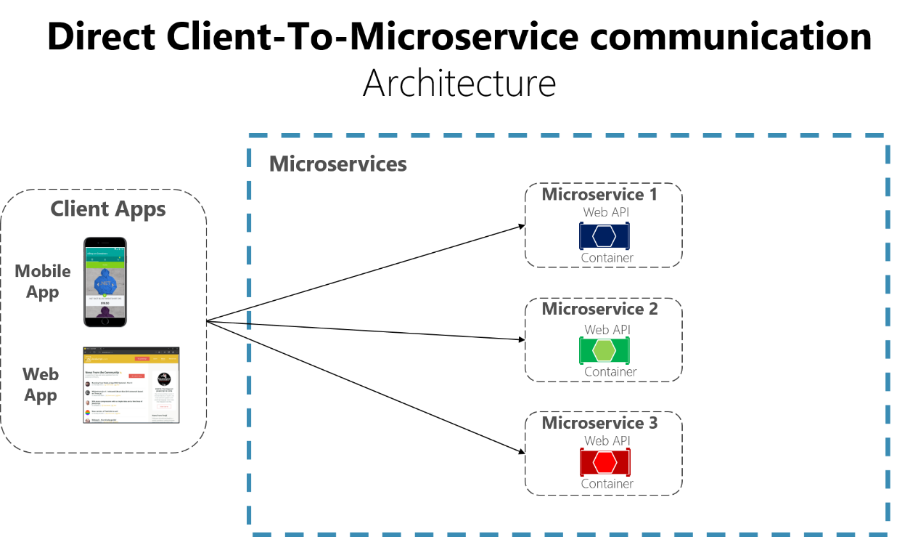

위 구조에서 만약 마이크로서비스의 IP가 바뀐다면, IP를 직접 사용하던 클라이언트도 함께 바뀌어야 합니다. 따라서 강한 의존성을 끊기 위해 클라이언트의 모든 요청을 받는 프록시 서버가 필요하게 되었고 gateway가 이러한 단일 진입점 역할을 하게 됩니다.

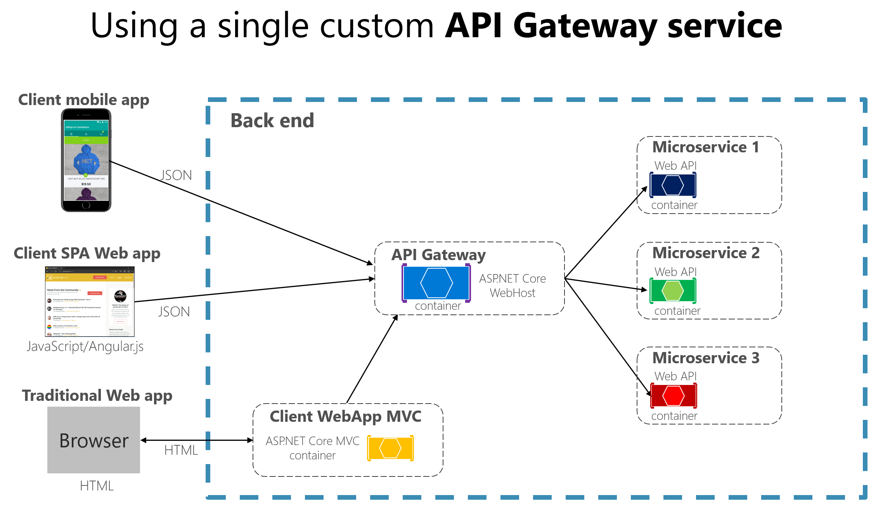

API 게이트웨이라는 프록시를 두게 되면 다음과 같은 기능을 추가할 수 있습니다.

- 인증 및 권한 부여
- 서비스 검색 통합
- 응답 캐싱
- 정책, 회로 차단기 및 QoS 다시 시도
- 속도 제한
- 부하 분산
- 로깅, 추적, 상관관계
- 헤더, 쿼리 문자열 및 청구 변환
- IP 허용 목록에 추가

------

## Netflix Ribbon과 Zuul

{: .q-left}

> Netflix Ribbon

Netflix Ribbon은 **클라이언트 사이드 로드 밸런서**로, RestTemplate 또는 FeignClient를 통해 다른 마이크로서비스와 통신할 때 활용되었습니다.

**특징**

- RestTemplate을 사용할 경우 직접적인 **IP + 포트번호**를 지정해야 했지만,
- @FeignClient("service-name")를 활용하면 **서비스 이름 기반 호출**이 가능해졌습니다.
- 내부적으로는 Ribbon이 **서비스 디스커버리 + 로드밸런싱 + 헬스체크** 기능을 수행했습니다.

하지만 현재는?

- Netflix는 Ribbon을 더 이상 **기능 개발하지 않고 유지보수만 진행**합니다.
- **WebFlux 기반 비동기** 환경과의 **호환성 부족**으로 현재는 사용이 권장되지 않습니다.

{: .q-left}

> Netflix Zuul

 Zuul은 마이크로서비스의 진입 지점으로, API Gateway 역할을 하며 다양한 요청을 내부 서비스로 라우팅합니다.

**특징**

- **동기식 Servlet 기반** 필터 체인 구조
- 요청 라우팅, 인증, 로깅, CORS 등의 기능 수행

하지만 현재는?

- Zuul 역시 **maintenance 모드**에 돌입했습니다.
- Spring Boot 및 Spring Cloud 최신 버전에서는 **호환성이 떨어집니다**.
- Spring 공식 문서에서도 **Spring Cloud Gateway 사용을 권장**합니다.

{: .q-left}

> Spring Cloud Gateway

Spring Cloud Gateway는 Spring 5에서 도입된 **WebFlux** 기반의 비동기 논블로킹 **API Gateway**입니다.

**주요 기술 특징**

| 항목            | Spring Cloud Gateway                          | Zuul / Ribbon                 |
| --------------- | --------------------------------------------- | ----------------------------- |
| 프로그래밍 모델 | **비동기/논블로킹 (Reactive)**                | 동기/블로킹 (Servlet 기반)    |
| 성능            | 높은 처리량, 적은 리소스 사용                 | 낮은 처리량, 높은 리소스 사용 |
| 유지보수 상태   | **Active Development (공식 권장)**            | Maintenance (기능 추가 없음)  |
| 필터 체계       | GlobalFilter, GatewayFilter 등                | ZuulFilter                    |
| 통합성          | Spring Security, WebFlux 등과 자연스럽게 통합 | 제한적 호환성                 |

{: .important}

왜 Gateway를 써야 할까?

- 최신 기술 스택에 맞는 **Reactive 기반**
- Spring Boot 2.x / 3.x 와의 **완벽한 호환성**
- 마이크로서비스 통신의 **확장성, 유연성, 성능 개선**
- 공식적으로 **Zuul/Ribbon의 후속으로 Spring에서 권장**

------

## Spring Cloud Gateway 생성

Gateway로 동작하는 서비스를 실행하는 프로젝트를 만들어 빌드를 진행해 보았습니다.

**Dependency**

- Developer Tools
- Lombok
- Spring Cloud Discovery - Eureka Discovery Client
- Spring Cloud Routing - Reactive Gateway (Webflux)

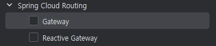

**application.yml**

- 포트 번호
- 유레카 연동 정보
- 애플리케이션 이름
- 라우터 정보 : if predicates then forward to uri, 라우팅 조건에 맞을 경우 도메인 이후의 요청 문자열을 그대로 넘깁니다.
- 라우팅 시나리오 : 클라이언트가 http://localhost:8080/first-service/welcome으로 요청으로 보내면 path 조건에 의해 /first-service/welcome이 http://localhost:8081/로 넘어갑니다. http://localhost:8080/first-service/welcome →  http://localhost:8081/first-service/welcome

```yml
server:
  port: 8000

# 마이크로서비스 아이디
# 라우팅 정보
spring:
  application:
    name: apigateway-service
  cloud:
    gateway:
      mvc:
        routes:
          - id: first-service
            uri: http://localhost:8081/
            predicates:
              - Path=/first-service/**
          - id: second-service
            uri: http://localhost:8082/
            predicates:
              - Path=/second-service/**
```

apigateway-service를 실행하면 비동기를 지원하기 위해 Netty 내장 서버를 사용하는걸 볼 수 있습니다.

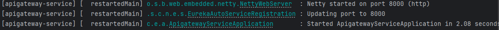

이어 First Service와 Second Service는 유레카에 등록되는 서비스이고, 각각 8081,8082 포트에서 동작합니다.


다음은 컨트롤러입니다. /message 경우 header처리를 강제하도록 하였습니다. (/second-service 역시 first와 동일)

```java
@RestController
@RequestMapping("/first-service")
@Slf4j
public class FirstServiceController {
    Environment env;

    public FirstServiceController(Environment env) {
        this.env = env;
    }

    @GetMapping("/welcome")
    public String welcome() {
        return "Welcome to the First service.";
    }

    @GetMapping("/message")
    public String message(@RequestHeader("f-request") String header) {
        log.info(header);
        return "Hello World in First Service.";
    }

    @GetMapping("/check")
    public String check(HttpServletRequest request) {
        log.info("Server port={}", request.getServerPort());

        return String.format("Hi, there. This is a message from First Service on PORT %s"
                , env.getProperty("local.server.port"));
    }
}
```

------

## Spring Cloud Gateway - Filter

클라이언트의 요청을 중개하는 게이트웨이에서는 다음과 같은 동작이 일어납니다.

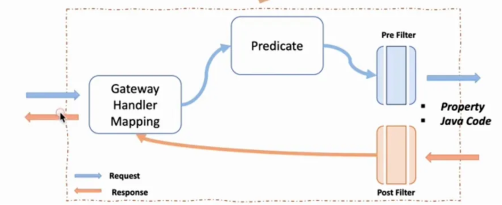

- **핸들러 매핑** : 모든 요청을 받음
- **Predicate** : 들어온 클라이언트 요청의 경로, 헤더, 쿼리 파라미터 등 다양한 정보를 기준으로 특정 라우트 규칙을 적용할지 말지를 판단하는 조건 역할
- **PreFilter** : 서비스로 라우팅 전에 처리
- **PostFilter** : 응답을 반환하기 전에 처리

필터는 설정 정보나 자바 코드로 등록할 수 있습니다.

{: .tip}

**자바 코드 이용 - Filter Config 등록**

- RouteLocator 등록
- 라우터에 필터와 목적지 uri 추가
- 필터에 요청 헤더와 응답 헤더에 정보 추가 (예제)
- 흐름 정리 : /first-service/** 요청을 받으면 http://localhost:8081/first-service/**로 요청하되, 넘기기 전에 필터를 실행해라.

```java
@Configuration
public class FilterConfig {
    // 아직 사용 안함
    Environment env;

    public FilterConfig(Environment env) {
        this.env = env;
    }

    @Bean
    public RouteLocator getRouteLocator(RouteLocatorBuilder builder) {
        return builder.routes()
                .route(r -> r.path("/first-service/**")
                        .filters(f -> f.addRequestHeader("f-request", "1st-request-header-by-java")
                                .addResponseHeader("f-response", "1st-response-header-from-java"))
                        .uri("http://localhost:8081"))
                .route(r -> r.path("/second-service/**")
                        .filters(f -> f.addRequestHeader("s-request", "2nd-request-header-by-java")
                                .addResponseHeader("s-response", "2nd-response-header-from-java"))
                        .uri("http://localhost:8082"))
                .build();
    }
}
```

First Service와 Second Service에 각 헤더를 받아서 로그를 찍는 컨트롤러를 추가합니다.

```java
@RestController
@RequestMapping("/first-service")
@Slf4j
public class FirstServiceController {

    @GetMapping("/message")
    public String message(@RequestHeader("f-request") String header) {
        log.info(header);
        return "Hello World in First Service.";
    }
    
}

@RestController
@RequestMapping("/second-service")
@Slf4j
public class SecondServiceController {
   
    @GetMapping("/message")
    public String message(@RequestHeader("s-request") String header) {
        log.info(header);
        return "Hello World in Second Service.";
    }

}
```

**Header처리를 하지 않아 Filtering된 경우**

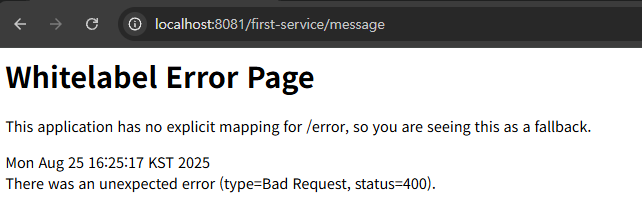

**Header처리를 한 경우**

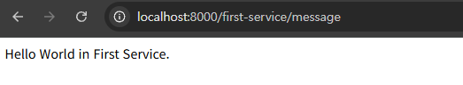

**Header처리를 하지 않아도 Config에서 강제 설정한 경우**

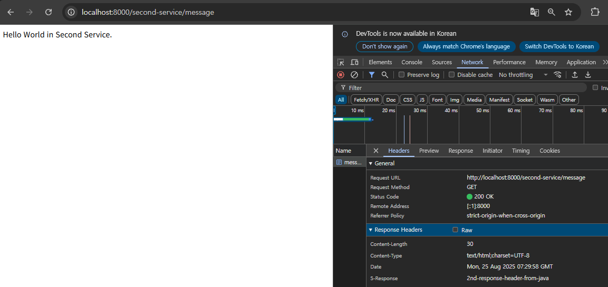

{: .tip}

**설정 정보 이용 - application.yml**

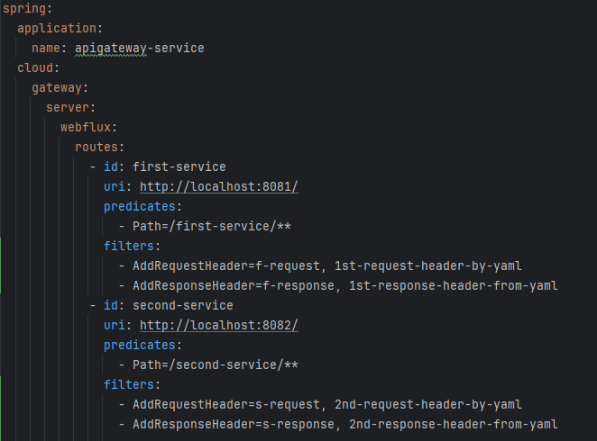

filters에 각 헤더를 강제 설정해놓습니다.

------

## Spring Cloud Gateway - Custom Filter

이번에는 사용자 정의 필터를 추가해보겠습니다.

Filter는 <span style="color:red">AbstractGatewayFilterFactory</span>를 상속받아 구현합니다.

- CustomerFilter 빈 등록
  - GatewayFilter 반환 - exchange로 요청 정보와 응답 정보를 받을 수 있고, chain에 post 필터를 등록합니다.
  - pre-filter로 사용자가 jwt를 가지고 있는지 로그를 찍습니다. (예제)
  - post-filter로 응답 코드 로그를 찍습니다. (예제)
- yml 파일의 filters에 CusomFilter를 등록합니다.

**CustomFilter 빈 등록**

```java
@Component
@Slf4j
public class CustomFilter extends AbstractGatewayFilterFactory<CustomFilter.Config> {

    public CustomFilter() {
        super(Config.class);
    }

    @Override
    public GatewayFilter apply(Config config) {
        return (exchange, chain) -> {
            ServerHttpRequest request = exchange.getRequest();
            ServerHttpResponse response = exchange.getResponse();

            // Custom Pre Filter
            log.info("Custom PRE Filter: request id -> {}", request.getId());

            return chain.filter(exchange).then(Mono.fromRunnable(() -> {
                // Custom Post Filter
                log.info("Custom POST Filter: request id -> {}", response.getStatusCode());
            }));
        };
    }

    public static class Config {

    }
}
```

다음과 같이 yml 파일의 filters에 필터를 등록합니다.

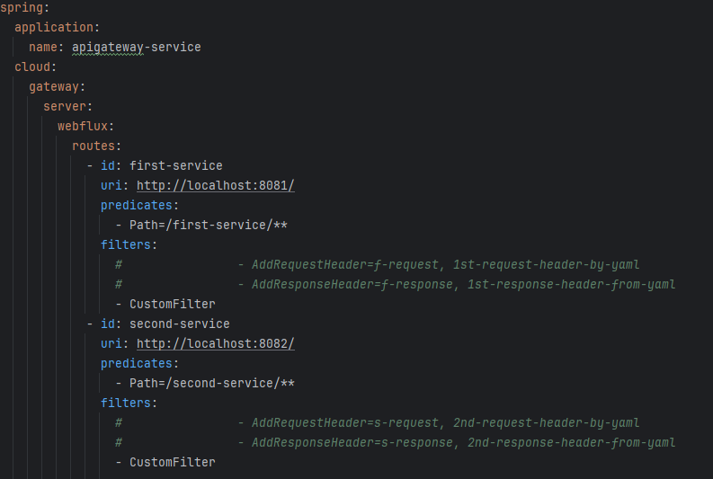

다음과 같이 필터를 체크할 컨트롤러를 서비스에 추가합니다.

```java
@RestController
@RequestMapping("/first-service")
@Slf4j
public class FirstServiceController {
    
    @GetMapping("/check")
    public String check(HttpServletRequest request) {
        log.info("Server port={}", request.getServerPort());

        return String.format("Hi, there. This is a message from First Service on PORT %s"
                , env.getProperty("local.server.port"));
    }
}
```

```java
@RestController
@RequestMapping("/second-service")
@Slf4j
public class SecondServiceController {

    @GetMapping("/check")
    public String check() {
        return "Hi, there. This is a message from Second Service.";
    }
}
```

**실행 결과**

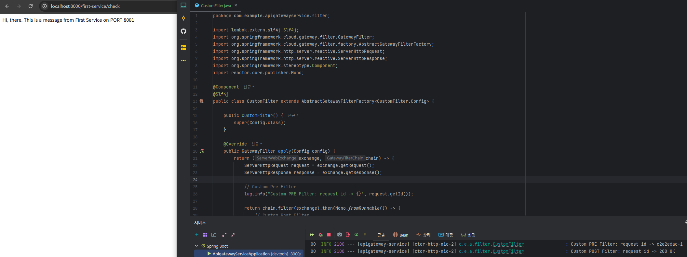

Gateway로 요청을 날리면 라우팅되기 전에 pre 필터를 거쳐서 로그가 찍히고, 응답 전에 post 필터를 거쳐서 로그가 찍힌것을 확인할 수 있습니다.

------

## Spring Cloud Gateway - Global Filter

- GlobalFilter 빈 등록
  - GatewayFilter 반환 - 내부 클래스 config에 필터 관련 정보를 넣고 yml 파일에서 값을 주입합니다.
  - pre-filter로 base messgage를 찍고, preLogger가 참인 경우 사용자 아이디가 유효한지 로그를 찍습니다. (예제)
  - post-filter로 postLogger가 참인 경우 응답 코드 로그를 찍습니다. (예제)
- yml 파일의 default-filters에 GlobalFilter를 등록할 때, 조건을 등록하지 않으며, 전달하는 파라미터 값을 args로 넣습니다.

```java
@Component
@Slf4j
public class GlobalFilter extends AbstractGatewayFilterFactory<GlobalFilter.Config> {
    public GlobalFilter() {
        super(Config.class);
    }

    @Override
    public GatewayFilter apply(Config config) {
        return (exchange, chain) -> {
            ServerHttpRequest request = exchange.getRequest();
            ServerHttpResponse response = exchange.getResponse();

            log.info("Global Filter baseMessage: {}, {}", config.getBaseMessage(), request.getRemoteAddress());

            if (config.isPreLogger()) {
                log.info("Global Filter Start: request id -> {}", request.getId());
            }

            return chain.filter(exchange).then(Mono.fromRunnable(() -> {
                if (config.isPostLogger()) {
                    log.info("Global Filter End: response code -> {}", response.getStatusCode());
                }
            }));
        };
    }

    @Data
    public static class Config {
        private String baseMessage;
        private boolean preLogger;
        private boolean postLogger;
    }
}
```

yml에 GlobalFilter를 등록하고 환경변수를 주입합니다.

```yml
spring:
  application:
    name: apigateway-service
  cloud:
    gateway:
      server:
        webflux:
          default-filters:
            - name: GlobalFilter
              args:
                baseMessage: Spring Cloud Gateway WebFlux Global Filter
                preLogger: true
                postLogger: true
```

**실행 결과**

글로벌 필터가 함께 동작합니다.

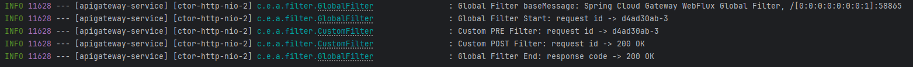

------

## Spring Cloud Gateway - Logging Filter

이번엔 AbstractGatewayFilterFactory를 응용하여 로깅 전용 필터를 적용해보겠습니다. Second Service에만 커스텀 필터로 등록합니다.

- LoggingFilter 빈 등록 : 내용은 글로벌 필터와 동일
- yml의 filter에 변수값과 함께 등록

LoggingFilter 빈을 등록합니다.

```java
@Component
@Slf4j
public class LoggingFilter extends AbstractGatewayFilterFactory<Config> {
    public LoggingFilter() {
        super(Config.class);
    }

    @Override
    public GatewayFilter apply(Config config) {
        return (exchange, chain) -> {
            ServerHttpRequest request = exchange.getRequest();
            ServerHttpResponse response = exchange.getResponse();

            log.info("Logging Filter baseMessage: {}, {}", config.getBaseMessage(), request.getRemoteAddress());

            if (config.isPreLogger()) {
                log.info("Logging Filter Start: request uri -> {}", request.getURI().toString());
            }

            return chain.filter(exchange).then(Mono.fromRunnable(() -> {
                if (config.isPostLogger()) {
                    log.info("Logging Filter End: response code -> {}", response.getStatusCode());
                }
            }));
        };
    }


    @Data
    public static class Config {
        private String baseMessage;
        private boolean preLogger;
        private boolean postLogger;
    }
}
```

yml에 LoggingFilter을 등록하고 환경변수를 주입하며, Second Service에만 커스텀으로 등록합니다.

```yml
spring:
  application:
    name: apigateway-service
  cloud:
    gateway:
      server:
        webflux:
          default-filters:
            - name: GlobalFilter
              args:
                baseMessage: Spring Cloud Gateway WebFlux Global Filter
                preLogger: true
                postLogger: true
          routes:
            - id: first-service
              uri: http://localhost:8081/
              predicates:
                - Path=/first-service/**
              filters:
                - CustomFilter
            - id: second-service
              uri: http://localhost:8082/
              predicates:
                - Path=/second-service/**
              filters:
                - name: CustomFilter
                - name: LoggingFilter
                  args:
                    baseMessage: Hi,there.
                    preLogger: true
                    postLogger: true
```

Second Service로 요청을 날려보면 다음과 같이 LoggingFilter가 동작합니다. 순서는 Global이 먼저 등록되고, yml 파일에 등록한 Custom → Logging 순입니다.

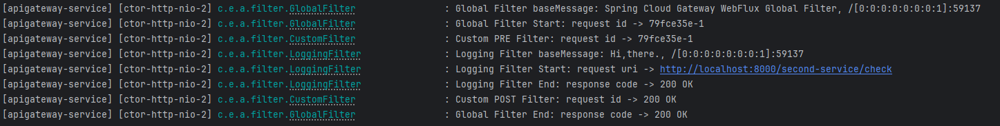

{: .note}

**필터를 등록하는 빈에서 필터의 우선순위를 적용**

<span style="color:red">OrderedGatewayFilter</span>를 명시적으로 생성하고 인자로 우선순위를 넘기는 방식입니다.

```java
@Component
@Slf4j
public class LoggingFilter extends AbstractGatewayFilterFactory<LoggingFilter.Config> {

/* 우선 순위를 갖는 Logging Filter 적용 */
    @Override
    public GatewayFilter apply(Config config) {
        GatewayFilter filter = new OrderedGatewayFilter((exchange, chain) -> {
            ServerHttpRequest request = exchange.getRequest();
            ServerHttpResponse response = exchange.getResponse();

            log.info("Logging Filter baseMessage: {}, {}", config.getBaseMessage(), request.getRemoteAddress());

            if (config.isPreLogger()) {
                log.info("Logging Filter Start: request uri -> {}", request.getURI().toString());
            }

            return chain.filter(exchange).then(Mono.fromRunnable(() -> {
                if (config.isPostLogger()) {
                    log.info("Logging Filter End: response code -> {}", response.getStatusCode());
                }
            }));
        }, OrderedGatewayFilter.HIGHEST_PRECEDENCE);

        return filter;
    }

}
```

------

## Spring Cloud Gateway - Eureka 연동

유레카 서비스 디스커버리 서버에 게이트웨이를 등록하고, First와 Second Service를 등록합니다. 

이제 유레카에서 디스커버리, First, Second 서비스의 위치를 알고 관리할 수 있습니다. 

클라이언트가 요청을 보내서 처리하는 순서는 다음과 같습니다.

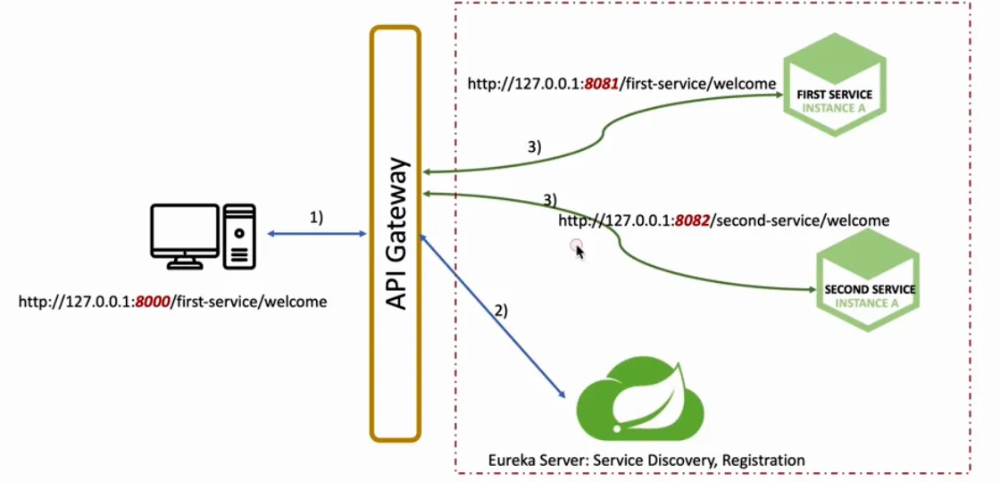

1. 클라이언트가 게이트웨이에 요청을 보낸다.
2. 게이트웨이는 해당 요청을 처리할 수 있는 서비스를 확인하고, 그 서비스의 위치를 유레카 서버에게 물어보고, 유레카 서버는 해당 정보를 알려준다.
3. 게이트웨이는 유레카에게 받은 서비스 위치 정보로 요청을 보내서 응답을 받고 클라이언트에게 응답한다. 이 과정에서 pre, post 필터가 동작할 수 있다.

다음 순서로 작업을 진행하겠습니다.

1. 게이트웨이, first, second 서비스에 유레카 클라이언트 추가해서 등록
2. 게이트웨이에 라우팅 정보 uri를 등록할 때 ip 대신 유레카에 등록된 이름 사용
3. 유레카 대시보드에서 등록된 서비스 확인

**유레카 클라이언트 추가 - 게이트웨이,first, second 서비스**

```yml
eureka:
  client:
    register-with-eureka: true
    fetch-registry: true
    service-url:
      defaultZone: http://localhost:8761/eureka
```

**게이트웨이 - 라우팅 정보 uri를 등록할 때 ip 대신 유레카에 등록된 이름 사용**

```yml
spring:
  application:
    name: apigateway-service
  cloud:
    gateway:
      server:
        webflux:
          default-filters:
            - name: GlobalFilter
              args:
                baseMessage: Spring Cloud Gateway WebFlux Global Filter
                preLogger: true
                postLogger: true
          routes:
            - id: first-service
              uri: lb://MY-FIRST-SERVICE
              predicates:
                - Path=/first-service/**
              filters:
                - CustomFilter
            - id: second-service
              uri: lb://MY-SECOND-SERVICE
              predicates:
                - Path=/second-service/**
              filters:
                - name: CustomFilter
                - name: LoggingFilter
                  args:
                    baseMessage: Hi,there.
                    preLogger: true
                    postLogger: true
```

{: .note}

**lb:// 스키마**

lb:// 스키마는 Spring Cloud LoadBalancer를 통해 Eureka에 등록된 서비스의 논리적 이름으로 요청을 라우팅할 때 사용됩니다. Gateway가 해당 서비스의 여러 인스턴스 중 하나를 선택하여 요청을 보냅니다.

{: .warning}

**랜덤 포트 지정**

port를 0으로 지정하여 랜덤 포트를 가지도록 하며 prefer-ip-address을 true로 설정합니다.

```yml
server:
  port: 0

spring:
  application:
    name: my-first-service

eureka:
  client:
    register-with-eureka: true
    fetch-registry: true
    service-url:
      defaultZone: http://localhost:8761/eureka
  instance:
    instance-id: ${spring.cloud.client.ip-address}:${spring.application.instance_id:${random.value}}
    prefer-ip-address: true
```

{: .q-left}

> Eureka에서 서비스 등록 시 기본 동작

- 클라이언트 애플리케이션이 **Eureka 서버**에 자신을 등록할 때, Eureka는 **호스트 이름(hostname)** 을 우선적으로 사용합니다.
   예: `my-first-service:8081` → 호스트명이 먼저 등록됨.
- 그런데, 다른 서비스에서 이 등록된 정보를 이용해 호출하려고 할 때, hostname을 DNS에서 제대로 못 찾거나 로컬 환경에서 hosts 설정이 안 되어 있다면 **접속 불가** 문제가 생길 수 있습니다.

따라서 **호스트명 대신 IP를 서비스 등록에 사용하기 위해** 👉 prefer-ip-address: true

{: .q-left}

> Spring Cloud Gateway가 Eureka에 등록된 동일한 마이크로서비스의 여러 인스턴스를 발견했을 때, 요청을 분산시키는 방식 중 하나는 무엇일까요?

Gateway는 서비스 디스커버리를 통해 얻은 인스턴스 목록을 기반으로 로드 밸런싱 알고리즘(예: Round-robin)을 적용합니다. 이를 통해 여러 인스턴스에 걸쳐 요청을 균등하게 분배할 수 있습니다.
