## What is Apache Kafka?

{: .q-left}

> 카프카(Kafka)란?

Apache Kafka는 **실시간 스트리밍 데이터의 수집, 저장, 처리에 최적화된 분산 이벤트 스트리밍 플랫폼**이다. 수많은 데이터 원천에서 끊임없이 생성되는 데이터를 안정적으로 받아들이고, 이를 필요한 애플리케이션이나 시스템에서 활용할 수 있도록 돕는다.

{: .q-left}

> 이벤트 스트리밍 플랫폼으로서의 Kafka

Kafka는 다음 세 가지 핵심 기능을 제공하여 **end-to-end 이벤트 스트리밍**을 구현한다:

1. 이벤트 스트림을 지속적으로 **발행(publish, write)** 하고, **구독(subscribe, read)** 할 수 있다.
2. 이벤트 스트림을 원하는 기간만큼 **내구성 있고 안정적으로 저장(store)**한다. (Kafka 클러스터의 브로커가 담당)
3. 이벤트 스트림을 **실시간 또는 과거 시점까지 거슬러 올라가 처리(process)** 할 수 있다.

{: .q-left}

> Kafka는 어디에 사용되나요?

Kafka는 크게 두 가지 목적에 활용된다.

- **실시간 스트리밍 데이터 파이프라인 구축**

  - 데이터를 안정적으로 처리하고, 한 시스템에서 다른 시스템으로 전달

  - 예: 사용자 활동 데이터를 수집해 웹사이트 사용 현황을 실시간으로 추적하고 분석하는 파이프라인

- **실시간 스트리밍 애플리케이션 개발**

  - 데이터 스트림을 직접 소비하고 활용하는 애플리케이션을 구현할 수 있다.

  - Kafka는 스트리밍 데이터를 저장하면서 동시에 애플리케이션이 데이터를 읽고 처리할 수 있도록 지원한다.

또한 Kafka는 **메시지 브로커 솔루션**으로서, 두 애플리케이션 간의 통신을 안정적으로 중재하는 역할도 자주 수행한다.

{: .q-left}

> 메시지 큐(Message Queue : MQ)

메시지 지향 미들웨어(Message Oriented Middleware:MOM)는 비동기 메시지를 사용하는 각각의 응용프로그램 사이의 데이터 송수신을 의미하고, **이를 구현한 시스템을 메시지큐(Message Queue:MQ)**라 한다.

많이 사용하는 오픈소스 MQ로는 **RabbitMQ, ActiveMQ, RedisQueue등이 있다.**

 

**Kafka는 이벤트 스트리밍 플랫폼**으로서 여러가지 역할을 할 수 있고 MQ처럼 메시지 브로커 역할을 할 수 있도록 구현하여 사용할 수도 있으며 기존 범용 메시지브로커들과 비교했을때 아래와 같은 특징을 가진다.

- **대용량의 실시간 로그 처리에 특화**되어 **TPS가 우수**하다. - **고성능**
- 분산 처리에 효과적으로 설계 되어 병렬처리와 확장(Scaleout), 고가용성(HA) 용이 - **클러스터링**
- 발행/구독(Publish-Subscribe) 모델 ( Push-Pull 구조 )
  - 메시지를 받기를 원하는 컨슈머가 해당 토픽(topic)을 구독함으로써 메시지를 읽어 오는 구조
  - 기존에 퍼블리셔나 브로커 중심적인 브로커 메시지와 달리 똑똑한 컨슈머 중심
  - 브로커의 역할이 줄어들기 때문에 좋은 성능을 기대할 수 있음
- 파일 시스템에 메시지를 저장함으로써 영속성(durability)이 보장
  - 장애시 데이터 유실 복구 가능
  - 메시지가 많이 쌓여도 성능이 크게 저하되지 않음
  - 대규모 처리를 위한 batch 작업 용이

  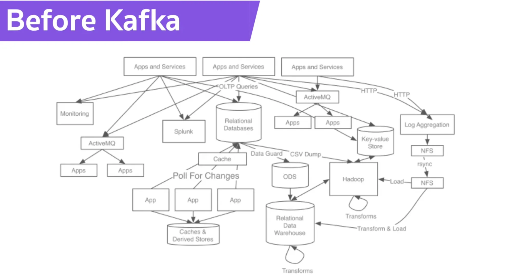
  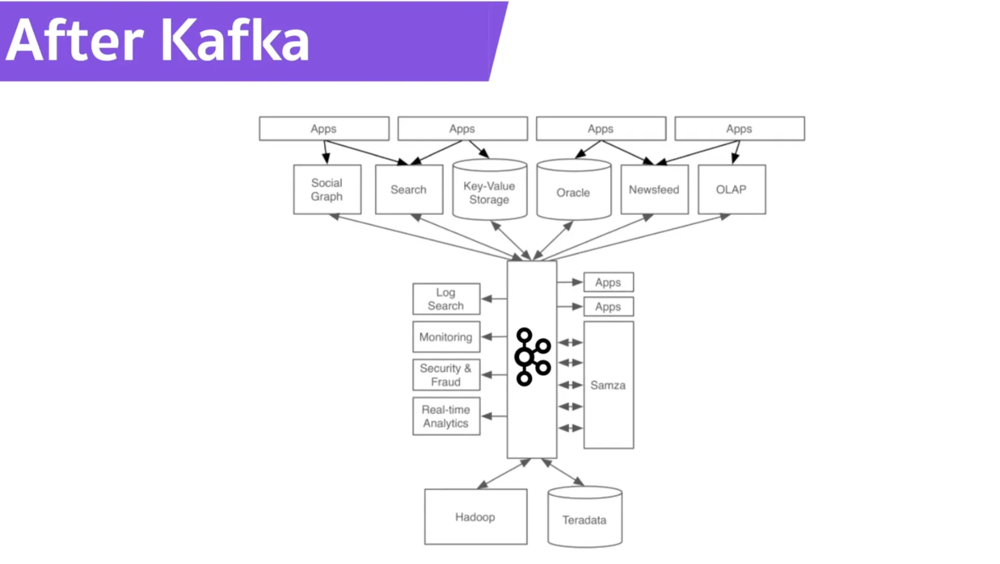

소스 애플리케이션과 타깃 애플리케이션의 연결이 일대일로 매우 복잡한 상태여서 데이터 전송 시 프로토콜 파편화 문제가 발생하지만 Kafka를 적용하면 두 애플리케이션 간의 커플링을 느슨하게 하여 문제점을 해결할 수 있다.

------

### 주요 개념 및 용어

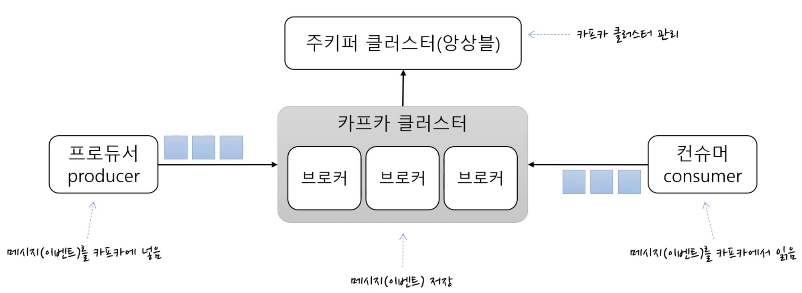

- **KafkaCluster** : 카프카의 브로커들의 모임. Kafka는 확장성과 고가용성을 위하여 broker들이 클러스터로 구성
- **Broker** : 각각의 카프카 서버, 동일 노드에 여러 브로커를 띄울 수 있다.
- **Zookeeper** : 카프카 클러스터 정보 및 분산처리 관리 등 **메타데이터 저장**. 카프카를 띄우기 위해 반드시 실행되어야 함
- **Producer** : **메시지(이벤트)를 발행하여 생산(Wirte)**하는 주체
- **Consumer** : **메시지(이벤트)를 구독하여 소비(Read)**하는 주체

{: .q-left}

> 토픽, 파티션, 오프셋

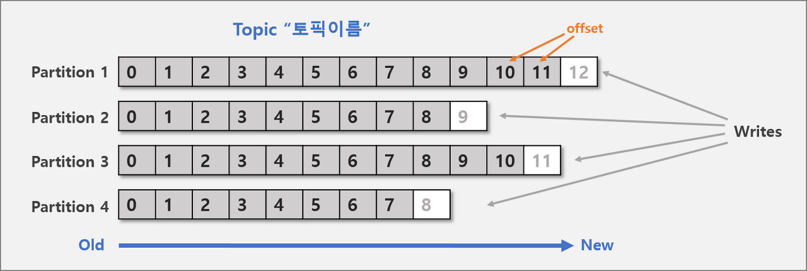

- **Topic** :  메시지를 구분하는 단위
  - 파일시스템의 폴더, 메일함과 유사
- **Partition** : 메시지를 저장하는 물리적인 파일
  - 한 개의 토픽은 한 개 이상의 파티션으로 구성됨
  - 파티션은 메시지 추가만 가능한 파일(append-only)
- **Offset** : 파티션 내 각 메시지의 저장된 상대적인 위치
  - 컨슈머는 오프셋 기준으로 마지막 커밋 시점부터 메시지를 순서대로 읽어서 처리
  - 파티션의 메시지 파일은 처리후에도 계속 저장되어 있으며 설정에 따라 일정시간 뒤 삭제

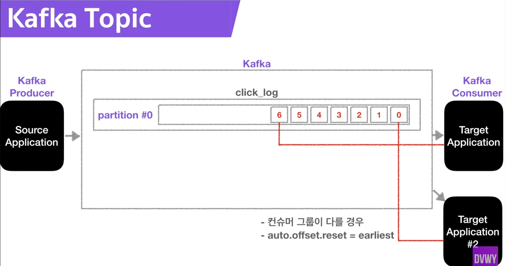

컨슈머가 새로 붙으면 기존에 큐에 있던 데이터를 가져갑니다. 단, 컨슈머 그룹이 달라야 하고 auto.offset.reset = earliest 옵션이 있어야 한다.

{: .important}

동일한 데이터를 다른 컨슈머가 재사용할 수 있다

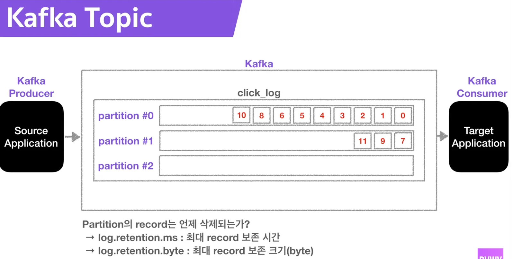

- 생산자에서 데이터를 발행할 때, 키가 null이면 기본 파티셔너를 사용하여 라운드 로빈으로 할당한다.
  - 만약 키가 있고 기본 파티셔너를 사용한다면, 키의 해시를 구해서 특정 파티션에 할당
- 파티션은 늘릴 수는 있지만 줄일 수는 없기에 늘릴 때는 주의해야 한다
  - 늘리는 이유 : 컨슈머 개수를 늘려서 데이터 처리를 분산시킬 수 있다.
- 파티션의 레코드 삭제 타이밍 : 레코드가 보존되는 시간과 크기를 지정할 수 있다.

------

{: .q-left}

> Producer

메시지(이벤트)를 발행하여 생산하는 주체

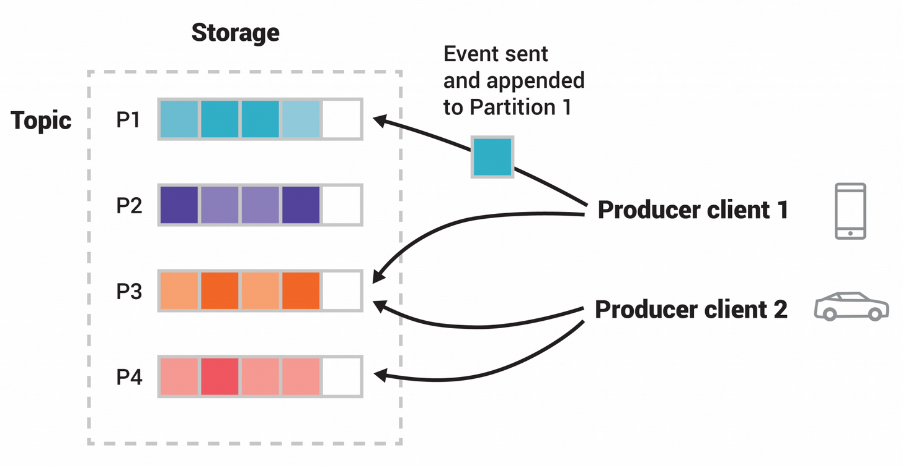

- 프로듀서는 메시지 전송 시 **토픽을 지정**
- 파티션은 **라운드 로빈** 방식 혹은 파티션 번호를 지정하여 넣을 수 있다.
- 같은 키를 갖는 메시지는 **같은 파티션에 저장되며 순서가 유지**

**Kafka 프로듀서 클래스**

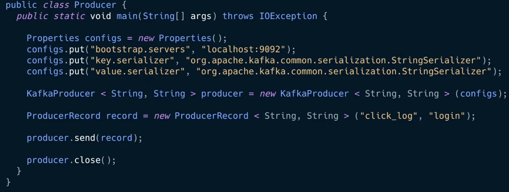

- KakaProducer : 카프카 프로듀서 인스턴스. 레코드(데이터)를 전송한다.
- ProducerRecord : 전송할 데이터 객체. click_log 토픽, key 없이 login이라는 value 전송

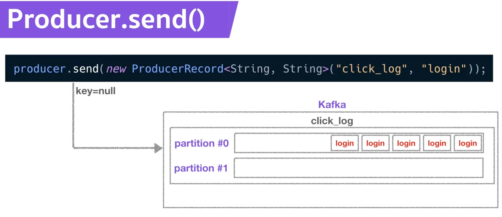

- key가 null이고, 파티션이 하나라면 : 큐에 차곡차곡 쌓임
- key가 null이고, 파티션이 두개라면 : 라운드 로빈 방식으로 쌓임

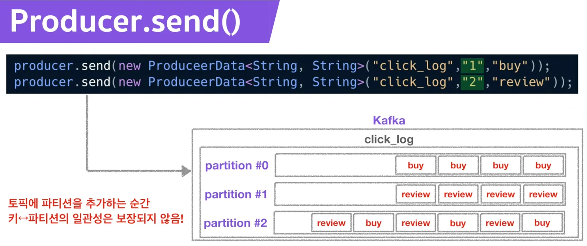

- key가 존재하고, 파티션이 두개일 때 : 하나의 파티션에 동일한 레코드가 쌓임
- 이때 파티션이 늘어난다면? : 키와 파티션의 일관성이 깨진다. 추후에 생성하면 안된다.

------

{: .q-left}

> Consumer

메시지(이벤트)를 구독하며 소비(Read)하는 주체

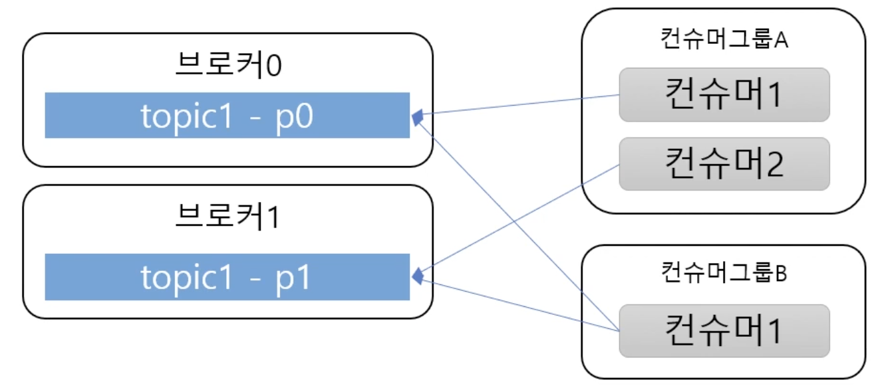

- **Consumer Group**
  - 메시지를 소비하는 컨슈머들의 논리적 그룹
  - Topic의 파티션은 컨슈머 그룹과 1:N 매칭 관계로 동일 그룹 내 한 개의 컨슈머만 연결 가능하다.
  - 이로써 파티션의 메시지는 순서대로 처리되도록 보장
  - 특정 컨슈머에 문제가 생겼을때 Fail over를 통한 리밸런싱 가능
  - 보통 파티션과 컨슈머는 1:1이 best practice로 봄
- **다른 메시징 서버와의 차이**
  - 다른 메시징 서버는 컨슈머가 데이터를 가져오면 그 데이터가 큐에서 삭제된다.
  - 하지만 카프카는 컨슈머가 데이터를 가져와도 토픽에 데이터가 남아있다.
  - 이러한 특징은 카프카를 데이터 파이프라인으로 운영하는데 매우 중요하다.

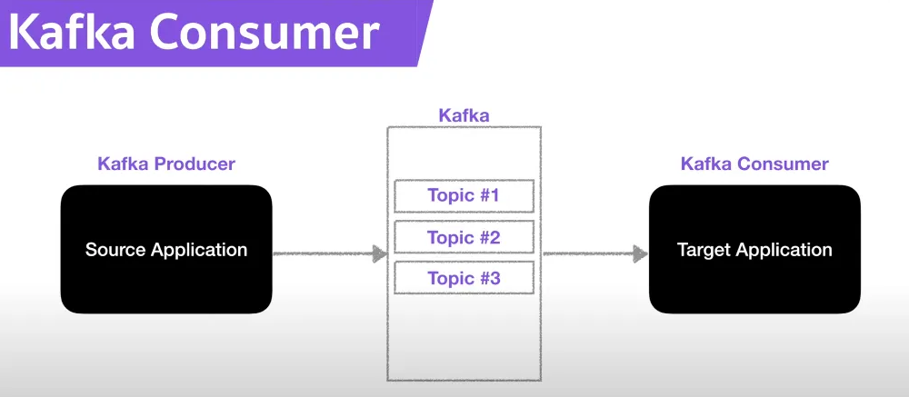

- **폴링** : 컨슈머가 토픽 내부 파티션에 저장된 데이터를 가져온다
- **컨슈머 역할** : 폴링 및 데이터 처리, 파티션의 데이터 번호인 offset 위치 기록, Consumer group으로 병렬 처리

**Kafka Consumer 클래스**

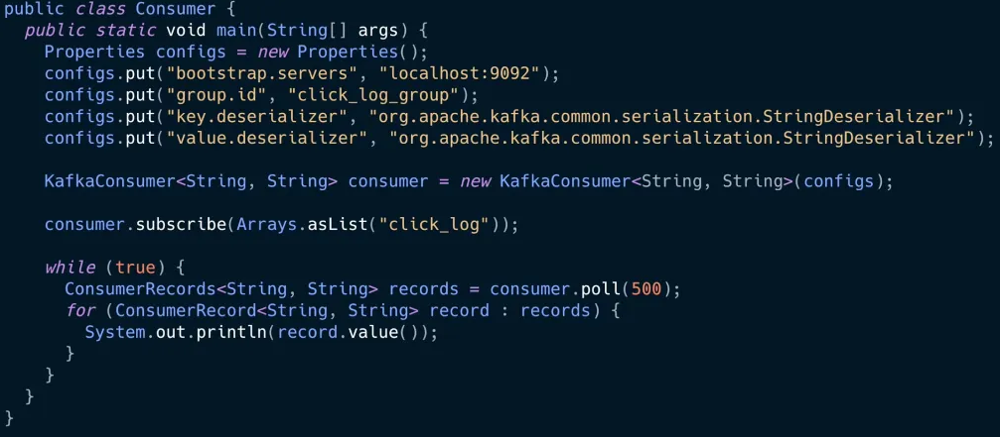

- **Properties** : 컨슈머 옵션, 부트 스트랩 서버, 컨슈머 그룹 아이디, key value 직렬화
- **KafkaConsumer** : 컨슈머 인스턴스로 데이터를 읽고 처리한다.
- **consumer.subscribe(토픽 이름들)** : 특정 토픽의 데이터를 가져온다
- **comsumer.assign(topicPartition)** : 특정 토픽의 특정 파티션에 있는 데이터를 가져온다
- **poll loop** : 브로커로부터 연속적으로, 컨슈머가 허락하는 만큼 데이터를 가져온다.

{: .tip}

**@KafkaListener** : 구독 + 메시지 소비 + 스레드 관리까지 Spring이 대신 처리

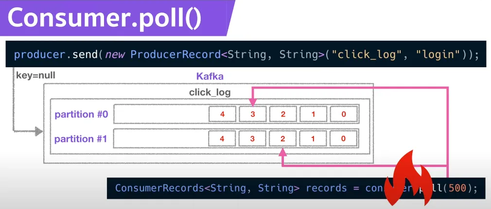

- **offset** : 파티션 내에서 데이터가 가지는 고유한 번호. 토픽별로 파티션별로 별개로 지정된다. 컨슈머가 데이터를 어느 지점까지 읽었는지 확인하는 용도로 사용한다.
- **__consumer_offsets 토픽** : 컨슈머가 데이터를 읽기 시작하면 오프셋을 커밋한다. 커밋한 오프셋은 이 토픽에 저장된다.
- **고가용성** : 만약 컨슈머가 죽더라도 오프셋 정보가 토픽에 남아있으므로, 컨슈머를 재실행하더라도 시작위치부터 다시 복구하여 실행할 수 있다.

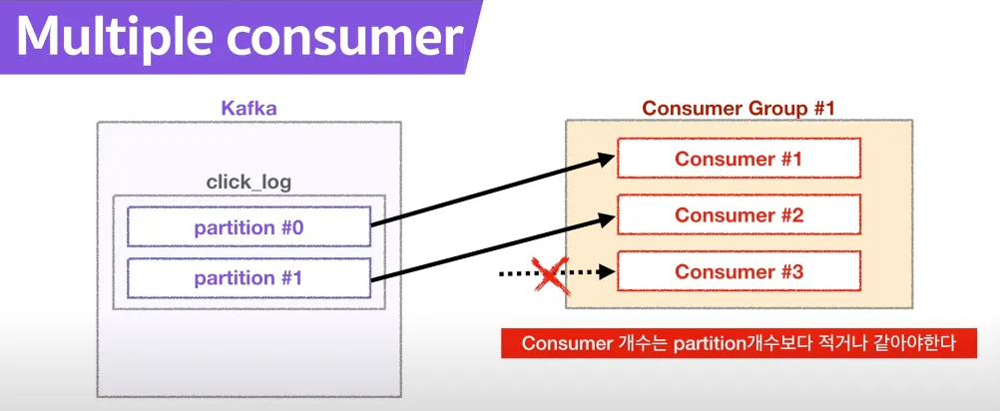

파티션이 두개있는 상황

- 컨슈머 1개 : 두개의 파티션에서 가져감
- 컨슈머 2개 : 각 컨슈머가 각각의 파티션에서 가져감
- 컨슈머 3개 : 세번째 컨슈머는 할당받을 파티션이 없으므로 동작하지 않음.

여러 파티션을 가진 토픽으로 컨슈머를 병렬처리 하고 싶다면, 컨슈머 개수는 파티션 개수보다 적거나 같아야 한다.

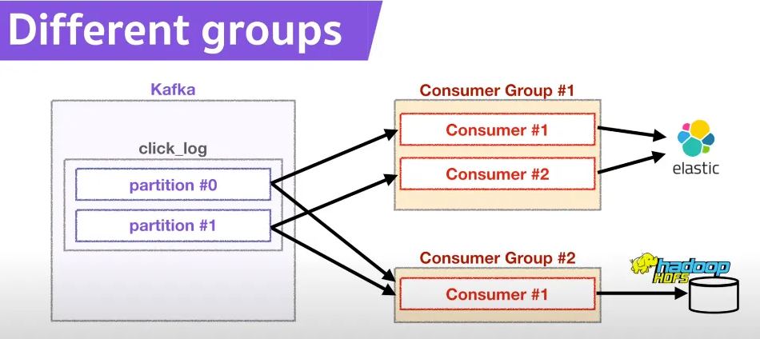

각기 다른 컨슈머 그룹에 속하는 컨슈머들은 다른 컨슈머 그룹에 영향을 미치지 않는다. 컨슈머 그룹은 다른 컨슈머 그룹과 함께 토픽을 동시에 읽을 수 있다. (병렬 처리)

데이터 시각화 및 분석을 위해 엘라스틱에 데이터를 전달하는 컨슈머 그룹과, 데이터 백업 용도로 하둡에 데이터를 저장하는 컨슈머 그룹이 있다고 가정하자.

__consumer_offsets 토픽은 컨슈머 그룹별로 offset을 나누어 저장하기 때문에, 엘라스틱 서치 그룹이 특정 오프셋을 읽고 있어도 하둡 그룹이 데이터를 읽는데 영향을 미치지 않는다.

{: .important}

**Consumer Lag** : Producer가 보낸 메시지 중 아직 Consumer가 읽지 못한 메시지의 갯수

프로듀서가 데이터를 넣는 속도가 컨슈머가 가져가는 속도보다 빨라진다면, 두 오프셋 간에 차이가 발생한다.

Lag이 **계속 증가** → 컨슈머 속도가 느리거나 문제가 발생해서 메시지가 쌓이게 됨.

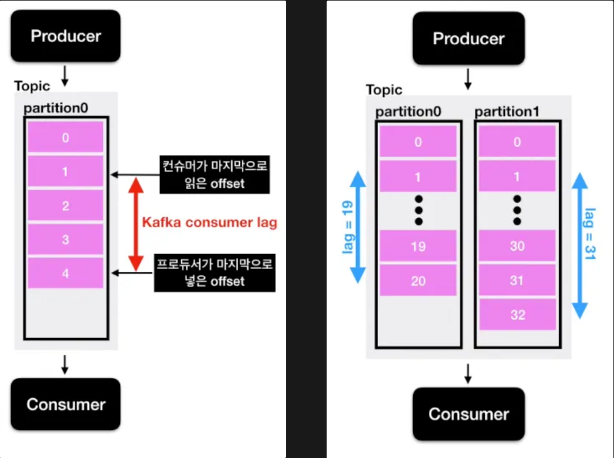

토픽에 여러 파티션이 존재하는 경우, 컨슈머 그룹에 대해 lag가 여러개 존재한다.

  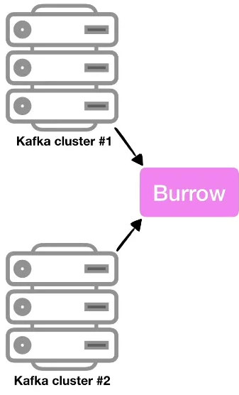

 

lag의 숫자를 통해 현재 해당 토픽에 대해 파이프라인으로 연계된 프로듀서와 컨슈머의 상태를 알 수 있는 모니터링 기술이 필요

**Burrow** : Kafka Consumer Lag 모니터링을 전담하는 독립 애플리케이션

- 컨슈머 내부에 의존하지 않고, 클러스터 외부에서 동작
- 여러 개의 Kafka 클러스터도 동시에 모니터링 가능

------

{: .q-left}

> Partitioner

프로듀서가 데이터를 보내면 무조건 파티셔너를 거쳐 브로커로 데이터가 전송된다. 파티셔너는 데이터를 토픽에 어떤 파티션으로 보낼지를 결정한다. 레코드에 포함된 메시지 키 또는 메시지 값에 따라 파티션의 위치가 결정된다.

- 디폴트 파티셔너는 UniformStickyPartitioner이다. 메시지 키가 있을 때는 해시값으로 변환하여 파티션에 할당한다.
- 동일한 키를 가진 레코드는 동일한 파티션으로 들어가기 때문에 순서를 지켜 데이터를 처리할 수 있다.
- 예를 들어 서울의 연속적인 온도 측정 값을 “서울” 키로 넣고 레코드를 지속적으로 보내면, 항상 동일한 파티션에 데이터가 순서대로 들어가기 때문에(큐) 컨슈머가 서울이라는 데이터를 순서를 지켜 처리할 수 있다.

메시지 키가 없으면 라운드 로빈으로 파티션에 들어간다. 이때 배치 단위로 데이터를 보내도 라운드 로빈으로 들어간다. 즉, 적절히 분배된다.

------

### Kafka Streams

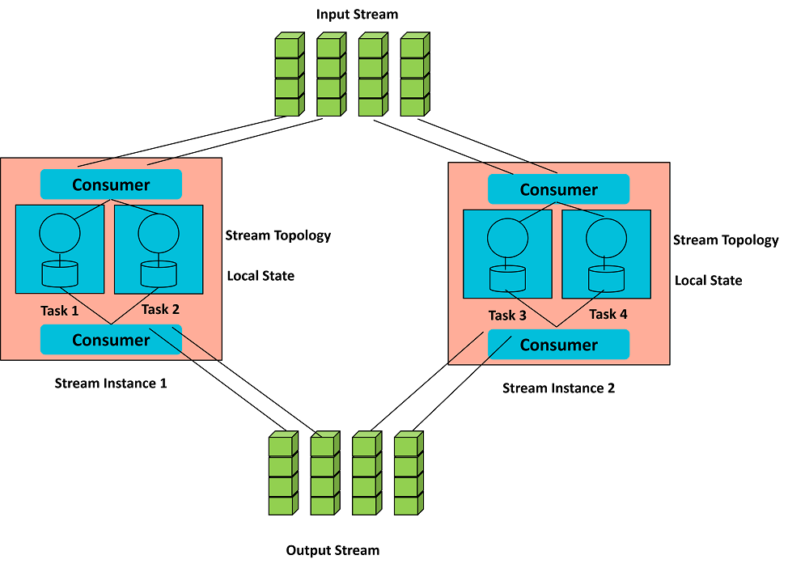

위 그림은  Kafka Streams가 입력 스트림(토픽)을 여러 Task로 분산 처리하고, 로컬 상태를 이용해 실시간 데이터 변환·집계 후 출력 스트림으로 내보내는 구조를 나타낸다.

**카프카 스트림**

- 실시간으로 끊임없이 발생하는 데이터를 처리하기 위한 프레임워크
- 토픽에 있는 데이터를 낮은 지연과 함께 빠른 속도로 처리할 수 있다.
- 이벤트 처리 기반 애플리케이션을 만들 수 있다

**카프카 스트림즈의 장점**

- **카프카와 완벽 호환**
  - 외부 툴(Spark, Logstash) 대비 데이터 유실/중복 없이 안정적이고 빠른 처리 가능
- **별도 스케줄링/클러스터 불필요**
  - 애플리케이션만 배포하면 동작, Spark처럼 대규모 클러스터 관리가 필요 없음

- **편리한 API 제공**
  - 스트림즈 DSL(간단 로직 처리) + 프로세서 API(복잡 로직 처리) 지원

- **로컬 상태 저장소 지원**

  - 상태 기반 처리(Stateful Processing) 지원

  - 상태는 로컬 저장 + 변경 로그는 카프카 토픽에 저장 → 장애 발생 시에도 복구 가능

------

### Kafka Connect

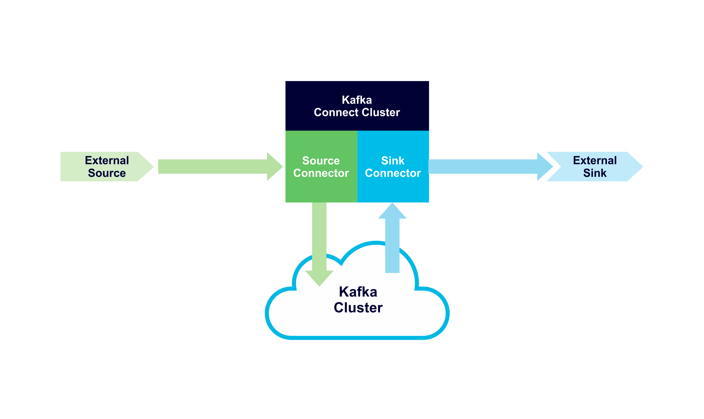

**카프카 커넥트**

- **반복적인 데이터 파이프라인을 쉽게 배포·관리할 수 있는 카프카 공식 컴포넌트**
- 외부 시스템(DB, ES, 파일 등)과 Kafka를 연결해주는 플랫폼

**커넥트 vs 커넥터**

- **커넥트 (Connect)**: 커넥터가 동작할 수 있도록 실행되는 **프로세스**
- **커넥터 (Connector)**: 특정 데이터 입출력 기능을 수행하는 **코드(jar 패키지)**

**커넥터 종류**

- **소스 커넥터**: 외부 DB → Kafka 토픽 (프로듀서 역할)
- **싱크 커넥터**: Kafka 토픽 → 외부 저장소(DB, ES 등) (컨슈머 역할)

**파이프라인 생성 방식**

- REST API + JSON 설정값만으로 파이프라인 생성 가능

예: OracleSinkConnector를 사용해 토픽 → 오라클 DB 테이블로 데이터 저장

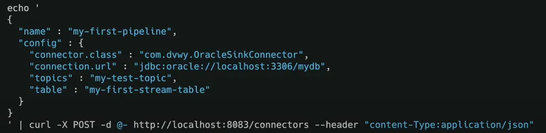

반복적인 데이터 파이프라인이 필요하다면, 일일이 컨슈머를 만드는 것보다는 커넥트를 구축해서 반복적으로 커넥트를 실행하는 편이 낫다. json 템플릿을 사용하기 때문에 빠르게 구현이 가능하다.

------

### Why Kafka?

- **고성능**

  - **다중 프로듀서 & 다중 컨슈머**가 간섭 없이 동시에 데이터 쓰기/읽기 가능.

  - **디스크 기반 이벤트 보존** → 데이터 유실 위험 적고, 컨슈머가 항상 켜져 있지 않아도 됨

  - **장애 복구** → 저장된 데이터를 재처리 가능

  - **OS 페이지 캐시 활용** → 디스크 I/O를 메모리처럼 빠르게 처리

  - **Zero Copy 지원** → 디스크 버퍼 → 네트워크 버퍼로 직접 복사, 성능 최적화

- **단순한 브로커, 똑똑한 컨슈머**

  - 브로커는 **파티션과 컨슈머 매핑 관리**에 집중 → 고성능 유지

  - 메시지 필터링, 재전송 같은 기능은 **프로듀서/컨슈머**가 담당

- **배치 처리 (Batch)**

  - **프로듀서**: 일정 크기만큼 메시지를 모아 전송 → 전송 효율↑

  - **컨슈머**: 최소 크기만큼 메시지를 모아 읽기 → 처리량↑

- **확장성 (Scalability)**
  - **수평 확장** 용이 → 브로커, 파티션, 컨슈머 추가로 처리량 확장 가능.

- **고가용성 (High Availability)**

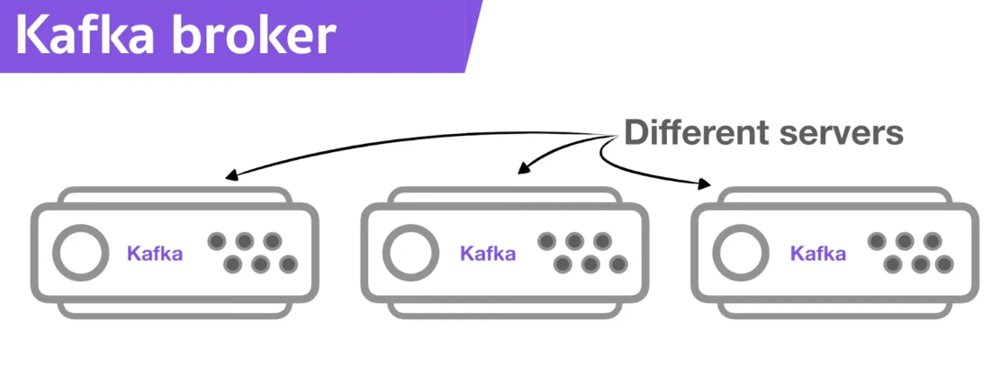

토픽은 파티션 단위로 클러스터 내 여러 서버에 분산 저장

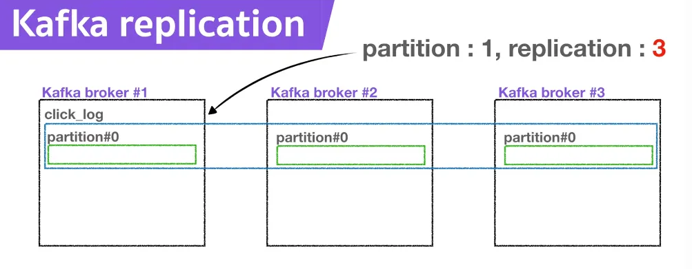

- **Replication**: 파티션 복제본을 여러 브로커에 분산 저장
  - replication-factor로 복제 개수 지정
  - 예: factor=2 → 파티션이 두 브로커에 복제됨

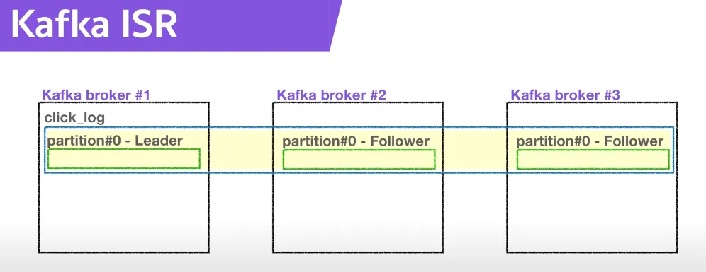

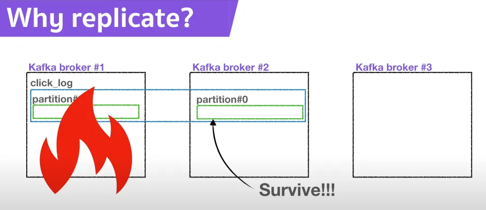

- **리더-팔로워 구조**

  - 프로듀서/컨슈머는 리더를 통해서만 메시지 처리

  - 팔로워는 리더를 복제

  - 리더 브로커 장애 시 → 팔로워가 리더로 승격(failover)

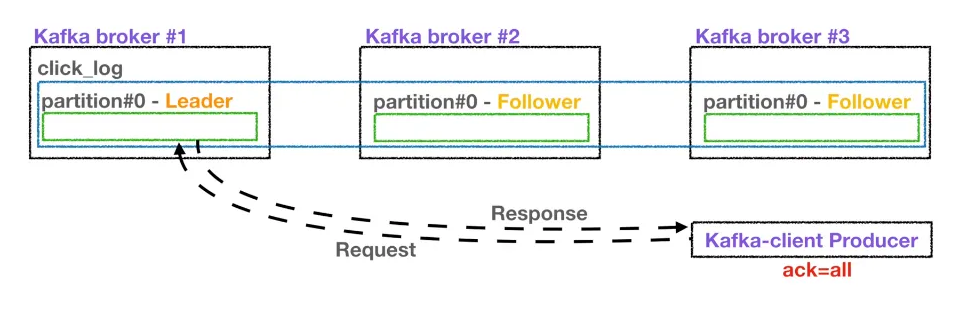

- **leader** : producer가 생산한 데이터를 보내는 브로커의 파티션
- **ack=0** : 프로듀서가 브로커에 데이터를 전송하고, 응답값을 받지 않는다. leader에 데이터가 잘 전달됐는지, 복제가 됐는지 확인 불가능하다. 속도는 빠르지만 데이터 유실 가능성이 있다.
- **ack=1** : leader에 데이터가 잘 전달됐는지 응답하지만, 복제가 됐는지 확인 불가능하다. 만약 리더가 데이터를 받은 직후 장애가 난다면 복제가 잘 됐는지 알 수 없으므로 데이터 유실 가능성이 있다.
- **ack=all** : leader에 데이터가 잘 전달됐는지, 복제가 됐는지 확인한다. 데이터 유실은 없지만, 복제가 될 때까지 기다려야하므로 시간이 오래 걸린다.

{: .tip}

replica의 수가 많아지만 고가용성이 높아지지만, 그만큼 중복되는 데이터가 많아지고, 브로커 리소스 사용량이 많아진다.

------

### 내용 정리

#### 1. 기본 개념

- **분산 메시징 플랫폼** : Kafka는 데이터를 **실시간 스트리밍** 형태로 주고받을 수 있는 분산 메시징 시스템
- **핵심 구성 요소**
  - **Producer**: 메시지를 생성해서 특정 토픽(Topic)에 전송
  - **Broker**: 메시지를 저장하고 관리하는 Kafka 서버
  - **Consumer**: 토픽으로부터 메시지를 읽는 주체
  - **Topic/Partition**: 메시지를 저장하는 단위(토픽은 파티션으로 나뉘어 병렬 처리 가능)

#### 2. 메시징 모델 결합

- **Queue 모델**
  - 여러 Consumer가 하나의 Queue에서 메시지를 나눠서 처리 → **작업 분산(확장성)**
- **Publish-Subscribe 모델**
  - 여러 Consumer가 동일한 메시지를 각각 받아볼 수 있음 → **다중 구독**
- Kafka는 **파티셔닝된 로그 구조**로 이 두 가지 장점을 모두 통합

#### 3. 파티셔닝된 로그

- **로그(Log)**: 시간 순서대로 기록된 메시지들의 연속
- **파티션(Partition)**: 하나의 토픽을 여러 개로 나누어 저장
  - 각 파티션은 독립적으로 메시지를 저장하고 **오프셋(offset)**으로 순서를 관리
  - Consumer 그룹이 있을 때, 각 Consumer는 특정 파티션만 읽어서 **부하 분산**이 가능

#### 4. 확장성과 유연성

- **여러 Consumer 그룹**이 동시에 같은 토픽을 읽을 수 있음
- Consumer는 **자신의 오프셋**을 관리 → 원하는 시점으로 다시 읽기(**재처리/재생 가능**)
- Broker는 단순히 로그 저장과 파티션 관리에 집중 → **성능 극대화**
- 장애가 발생해도 저장된 로그를 기반으로 메시지를 다시 읽을 수 있어 **내결함성** 제공

**게시-구독**

------

## Apache Kafka 와 RabbitMQ의 차이점은 무엇인가요?

| **특징**          | **Apache Kafka**                                             | **RabbitMQ**                                                 |
| ----------------- | ------------------------------------------------------------ | ------------------------------------------------------------ |
| **아키텍처**      | Kafka는 메시징 큐와 게시 구독 접근 방식을 결합하는 분할된 로그 모델을 사용 | RabbitMQ는 메시징 큐를 사용                                  |
| **확장성**        | Kafka는 여러 서버에 파티션을 분산할 수 있도록 지원함으로써 확장성을 제공 | 대기열에 있는 소비자 수를 늘려 경쟁 소비자 전체로 처리를 확장 |
| **메시지 보존**   | 예를 들어 정책에 기반한 경우, 메시지를 하루 동안 저장할 수 있다. 사용자는 이러한 보존 기간을 구성할 수 있다. | 승인에 기반한 경우, 메시지가 소비되면 삭제                   |
| **다수의 소비자** | Kafka에서는 일정 기간 동안 동일한 메시지를 재생할 수 있으므로 여러 소비자가 동일한 주제를 구독할 수 있다. | 메시지는 소비될 때 제거되므로 여러 소비자가 모두 동일한 메시지를 받을 수는 없다. |
| **복제**          | 토픽은 자동으로 복제되지만 사용자가 토픽을 복제하지 않도록 수동으로 구성할 수 있다. | 메시지는 자동으로 복제되지 않지만 사용자가 메시지를 복제하도록 수동으로 구성할 수 있다. |
| **메시지 정렬**   | 각 소비자는 분할된 로그 아키텍처로 인해 정보를 순서대로 수신한다. | 메시지는 대기열에 도착한 순서대로 소비자에게 전달된다. 경쟁 소비자가 있는 경우, 각 소비자는 해당 메시지의 일부를 처리한다. |
| **프로토콜**      | Kafka는 TCP를 통한 바이너리 프로토콜을 사용한다.             | 플러그인을 통해 지원되는 고급 메시징 큐 프로토콜(AMQP): MQTT, STOMP. |

