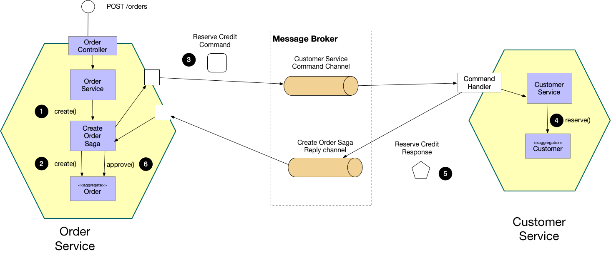
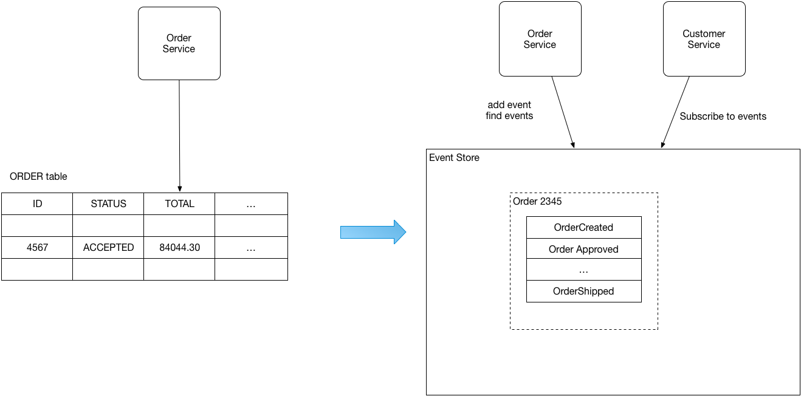

마이크로서비스 환경에서 트랜잭션이 여러 서비스에 걸쳐있기 때문에 일관성을 지키는 것은 쉽지 않다.
그래서 여러 서비스에서 트랜잭션을 구현할 수 있는 과정이 필요하다.

## Two Phase Commit

분산 트랜잭션을 일관되게 커밋하기 위한 분산 합의 프로토콜

분산 DB 환경에서 쓰는 방법으로 주로 RDBMS에서 기능을 제공한다. Two-Phase Commit은 말 그대로 2단계에 걸쳐 데이터를 영속화 하는 작업이다. 위 그림과 같이 여러 DB가 분산되었을 때, 트랜잭션을 조율하는 조정자와 트랜잭션에 참여하는 참가자가 존재한다. 조정자는 트랜잭션 요청이 들어왔을 때 두 단계를 거쳐 트랜잭션 진행을 담당한다.

🔹 **동작 과정**

**1단계 : Prepare Phase**

1. **Coordinator** 가 모든 Participant 에게 "트랜잭션 실행 가능하니?" 라고 **Prepare 요청**을 보냄

2. 각 **Participant** 는 실제 작업을 실행해보고, 문제가 없으면 데이터를 잠그고 "Yes(Commit 가능)" 응답

3. 문제가 있으면 "No(Abort)" 응답

**2단계 : Commit Phase( 커밋/중단 단계)** 

- 모든 Participant 가 "Yes"를 보냈으면 → Coordinator 는 "Commit" 명령을 내려 트랜잭션을 확정

- 하나라도 "No"를 보냈으면 → Coordinator 는 "Rollback" 명령을 내려 전체 취소

🔹 **장점**

- **원자성(Atomicity)** 보장 → 모두 커밋하거나 모두 롤백
- **일관성(Consistency)** 유지 → 분산 환경에서도 데이터 무결성 확보

🔹 **단점**

- **Blocking 문제**: Coordinator 장애 시 Participant 는 잠금(lock) 상태로 대기 → Deadlock 가능

- **Coordinator Single Point of Failure**: Coordinator 가 죽으면 전체 트랜잭션 진행 불가

- **성능 문제**: 네트워크 왕복이 많아져서 지연(latency) 발생

------

## Saga Pattern

이전에는 분산 트랜잭션을 관리하기 위해  2PC(two-phaze commit) 프로토콜을 이용했다.
모든 참가자가 커밋하거나 롤백할지에 대해 관여했기 때문에 트랜잭션 관리가 가능했다. 하지만 같은 DB 여야 하고, DB가 분산 트랜잭션을 지원해야 한다는 단점이 있었다.

Saga Pattern 은 분산 트랜잭션 환경에서 메시지 또는 이벤트를 주고 받으며 서비스 간의 데이터 일관성을 지키기 위한 패턴이다.
이 패턴은 로컬 트랜잭션을 사용하며, 트랜잭션이 실패되면 변경된 내용을 취소하는 보상 트랜잭션을 실행한다.

Saga 패턴은 트랜잭션의 관리주체가 DBMS가 아닌 Application에 있다. App이 분산되어있을 때, 각 App 하위에 존재하는 DB는 Local 트랜잭션 처리만 담당한다.

따라서 각각의 App에 대한 연속적인 트랜잭션 요청 및 실패의 경우에 Rollback 처리(보상 트랜잭션)을 Application에서 구현해야 한다.

Saga 패턴은 위 그림과 같이 연속적인 업데이트 연산으로 이루어져 있으며, 전체 데이터가 동시에 영속화되는 것이 아니라 순차적인 단계로 트랜잭션이 이루어진다. 따라서 Application 비즈니스 로직에서 요구되는 마지막 트랜잭션이 끝났을 때, 데이터가 완전히 영속되었음을 인지하고 이를 종료한다.

Two-Phase Commit과 다르게 Saga를 활용한 트랜잭션은 데이터 격리성(Isolation)을 보장해주지 않는다. 하지만 Application의 트랜잭션 관리를 통해 최종 일관성(Eventually Consistency)을 달성할 수 있기 때문에 분산되어있는 DB간에 정합성을 맞출 수 있다. 또한 트랜잭션 관리를 Application에서 하기 때문에 DBMS를 다른 제품군으로 구성할 수 있는 장점이 있다.

하지만 이러한 일관성을 달성하기 위해서는 프로세스 수행 과정 상 누락되는 작업이 없는지 면밀히 살펴야하며, 실패할 경우 에러 복구를 위한 보상 트랜잭션 처리에 누락이 없도록 설계해야 한다.

{: .q-left}

> Saga Pattern 종류

Saga Pattern 을 구현하는 방법에는 보통 Orchestration과 Choreography 두 가지 방법이 존재한다.

### Orchestration

오케스트레이션(orchestration)은 오케스트레이터(orchestrator) 라는 중앙 컨트롤러가 보상 작업을 트리거하는 방식이다.

이 오케스트레이터는 모든 트랜잭션을 처리하고 수행해야 하는 작업을 메세지를 보내 참여자들과 통신한다. 오케스트레이터는 작업의 상태를 저장 및 해석하고 있어서 분산 트랜잭션의 중앙 집중화가 이루어지고 데이터 일관성을 지킬 수 있다.

- 서비스의 Saga 모듈이 존재
- 마이크로 서비스들의 로컬 트랜잭션이 오케스트레이터에 의해 호출, 상태값 설정
- 참여자들의 트랜잭션이 모두 처리되면 서비스의 상태 변경
- 특정 서비스에서 오류가 발생되면 보상 트랜잭션 호출

**주문 생성 애플리케이션 예제**

1. Order Service 에서 POST /orders 수신 및 오케스트레이터에 주문 생성 알림
2. PENDING 상태의 주문 생성
3. Customer Service에 Reserve Credit 명령 요청
4. Reserve Credit 수행
5. 응답 메세지 수신
6. 오케스트레이터가 주문 생성을 승인하거나 거부

만약 중간에 실패하게 되면 아래 그림과 같이 Orchestrator에서 보상 트랜잭션을 발동하여 일관성을 유지하도록 한다.

모든 관리를 오케스트레이터가 호출하기 때문에 분산 트랜잭션의 중앙 집중화가 이루어진다. 따라서 **서비스간의 복잡성이 줄어들고 구현 및 테스트가 상대적으로 쉽다**. 또한 트랜잭션의 현재 상태를 오케스트레이터가 알고 있기 때문에 **롤백을 쉽게** 할 수 있는 것 또한 장점이다. 하지만 이를 관리하기 위한 Orchestrator 서비스가 추가되어야 하기 때문에 인프라 구현의 복잡성이 증가되는 단점이 존재한다.

### choreography

코레오그래피(choreography)는 **중앙 제어 없이** 서비스끼리 이벤트로 통신하는 방법이다. 자신이 보유한 서비스 내 local 트랜잭션을 관리하며, 트랜잭션이 종료되면 완료 이벤트를 발행한다. 만약 그 다음으로 수행해야 할 트랜잭션이 있다면, 해당 트랜잭션을 수행해야하는 App에서 완료 이벤트를 수신받고 다음 작업을 처리한다. 

이때 Event는 Kafka와 같은 메시지 큐를 이용해서 비동기 방식으로 전달할 수 있다.

- 트랜잭션이 실패한다면 보상 이벤트를 발행하여 롤백
- 메시지를 발행하는 동작도 트랜잭션에 포함되어야 함

Choreography-Based Saga 방식에서는 각 App별로 트랜잭션을 관리하는 로직이 있다. 따라서 중간에 트랜잭션이 실패하면, 해당 트랜잭션 취소 처리를 실패한 App에서 보상 이벤트를 발생하여 Rollback 처리를 시도한다.

위와 같은 구성은 구축하기 쉬운 장점이 있으나, 운영자의 입장에서 트랜잭션의 현재 상태를 알기가 어렵다.

**주문 생성 애플리케이션 예제**

1. Order Service 에서 POST /orders 수신 및 PENDING 상태 주문 생성
2. 주문 생성(Order Created) 이벤트 발행
3. Customer Service 에서 이벤트 수신하고 Reserve Credit 명령 수행
4. Reserve Credit 결과 이벤트 발행
5. Order Service 에서 주문을 승인 또는 거절 수행

------

## Event Sourcing

**어플리케이션의 모든 상태 변화를 순서대로 이벤트로 보관하여 처리하는 개념**이다. 이렇게 모든 상태를 이벤트의 흐름으로 처리하므로써 어플리케이션 개발을 간소화하고 분산환경에 적절히 대응할 수 있다. 데이터의 일관성과 트랜잭션 처리가 가능하며, 데이터 저장소의 개체를 직접 업데이트 하지 않기 때문에, 동시성에 대한 충돌 문제를 해결할 수 있다.

모든 이벤트는 시간 순으로 기록이 되며 각 서비스들은 자신이 필요한 이벤트만 보고 있다가 최신의 상태를 유지하면 된다.

🔹 **메시지 중심의 비동기 작업 처리**

회원관리 서비스는 회원의 생성 삭제, 또는 변경 이벤트만 참조하여 회원의 최신정보(snapshot)을 가지고 빠르게 최신 정보를 유지할 수 있으며, 상품 관련 서비스는 상품의 주문, 배송 등과 관련된 이벤트만 참조(Listening)하고 최신 상태를 유지한다.

이러한 Event Sourcing이 완벽하게 동작하려면 모든 이벤트는 기록되어야 하고, 이벤트를 받지 못하는 서비스가 없도록 재전송이 가능해야한다. 또한 이벤트는 자신의 서비스 또는 WAS 내에서만 받을 수 있는 것이 아니라 브로드캐스팅이 되어야 분산된 환경에서도 완벽하게 동작할 수 있어야 한다.

Event Sourcing의 이러한 특징 때문에 MSA 시스템을 적용할 때 Event 기반으로 구현하면 보다 손쉽게 구현이 가능하며, 각 서비스 간의 loosed coupling이 가능하다.

------

## **CQRS(Command Query Responsibility Separation)**

Event Sourcing과 항상 함께 알아두어야 할 개념으로 CQRS가 있으며 간단히 설명하면 Command와 Query의 책임을 분리해서 복잡한 도메인 로직을 단순화하자는 것이다.

Command는 일반적인 Database 기준으로 상태를 변경하는 Create, Update, Delete와 같은 메소드로 생각할 수 있으며, Query는 단순 데이터를 조회하기 위한 Read 메소드로 생각할 수 있다. 전에 설명한 Event Sourcing과 연계시켜 생각해보면 Event는 Command 즉 상태 변경되는 경우만 발생하고 그 경우만 기록하면 된다. 단순 Query인 경우는 모델의 정보를 변화시키지 않기 때문에 그 기능을 분리하여 좀 더 손쉽게 Event Sourcing Pattern을 적용할 수 있다.

또한 Event Sourcing 개념에 의해 생성된 최신 데이터(snapshot)는 CQRS에서 Query의 개념으로만 접근하여 조회하기 때문에 로직을 간략화하고 cache를 통해 조회속도를 손쉽게 개선할 수 있다.
