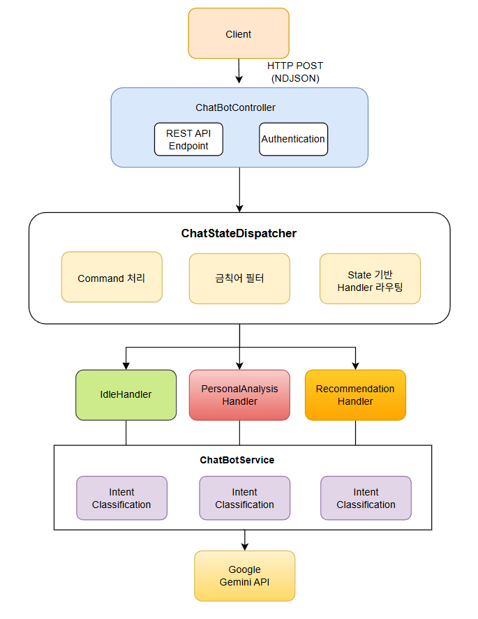

### 프로젝트 소개

자연어 대화를 통해 사용자의 통신 성향을 분석하고, 최적의 요금제를 추천하는 지능형 서비스

🗣️ **자연어 상담**을 통한 맞춤형 요금제 추천

🛡️ **금칙어 관리, 사용자 분석** 및 관리자 백오피스를 통한 서비스 품질 향상

🧠 **대화 토픽 분류**를 통한 질문 문맥 기반 대화 가능

🗂️ **Redis 와 MongoDB**를 활용한 대화 내역 저장 및 분석

📊 **Elsaticsearch + Kibana** 연동으로 사용자 행동 로그 시각화 및 분석

------

### 주요 기능

1. **회원가입 / 로그인**: JWT 기반의 RTR(Refresh Token Rotation) 방식을 적용해 보안성을 강화했고, Spring Security와 연동하여 접근 제어 관리

2. **보안**: 역할(Role) 기반 접근 제한을 적용하여 사용자의 권한에 따라 접근 가능한 리소스를 구분

3. **마이페이지**: 사용자가 자신이 가입한 요금제, 데이터 사용량, 개인 정보를 직관적으로 조회할 수 있도록 구현

4. **요금제 검색 및 비교**: 다양한 요금제를 탐색할 수 있는 목록 페이지와 상세 조회 페이지를 제공하며, 여러 요금제를 동시에 AI를 통해 비교할 수 있는 기능 지원

5. **AI 챗봇 상담** (멀티턴 지원): Gemini 기반의 자연어 처리 모델을 활용해 단순 질의응답을 넘어 **멀티턴 대화**를 지원. 사용자의 이전 대화 맥락을 반영해 보다 자연스럽고 일관된 상담이 가능하며, 요금제 추천과 리뷰 요약을 함께 제공

6. **금칙어 관리**: 관리자 백오피스에서 금칙어를 등록·관리할 수 있도록 하여 상담 품질을 유지

7. **대시보드**: Elasticsearch + Kibana 기반 대시보드를 제공해 챗봇 대화 로그, 사용자 의도 분류 결과, 응답 시간 등을 실시간으로 시각화하고, 이를 바탕으로 서비스 품질을 모니터링

8. **추천 질문 제공**: Elasticsearch에 임베딩된 질문 데이터와 사용자의 입력을 벡터 유사도 기반으로 비교하여, 상황에 맞는 **추천 질문**을 제공합니다. 이를 통해 사용자는 추가적으로 물어볼 수 있는 유사 질문을 빠르게 확인할 수 있다
9. **음성 기반 질문 입력(STT)**: 음성 인식(STT)을 적용해 사용자가 키보드 입력 없이 **음성으로 질문을 전달**할 수 있으며, 이 역시 멀티턴 문맥 안에서 처리된다

------

###  기술 스택

**Backend**

[](https://github.com/msdio/stackticon)

**Frontend**

[](https://github.com/msdio/stackticon)

**AI/ML**

[](https://github.com/msdio/stackticon)

**DevOps & Monitoring**

[](https://github.com/msdio/stackticon)

- **Backend Framework**: Spring Boot (WebFlux - Reactive)
- **LLM**: Google Gemini API
- **State Management**: Redis (Reactive)
- **Database**: MongoDB, Elasticsearch
- **Logging**: Elasticsearch
- **Embedding**: Python FastAPI 서비스

------

### 시스템 아키텍처 (ChatBot)

**전체 구조도**



**레이어 구조**

```
Controller Layer
    ↓
Dispatcher Layer (State Management)
    ↓
Handler Layer (State-specific Logic)
    ↓
Service Layer (Business Logic)
    ↓
Repository Layer (Data Access)
```

------

### 기술적 특징

**1. Reactive Programming**

**WebFlux 기반 비동기 처리**:

```
Flux: 다중 응답 스트리밍
Mono: 단일 비동기 작업
논블로킹 I/O로 높은 동시성 처리
```

**예시**:

```java
return chatBotService.classifyUserIntent(message, history)
    .flatMapMany(result -> {
        Mono<ChatResponseDto> waitMessage = buildWaitMessage(result);
        return waitMessage.concatWith(handleGeneralTopic(...));
    });
```

**2. 전략 패턴 (Strategy Pattern)**

**프롬프트 전략**:

```
토픽별 독립적인 프롬프트 생성 로직
확장 가능한 구조
Spring 의존성 주입을 통한 자동 등록
```

**3. 상태 패턴 (State Pattern)**

**Handler 기반 상태 관리**:

```
상태별 독립적인 처리 로직
상태 전환 명확성
Redis를 통한 상태 영속성
```

**4. 팩토리 패턴 (Factory Pattern)**

**PromptStrategyFactory**:

```
토픽별 전략 자동 매핑
런타임 전략 선택
EnumMap을 통한 O(1) 조회
```

**5. 프로세서 패턴**

**Cross-cutting Concerns 처리**: 관심사 분리로 핵심 로직 단순화

```
ForbiddenWordProcessor: 금칙어 필터링
ChatLogProcessor: 로깅 및 데이터 저장
```

**6. 성능 최적화**

**비동기 병렬 처리**: 여러 로깅 작업을 병렬로 처리 -> 응답 지연 최소화

```java
return Mono.when(
    chatLogProcessor.saveRecentLog(...),
    chatLogProcessor.savePermanentLog(...),
    chatLogProcessor.saveEmbeddingIfNeeded(...),
    chatLogProcessor.saveElasticsearchLog(...)
).thenReturn(response);
```

------

### 핵심 컴포넌트

{: .important}

**ChatBotController**

**역할**: REST API 엔드포인트 제공 및 인증 처리

```java
@RestController
@RequestMapping("/api/chat")
public class ChatBotController {
    @PostMapping(produces = MediaType.APPLICATION_NDJSON_VALUE)
    public Flux<ChatResponseDto> chat(
        @AuthenticationPrincipal CustomUserDetails userDetails, 
        @RequestBody ChatRequestDto requestDto
    ) {
        return chatStateDispatcher.dispatch(userDetails.getUserId(), requestDto);
    }
}
```

- `APPLICATION_NDJSON_VALUE`: Server-Sent Events를 통한 스트리밍 응답
- Spring Security를 통한 사용자 인증
- Reactive Streams (`Flux`)를 사용한 비동기 처리

------

{: .important}

**ChatStateDispatcher**

**역할**: 사용자 요청을 현재 상태에 맞는 Handler로 라우팅

**2.1 Command 처리**

```java
public Flux<ChatResponseDto> dispatch(String userId, ChatRequestDto requestDto) {
    ChatCommand command = requestDto.getCommand();
    
    if (command.equals(ChatCommand.START_ANALYSIS)) {
        return chatStateService.setState(sessionId, ChatState.AWAITING_PERSONAL_ANALYSIS_START)
                .thenMany(dispatchByCurrentState(userId, requestDto));
    }
    
    if (command.equals(ChatCommand.CANCEL)) {
        return chatStateService.setState(sessionId, ChatState.IDLE)
                .thenReturn(ChatResponseDto.ofInfoReply(...)).flux();
    }
    
    return dispatchByCurrentState(userId, requestDto);
}
```

**2.2 금칙어 필터링**

```java
private Flux<ChatResponseDto> dispatchByCurrentState(String userId, ChatRequestDto requestDto) {
    // 금칙어 필터링
    Flux<ChatResponseDto> filtered = forbiddenWordProcessor.filter(requestDto);
    if (!filtered.equals(Flux.empty())) {
        return filtered;
    }
    // ... 상태 기반 라우팅
}
```

**2.3 상태 기반 Handler 라우팅**

```java
return chatStateService.getState(requestDto.getSessionId())
    .flatMapMany(state -> {
        ChatStateHandler handler = handlerMap.getOrDefault(state, defaultHandler);
        return handler.handle(userId, requestDto);
    })
    .flatMap(response -> {
        // 로깅 및 후처리
        if (requestDto.getCommand() == ChatCommand.CHAT && 
            response.getType() != ChatResponseType.WAITING) {
            return Mono.when(
                chatLogProcessor.saveRecentLog(userId, requestDto, response),
                chatLogProcessor.savePermanentLog(userId, requestDto, response),
                chatLogProcessor.saveEmbeddingIfNeeded(requestDto.getMessage()),
                chatLogProcessor.saveElasticsearchLog(...)
            ).thenReturn(response);
        }
        return Mono.just(response);
    });
```

**Handler 맵 초기화**:

```java
@PostConstruct
public void init() {
    for (ChatStateHandler handler : handlers) {
        handlerMap.put(handler.getState(), handler);
    }
}
```

------

{: .important}

**ChatStateHandler 인터페이스**

**역할**: 상태별 처리 로직을 캡슐화하는 전략 패턴

```java
public interface ChatStateHandler {
    ChatState getState();
    Flux<ChatResponseDto> handle(String userId, ChatRequestDto requestDto);
}
```

**구현체**:

- `IdleHandler`: 기본 대화 상태 처리
- `PersonalAnalysisHandler`: 개인 성향 분석 모드
- `RecommendationHandler`: 요금제 추천 모드

------

{: .important}

**IdleHandler**

**역할**: 기본 대화 상태에서 사용자 의도를 분류하고 적절한 응답 생성

**처리 흐름**:

```java
@Override
public Flux<ChatResponseDto> handle(String userId, ChatRequestDto requestDto) {
    // 1. 최근 대화 기록 조회
    String recentChatHistory = JsonUtil.toJson(
        chatLogService.getRecentChatHistory(userId, requestDto.getSessionId())
    );

    // 2. 사용자 의도 분류
    return chatBotService.classifyUserIntent(requestDto.getMessage(), recentChatHistory)
        .flatMapMany(result -> {
            // 3. 대기 메시지 생성
            Mono<ChatResponseDto> waitMessage = buildWaitMessage(result);
            
            // 4. 토픽별 처리
            if (result.getTopic() == Topic.ALL_PLAN_LIST) {
                return waitMessage.concatWith(handleAllPlanTopic(requestDto));
            }
            return waitMessage.concatWith(
                handleGeneralTopic(result.getTopic(), requestDto, recentChatHistory)
            );
        });
}
```

**토픽별 프롬프트 생성**:

```java
private String generatePromptByTopic(Topic topic) {
    PromptStrategy strategy = promptStrategyFactory.getStrategy(topic);
    return switch (topic) {
        case PLAN_DETAIL, PLAN_LIST, COMPARE_PLAN, RECOMMENDATION_PLAN -> {
            List<PlanDto> plans = planProvider.getPlans();
            List<PlanForLLMDto> planForLLM = PlanLLMConverter.convertToLLMDto(plans);
            String plansJson = JsonUtil.toJson(planForLLM);
            yield PromptStrategyInvoker.invokeSingleArgStrategy(strategy, plansJson);
        }
        default -> PromptStrategyInvoker.invokeNoArgsStrategy(strategy);
    };
}
```

------

{: .important}

**PersonalAnalysisHandler**

**역할**: 사용자 성향 분석을 위한 단계별 질문 처리

**주요 기능**:

**5.1 분석 단계 관리**

```java
private Flux<ChatResponseDto> processAnalysisStep(
    String sessionId, String userId, String message, UserChatAnalysis analysis
) {
    int currentStep = analysis.getCurrentStep();
    int totalSteps = questionProvider.total();
    String questionText = questionProvider.getQuestion(currentStep);
    
    // 응답 검증
    String validationPrompt = PromptTemplateProvider.buildPersonalValidationPrompt(questionText);
    return chatBotService.validateAnalysisAnswer(validationPrompt, message)
        .flatMapMany(validationResult -> 
            processValidationResult(sessionId, userId, message, currentStep, totalSteps, validationResult)
        );
}
```

**5.2 응답 검증 및 피드백**

```java
private Flux<ChatResponseDto> handleInvalidAnswer(
    String sessionId, int currentStep, ChatbotRawResponseDto validationResult
) {
    String questionText = questionProvider.getQuestion(currentStep);
    
    ChatResponseDto feedback = ChatResponseDto.ofFeedBack(validationResult.getReply());
    ChatResponseDto retryQuestion = ChatResponseDto.ofAnalysisReply(questionText);
    
    return Flux.concat(
        Mono.just(feedback),
        Mono.delay(Duration.ofSeconds(1)).thenReturn(retryQuestion)
    );
}
```

**5.3 분석 완료 후 최종 추천**

```java
private Flux<ChatResponseDto> handleAnalysisCompletion(
    String sessionId, String userId, ChatbotRawResponseDto validationResult
) {
    UserDto userDto = userService.findById(userId);
    return chatStateService.setState(sessionId, ChatState.IDLE)
        .thenMany(
            Flux.concat(
                Flux.just(ChatResponseDto.ofWaitingReply("분석 중...")),
                Mono.fromCallable(() -> chatLogService.getAnalysis(sessionId))
                    .flatMapMany(analysisResult -> 
                        processAnalysisResult(userDto, validationResult, analysisResult)
                    )
            )
        );
}
```

------

### 상태 관리 시스템

```java
public enum ChatState {
    IDLE,                                    // 기본 대화 상태
    AWAITING_LINE_SELECTION,                 // 회선 선택 대기
    AWAITING_PERSONAL_ANALYSIS_START,        // 성향 분석 시작 대기
    PERSONAL_ANALYSIS,                       // 성향 분석 진행 중
    AWAITING_ADDITIONAL_FEEDBACK,            // 추가 피드백 대기
    RECOMMENDATION_START                     // 추천 모드 시작
}
```

{: .warning}

**ChatStateService 구현**

**Redis 기반 상태 저장**:

```java
@Service
public class ChatStateServiceImpl implements ChatStateService {
    private final ReactiveRedisTemplate<String, UserChatState> redisTemplate;
    
    @Override
    public Mono<ChatState> getState(String sessionId) {
        return redisTemplate.opsForValue()
            .get(redisKey(sessionId))
            .map(UserChatState::getState)
            .defaultIfEmpty(ChatState.IDLE);
    }
    
    @Override
    public Mono<ChatState> setState(String sessionId, ChatState state) {
        UserChatState userState = new UserChatState(sessionId, state);
        return redisTemplate.opsForValue()
            .set(redisKey(sessionId), userState)
            .thenReturn(state);
    }
}
```

**특징**:

- Reactive Redis를 사용한 비동기 상태 관리
- 세션별 상태 격리
- 기본값으로 `IDLE` 상태 반환

------

### 토픽 분류 시스템

**Topic Enum**

```java
public enum Topic {
    INFO,                    // 앱 사용 방법 문의
    PLAN_DETAIL,            // 특정 요금제 상세 정보
    RECOMMENDATION_PLAN,    // 조건 없는 요금제 추천
    PLAN_LIST,              // 조건 기반 요금제 목록
    ALL_PLAN_LIST,          // 전체 요금제 목록
    COMPARE_PLAN,           // 요금제 간 비교
    COMPARE_WITH_MY_PLAN,   // 내 요금제와 비교
    MY_USAGE_INFORMATION,   // 사용량 정보 조회
    ETC                     // 기타 대화
}
```

**의도 분류 프로세스**

```java
@Override
public Mono<ClassifiedTopicResult> classifyUserIntent(
    String message, String recentHistory
) {
    Map<String, Object> requestBody = buildTopicClassifyBody(message, recentHistory);
    
    return sendChatRequest(requestBody)
        .map(GeminiResponseUtils::extractTextFromResponse)
        .map(GeminiResponseParser::toTopicResult)
        .onErrorResume(e -> 
            Mono.just(new ClassifiedTopicResult(Topic.ETC, "잠시만 기다려주세요"))
        );
}
```

**특징**:

- 최근 대화 기록을 컨텍스트로 활용
- 에러 발생 시 기본값(`ETC`) 반환으로 안정성 확보
- Gemini API를 통한 자연어 기반 분류

------

### 프롬프트 전략 패턴

**PromptStrategy 인터페이스**

```java
public interface PromptStrategy {
    Optional<Topic> support();
}
```

**전략 구현체 계층 구조**

```
PromptStrategy (Interface)
    ├── NoArgsPromptStrategy (인자 없음)
    │   ├── EtcPromptStrategy
    │   ├── ServiceInfoPromptStrategy
    │   └── AllPlanPromptStrategy
    │
    ├── SingleArgsPromptStrategy (단일 인자)
    │   ├── PlanDetailPromptStrategy
    │   ├── FilteredPlanPromptStrategy
    │   ├── RecommendPromptStrategy
    │   └── ComparePlanPromptStrategy
    │
    └── DoubleArgsPromptStrategy (복수 인자)
        └── CompareWithMyPlanPromptStrategy
```

**PromptStrategyFactory**

**역할**: 토픽별 적절한 전략 선택

```java
@Component
public class PromptStrategyFactory {
    private final List<PromptStrategy> strategies;
    private final Map<Topic, PromptStrategy> strategyMap = new EnumMap<>(Topic.class);
    
    @PostConstruct
    public void init() {
        for (PromptStrategy strategy : strategies) {
            strategy.support().ifPresent(topic -> strategyMap.put(topic, strategy));
        }
    }
    
    public PromptStrategy getStrategy(Topic topic) {
        PromptStrategy strategy = strategyMap.get(topic);
        if (strategy == null) {
            throw new IllegalArgumentException("해당 토픽을 지원하는 프롬프트 전략이 없습니다: " + topic);
        }
        return strategy;
    }
}
```

**특징**:

- Spring의 의존성 주입을 통한 전략 자동 등록
- EnumMap을 사용한 O(1) 조회 성능
- 확장 가능한 구조 (새로운 전략 추가 용이)

------

### LLM 통합 (Google Gemini)

**GeminiService**

**역할**: Google Gemini API와의 통신 담당

```java
@Service
public class GeminiService implements ChatBotService {
    @Value("${gemini.api.key}")
    private String apiKey;
    
    private final WebClient webClient;
    private final String geminiFullPath;
    
    // 1. 일반 대화 응답 생성
    @Override
    public Mono<ChatbotRawResponseDto> generateChatReply(
        String prompt, String message, String recentChatHistory
    ) {
        Map<String, Object> requestBody = buildChatBody(prompt, message, recentChatHistory);
        return sendChatRequest(requestBody)
            .map(GeminiResponseUtils::extractTextFromResponse)
            .map(GeminiResponseParser::toChatbotResponse);
    }
    
    // 2. 의도 분류
    @Override
    public Mono<ClassifiedTopicResult> classifyUserIntent(
        String message, String recentHistory
    ) {
        Map<String, Object> requestBody = buildTopicClassifyBody(message, recentHistory);
        return sendChatRequest(requestBody)
            .map(GeminiResponseUtils::extractTextFromResponse)
            .map(GeminiResponseParser::toTopicResult)
            .onErrorResume(e -> 
                Mono.just(new ClassifiedTopicResult(Topic.ETC, "잠시만 기다려주세요"))
            );
    }
    
    // 3. 분석 응답 검증
    @Override
    public Mono<ChatbotRawResponseDto> validateAnalysisAnswer(
        String prompt, String message
    ) {
        Map<String, Object> requestBody = buildValidAnswerBody(prompt, message);
        return sendChatRequest(requestBody)
            .map(GeminiResponseUtils::extractTextFromResponse)
            .map(GeminiResponseParser::toChatbotResponse);
    }
    
    // 4. 최종 추천 생성
    @Override
    public Mono<ChatbotRawResponseDto> generateFinalRecommendation(String prompt) {
        Map<String, Object> requestBody = buildRecommendByAnalysisBody(prompt);
        return sendChatRequest(requestBody)
            .map(GeminiResponseUtils::extractTextFromResponse)
            .map(GeminiResponseParser::toChatbotResponse);
    }
    
    private Mono<Map> sendChatRequest(Map<String, Object> requestBody) {
        return webClient.post()
            .uri(uriBuilder -> uriBuilder
                .path(geminiFullPath)
                .queryParam("key", apiKey)
                .build())
            .bodyValue(requestBody)
            .retrieve()
            .bodyToMono(Map.class);
    }
}
```

**주요 메서드**:

1. `generateChatReply`: 일반 대화 응답 생성
2. `classifyUserIntent`: 사용자 의도 분류
3. `validateAnalysisAnswer`: 분석 질문 응답 검증
4. `generateFinalRecommendation`: 최종 추천 생성

------

### 데이터 흐름

**일반 대화 흐름**

```
1. 사용자 메시지 입력
   ↓
2. ChatBotController.chat()
   ↓
3. ChatStateDispatcher.dispatch()
   ├─ 금칙어 필터링
   ├─ 현재 상태 조회 (Redis)
   └─ 적절한 Handler 선택
   ↓
4. IdleHandler.handle()
   ├─ 최근 대화 기록 조회
   ├─ 의도 분류 (Gemini API)
   ├─ 토픽별 프롬프트 생성
   └─ 응답 생성 (Gemini API)
   ↓
5. ChatLogProcessor
   ├─ 최근 대화 로그 저장 (Redis)
   ├─ 영구 대화 로그 저장 (MongoDB)
   ├─ Embedding 생성 및 저장 (Elasticsearch)
   └─ 분석 로그 저장 (Elasticsearch)
   ↓
6. 클라이언트로 스트리밍 응답
```

**개인 성향 분석 흐름**

```
1. START_ANALYSIS 명령
   ↓
2. 상태 변경: AWAITING_PERSONAL_ANALYSIS_START → PERSONAL_ANALYSIS
   ↓
3. PersonalAnalysisHandler.handle()
   ├─ 현재 단계 확인
   ├─ 질문 제공
   └─ 사용자 응답 대기
   ↓
4. 사용자 응답 입력
   ↓
5. 응답 검증 (Gemini API)
   ├─ 유효한 응답 → 다음 질문 또는 완료
   └─ 무효한 응답 → 피드백 및 재질문
   ↓
6. 모든 질문 완료 시
   ├─ 분석 결과 수집
   ├─ 최종 추천 생성 (Gemini API)
   └─ 요금제 카드와 함께 응답
```

------

### 담당 역할

이번 프로젝트에서 저는 **AI 챗봇 기반 요금제 추천 서비스의 분석 환경**을 담당했습니다.

{: .q-left}

> 챗봇 분석 로그 대시보드 구성

챗봇이 실제로 어떻게 사용되는지 확인하기 위해 **원본 대화 전체를 영구 보관하는** MongoDB와는 달리 분석 용도로**Elasticsearch와 Kibana**를 활용해 분석에 필요한 필드만 비정규화해서 **대시보드**를 구성했습니다.

이 구조는 ES 인덱스가 깨져도 대화 원본은 안전하고 분석 부하가 커져도 서비스 DB(MongoDB)에 영향은 적기 때문에 장애/확장 관점에서도 안전하였습니다.

**대시보드 구성:**

- 어떤 의도로 질문이 들어왔는지,
- 응답 속도는 얼마나 걸렸는지,
- 추천 질문이 얼마나 클릭되었는지,
- 사용자별 대화 흐름은 어떻게 이어졌는지

이 모든 데이터를 시각화해서 한눈에 확인할 수 있도록 했습니다. 이를 통해 단순히 작동하는 챗봇이 아니라, **데이터 기반으로 지속적으로 개선할 수 있는 챗봇**으로 발전시킬 수 있었습니다.

{: .q-left}

> 음성 입력(STT) 기능 구현

**ETRI의 STT API**를 활용하여 사용자가 텍스트 입력뿐만 아니라 **음성으로 질문**을 할 수 있는 기능을 구현했습니다. 

사용자의 발화를 실시간으로 텍스트로 변환하고, 이를 챗봇 대화 맥락에 자연스럽게 반영할 수 있도록 했습니다. 

이를 통해 기존의 키보드 입력 위주 상담에서 벗어나 **멀티모달 상담 경험**을 제공했습니다.

{: .q-left}

> 추천 질문 제공 (임베딩 기반)

**OpenAI 임베딩 모델**과 **FastAPI** 서버를 연동하여, 사용자가 입력한 질문을 벡터화하고 이미 Elasticsearch에 저장된 질문 벡터와 **유사도 검색**을 수행했습니다.

그 결과, 사용자는 단순히 답변만 받는 것이 아니라 맥락에 맞는 **추천 질문 리스트**를 추가로 확인할 수 있어, 더 깊이 있는 대화를 이어갈 수 있었습니다.

추천 질문 기능은 키워드 매칭이 아닌 의미 기반 유사도 문제로 정의하고, OpenAI 임베딩 모델을 활용해 질문을 벡터화한 뒤 Elasticsearch의 벡터 검색 기능으로 연관 질문을 도출했습니다.
임베딩 처리는 FastAPI 기반의 별도 서비스로 분리해 Spring 메인 서비스와의 결합도를 낮추고 안정성을 확보했습니다.
