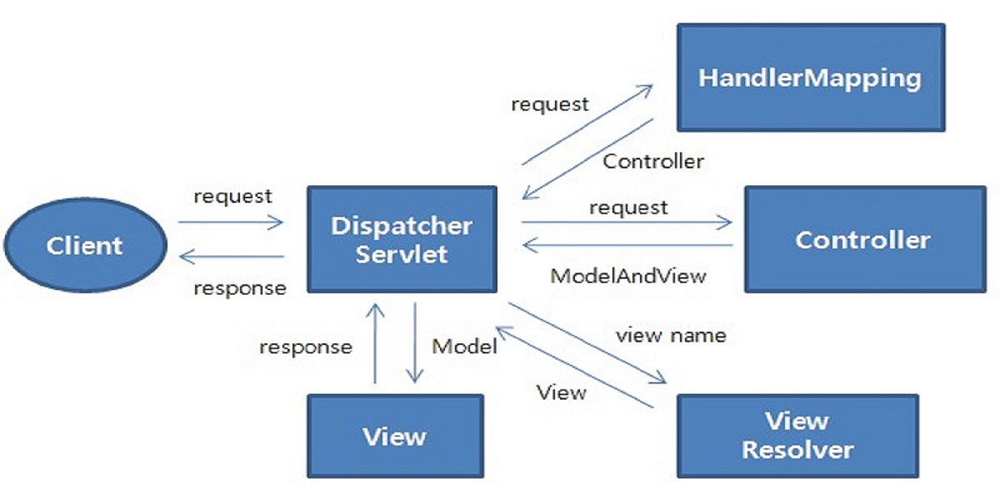
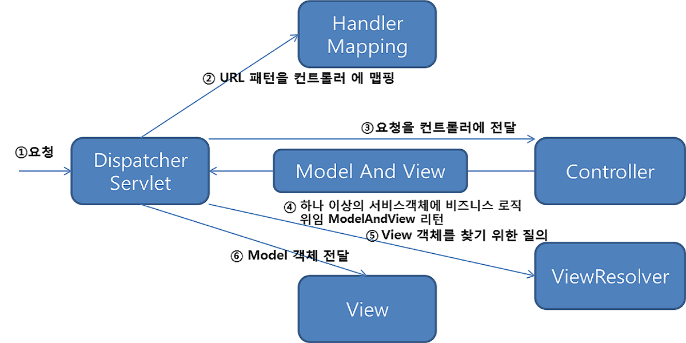

## Spring MVC란?

Spring MVC는 Spring에서 제공하는 웹 모듈로, Model, View, Controller 세가지 구성요소를 사용해 사용자의 다양한 HTTP Request을 처리하고 단순한 텍스트 형식의 응답부터 REST 형식의 응답은 물론 View를 표시하는 html을 return하는 응답까지 다양한 응답을 할 수 있도록 하는 프레임워크입니다.

------

## Spring MVC 구성요소

- **Dispatcher Servlet** : 제일 앞단에서 HTTP Request를 처리하는 Controller
- **Controller(Handler)** : HTTP Request를 처리해 Model을 만들고 View를 지정
  - DispatcherServlet에 의해 배정된 Controller는 HTTP Request를 처리하고, HTTP Request의 메세지를 처리해 필요한 데이터를 뽑아 Model에 저장
  - HTTP Request에 따라서 HTTP가 보여줄 View Name를 지정 혹은 View를 직접 반환할 수도 있다
- **ModelAndView** : Controller에 의해 반환된 Model과 View가 Wrapping된 객체
- **Model** : Map<String, Value> 형태의 데이터 저장소
  - HTTP Request 속의 데이터를 파싱해 Key-Value 쌍으로 만들어 저장한다.
- **View, View Name** : ViewResolver에서 그릴 View를 지정
- **ViewResolver** :  ModelAndView를 처리하여 View를 그리기
  - 모델에 저장된 데이터를 사용해 View를 그려준다.  
  - View는 사용자에게 보여줄 완성된 View이며, 여기서 그려지는 View는 그대로 유저에게 반환된다.

{: .important}

Spring MVC는 웹 어플리케이션을 유연하고 확장 가능하게 만들어준다.

------

### 동작 흐름

**[View를 응답하는 경우]**

1. 클라이언트로부터 HTTP 요청이 들어옵니다. 이때 DispatcherServlet이 프론트 컨트롤러의 역할을 수행합니다.
2. HandlerMapping을 통해 URL에 매핑된 핸들러를 조회합니다.
3. DispatcherServlet은 찾은 핸들러를 실행하기 위해 HandlerAdapter를 사용합니다.
4. HandlerAdapter가 실제로 요청을 처리하는 메서드를 호출합니다.
5. 컨트롤러는 결과 데이터를 Model 객체에 담고, View 이름을 반환합니다.
6. ViewResolver는 View 이름을 기반으로 적절한 뷰를 찾습니다.
7. ViewResolver가 찾은 뷰를 사용해 최종적으로 HTML과 같은 응답을 생성합니다.

------

**[Message Converter의 동작]**

JSON과 문자열 등을 응답하는 경우는 View를 응답하는 경우와 유사한 흐름으로 동작합니다. 단, ViewResolver 대신 HttpMessageConverter 가 동작합니다. MessageConverter는 HTTP 요청과 응답 두 경우 모두 사용될 수 있습니다. 이때 클라이언트의 HTTP Accept 헤더와 반환 타입 정보, Content-Type 등을 조합하여 타입에 맞는 HttpMessageConverter가 선택됩니다.

1. 클라이언트로부터 HTTP 요청이 들어옵니다. 이때 DispatcherServlet이 Front Controller의 역할을 수행합니다.
2. HandlerMapping을 통해 URL에 매핑된 핸들러(컨트롤러)를 조회합니다.
3. @RequestMapping 을 처리하는 핸들러 어댑터인 **RequestMappingHandlerAdapter**가 **ArgumentResolver를 호출**해 핸들러가 필요로 하는 파라미터의 값을 생성하고, 컨트롤러 메서드를 호출하면서 값을 넘겨줍니다. 이때 ArgumentResolver가 HttpMessageConverter를 사용해 필요한 객체를 생성합니다.
4. 컨트롤러는 전달받은 파라미터를 사용하여 서비스 계층과 데이터 접근 계층을 호출해 비즈니스 로직을 수행합니다.
5. @ResponseBody와 HttpEntity 를 처리하는 ReturnValueHandler가 HTTPMessageConverter를 호출해 응답 결과를 만들어냅니다.
