### 대규모 트래픽 처리 경험은 어떻게 쌓을까?

{: .important}

백엔드 개발자 채용 공고에 자주 등장하는 **'대용량 트래픽 처리 경험'**

백엔드 개발자 채용 공고를 살펴보면 <span style="color:red">**대용량 트래픽 처리 경험**</span>에 관한 얘기가 자주 나온다. 아무래도 서비스가 점점 고도화 될수록 빼놓을 수 없는 역량 때문인 것 같다.

-1760449984207-4.png)

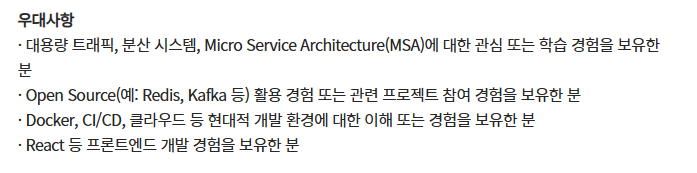

{: .q-left}

> 취준생이 어떻게 '대용량 트래픽 처리 경험'을 쌓죠?

대표적인 IT 기업에 들어가더라도 대용량 트래픽을 경험해보기란 쉽지 않다고 한다. 그러면 어떻게 **대용량 트래픽**을 경험할 수 있을까?

바로 부하 테스트 툴을 활용해서 대용량 트래픽을 경험하면 된다. 부하 테스트 툴은 다양한 형태로 대용량 트래픽을 만들어낼 수 있다. 실제 현업에서도 부하 테스트 툴을 활용해 대용량 트래픽을 직접 만들어내면서 부하를 얼마나 견뎌낼 수 있는 지 테스트한다.

따라서 <span style="color:CornflowerBlue">**부하 테스트**</span>하는 방법을 배워둠으로써 대용량 트래픽을 어떻게 처리할 지에 대한 간접적인 경험을 쌓아보려고 한다.

{: .q-left}

> **부하 테스트를 왜 할까?**

**부하 테스트** : 시스템이 어느 정도의 부하(= 트래픽, 요청)를 견딜 수 있는 지 테스트하는 것

**현업에서 부하 테스트를 왜 할까?**

```
프로덕션 환경에서 서비스 배포를 하기 전에 문득 들 수 있는 생각
- "혹시 요청이 몰려서 서버가 터지면 어떡하지?"
- "내 서버는 어느 정도 사용자 요청을 견딜 수 있을까?"
```

이런 불안감을 없애기 위해서 서비스를 배포하기 전에 백엔드 서버가 어느 정도의 요청을 견딜 수 있는 지 부하 테스트를 해봐야 한다. 그래야 어느 정도의 트래픽을 감당할 수 있는 지 미리 파악할 수 있다. 이걸 파악할 수 있다는 건 트래픽이 늘어나서 서버가 터질 때쯤 빠르게 대처할 수 있다는 게 장점이다. 

즉, 서버가 터져서 죽는 걸 미리 감지하고 대처할 수 있다는 뜻이다. 

{: .caution}

**그냥 걱정 없이 가장 좋은 사양의 서버를 쓰면 되지 않을까?**

당연히 오버 스펙으로 고사양의 컴퓨터를 서버로 사용하면 수많은 트래픽을 처리할 수 있을 것이다. 하지만 여기서 문제가 되는 건 비용이다. 비용을 절약하기 위해 부하 테스트를 통해 딱 필요한 만큼의 컴퓨터 사양을 선택하는 게 중요하다. 

------

### 처리량(Throughput), 지연 시간(Latency)

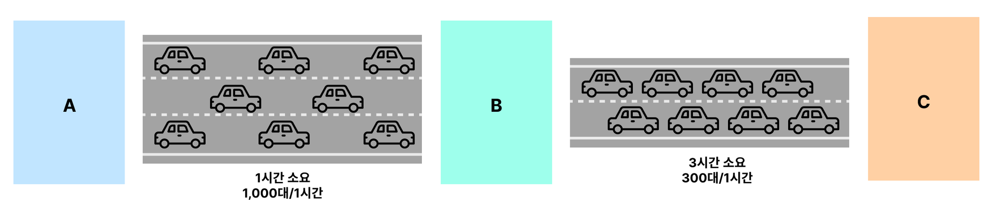

- **처리량(Throughput)** : 단위 시간당 목적지에 도착하는 자동차의 대수

부하 테스트에서 **서비스가 1초당 처리할 수 있는 트래픽 양**을 보고 **Throughput**이라고 부른다. 단위는  **TPS(Transaction Per Seconds, 1초당 처리한 트랜잭션의 수)**를 많이 활용한다. 만약 내가 만든 서비스가 1초에 최대 100개의 API 요청을 처리할 수 있다면, 이 서비스의 **Throughput**은 **100 TPS**라고 얘기한다.

- **지연 시간(Latency)** : 출발지부터 목적지까지 걸리는 시간

부하 테스트에서의 **Latency**는 **요청에 대한 응답 시간**을 의미한다. 만약 내가 만든 서비스에 부하 테스트를 했을 때 평균 응답 시간이 2.5초일 경우, **평균 Latency**가 **2.5초**라고 얘기한다. 조금 더 쉽게 해석하자면 하나의 API에 요청을 보냈을 때 응답받기까지의 시간이 2.5초 정도 걸린다는 뜻이다.

------

### 부하 테스트 툴 선정 (k6)

{: .q-left}

> **k6란?**

부하테스트 툴에는 다양한 툴이 있다. 그 중 유명한 부하테스트 툴에는 grinder, jmeter, ab, locust 등이 있다. 그 중 <span style="color:FireBrick">**메모리를 적게 사용하면서 비교적 많은 요청 수를 보낼 수 있는 부하 테스트 툴이 k6**</span>이다. 또한 사용법이 간단해 쉽게 테스트 해볼 수 있다.

쉽게 테스트할 수 있다고 해서 테스트 결과가 부정확한 것도 아니며 k6도 높은 정확도와 많은 트래픽을 발생시킬 수 있는 부하테스트 툴이라고 한다. 현업에서도 많이 쓰니까 걱정하지 말고 사용해도 될 것 같다. 

{: .important}

**어떤 부하 테스트 툴이냐는게 크게 중요할까?**

부하 테스트 툴에서 k6을 쓸 줄 아는 지 ngrinder를 쓸 줄 아는 지는 하나도 안 중요하다고 한다. 실제 부하 테스트를 하면서 결과 데이터를 정확하게 해석할 수 있는 지와, 결과 데이터를 바탕으로 적절한 방식으로 성능 개선을 할 수 있는 지의 역량만 기르면 될 것 같다.

------

## [간단한 실습] 부하 테스트

### EC2에 간단한 API 서버 세팅하기

- **EC2 인스턴스 생성하기**

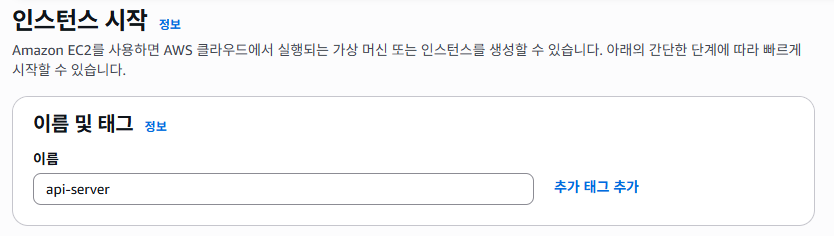

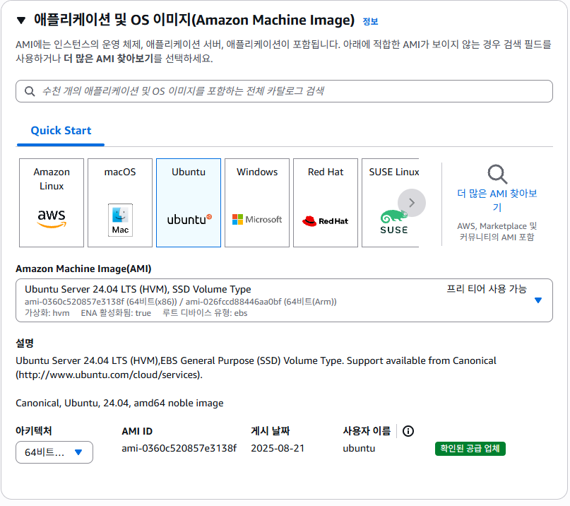

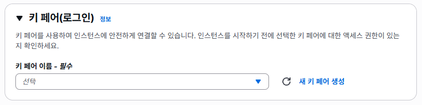

간단한 테스트용이라 키페어는 따로 생성하지 않았다.

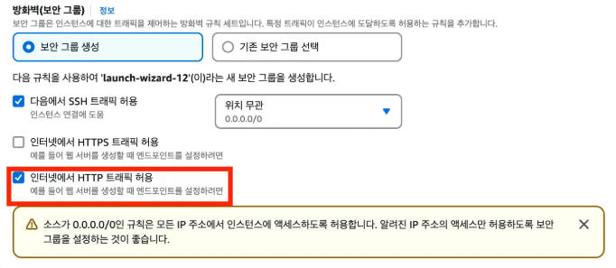

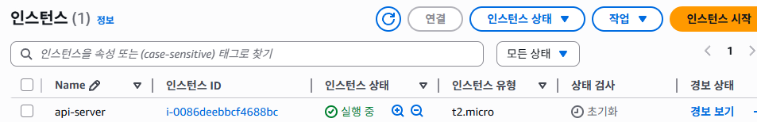

------

- **간단한 API 서버 세팅하기**

⚠️ 이번 간단한 실습에서는 Node 기반의 Express 서버를 활용하지만, 이후에는 Spring Boot를 활용해 테스트를 할 예정이다. 

1. **Node 설치** : Ubuntu 환경에서 Express 서버를 실행시키려면 Node.js가 설치되어 있어야 한다. 그래서 Ubuntu에 우선 Node.js를 설치한다. 

   ```shell
   $ sudo su
   $ apt-get update && /
   apt-get install -y ca-certificates curl gnupg && /
   mkdir -p /etc/apt/keyrings && /
   curl -fsSL https://deb.nodesource.com/gpgkey/nodesource-repo.gpg.key | sudo gpg --dearmor -o /etc/apt/keyrings/nodesource.gpg && /
   NODE_MAJOR=20 && /
   echo "deb [signed-by=/etc/apt/keyrings/nodesource.gpg] https://deb.nodesource.com/node_$NODE_MAJOR.x nodistro main" | sudo tee /etc/apt/sources.list.d/nodesource.list && /
   apt-get update && /
   apt-get install nodejs -y
   
   # 잘 설치됐는 지 확인하기 (버전 출력되는지 확인)
   $ node -v
   ```

2. **Express 서버 세팅**

   ```shell
   $ mkdir my-server
   $ cd my-server
   $ npm init # 의존성 관리 파일 생성
   $ npm i express # express 라이브러리 설치
   ```

   API 로직 작성 (app.js)

   ```javascript
   const express = require('express');
   const app = express();
   const port = 80;
   
   app.get('/boards', (req, res) => {
     res.send([
       { id: 1, title: '첫 번째 게시글', content: '이것은 첫 번째 게시글의 내용입니다.' },
       { id: 2, title: '두 번째 게시글', content: '이것은 두 번째 게시글의 내용입니다.' },
       { id: 3, title: '세 번째 게시글', content: '이것은 세 번째 게시글의 내용입니다.' }
     ]);
   })
   
   app.listen(port, () => {
     console.log(`Example app listening on port ${port}`)
   })
   ```

3. **pm2 설치** : Node 기반의 서버는 pm2를 활용해서 많이 실행시킨다. 서비스를 운영하는 데 있어서 유용한 기능들을 많이 가지고 있기 때문이다.

   ```shell
   $ npm i -g pm2
   ```

4. **API 서버 실행**

   ```shell
   $ pm2 start app.js
   ```

   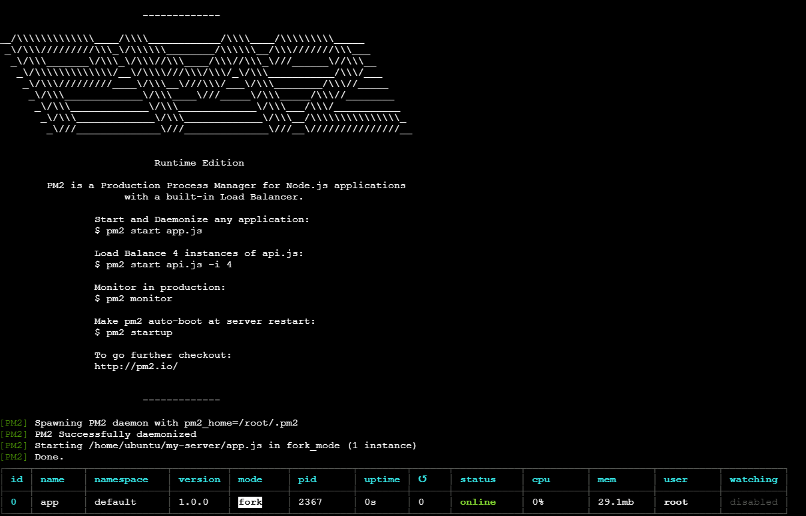

5. **잘 작동하는 지 확인**

   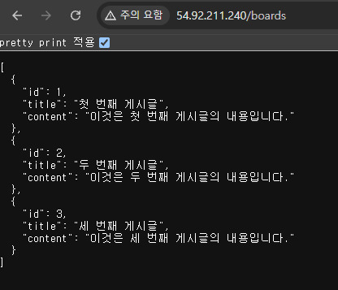

------

## EC2에 부하 테스트 툴 세팅하기

- **EC2 인스턴스 생성하기**

 충분한 부하를 만들어내기 위해 인스턴스를 t3a.small로 생성한다.

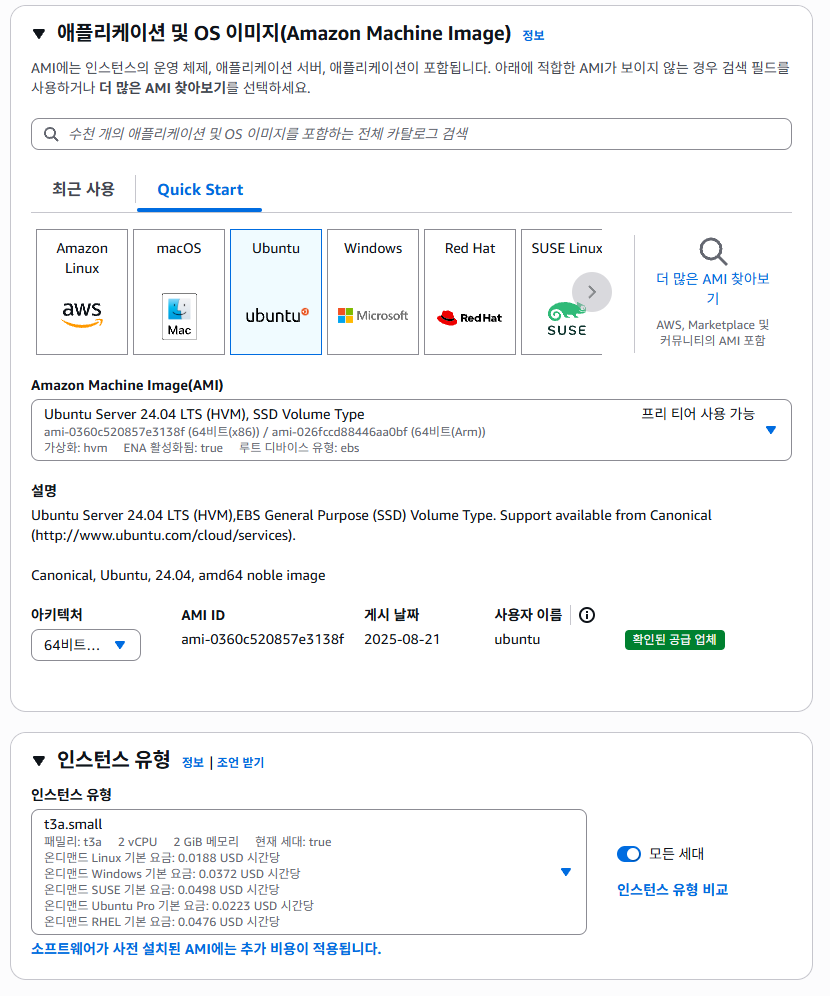

⚠️ **보안 그룹 규칙 편집**

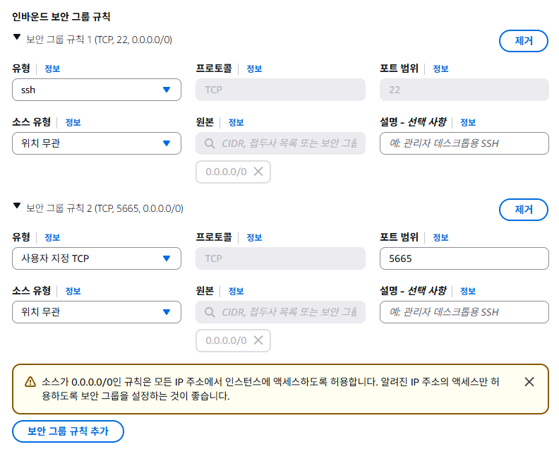

이 보안 그룹은 K6가 부하 테스트 결과에 대한 데이터를 그래프로 실시간으로 보여주는 웹페이지를 5665에서 볼 수 있도록 하기 위해 열어준다.

- **EC2에 부하테스트 툴 세팅**

1. **k6 설치**

   ```shell
   $ sudo gpg -k && /
   sudo gpg --no-default-keyring --keyring /usr/share/keyrings/k6-archive-keyring.gpg --keyserver hkp://keyserver.ubuntu.com:80 --recv-keys C5AD17C747E3415A3642D57D77C6C491D6AC1D69 && /
   echo "deb [signed-by=/usr/share/keyrings/k6-archive-keyring.gpg] https://dl.k6.io/deb stable main" | sudo tee /etc/apt/sources.list.d/k6.list && /
   sudo apt-get update && /
   sudo apt-get install k6
   ```

2.  **k6 잘 설치됐는 지 확인**

   ```shell
   $ k6
   ```

   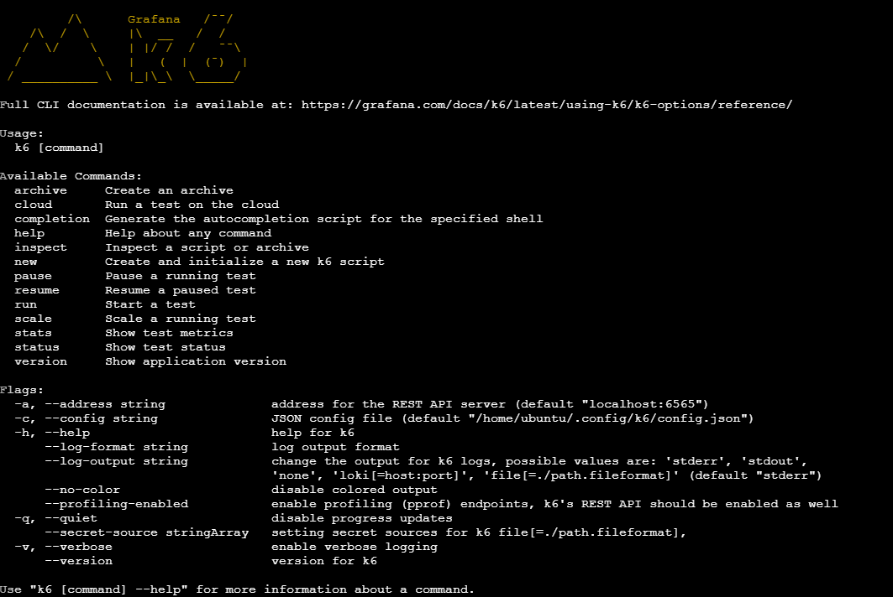

{: .note}

**주의점**

- **부하 테스트 환경 독립적으로 분리**

부하 테스트 툴(k6)은 테스트하고자 하는 시스템(백엔드, DB 등)과 반드시 독립적으로 분리해서 구성해야 한다. 

왜냐하면 부하 테스트 도구 자체도 상당한 컴퓨팅 자원을 사용하기 때문에, 테스트 도구 서버의 성능 제약이 실제 생성 가능한 부하량에 영향을 주어 정확한 테스트가 어려워질 수 있기 때문이다.

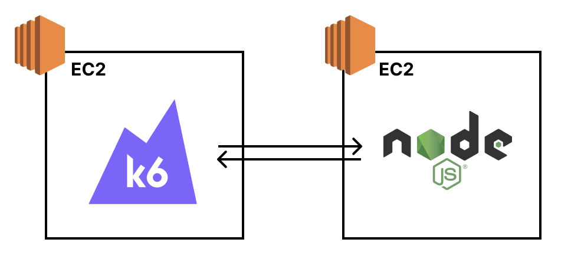

- **부하 테스트 툴을 개인 컴퓨터에 설치하지 않기**

개인이 가지고 있는 컴퓨터는 Windows 또는 Mac OS일텐데, 컴퓨터 자체적으로 부하를 발생시킬 때 제한이 걸릴 때가 종종 있다. 따라서 EC2 인스턴스를 생성해 Linux 환경에서 부하 테스트를 진행하는 것이 권장사항이다.

------

### 내가 구성한 백엔드 서버는 1초당 몇 개의 요청을 견뎌낼 수 있을까?

- **k6를 활용해 부하 테스트 진행하기**

1. **백엔드 서버에 부하를 주기 위해 k6 스크립트 작성** (script.js)

   ```
   구성한 시스템이 1초당 몇 개의 요청을 견딜 수 있는 지 알아보려면, 점진적으로 트래픽을 늘려가게끔 부하 테스트를 세팅해야 한다.
   ```

   ```javascript
   import http from 'k6/http';
   import { sleep } from 'k6';
   
   export const options = {
     // 부하를 생성하는 단계(stages)를 설정
     stages: [
       // 10분에 걸쳐 vus(virtual users, 가상 유저수)가 6000에 도달하도록 설정
       { duration: '10m', target: 6000 }
     ],
   };
   
   export default function () {
     // API 주소로 GET 요청
     http.get('http://{EC2 IP 주소}/boards');
     // 1초 휴식
     sleep(1);
   }
   ```

2. **부하 테스트 시작**

   ```shell
   $ K6_WEB_DASHBOARD=true k6 run script.js
   ```

   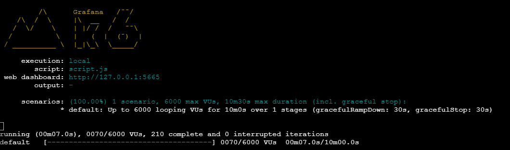

3. **k6의 웹 대시보드 열기**

   http://{k6가 실행되고 있는 EC2 IP 주소}:5665으로 접속하기

   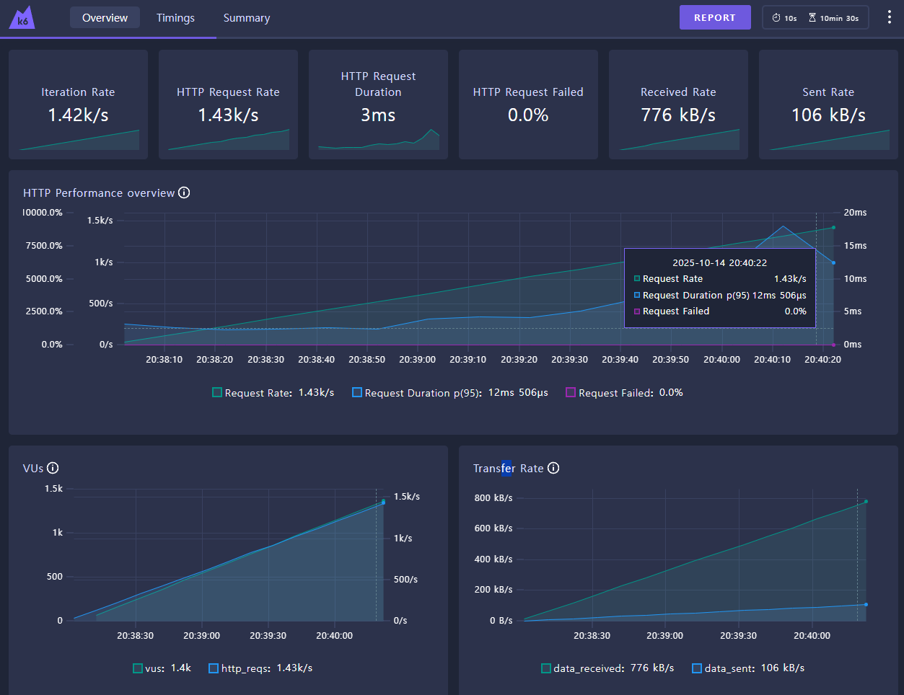

------

- **부하 테스트 결과 해석 방법**

k6의 웹 대시보드에서 부하 테스트 결과를 보면 수치가 너무 많아 복잡하게 느껴질 수 있지만, 중요한 3가지 수치만 확인하면 된다.

1. **HTTP Request Rate**

   **1초당 처리한 요청 수**를 의미한다. 즉, **Throughput(처리량)**을 나타내는 값이다.

2. **HTTP Request Duration**

   **요청에 대한 평균 응답 시간**을 의미한다. 즉, **Latency(지연 시간)**을 나타내는 값이다.

3. **HTTP Request Failed**

   **1초당 요청 실패 수**를 의미한다. 요청 실패가 발생한다면 어떤 문제로 인해 요청이 실패하는 지 체크해봐야 하는 신호이다.

------

- **실제 해석 순서**

  1. **VUs가 늘어나도 HTTP Request Rate가 더 이상 증가하지 않는 구간을 찾는다.**

     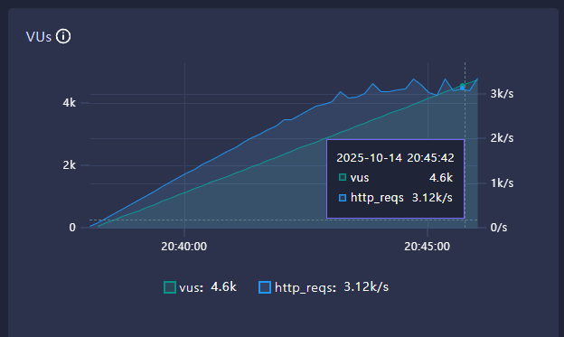

     더 이상 증가하지 않는 HTTP Request Rate가 현재 시스템의 최대 Throughput이다. 초당 3,100개 정도의 요청을 처리하고 있다. 즉, 현재 시스템은 1초당 3,100개의 요청을 처리할 수 있다는 뜻이다. 이걸 보고 ‘**현재 시스템의 최대 Throughput은 3,100 TPS**’라고 표현한다.

  2. **HTTP Request Duration이 비이상적으로 높은 건 아닌지 체크한다.**

     요청 당 응답 시간(Latency)이 비이상적으로 높을 경우 문제가 있는 건 아닌 지 체크해봐야 한다. 여기서 ‘비이상적’의 기준은 정하기 나름이다. 특정 서비스에서 응답 시간이 1초가 넘어가는 순간 사용자 이탈률이 크게 증가한다면, 정상적인 응답 시간 기준을 1초로 잡으면 된다. 

     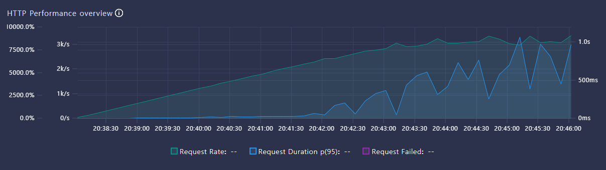

  3. **HTTP Request Failed가 있는 건 아닌지 체크한다.**

     만약 실패한 요청이 있다면 요청이 왜 실패했는 지 분석해야 한다.
