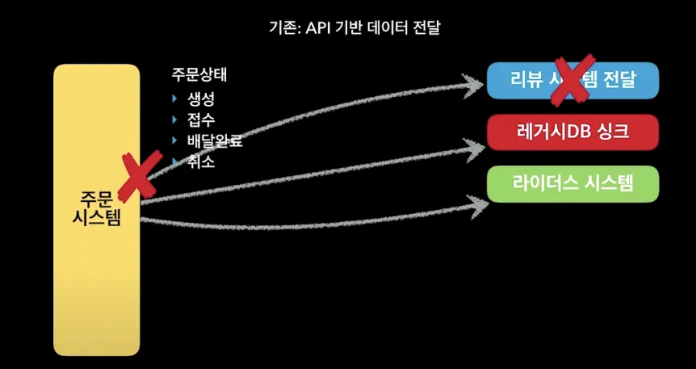
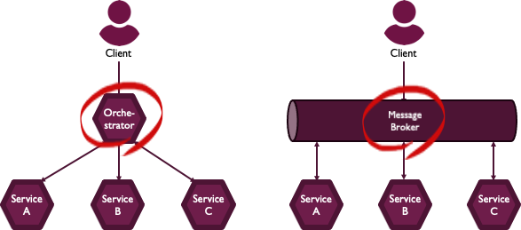
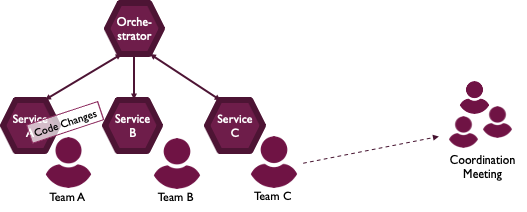
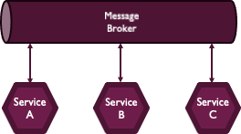
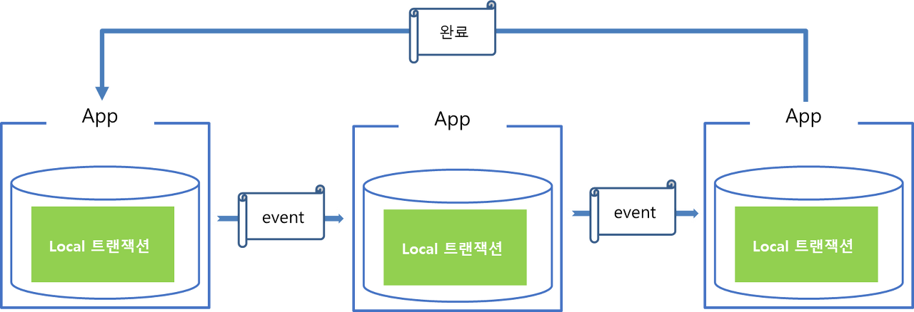
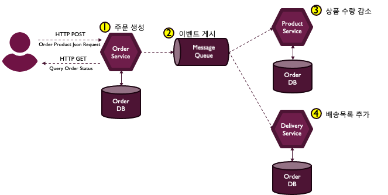
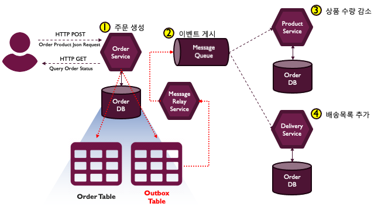
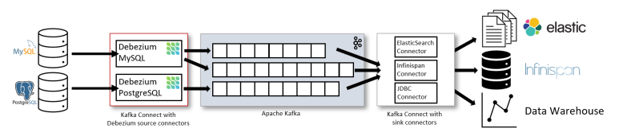

{: .q-left}

> 이벤트 기반 아키텍처에서 아키텍처의 신뢰성을 확보하는 방법

------

## Microservice Architecture & Event Driven Architecture

MSA는 **작은 규모의 여러 비즈니스 서비스를 묶어 하나의 어플리케이션을 제공**하고 배포하는 설계 구조입니다.


MSA는 각각의 서비스별로 다른 개발언어와 데이터베이스를 사용할 수 있으며 컨테이너 기반으로 관리됩니다. 이러한 작업을 하기 위하여 MSA는 Cloud Native 기반의 환경으로 구축하게 되며 **Docker 컨테이너(Container)를 생성하여 각각의 서비스를 운영**하게 됩니다.

이런 분산환경에서 데이터의 일관성을 보장하기 위해서, 서비스 별로 로컬 트랜잭션을 순차적으로 수행해서 분리된 데이터들의 트랜잭션을 관리하는 방법을 생각해 볼 수 있습니다.

MSA 아키텍처를 적용하면 서버 수가 늘어나고, 서버간의 소통을 위한 Rest API 호출이 빈번해집니다. 해당 API에서 장애가 나게 되면 어떻게 될까요?



예를들어 리뷰 시스템은  리뷰를 작성해 달라는 푸쉬 알림을 위해 주문 완료 정보가 필요합니다. 이는 주문 시스템에서 리뷰 시스템으로 전달해주어야 하는데, 리뷰 시스템 측 API에서 timeout 또는 500에러가 발생하는 상황이 있을 수 있습니다. 

장애의 전파를 막기위해 도입한 MSA인데, 해당 API 요청이 실패함으로써 주문시스템도 어떤 식으로든 영향을 받게 됩니다.

또한 주문 시스템을 개발하는 개발자는 리뷰 시스템, 레거시 DB, 라이더스 시스템에 대해 이해하고 주문 서버 소스 코드에 변경이 있을 때마다 이에 대한 여파를 고민해야 합니다. 

해당 난점을 극복하기 위해 서버간의 메시지를 전달하는 미들웨어인 메시징 큐를 도입하고, 각각의 서버는 이벤트를 통해 소통하는 이벤트 기반 아키텍처를 구성합니다.

이벤트 기반 아키텍처로 구성하면 각 서비스 간의 의존성이 낮아지고, 각 서비스가 다운되는 상황에서 이벤트를 통해 쉽게 장애에 대비할 수 있습니다.

------

## SAGA 패턴

SAGA 패턴은 분산 트랜잭션 환경에서 메시지 또는 이벤트를 주고 받으며 서비스 간의 데이터 일관성을 지키기 위한 패턴입니다.


이 패턴은 로컬 트랜잭션을 사용하며, 트랜잭션이 실패되면 변경된 내용을 취소하는 보상 트랜잭션을 실행합니다.

SAGA 패턴에서의 트랜잭션 요청 및 실패의 경우를 예로 들어보겠습니다.


Saga 패턴은 트랜잭션의 관리주체가 DBMS가 아닌 Application에 있습니다. App이 분산되어있을 때, 각 App 하위에 존재하는 DB는 로컬 트랜잭션 처리만 담당하게 됩니다.

따라서 각각의 App에 대한 연속적인 트랜잭션 요청 및 실패의 경우에 Rollback 처리(보상 트랜잭션)을 Application에서 구현해야 합니다.

Saga 패턴은 위 그림과 같이 연속적인 업데이트 연산으로 이루어져 있으며, 전체 데이터가 동시에 영속화되는 것이 아니라 순차적인 단계로 트랜잭션이 이루어집니다. 따라서 Application 비즈니스 로직에서 요구되는 마지막 트랜잭션이 끝났을 때, 데이터가 완전히 영속되었음을 인지하고 이를 종료합니다.

Application의 트랜잭션 관리를 통해 최종 일관성(Eventually Consistency)을 달성할 수 있기 때문에 분산되어있는 DB간에 정합성을 맞출 수 있습니다. 또한 트랜잭션 관리를 Application에서 하기 때문에 DBMS를 다른 제품군으로 구성할 수 있는 장점이 있습니다.

하지만 이러한 일관성을 달성하기 위해서는 프로세스 수행 과정 상 누락되는 작업이 없는지 면밀히 살펴야하며, 실패할 경우 에러 복구를 위한 보상 트랜잭션 처리에 누락이 없도록 설계해야 합니다.

{: .q-left}

> Saga Pattern 종류

Saga Pattern 을 구현하는 방법에는 보통 Orchestration과 Choreography 두 가지 방법이 존재합니다.



------

### Orchestration

오케스트레이션(orchestration)은 오케스트레이터(orchestrator) 라는 중앙 컨트롤러가 보상 작업을 트리거하는 방식입니다.



이 오케스트레이터는 모든 트랜잭션을 처리하고 수행해야 하는 작업을 메세지를 보내 참여자들과 통신합니다.

모든 관리를 오케스트레이터가 호출하기 때문에 분산 트랜잭션의 중앙 집중화가 이루어집니다. 따라서 **서비스간의 복잡성이 줄어들고 구현 및 테스트가 상대적으로 쉽습니다**. 또한 트랜잭션의 현재 상태를 오케스트레이터가 알고 있기 때문에 **롤백을 쉽게** 할 수 있는 것 또한 장점입니다. 

하지만 이를 관리하기 위한 Orchestrator 서비스가 추가되어야 하기 때문에 인프라 구현의 복잡성이 증가되는 점 및 서비스 A를 담당하는 팀에서 기능을 변경하려면, 오케스트레이터가 관리하는 프로세스에 영향을 주지 않기 위해서 각 서비스 개발팀이 변경을 조율 해야한다는 단점이 있습니다.

------

### Choreography



코레오그래피(choreography)는 **중앙 제어 없이** 서비스끼리 이벤트로 통신하는 방법입니다. 이때 이벤트는 kafka와 같은 메시지 큐를 이용해서 비동기 방식으로 전달을 합니다.




자신이 보유한 서비스 내 local 트랜잭션을 관리하며, 트랜잭션이 종료되면 완료 이벤트를 발행합니다. 만약 그 다음으로 수행해야 할 트랜잭션이 있다면, 해당 트랜잭션을 수행해야하는 App에서 완료 이벤트를 수신받고 다음 작업을 처리합니다.

서비스 중 하나가 장애가 발생해도 전체 트랜잭션 Flow에 문제로 전이되지 않고, 트랜잭션 내에 서비스가 추가되거나 삭제되더라도 메시지 큐에 해당 내용을 변경하면 됩니다.

Orchestration 서비스가 없으니 중앙에 모이던 오버헤드도 없고, 비용도 적게 듭니다. 그러나, 중심이 없어서 Flow 문제가 생겼을 때 트랜잭션 추적 및 트러블 슈팅이 어렵다는 단점이 있습니다.

{: .important}

**Example : Shopping Mall**

요구사항 : 사용자가 **상품을 주문**하면, 주문한 상품의 **재고량을 감소**시키고, **배송목록을 생성**한다.



고객이 상품을 주문하는 요청이 들어오면,

1. 주문 서비스는 새로운 주문정보를 주문 데이터베이스에 추가합니다.
2. 그리고 트랜잭션 내에 있는 다른 서비스에서 로컬 트랜잭션 처리를 트리거할 이벤트를 발행합니다.
3. 전체 트랜잭션 안에[ 있는 상품 서비스는 이 이벤트를 수신, 상품 수량을 감소키시는 로컬 트랜잭션을 수행하고,
4. 배송 서비스도 이벤트를 수신, 배송목록을 추가하는 로컬 트랜잭션을 수행합니다.

여기서, 주문 서비스에서 주문을 생성하고, 이벤트를 게시하는 로직이 하나의 트랜잭션으로 묶어야 한다는 걸 알수 있습니다.

```java
public void order(Order order) {

    // connect Order database
    // insert new order into Order table
    
    // publish order-created event
}
```

주문 데이터베이스에 새로운 주문정보를 추가하는 것과 order-created 이벤트를 발행하는 것은 원자성이 없으므로, 데이터베이스와 메시지 브로커 간에는 트랜잭션이 보장되지 않습니다.

주문 데이터베이스에 새로운 주문을 추가하고, 이벤트를 발행하기 직전에 서비스가 끊기게 된다면 어떻게 될까요?

보통 클라우드에서 대규모 시스템을 운영하는 경우 이런 문제는 충분히 일어날 수 있습니다.

새로운 주문은 주문 데이터베이스에 있지만, 연계된 다른 서비스들은 이벤트를 전달 받지 못하는 상황이 됩니다.

------

## Transactional Outbox 패턴

이런 문제를 해결하기 위한 방법은, 데이터베이스를 업데이트하는 트랜잭션 안에 발행해야할 메시지를 데이터베이스에 저장하고,

별도의 프로세스가 데이터베이스에 저장된 이벤트를 읽어서 메시지 브로커에 전송하는 것입니다. 

이 방식을 Transactional Outbox 패턴이라고 합니다.

Outbox는 보낼 편지함이라는 뜻으로, 발행할 이벤트를 저장하는 공간, 임시 메시지 큐의 역할을 하며, 엔티티의 업데이트와 하나의 트랜잭션으로 묶입니다.

그럼 앞에서 설명한 상품 주문 프로세스에 이 패턴을 적용해 보겠습니다.



주문 데이터베이스의 주문 테이블에 새로운 주문 정보를 추가할때 Outbox 테이블에는 발행해야할 이벤트를 저장하고, Commit을 수행합니다.

그럼 별도 프로세스, 그림의 메시지 릴레이 서비스가 Outbox 테이블에 저장된 이벤트를 읽어서 메시지 브로커에 전송한 다음 메시지가 전송되었다는 걸 Outbox 테이블에 표시한 후 삭제합니다.

이렇게 Transaction Outbox 패턴을 사용하면 데이터가 유실되거나 메시지 전송에 실패하는 문제를 해결할 수 있습니다.

------

## 아웃박스 테이블 변화 감지 - CDC (Change Data Capture)

더 나아가서 메시지 릴레이 서비스는 아웃박스 테이블의 변화를 어떻게 감지할 수 있을까요?

폴링으로 주기적으로 아웃박스 테이블을 조회하는 방법도 있지만, 트랜잭션 로그를 읽어 변화를 감지하는 방법도 있습니다.

이렇게 DB 변경 로그를 읽어 처리하는 방법을 CDC (Change Data Capture)라고 합니다.

변화감지에 사용되는 툴로 디비지움(Debezium), 링크드인에서 만든 데이터 버스(Databus), DynamoDB의 stream등이 있습니다. 이러한 툴은 source의 변화를 감지에서 타겟으로 메시지를 발행하는 것을 도와주는 도구입니다. 이 도구들은 메시지를 발행하고 소비할 때 문제가 발생할 때 이를 감지하고 해결해주는 도구입니다.



감지된 변경 사항을 Kafka 등의 메세지 브로커로 전송해서 다른 시스템으로 전파하고 이를 통해 데이터 일관성을 보장할 수 있습니다. 

로그기반 CDC를 활용하는 Debezium은 다음과 같은 특성을 지닙니다. 

- 모든 데이터의 변경사항이 추적됩니다. 

  - Debezium은 데이터베이스의 로그를 읽기 때문에 모든 데이터의 변경사항을 추적할 수 있습니다. 

  - Debezium이 다운되더라도 데이터베이스의 로그가 사라지지 않기 때문에 안전합니다. 

- Polling 방식을 활용하지 않기 때문에 변경된 데이터의 추적속도가 빠르더라도 CPU의 사용량이 급격히 증가하지 않습니다. 
  - Polling의 경우 데이터의 변경사항을 더욱 빠르게 확인하기 위해 polling interval을 줄이게 됩니다. Polling interval이 줄면 데이터의 변경사항을 더 빠르게 확인할 수 있지만 그만큼 CPU 사용량이 증가합니다. 
  - Debezium의 Log based CDC를 통해 CPU 사용량의 증가 없이 데이터의 변경사항을 준 실시간으로 추적할 수 있습니다. 

- 변경사항을 추적하기 위해 데이터 모델에 별도의 필드를 추가하거나 변경을 수행하지 않아도 됩니다. 
  - Polling의 경우 데이터가 변경됨을 식별하기 위해 LAST_UPDATE_TIMESTAMP와 같이 별도의 필드가 필요합니다. Debezium은 이와 같은 필드 없이도 데이터의 변경을 식별할 수 있습니다. 

- 데이터 삭제도 추적할 수 있습니다. 
  - Polling의 경우 삭제된 데이터에 대해서는 추적이 불가능합니다. 

------

