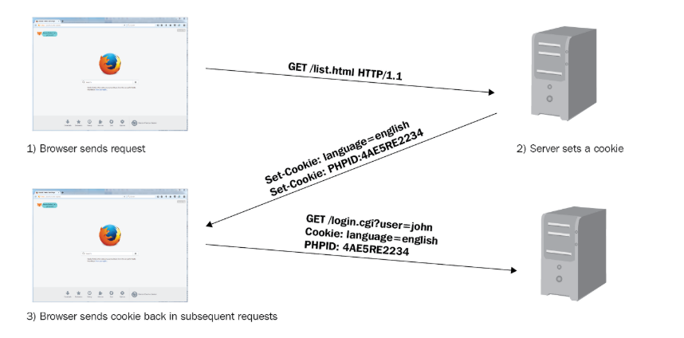
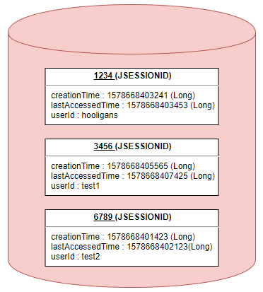
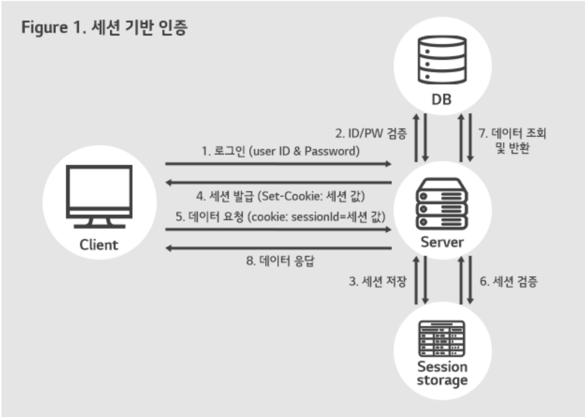
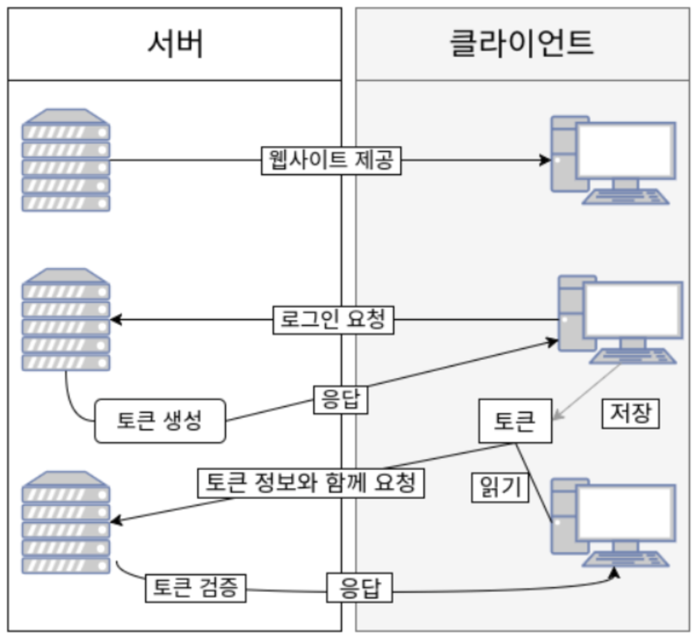
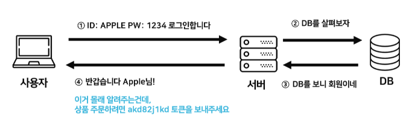
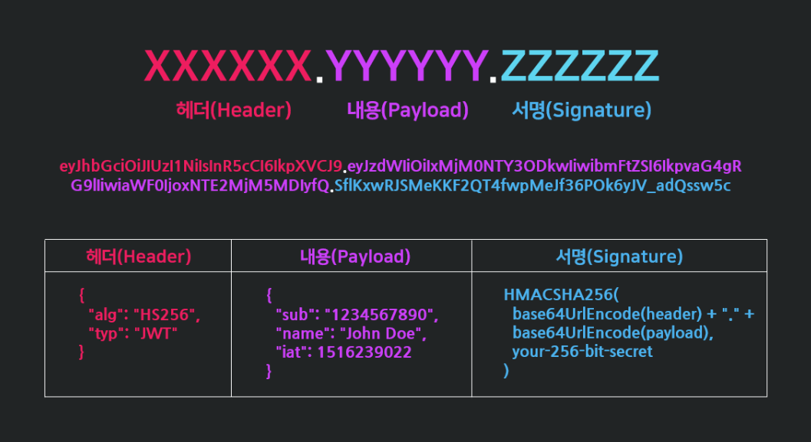
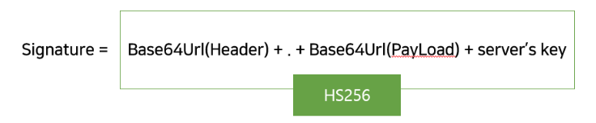
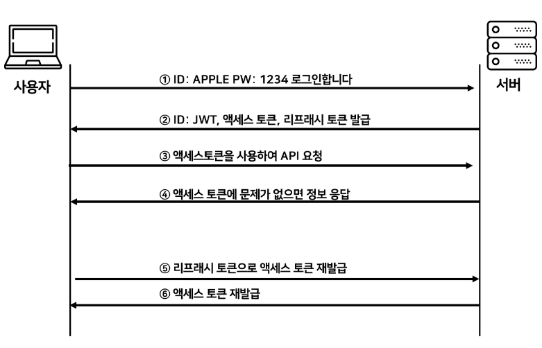

## Cookie / Session / Token 인증 방식 종류

서버가 클라이언트 인증을 확인하는 방식은 대표적으로 <span style="color:CornflowerBlue">**쿠키, 세션, 토큰 3가지 방식**</span>이 있다.

### Cookie 인증

쿠키는 <span style="color:Crimson">웹 서버가 사용자의 웹 브라우저에 저장하도록 전달하는 작은 데이터 조각</span>이다. <br>HTTP는 기본적으로 Stateless 프로토콜이기 때문에 서버는 각각의 요청이 어떤 사용자의 요청인지 알 수 없다.

따라서 로그인과 같이 사용자의 상태를 유지해야 하는 경우 쿠키를 사용할 수 있다.

<br>

#### Cookie 인증 방식



1. 브라우저가 서버에 요청을 보낸다.
2. 서버는 응답 헤더의 Set-Cookie를 이용하여 브라우저에 저장하고 싶은 정보를 저장하도록 요청한다.
3.  이후 브라우저가 같은 서버에 요청을 보내면 저장된 쿠키가 요청 헤더에 자동으로 포함된다.

<br>

#### Cookie 방식의 장단점

**장점**

- **HTTPOnly를 통한 보안 강화** <br>인증 쿠키에 HttpOnly를 설정하면 JavaScript에서 직접 접근할 수 없기 때문에 인증 정보의 XSS 탈취 위험을 줄일 수 있다.
- 세션 ID만 쿠키에 저장하고 실제 인증 상태는 서버에서 관리하는 구조를 쉽게 구현할 수 있다.
- 브라우저가 자동으로 전송

**단점**

- **CSRF 공격에 대한 고려가 필요**<br>쿠키는 브라우저가 자동으로 전송하기 때문에 공격자가 사용자를 속여 특정 요청을 보내도록 만들 경우 인증 쿠키가 함께 전송될 수 있다.
- 용량 제한
- 브라우저 간 공유가 불가

------

### Session 인증

쿠키의 보안 이슈 때문에, 세션은 비밀번호 등 클라이언트의 민감한 인증 정보를 브라우저가 아닌 <span style="color:Crimson">**서버 측에 저장하고 관리**</span>한다. 서버의 메모리에 저장하거나, 로컬 파일, 데이터베이스에 저장하기도 한다.

{: .note}

**세션 객체는 어떤 형태로 이루어져 있을까?**

세션 객체는 key에 해당하는 세션ID와 이에 대응하는 Value로 구성되어 있다.



<br>

#### Session 인증 방식



1. 사용자가 로그인하면 세션이 서버 메모리(혹은 데이터베이스)에 저장된다.<br>이때, 세션을 식별하기 위한 세션 ID를 기준으로 정보를 저장한다.
2. 서버에서 브라우저의 쿠키에다가 세션 ID를 저장한다.
3. 쿠키에 정보가 담겨있기 때문에 브라우저는 데이터 요청에 있어 세션 값을 쿠키 담아 전송한다.
4. 서버는 클라이언트가 보낸 세션 ID와 세션 저장소에서 검증을 통해 인증을 수행한다.

<br>

#### Session 방식의 장단점

**장점**

- 인증 정보를 서버에서 관리할 수 있다.
- 서버에서 특정 세션을 삭제하는 세션 무효화가 쉽다

**단점**

- 서버에 세션 저장 공간이 필요하며, 요청이 많아지면 서버에 부하가 심해진다.
- 서버가 여러 대일 경우 세션 공유 문제가 발생한다.

------

### Token 인증

토큰 기반 인증 시스템은 클라이언트가 서버에 접속을 하면 서버에서 해당 클라이언트에게 인증되었다는 의미로 <span style="color:Crimson">'토큰'을 부여</span>한다. 이 토큰은 유일하며 토큰을 발급 받은 클라이언트는 또 다시 서버에 요청을 보낼 때 요청 헤더에 토큰을 심어서 보낸다. 그러면 서버에서는 클라이언트로부터 받은 토큰을 서버에서 제공한 토큰과의 일치 여부를 체크하여 인증 과정을 처리하게 된다.

기존의 세션기반 인증은 서버가 파일이나 데이터베이스에 세션정보를 가지고 있어야 하고 이를 조회하는 과정이 필요하기 때문에 많은 오버헤드가 발생한다. 하지만 토큰은 세션과는 달리 서버가 아닌 클라이언트에 저장되기 때문에 메모리나 스토리지 등을 통해 세션을 관리했던 서버의 부담을 덜 수 있다. 토큰 자체에 데이터가 들어있기 때문에 클라이언트에서 받아 위조되었는지 판별만 하면 되기 떄문이다.

토큰은 앱과 서버가 통신 및 인증할 때 가장 많이 사용된다. 왜냐하면 웹에는 쿠키와 세션이 있지만 앱에서는 없기 때문이다.

#### Token 인증 방식



1. 사용자가 로그인을 한다.
2. 서버는 사용자에게 **유일한 토큰**을 발급한다.
3. 클라이언트는 서버 측에서 전달 받은 토큰을 쿠키나 스토리지에 저장해두고, 서버에 요청을 할 때마다 HTTP 요청 헤더에 토큰을 포함시켜 전달한다.
4. 서버는 전달받은 토큰을 검증하고 요청에 응답한다. 

#### Token 방식의 장단점

**장점**

- 서버에서 인증정보를 별도로 저장할 필요가 없다.
- 여러 디바이스, 도메인에서도 호환되기 쉽다.

**단점**

- 토큰 자체의 데이터 길이가 길어, 인증 요청이 많아질수록 네트워크 부하가 심해질 수 있다.
- XSS 공격 등으로 토큰을 탈취당하면 유효기간 동안 계속 요청을 보낼 수 있다.

------

## JWT (JSON Web Token)이란



JWT란 <span style="color:RoyalBlue">**인증에 필요한 정보들을 암호화시킨 JSON 토큰**</span>을 의미한다.

JWT는 JSON 데이터를 Base64 URL-safe Encode 를 통해 인코딩하여 직렬화한 것이며, 토큰 내부에는 위변조 방지를 위해 개인키를 통한 전자서명도 들어있다. 

따라서 사용자가 JWT 를 서버로 전송하면 서버는 서명을 검증하는 과정을 거치게 되며 검증이 완료되면 요청한 응답을 돌려준다.

<br>

### JWT 구조



- **Header**: JWT에서 사용할 타입과 해싱 알고리즘이 담겨 있다.
- **Payload**: 서버에서 첨부한 사용자 권한 정보와 데이터가 담겨 있다.
- **Signature**: Header, Payload를 Base64 URL -safe Encode한 이후 Header에 명시된 해시함수를 적용해 개인키로 서명한 전자 서명이 담겨있다.

<br>

#### Header

```json
{
	"alg" : "HS256", 
	"typ" : "JWT"
}
alg : 서명 암호화 알고리즘(ex: HMAC SHA256, RSA)
typ : 토큰 유형
```

#### Payload

서버와 클라이언트가 주고받는 시스템에서 <span style="color:RoyalBlue">**실제로 사용될 정보에 대한 내용을 담고 있는 영역**</span>이다.

{: .note}

key-value 형식으로 이루어진 한 쌍의 정보를 Claim이라고 한다.

```json
{
	"sub" : "1234567890", 
	"name" : "John Doe",
	"iat" : 1516239022
}
```

#### Signature

시그니처에서 사용하는 알고리즘은 헤더에서 정의한 알고리즘 방식(alg)을 활용한다.

시그니처의 구조는  <span style="color:RoyalBlue">**(헤더 + 페이로드)**</span>와 서버가 갖고 있는  <span style="color:RoyalBlue">**유일한 Key 값**</span>을 합친 것을 헤더에서 정의한 알고리즘으로 암호화를 한다.



{: .important}

Header와 Payload는 단순히 인코딩된 값이기 때문에 제 3자가 복호화 및 조작할 수 있지만, Signature는 서버 측에서 관리하는 비밀키가 유출되지 않는 이상 복호화할 수 없다. <br>따라서 Signature는 토큰의 위변조 여부를 확인하는데 사용된다.

<br>

### JWT를 이용한 인증 과정



1. 사용자가 ID, PW를 입력하여 서버에 로그인 인증을 요청한다.
2. 서버에서 클라이언트로부터 인증 요청을 받으면, Header, PayLoad, Signature를 정의한다. Hedaer, PayLoad, Signature를 각각 Base64로 한 번 더 암호화하여 JWT를 생성하고 이를 쿠키에 담아 클라이언트에게 발급한다.
3. 클라이언트는 서버로부터 받은 JWT를 로컬 스토리지에 저장한다. (쿠키나 다른 곳에 저장할 수도 있음) API를 서버에 요청할때 Authorization header에 Access Token을 담아서 보낸다.
4. 서버가 할 일은 클라이언트가 Header에 담아서 보낸 JWT가 내 서버에서 발행한 토큰인지 일치 여부를 확인하여 일치한다면 인증을 통과시켜주고 아니라면 통과시키지 않으면 된다.
   인증이 통과되었으므로 페이로드에 들어있는 유저의 정보들을 select해서 클라이언트에 돌려준다.
5. 클라이언트가 서버에 요청을 했는데, 만일 액세스 토큰의 시간이 만료되면 클라이언트는 리프래시 토큰을 이용해서
6. 서버로부터 새로운 엑세스 토큰을 발급 받는다.

{: .tip}

 **JWT은 서명(인증)이 목적이다.**<br><br>JWT는 Base64로 암호화를 하기 때문에 디버거를 사용해서 인코딩된 JWT를 1초만에 복호화할 수 있다.
복호화 하면 사용자의 데이터를 담은 Payload 부분이 그대로 노출되어 버린다. 그래서 페이로드에는 비밀번호와 같은 민감한 정보는 넣지 말아야 한다.<br><br>시그니처에 사용된 비밀키가 노출되지 않는이상 데이터를 위조해도 시그니처 부분에서 바로 걸러지기 때문이다.

<br>

### JWT 장단점

**장점**

- Header와 Payload를 가지고 Signature를 생성하므로 **데이터 위변조를 막을 수 있다.**
- 인증 정보에 대한 **별도의 저장소가 필요없다.**
- JWT는 토큰에 대한 기본 정보와 전달할 정보 및 토큰이 검증되었음을 증명하는 서명 등 필요한 모든 정보를 자체적으로 지니고 있다.
- 클라이언트 인증 정보를 저장하는 세션과 다르게, **서버는 무상태(StateLess)**가 되어 서버 확장성이 우수해질 수 있다.
- 토큰 기반으로 **다른 로그인 시스템에 접근 및 권한 공유가 가능하다. (쿠키와 차이)**
- OAuth의 경우 Facebook, Google 등 소셜 계정을 이용하여 다른 웹서비스에서도 로그인을 할 수 있다.
- 모바일 어플리케이션 환경에서도 잘 동작한다. (모바일은 세션 사용 불가능)

**단점**

- 토큰 자체에 정보를 담고 있으므로 위험 가능성 존재
- 토큰 길이 : 토큰의 Payload에 3종류의 클레임을 저장하기 때문에, 정보가 많아질수록 토큰의 길이가 늘어나 **네트워크에 부하**를 줄 수 있다.
- payload 자체는 암호화 된 것이 아니라 BASE64로 인코딩 된 것이기 때문에, 중간에 **Payload를 탈취하여 디코딩하면 데이터를 볼 수 있으므로**, payload에 중요 데이터를 넣지 않아야 한다.
- Store Token : stateless 특징을 가지기 때문에, 토큰은 클라이언트 측에서 관리하고 저장한다. 때문에 토큰 자체를 탈취당하면 대처하기가 어렵게 된다.

------

## JWT의 Access Token / Refresh Token

JWT도 제 3자에게 토큰 탈취의 위험성이 있기 때문에, 그대로 사용하는 것이 아닌 Access Token, Refresh Token 으로 이중으로 나누어 인증을 하는 방식을 현업에선 취한다.
Access Token 과 Refresh Token은 둘 다 똑같은 JWT이다. 다만 토큰이 어디에 저장되고 관리되느냐에 따른 사용 차이일 뿐이다.

- **Access Token** : 클라이언트가 갖고 있는 실제로 유저의 정보가 담긴 토큰으로, 클라이언트에서 요청이 오면 서버에서 해당 토큰에 있는 정보를 활용하여 사용자 정보에 맞게 응답을 진행
- **Refresh Token**: 새로운 Access Token을 발급해주기 위해 사용하는 토큰으로 짧은 수명을 가지는 Access Token에게 새로운 토큰을 발급해주기 위해 사용.

{: .tip}

 JWT 인증 방식을 만약 Access Token 만을 이용하면, Access Token은 발급된 이후 서버에 저장되지 않고 클라이언트에 저장되어 토큰 자체로 검증을 하며 사용자 권한 인증을 진행하기 때문에, Access Token이 탈취되면 토큰이 만료되기 전까지, 토큰을 획득한 사람은 누구나 권한 접근이 가능해지는 문제점이 있었다. <br><br>그래서 토큰의 유효 시간을 부여하여 탈취 문제에 대해 대응을 하기도 하지만, 만일 유효 기간이 짧을 경우 그만큼 사용자는 로그인을 자주해야 하는 번거로움이 있다.
<br><br>따라서 이러한 문제를 해결하기 위해 Refresh Token 이라는 추가적인 토큰을 활용하여 토큰을 이중 장막을 쳐서 보다 보안을 강화하는 식으로 보면 된다.

정리하자면, Access Token은 접근에 관여하는 토큰, Refresh Token은 재발급에 관여하는 토큰의 역할로 사용되는 JWT 이라고 말할 수 있다.

------

출처: [https://inpa.tistoryhttps://inpa.tistory.com/entry/WEB-📚-JWTjson-web-token-란-💯-정리 [Inpa Dev 👨‍💻:티스토리]](https://inpa.tistory.com/entry/WEB-%F0%9F%93%9A-JWTjson-web-token-%EB%9E%80-%F0%9F%92%AF-%EC%A0%95%EB%A6%AC)

